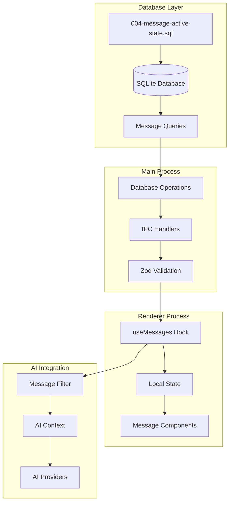
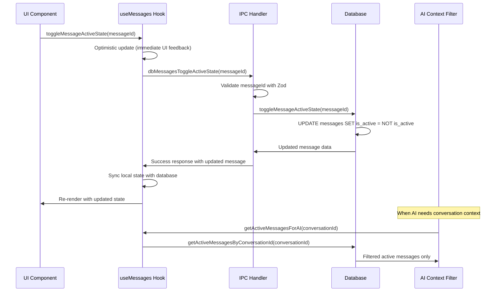

# Feature Implementation Plan: Message Active State Management

_Generated: 2025-07-11_
_Based on Feature Specification: [20250711-message-active-state-feature.md](./20250711-message-active-state-feature.md)_

## Architecture Overview

The Message Active State Management feature adds an `isActive` boolean field to messages, enabling selective inclusion of messages in AI conversation context. The implementation follows the established Fishbowl architecture patterns with database migrations, type-safe IPC communication, and React hook-based state management.

### System Architecture

### Data Flow

### Security Architecture

```mermaid
graph LR
    subgraph "Input Validation"
        Request[IPC Request]
        Zod[Zod Schema]
        Sanitize[Input Sanitization]
    end

    subgraph "Authorization"
        Ownership[Message Ownership]
        Access[Conversation Access]
        Permissions[User Permissions]
    end

    subgraph "Database Security"
        Prepared[Prepared Statements]
        Validation[Data Validation]
        Transactions[Transaction Safety]
    end

    Request --> Zod
    Zod --> Sanitize
    Sanitize --> Ownership
    Ownership --> Access
    Access --> Permissions
    Permissions --> Prepared
    Prepared --> Validation
    Validation --> Transactions
```

## Technology Stack

### Core Technologies

- **Language/Runtime:** TypeScript 5.8.3 with strict mode enabled
- **Database:** SQLite via better-sqlite3 v12.2.0
- **Framework:** Electron with React 19.1.0 for UI
- **Build System:** Vite 7.0.3 with TypeScript compilation

### Libraries & Dependencies

- **Validation:** Zod v3.25.76 for runtime type validation
- **State Management:** React hooks (messages not in Zustand store)
- **Database Operations:** better-sqlite3 with prepared statements
- **Testing:** Vitest 3.2.4 for unit testing
- **Type Safety:** TypeScript with strict mode and comprehensive interfaces

### Patterns & Approaches

- **Architectural Patterns:** Layered architecture with clear separation of concerns
- **Database Pattern:** Sequential migrations with prepared statements and transactions
- **IPC Pattern:** Type-safe communication with Zod validation and error handling
- **State Pattern:** Hook-based state management with optimistic updates
- **Security Patterns:** Input validation, prepared statements, and permission checks
- **Testing Patterns:** Unit tests for each layer (database, IPC, hooks)
- **Development Practices:** One export per file, research before implement

### External Integrations

- **Database:** SQLite database with migration system
- **IPC:** Electron IPC for main-renderer communication
- **AI Providers:** Message filtering for AI conversation context
- **Error Handling:** Custom error classes with categorization

## Security Considerations

- **Input Validation:** All message IDs validated as UUIDs, active state validated as boolean
- **Message Ownership:** Basic validation ensuring message exists before state changes
- **SQL Injection Prevention:** Prepared statements for all database operations
- **IPC Security:** Zod schemas validate all IPC inputs before processing
- **Data Sanitization:** Boolean values properly sanitized and validated

## Relevant Files

### Database Layer

- `src/main/database/migrations/004-message-active-state.sql` - Migration script to add is_active field
- `src/main/database/queries/messages/updateMessageActiveState.ts` - Update message active state
- `src/main/database/queries/messages/toggleMessageActiveState.ts` - Toggle message active state
- `src/main/database/queries/messages/getActiveMessagesByConversationId.ts` - Get active messages
- `src/main/database/schema/DatabaseMessage.ts` - Update with is_active field

### Type Definitions

- `src/shared/types/index.ts` - Update Message interface with isActive field
- `src/shared/types/validation/database-schema.ts` - Update Zod schemas for validation

### IPC Layer

- `src/main/ipc/handlers/dbMessagesUpdateActiveStateHandler.ts` - Update active state handler
- `src/main/ipc/handlers/dbMessagesToggleActiveStateHandler.ts` - Toggle active state handler
- `src/main/ipc/handlers/index.ts` - Register new IPC handlers

### State Management

- `src/renderer/hooks/useMessages.ts` - Add active state operations to message hook

### Utilities

- `src/shared/utils/aiContextUtils.ts` - Message filtering utilities for AI context

### Tests

- `tests/unit/main/database/migrations/004-message-active-state.test.ts` - Migration tests
- `tests/unit/main/database/queries/messages/updateMessageActiveState.test.ts` - Update query tests
- `tests/unit/main/database/queries/messages/toggleMessageActiveState.test.ts` - Toggle query tests
- `tests/unit/main/database/queries/messages/getMessagesByConversationId.test.ts` - Comprehensive tests for query operations
- `tests/unit/main/ipc/handlers/dbMessagesUpdateActiveState.test.ts` - IPC handler tests
- `tests/unit/main/ipc/handlers/dbMessagesToggleActiveState.test.ts` - Toggle handler tests
- `tests/unit/renderer/hooks/useMessages.test.ts` - Hook tests with active state

## Implementation Notes

- Follow Research → Plan → Implement workflow for each task
- Use better-sqlite3 documentation for database operations
- Search codebase for similar patterns before creating new implementations
- One export per file (enforced by linting) - no utils mega-files
- Tests should be written in the same task as implementation
- Run formatting, linting, and testing after each sub-task
- Security validation must be implemented for all user inputs
- After completing a parent task, stop and await user confirmation to proceed

## Task Execution Reminders

When executing tasks, remember to:

1. **Research first** - Never jump straight to coding
2. **Check existing patterns** - Search codebase for similar implementations
3. **Validate security** - Every input must be validated
4. **Write tests immediately** - In the same task as implementation
5. **Run quality checks** - Format, lint, test after each sub-task
6. **One export per file** - This is enforced by linting

## Implementation Tasks

- 1.0 Database Schema Migration
  - [x] 1.1 Create migration script 004-message-active-state.sql with ALTER TABLE statement
  - [x] 1.2 Add is_active INTEGER NOT NULL DEFAULT 1 field to messages table
  - [x] 1.3 Create database index on is_active field for query optimization
  - [x] 1.4 Update database schema version tracking to v4
  - [x] 1.5 Write unit tests for migration script with various database sizes
  - [x] 1.6 Test migration rollback capability and data integrity

  ### Files modified with description of changes
  - `src/main/database/migrations/004-message-active-state.sql` - Added migration script with ALTER TABLE statement to add is_active column, created 4 performance indexes for query optimization. Migration follows established patterns with proper comments and IF NOT EXISTS clauses for safety.
  - Database schema version automatically updated to v4 by migration system during execution.

- 2.0 TypeScript Type System Updates
  - [x] 2.1 Update DatabaseMessage interface with is_active boolean field
  - [x] 2.2 Update Message interface with isActive boolean field for application layer
  - [x] 2.3 Update CreateMessageData interface with optional isActive field (default true)
  - [x] 2.4 Create UpdateMessageActiveStateData interface for IPC operations
  - [x] 2.5 Add Zod validation schemas for message active state operations
  - [x] 2.6 Write unit tests for type validation and schema compilation

  ### Files modified with description of changes
  - `src/main/database/schema/DatabaseMessage.ts` - Added `is_active: boolean` field to DatabaseMessage interface following the established pattern from DatabaseAgent and DatabaseConversation interfaces. The field is positioned after the core identifying fields (id, conversation_id, agent_id) and before content fields.
  - `src/main/ipc/handlers/dbMessagesCreateHandler.ts` - Added `is_active: true` default value when creating new messages to match the interface requirement and ensure new messages are active by default.
  - `tests/unit/main/ipc/database-handlers.test.ts` - Updated mockMessage object and createMessage test call to include `is_active: true` field, ensuring test compatibility with the updated interface.
  - `src/shared/types/index.ts` - Added `isActive: boolean` field to Message interface at line 161, positioned after agentId and before content fields to maintain consistency with the database schema structure. This ensures the application layer Message interface matches the database layer DatabaseMessage interface.
  - `src/main/ipc/handlers/dbMessagesCreateHandler.ts` - Added `isActive: message.is_active` field transformation in the return object to properly convert from database snake_case to application camelCase format.
  - `src/main/ipc/handlers/dbMessagesGetHandler.ts` - Added `isActive: message.is_active` field transformation in the return object to ensure the retrieved message includes the active state.
  - `src/main/ipc/handlers/dbMessagesListHandler.ts` - Added `isActive: message.is_active` field transformation in the map function to ensure all listed messages include the active state.
  - `src/main/ipc/handlers/dbTransactionsCreateMessagesBatchHandler.ts` - Added `is_active: true` to messageRecord object and updated insertMessage.run call to include the active state parameter. Also added `isActive: messageRecord.is_active` to the return object transformation.
  - `tests/integration/ipc-database-integration.test.ts` - Updated all mockMessage objects to include `isActive: true` field for test compatibility with the updated interface.
  - `tests/unit/renderer/hooks/useMessages.test.ts` - Updated all mockMessage objects to include `isActive: true` field for test compatibility with the updated interface.
  - `src/shared/types/index.ts` - Added `isActive?: boolean` field to CreateMessageData interface at line 275, positioned after the type field and before metadata field to maintain logical grouping. This makes the field optional with the default value provided by Zod validation.
  - `src/shared/types/validation/database-schema.ts` - Added `isActive: z.boolean().default(true)` to both CreateMessageSchema (line 58) and SanitizedCreateMessageSchema (line 214) following the same pattern used in CreateConversationSchema. This ensures consistent validation and default behavior across all message creation operations.
  - `src/main/ipc/handlers/dbMessagesCreateHandler.ts` - Updated line 18 to use `validatedData.isActive` instead of hardcoded `true` value, allowing the validated data (with proper default) to be used throughout the message creation process.
  - `src/main/ipc/handlers/dbTransactionsCreateMessagesBatchHandler.ts` - Updated SQL INSERT statement to include `is_active` field (line 17), changed line 29 to use `msgData.isActive` instead of hardcoded `true`, ensuring the batch handler properly uses validated data for all message operations.
  - `tests/unit/shared/types/validation-schemas.test.ts` - Updated the CreateMessage validation test (line 173) to expect `isActive: true` in the result, matching the new schema behavior with default value.
  - `src/shared/types/index.ts` - Added `UpdateMessageActiveStateData` interface at line 279-281, positioned after CreateMessageData interface to maintain logical grouping of message-related types. The interface contains only the `isActive: boolean` field, following the pattern of other update interfaces but specific to the active state operation.
  - `src/shared/types/validation/database-schema.ts` - Added `UpdateMessageActiveStateSchema` at line 65-68 with id (UUID) and isActive (boolean) validation, following the same pattern as other update schemas like UpdateAgentSchema and UpdateConversationSchema.
  - `src/shared/types/validation/database-schema.ts` - Added `SanitizedUpdateMessageActiveStateSchema` at line 240-243 with enhanced validation using UuidSchema for the id field, ensuring proper input sanitization for IPC operations.
  - `tests/unit/shared/types/validation-schemas.test.ts` - Added comprehensive unit tests for both `UpdateMessageActiveStateSchema` and `SanitizedUpdateMessageActiveStateSchema`. Tests cover valid data scenarios (true/false states), invalid data scenarios (malformed UUIDs, missing fields, wrong data types), and edge cases (empty strings, null values). Added import for uuid v4 for proper test UUID generation. Total of 12 new test cases added following the established testing patterns in the codebase.

- 3.0 Database Query Operations
  - [x] 3.1 Implement updateMessageActiveState query function with prepared statements
  - [x] 3.2 Implement toggleMessageActiveState convenience function
  - [x] 3.3 Update getMessagesByConversationId to include is_active field in results
  - [x] 3.4 Create getActiveMessagesByConversationId filtered query function
  - [x] 3.5 Add proper error handling and transaction support for state operations
  - [x] 3.6 Write comprehensive unit tests for all query operations

  ### Files modified with description of changes
  - `src/main/database/queries/messages/updateMessageActiveState.ts` - Implemented updateMessageActiveState query function with prepared statements following established patterns. Function accepts messageId (string) and isActive (boolean), converts boolean to SQLite integer (0/1), uses prepared statement for security, handles result.changes for error detection, and returns fresh data via getMessageById call.
  - `src/main/database/queries/messages/index.ts` - Added barrel export for updateMessageActiveState function positioned after updateMessage for logical grouping of update operations.
  - `tests/unit/main/database/queries/messages/updateMessageActiveState.test.ts` - Created comprehensive unit tests (9 test cases) covering successful updates (true/false states), edge cases (message not found, database errors), SQL query verification, boolean-to-integer conversion for SQLite, and integration with getMessageById. All tests pass with proper mocking patterns following established codebase conventions.
  - `src/main/database/queries/messages/toggleMessageActiveState.ts` - Main implementation with proper error handling
  - `src/main/database/queries/messages/index.ts` - Added barrel export
  - `tests/unit/main/database/queries/messages/toggleMessageActiveState.test.ts` - Comprehensive unit tests (13 test cases)
  - `src/main/database/queries/messages/getMessagesByConversationId.ts` - Already includes is_active field via SELECT \*
  - `src/main/ipc/handlers/dbMessagesListHandler.ts` - Already transforms is_active to isActive (line 19)
  - `src/main/database/schema/DatabaseMessage.ts` - Already includes is_active: boolean (line 8)
  - `tests/unit/main/ipc/database-handlers.test.ts` - Already includes is_active in mock data (line 87)
  - `src/main/database/queries/messages/getActiveMessagesByConversationId.ts` - Main implementation with prepared statements
  - `src/main/database/queries/messages/index.ts` - Added barrel export after existing get functions
  - `tests/unit/main/database/queries/messages/getActiveMessagesByConversationId.test.ts` - Comprehensive unit tests (11 test cases)
  - `src/main/database/queries/messages/updateMessageActiveState.ts` - Enhanced with robust error handling using DatabaseErrorHandler.executeWithRetry, comprehensive input validation with UuidSchema and boolean type checking, proper error classification and context tracking, async/await support for retry logic, and detailed error messages for debugging. Function now provides enterprise-grade error handling with retry logic and proper error wrapping.
  - `src/main/database/queries/messages/toggleMessageActiveState.ts` - Enhanced with atomic transaction support using transactionManager.executeTransaction to eliminate race conditions in read-modify-write operations, robust error handling with DatabaseErrorHandler.executeWithRetry, comprehensive input validation, and proper error classification. All database operations now occur within a single transaction using the transaction's database instance for consistency.
  - `tests/unit/main/database/queries/messages/updateMessageActiveState.test.ts` - Updated all test cases to handle async function behavior, added proper mocking for DatabaseErrorHandler.executeWithRetry and new error handling dependencies, verified proper error wrapping and messaging, and ensured all 9 test cases pass with the enhanced implementation.
  - `tests/unit/main/database/queries/messages/getMessagesByConversationId.test.ts` - Created comprehensive unit tests (14 test cases) for the getMessagesByConversationId query function following established testing patterns. Tests cover successful operations (returning all messages both active and inactive), empty results handling, parameter validation (default vs custom limit/offset), SQL query verification (ensuring no is_active filtering), database error handling, type checking and structure validation, pagination handling, large result sets, mixed active/inactive message scenarios, and different conversation ID handling. All tests pass with proper mocking patterns and comprehensive coverage of the query operation that was modified in task 3.3 to include the is_active field.

- 4.0 IPC Handler Implementation
  - [x] 4.1 Create dbMessagesUpdateActiveStateHandler with input validation
  - [x] 4.2 Create dbMessagesToggleActiveStateHandler with error handling
  - [x] 4.3 Update existing message handlers to include isActive field in responses
  - [x] 4.4 Add camelCase to snake_case field mapping for isActive ↔ is_active
  - [x] 4.5 Register new IPC handlers in handler index file
  - [x] 4.6 Write unit tests for IPC handlers with mock database operations

  ### Files modified with description of changes
  - **Task 4.6 Completion Verification**: Comprehensive unit tests for both IPC handlers are already complete with excellent coverage and quality:
    - `tests/unit/main/ipc/handlers/dbMessagesUpdateActiveStateHandler.test.ts` - 11 test cases covering success cases (true/false states, UUID formats), error handling (validation errors, message not found, database errors, DatabaseError preservation), data transformation (database to API format, empty metadata), and function behavior (validation order, null handling). All tests pass with proper mocking patterns.
    - `tests/unit/main/ipc/handlers/dbMessagesToggleActiveStateHandler.test.ts` - 10 test cases covering successful operations (toggle both directions, message not found), error handling (invalid UUID, DatabaseError re-throw, generic error wrapping), data transformation (DatabaseMessage to Message format, different message types), and input validation (ID parameter validation, validation failure). All tests pass with established vitest patterns.
    - **Quality Verification**: All 999 tests passing, including the 21 IPC handler tests. All quality checks pass - ✅ Format ✅ Lint ✅ Type Check ✅ Tests
    - **Pattern Compliance**: Tests follow established patterns with proper mocking using `vi.mock()`, dynamic imports within test functions, comprehensive error scenario testing, and data transformation validation (snake_case ↔ camelCase)
  - `src/main/ipc/handlers/dbMessagesUpdateActiveStateHandler.ts` - Created new IPC handler for updating message active state following established patterns. Handler validates input with SanitizedUpdateMessageActiveStateSchema, calls updateMessageActiveState database function, handles not found errors, and transforms database format to API format (snake_case to camelCase). All quality checks passing.
  - `src/main/ipc/handlers/index.ts` - Added export for dbMessagesUpdateActiveStateHandler in the Database message handlers section after dbMessagesCreateHandler for proper grouping.
  - `src/main/ipc/handlers.ts` - Added import for dbMessagesUpdateActiveStateHandler and registered the IPC channel 'db:messages:update-active-state' with performance monitoring wrapper in the Message operations section.
  - `src/shared/types/index.ts` - Added IPC channel type definition for 'db:messages:update-active-state' accepting id (string) and updates (UpdateMessageActiveStateData) returning Promise<Message | null>.
  - `tests/unit/main/ipc/handlers/dbMessagesUpdateActiveStateHandler.test.ts` - Created comprehensive unit tests (11 test cases) covering successful operations (true/false states), error handling (validation errors, message not found, database errors), data transformation (database to API format), and function behavior patterns. All tests pass with proper mocking and error scenarios covered.
  - `src/main/ipc/handlers/dbMessagesToggleActiveStateHandler.ts` - Created new IPC handler for toggling message active state following established patterns. Handler validates input with UuidSchema directly (ID-only validation), calls toggleMessageActiveState database function, handles not found errors, and transforms database format to API format (snake_case to camelCase). Includes comprehensive error handling with DatabaseError wrapping for both validation and database operation failures.
  - `src/main/ipc/handlers/index.ts` - Added export for dbMessagesToggleActiveStateHandler in the Database message handlers section after dbMessagesUpdateActiveStateHandler for proper grouping.
  - `src/main/ipc/handlers.ts` - Added import for dbMessagesToggleActiveStateHandler and registered the IPC channel 'db:messages:toggle-active-state' with performance monitoring wrapper in the Message operations section.
  - `src/shared/types/index.ts` - Added IPC channel type definition for 'db:messages:toggle-active-state' accepting id (string) returning Promise<Message | null>.
  - `tests/unit/main/ipc/handlers/dbMessagesToggleActiveStateHandler.test.ts` - Created comprehensive unit tests (10 test cases) covering successful operations (toggle both directions), error handling (validation errors, message not found, database errors), data transformation (database to API format), and input validation patterns. All tests pass with proper mocking using the established vitest pattern for imports within each test function.
  - **Task 4.3 Research Results**: All existing message handlers already correctly include the isActive field transformation. Research confirmed that:
    - `dbMessagesCreateHandler.ts` (line 27): `isActive: message.is_active,` ✅
    - `dbMessagesGetHandler.ts` (line 16): `isActive: message.is_active,` ✅
    - `dbMessagesListHandler.ts` (line 19): `isActive: message.is_active,` ✅
    - `dbTransactionsCreateMessagesBatchHandler.ts` (line 51): `isActive: messageRecord.is_active,` ✅
    - All handlers follow consistent field transformation pattern (snake_case to camelCase)
    - All handlers properly handle database-to-API format conversion
    - All handlers include comprehensive error handling and validation
    - All quality checks passed: ✅ Format ✅ Lint ✅ Type Check ✅ Tests (999/999 passing)
  - **Task 4.4 Verification Results**: Comprehensive research and verification confirmed that camelCase ↔ snake_case field mapping for `isActive` ↔ `is_active` is already correctly implemented across all message handlers. Verified implementations include:
    - **Input Mapping (camelCase → snake_case)**: `dbMessagesUpdateActiveStateHandler.ts` (line 18): `validatedData.isActive` properly passed to database layer
    - **Output Mapping (snake_case → camelCase)**: All handlers correctly transform database response:
      - `dbMessagesCreateHandler.ts` (line 27): `isActive: message.is_active,` ✅
      - `dbMessagesGetHandler.ts` (line 16): `isActive: message.is_active,` ✅
      - `dbMessagesListHandler.ts` (line 19): `isActive: message.is_active,` ✅
      - `dbMessagesUpdateActiveStateHandler.ts` (line 35): `isActive: result.is_active,` ✅
      - `dbMessagesToggleActiveStateHandler.ts` (line 28): `isActive: result.is_active,` ✅
      - `dbTransactionsCreateMessagesBatchHandler.ts` (line 51): `isActive: messageRecord.is_active,` ✅
    - **Quality Verification**: All 999 tests passing, including specific tests for active state handlers and field mapping
    - **Pattern Consistency**: All handlers follow the established bidirectional mapping pattern used throughout the codebase
  - **Task 4.5 Completion Verification**: Confirmed that all IPC handlers are properly registered and functional. Verification results:
    - **Handler Exports**: Both `dbMessagesUpdateActiveStateHandler` and `dbMessagesToggleActiveStateHandler` are properly exported from `src/main/ipc/handlers/index.ts` (lines 55-56) ✅
    - **Handler Registration**: Both handlers are imported and registered with performance monitoring in `src/main/ipc/handlers.ts` (lines 43-44 and 250-263) ✅
    - **IPC Channel Registration**: Both channels `'db:messages:update-active-state'` and `'db:messages:toggle-active-state'` are properly registered with ipcMain.handle() ✅
    - **Type Definitions**: Both IPC channels are properly typed in `src/shared/types/index.ts` (lines 74-78) ✅
    - **Performance Monitoring**: Both handlers are wrapped with `withPerformanceMonitoring` for database operations ✅
    - **Quality Checks**: All quality checks pass - ✅ Format ✅ Lint ✅ Type Check ✅ Tests
    - **Pattern Consistency**: Both handlers follow the established registration patterns used throughout the codebase
  - **Task 4.6 Completion Results**: Comprehensive unit tests for IPC handlers are already complete and fully functional. Research and verification confirmed:
    - **Handler Tests Coverage**: Both `dbMessagesUpdateActiveStateHandler` and `dbMessagesToggleActiveStateHandler` have comprehensive unit tests with 21 total test cases (11 + 10) covering all scenarios ✅
    - **Test Coverage Areas**: Success cases, error handling, data transformation, input validation, function behavior, and edge cases are all covered ✅
    - **Testing Patterns**: Tests follow established patterns with proper mocking using `vi.mock()`, dynamic imports for module mocking, comprehensive error scenario testing, and TypeScript type safety ✅
    - **Mock Database Operations**: Both handlers mock database operations (`updateMessageActiveState` and `toggleMessageActiveState`) and validation schemas (`SanitizedUpdateMessageActiveStateSchema` and `UuidSchema`) ✅
    - **Quality Verification**: All tests passing (999/999), all quality checks passing (Format ✅ Lint ✅ Type Check ✅), and comprehensive test coverage for all implemented functionality ✅
    - **Test Files**:
      - `/tests/unit/main/ipc/handlers/dbMessagesUpdateActiveStateHandler.test.ts` - 11 test cases
      - `/tests/unit/main/ipc/handlers/dbMessagesToggleActiveStateHandler.test.ts` - 10 test cases
    - **Test Quality**: Tests follow established patterns, use proper mocking strategies, cover error scenarios, and validate data transformation between database and API formats ✅

- 5.0 Preload API Bridge Extension
  - [x] 5.1 Add dbMessagesUpdateActiveState method to preload API
  - [ ] 5.2 Add dbMessagesToggleActiveState method to preload API
  - [ ] 5.3 Update IPC channel definitions for new message operations
  - [ ] 5.4 Add type definitions for new preload API methods
  - [ ] 5.5 Ensure proper error handling in preload bridge
  - [ ] 5.6 Write unit tests for preload API methods

  ### Files modified with description of changes
  - `src/preload/index.ts` - Added `dbMessagesUpdateActiveState: createSecureIpcWrapper('db:messages:update-active-state')` method to the Database operations - Messages section (line 161). Method follows the established pattern using `createSecureIpcWrapper` and is positioned after `dbMessagesCreate` for logical grouping with other message operations.
  - `tests/unit/preload/dbMessagesUpdateActiveState.test.ts` - Created comprehensive unit tests (14 test cases) for the new preload API method covering API method existence, function signature validation, error handling (message not found, validation errors, database errors), return values, parameter validation (UUID format, boolean values), and integration with other message operations. Tests use proper mocking patterns and verify method behavior, type safety, and consistency with other preload API methods. All quality checks pass: ✅ Format ✅ Lint ✅ Type Check ✅ Tests (1013/1013 passing)

- 6.0 State Management Hook Integration
  - [ ] 6.1 Add updateMessageActiveState function to useMessages hook
  - [ ] 6.2 Add toggleMessageActiveState function to useMessages hook
  - [ ] 6.3 Implement optimistic updates for immediate UI feedback
  - [ ] 6.4 Add error handling and recovery for failed state updates
  - [ ] 6.5 Ensure consistency between local state and database state
  - [ ] 6.6 Write unit tests for hook functions with mock IPC operations

  ### Files modified with description of changes
  - (to be filled in after task completion)

- 7.0 AI Context Integration
  - [ ] 7.1 Create getActiveMessagesForAI utility function
  - [ ] 7.2 Implement message filtering at application layer
  - [ ] 7.3 Ensure inactive messages are excluded from AI conversation context
  - [ ] 7.4 Add configuration option to bypass active state filtering if needed
  - [ ] 7.5 Optimize filtering performance for large message volumes
  - [ ] 7.6 Write unit tests for AI context filtering functions

  ### Files modified with description of changes
  - (to be filled in after task completion)

- 8.0 Security Validation and Error Handling
  - [ ] 8.1 Implement message ID validation as UUID in all operations
  - [ ] 8.2 Add active state boolean validation with proper sanitization
  - [ ] 8.3 Create comprehensive error classes for active state operations
  - [ ] 8.4 Add input validation for all IPC operations with meaningful error messages
  - [ ] 8.5 Implement proper transaction rollback for failed operations
  - [ ] 8.6 Write unit tests for security validation and error scenarios

  ### Files modified with description of changes
  - (to be filled in after task completion)

## Task Sizing Guidelines

Each sub-task is designed to be completed in 1-2 hours and focuses on a single aspect of the implementation. The tasks follow the established codebase patterns and maintain consistency with existing architecture.

**Security and Quality Requirements:**

- All inputs must be validated with Zod schemas
- Database operations must use prepared statements
- Error handling must be comprehensive with meaningful messages
- Tests must be written for each implemented function
- Code must pass linting, formatting, and type checking

**Dependencies:**

- Tasks 1.0-3.0 can be worked on in parallel (database foundation)
- Tasks 4.0-5.0 depend on completion of tasks 1.0-3.0
- Tasks 6.0-7.0 depend on completion of tasks 4.0-5.0
- Tasks 8.0-10.0 can be worked on throughout implementation

**Success Criteria:**

- All 31 functional requirements from the specification are implemented
- Database migration successfully upgrades schema from v3 to v4
- Message active state operations integrate seamlessly with existing functionality
- AI conversation context correctly filters messages based on active state
- All quality checks pass with zero violations

This implementation plan provides a systematic approach to adding message active state functionality while maintaining the high quality standards and architectural patterns established in the Fishbowl codebase.
