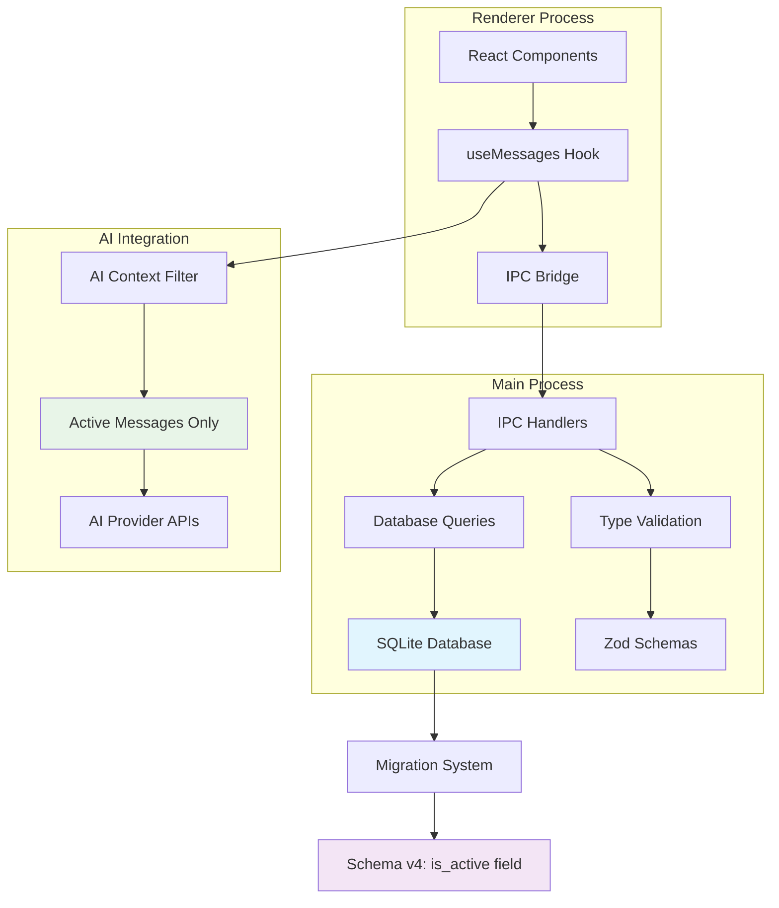
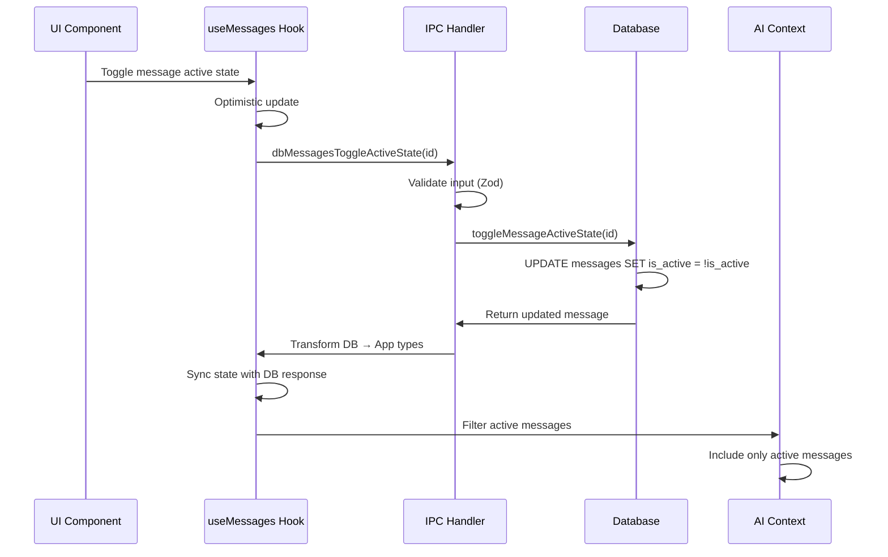
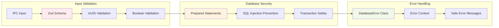

# Feature Implementation Plan: Message Active State Management

_Generated: 2025-07-11_
_Based on Feature Specification: [20250711-message-active-state-feature.md](./20250711-message-active-state-feature.md)_

## Architecture Overview

The Message Active State Management feature implements a boolean flag system that allows selective inclusion of messages in AI conversation context. The implementation follows established Fishbowl patterns with database schema migration, type-safe IPC communication, and hook-based state management.

### System Architecture

### Data Flow

### Security Architecture

## Technology Stack

### Core Technologies

- **Language/Runtime:** TypeScript v5.8.3, Node.js (Electron v37.2.0)
- **Framework:** Electron with React v19.1.0
- **Database:** SQLite via better-sqlite3 v12.2.0

### Libraries & Dependencies

- **UI/Frontend:** React v19.1.0, React Router DOM v7.6.3
- **Backend/API:** better-sqlite3 v12.2.0, uuid v11.1.0
- **Testing:** Vitest v3.2.4, @testing-library/react v16.3.0
- **Security:** Zod v3.25.76 (validation), keytar v7.9.0 (secure storage)
- **Validation:** Zod v3.25.76 with strict TypeScript types
- **Utilities:** immer v10.1.1, uuid v11.1.0

### Patterns & Approaches

- **Architectural Patterns:** Electron main/renderer separation, IPC bridge pattern
- **Design Patterns:** Repository pattern for database, hook pattern for state
- **Security Patterns:** Input validation with Zod, prepared statements, context isolation
- **Testing Patterns:** Unit tests for database operations, integration tests for IPC
- **Error Handling:** Custom DatabaseError class with operation context
- **Development Practices:** One export per file, Research → Plan → Implement workflow

### External Integrations

- **Database:** SQLite with sequential migration system
- **IPC:** Type-safe Electron IPC with performance monitoring
- **AI Context:** Application-layer message filtering for AI providers

## Security Considerations

- **Authentication:** Message ownership validation before state changes
- **Authorization:** IPC channel access control with context isolation
- **Data Validation:** Zod schema validation for all inputs (UUID, boolean)
- **Sensitive Data:** No sensitive data exposure in active state operations
- **Security Headers:** Electron security best practices with context isolation

## Relevant Files

### Database Layer

- `src/main/database/migrations/004-message-active-state.sql` - Migration script
- `src/main/database/queries/messages/updateMessageActiveState.ts` - Active state update query
- `src/main/database/queries/messages/toggleMessageActiveState.ts` - Toggle convenience function
- `src/main/database/queries/messages/getActiveMessagesByConversationId.ts` - Filtered query
- `src/main/database/queries/messages/index.ts` - Updated query exports
- `src/main/database/schema/DatabaseMessage.ts` - Updated schema interface

### Type Definitions

- `src/shared/types/index.ts` - Updated Message interface with isActive field
- `src/shared/types/validation/database-schema.ts` - Updated Zod schemas

### IPC Layer

- `src/main/ipc/handlers/dbMessagesUpdateActiveStateHandler.ts` - Active state update handler
- `src/main/ipc/handlers/dbMessagesToggleActiveStateHandler.ts` - Toggle handler
- `src/main/ipc/handlers/index.ts` - Updated handler registration

### State Management

- `src/renderer/hooks/useMessages.ts` - Updated hook with active state operations
- `src/shared/utils/aiContextUtils.ts` - AI context filtering utility

### Tests

- `tests/unit/main/database/migrations/004-message-active-state.test.ts` - Migration tests
- `tests/unit/main/database/queries/messages/updateMessageActiveState.test.ts` - Query tests
- `tests/unit/main/database/queries/messages/toggleMessageActiveState.test.ts` - Toggle tests
- `tests/unit/main/ipc/handlers/dbMessagesUpdateActiveState.test.ts` - IPC handler tests
- `tests/unit/main/ipc/handlers/dbMessagesToggleActiveState.test.ts` - Toggle handler tests
- `tests/integration/messageActiveState.test.ts` - End-to-end tests

## Implementation Notes

- Follow Research → Plan → Implement workflow for each task
- Search codebase for similar patterns before creating new implementations
- One export per file (enforced by linting) - no utility mega-files
- Tests should be written in the same task as implementation
- Run formatting, linting, and testing after each sub-task
- Security validation must be implemented for all user inputs
- After completing a parent task, stop and await user confirmation to proceed

## Task Execution Reminders

When executing tasks, remember to:

1. **Research first** - Never jump straight to coding
2. **Check existing patterns** - Search codebase for similar implementations
3. **Validate security** - Every input must be validated with Zod
4. **Write tests immediately** - In the same task as implementation
5. **Run quality checks** - Format, lint, test after each sub-task
6. **One export per file** - This is enforced by linting
7. **Database field mapping** - SQLite INTEGER (0/1) ↔ JavaScript boolean (true/false)
8. **Error handling** - Use DatabaseError class with operation context
9. **Type safety** - Maintain strict TypeScript types throughout

## Implementation Tasks

- 1.0 Database Schema Migration
  - 1.1 Create migration script for message active state
    - [ ] 1.1.1 Create 004-message-active-state.sql migration file
    - [ ] 1.1.2 Add ALTER TABLE statement to add is_active INTEGER NOT NULL DEFAULT 1
    - [ ] 1.1.3 Add simple index: CREATE INDEX idx_messages_is_active ON messages(is_active)
    - [ ] 1.1.4 Add migration validation checks for data integrity
  - 1.2 Test migration on different database scenarios
    - [ ] 1.2.1 Test migration on empty database
    - [ ] 1.2.2 Test migration on database with 100 sample messages
    - [ ] 1.2.3 Test migration on database with 1000 sample messages
    - [ ] 1.2.4 Verify all existing messages default to is_active = 1
  - 1.3 Performance and rollback testing
    - [ ] 1.3.1 Benchmark migration performance on large dataset (10k+ messages)
    - [ ] 1.3.2 Test database schema version increment to v4
    - [ ] 1.3.3 Document migration rollback procedure
    - [ ] 1.3.4 Write unit tests for migration script validation

  **Files modified:**
  - `src/main/database/migrations/004-message-active-state.sql` - New migration file
  - `tests/unit/main/database/migrations/004-message-active-state.test.ts` - New migration tests

- 2.0 TypeScript Type Definitions
  - 2.1 Update database schema interfaces
    - [ ] 2.1.1 Add is_active: boolean field to DatabaseMessage interface
    - [ ] 2.1.2 Update DatabaseMessage type exports
    - [ ] 2.1.3 Add type validation for is_active field
    - [ ] 2.1.4 Write unit tests for updated DatabaseMessage interface
  - 2.2 Update application-layer message interfaces
    - [ ] 2.2.1 Add isActive: boolean field to Message interface
    - [ ] 2.2.2 Add optional isActive: boolean field to CreateMessageData interface with default true
    - [ ] 2.2.3 Add optional isActive: boolean field to UpdateMessageData interface
    - [ ] 2.2.4 Update message interface exports in index.ts
  - 2.3 Update validation schemas
    - [ ] 2.3.1 Add isActive: z.boolean() to MessageSchema
    - [ ] 2.3.2 Add isActive: z.boolean().default(true) to CreateMessageSchema
    - [ ] 2.3.3 Add isActive: z.boolean().optional() to UpdateMessageSchema
    - [ ] 2.3.4 Add isActive: z.boolean() to SanitizedCreateMessageSchema
  - 2.4 Type consistency validation
    - [ ] 2.4.1 Verify TypeScript compilation passes with strict mode
    - [ ] 2.4.2 Test type mapping between database and application layers
    - [ ] 2.4.3 Write integration tests for Zod schema validation
    - [ ] 2.4.4 Document type mapping conventions (is_active ↔ isActive)

  **Files modified:**
  - `src/main/database/schema/DatabaseMessage.ts` - Updated interface
  - `src/shared/types/index.ts` - Updated Message, CreateMessageData, UpdateMessageData interfaces
  - `src/shared/types/validation/database-schema.ts` - Updated Zod schemas

- 3.0 Database Query Operations
  - 3.1 Create dedicated active state update functions
    - [ ] 3.1.1 Create updateMessageActiveState.ts with prepared statement
    - [ ] 3.1.2 Implement function: updateMessageActiveState(messageId: string, isActive: boolean)
    - [ ] 3.1.3 Add input validation for messageId (UUID) and isActive (boolean)
    - [ ] 3.1.4 Add error handling with DatabaseError class
  - 3.2 Create toggle convenience function
    - [ ] 3.2.1 Create toggleMessageActiveState.ts
    - [ ] 3.2.2 Implement function: toggleMessageActiveState(messageId: string)
    - [ ] 3.2.3 Add optimized toggle logic using SQL NOT operator
    - [ ] 3.2.4 Add input validation and error handling
  - 3.3 Update existing message queries
    - [ ] 3.3.1 Update getMessagesByConversationId to include is_active field in SELECT
    - [ ] 3.3.2 Update getMessageById to include is_active field in SELECT
    - [ ] 3.3.3 Update createMessage to handle optional isActive parameter
    - [ ] 3.3.4 Update existing message query tests
  - 3.4 Create filtered query functions
    - [ ] 3.4.1 Create getActiveMessagesByConversationId.ts
    - [ ] 3.4.2 Implement filtered query with WHERE is_active = 1
    - [ ] 3.4.3 Add pagination support (limit, offset)
    - [ ] 3.4.4 Add performance optimization using index
  - 3.5 Update query exports and testing
    - [ ] 3.5.1 Update messages/index.ts to export new query functions
    - [ ] 3.5.2 Write unit tests for updateMessageActiveState
    - [ ] 3.5.3 Write unit tests for toggleMessageActiveState
    - [ ] 3.5.4 Write unit tests for getActiveMessagesByConversationId
  - 3.6 Performance and edge case testing
    - [ ] 3.6.1 Test query performance with large datasets (10k+ messages)
    - [ ] 3.6.2 Test edge cases (invalid IDs, missing messages)
    - [ ] 3.6.3 Test concurrent access scenarios
    - [ ] 3.6.4 Add query performance benchmarks

  **Files modified:**
  - `src/main/database/queries/messages/updateMessageActiveState.ts` - New query function
  - `src/main/database/queries/messages/toggleMessageActiveState.ts` - New toggle function
  - `src/main/database/queries/messages/getActiveMessagesByConversationId.ts` - New filtered query
  - `src/main/database/queries/messages/getMessagesByConversationId.ts` - Updated to include is_active
  - `src/main/database/queries/messages/getMessageById.ts` - Updated to include is_active
  - `src/main/database/queries/messages/createMessage.ts` - Updated to handle isActive
  - `src/main/database/queries/messages/index.ts` - Updated exports

- 4.0 IPC Handler Implementation
  - 4.1 Create active state update handler
    - [ ] 4.1.1 Create dbMessagesUpdateActiveStateHandler.ts
    - [ ] 4.1.2 Implement handler with Zod validation (messageId: UUID, isActive: boolean)
    - [ ] 4.1.3 Add database operation call to updateMessageActiveState
    - [ ] 4.1.4 Add response transformation (database → application types)
  - 4.2 Create toggle handler
    - [ ] 4.2.1 Create dbMessagesToggleActiveStateHandler.ts
    - [ ] 4.2.2 Implement handler with Zod validation (messageId: UUID)
    - [ ] 4.2.3 Add database operation call to toggleMessageActiveState
    - [ ] 4.2.4 Add response transformation and error handling
  - 4.3 Update existing message handlers
    - [ ] 4.3.1 Update dbMessagesCreateHandler to include isActive in response
    - [ ] 4.3.2 Update dbMessagesGetHandler to include isActive in response
    - [ ] 4.3.3 Update dbMessagesListHandler to include isActive in response
    - [ ] 4.3.4 Update dbMessagesUpdateHandler to handle isActive field
  - 4.4 Register handlers and update IPC surface
    - [ ] 4.4.1 Register dbMessagesUpdateActiveStateHandler in handlers/index.ts
    - [ ] 4.4.2 Register dbMessagesToggleActiveStateHandler in handlers/index.ts
    - [ ] 4.4.3 Update IPC channel definitions in shared/types/index.ts
    - [ ] 4.4.4 Update preload script to expose new IPC channels
  - 4.5 Handler testing and validation
    - [ ] 4.5.1 Write unit tests for dbMessagesUpdateActiveStateHandler
    - [ ] 4.5.2 Write unit tests for dbMessagesToggleActiveStateHandler
    - [ ] 4.5.3 Write integration tests for IPC communication
    - [ ] 4.5.4 Test error handling and validation scenarios

  **Files modified:**
  - `src/main/ipc/handlers/dbMessagesUpdateActiveStateHandler.ts` - New handler
  - `src/main/ipc/handlers/dbMessagesToggleActiveStateHandler.ts` - New handler
  - `src/main/ipc/handlers/dbMessagesCreateHandler.ts` - Updated to include isActive
  - `src/main/ipc/handlers/dbMessagesGetHandler.ts` - Updated to include isActive
  - `src/main/ipc/handlers/dbMessagesListHandler.ts` - Updated to include isActive
  - `src/main/ipc/handlers/dbMessagesUpdateHandler.ts` - Updated to handle isActive
  - `src/main/ipc/handlers/index.ts` - Updated handler registration
  - `src/shared/types/index.ts` - Updated IPC channel definitions
  - `src/preload/index.ts` - Updated preload script

- 5.0 State Management Integration
  - 5.1 Update useMessages hook with active state operations
    - [ ] 5.1.1 Add updateMessageActiveState function to useMessages hook
    - [ ] 5.1.2 Add toggleMessageActiveState function to useMessages hook
    - [ ] 5.1.3 Implement optimistic updates for immediate UI feedback
    - [ ] 5.1.4 Add error handling and rollback for failed optimistic updates
  - 5.2 Enhanced state management features
    - [ ] 5.2.1 Add isActive field to message state updates
    - [ ] 5.2.2 Create utility functions for active message filtering
    - [ ] 5.2.3 Add state validation for active state consistency
    - [ ] 5.2.4 Implement state synchronization with database responses
  - 5.3 Integration with existing message operations
    - [ ] 5.3.1 Update createMessage to handle isActive parameter
    - [ ] 5.3.2 Update message list operations to include isActive field
    - [ ] 5.3.3 Update message refresh operations to preserve active state
    - [ ] 5.3.4 Add active state to message cache invalidation logic
  - 5.4 Hook testing and validation
    - [ ] 5.4.1 Write unit tests for updateMessageActiveState hook function
    - [ ] 5.4.2 Write unit tests for toggleMessageActiveState hook function
    - [ ] 5.4.3 Write unit tests for optimistic updates and rollback
    - [ ] 5.4.4 Write integration tests for state consistency

  **Files modified:**
  - `src/renderer/hooks/useMessages.ts` - Updated hook with active state operations

- 6.0 AI Context Integration
  - 6.1 Create AI context filtering utilities
    - [ ] 6.1.1 Create aiContextUtils.ts with getActiveMessagesForAI function
    - [ ] 6.1.2 Implement application-layer filtering for active messages
    - [ ] 6.1.3 Add configuration option to bypass active state filtering
    - [ ] 6.1.4 Add message sorting and formatting for AI context
  - 6.2 Integration with AI conversation context
    - [ ] 6.2.1 Update AI context preparation to use active message filtering
    - [ ] 6.2.2 Ensure inactive messages are excluded from AI requests
    - [ ] 6.2.3 Add logging for AI context message filtering
    - [ ] 6.2.4 Add performance optimization for message filtering
  - 6.3 Testing and validation
    - [ ] 6.3.1 Write unit tests for getActiveMessagesForAI function
    - [ ] 6.3.2 Write integration tests for AI context filtering
    - [ ] 6.3.3 Test performance impact of message filtering
    - [ ] 6.3.4 Test edge cases (all messages inactive, no messages)

  **Files modified:**
  - `src/shared/utils/aiContextUtils.ts` - New utility for AI context filtering

- 7.0 Security Hardening and Validation
  - 7.1 Input validation and sanitization
    - [ ] 7.1.1 Add comprehensive UUID validation for message IDs
    - [ ] 7.1.2 Add boolean validation for isActive parameters
    - [ ] 7.1.3 Add message ownership validation before state changes
    - [ ] 7.1.4 Add input length and format validation
  - 7.2 Database security measures
    - [ ] 7.2.1 Verify all database operations use prepared statements
    - [ ] 7.2.2 Add transaction safety for active state operations
    - [ ] 7.2.3 Add database constraint validation
    - [ ] 7.2.4 Add SQL injection prevention testing
  - 7.3 IPC security validation
    - [ ] 7.3.1 Validate IPC channel access control
    - [ ] 7.3.2 Add rate limiting for state change operations
    - [ ] 7.3.3 Add logging for security-relevant operations
    - [ ] 7.3.4 Test IPC security with malicious inputs
  - 7.4 Error handling and logging
    - [ ] 7.4.1 Add comprehensive error handling for all operations
    - [ ] 7.4.2 Add security logging for failed operations
    - [ ] 7.4.3 Add error context preservation
    - [ ] 7.4.4 Test error handling edge cases

  **Files modified:**
  - Security improvements across all implemented files

- 8.0 Testing and Quality Assurance
  - 8.1 Database operation testing
    - [ ] 8.1.1 Create comprehensive test suite for migration operations
    - [ ] 8.1.2 Create test suite for active state database queries
    - [ ] 8.1.3 Add performance benchmarks for database operations
    - [ ] 8.1.4 Add stress testing for concurrent operations
  - 8.2 IPC communication testing
    - [ ] 8.2.1 Create test suite for IPC handler validation
    - [ ] 8.2.2 Add integration tests for IPC communication
    - [ ] 8.2.3 Add error scenario testing for IPC operations
    - [ ] 8.2.4 Add performance testing for IPC communication
  - 8.3 State management testing
    - [ ] 8.3.1 Create test suite for useMessages hook operations
    - [ ] 8.3.2 Add optimistic update testing
    - [ ] 8.3.3 Add state consistency testing
    - [ ] 8.3.4 Add error recovery testing
  - 8.4 End-to-end integration testing
    - [ ] 8.4.1 Create end-to-end test for message active state workflow
    - [ ] 8.4.2 Add AI context filtering integration tests
    - [ ] 8.4.3 Add performance testing for complete workflow
    - [ ] 8.4.4 Add regression testing for existing functionality

  **Files modified:**
  - All test files listed in relevant sections above

- 9.0 Documentation and Cleanup
  - 9.1 Code documentation
    - [ ] 9.1.1 Add JSDoc comments to all new database query functions
    - [ ] 9.1.2 Add JSDoc comments to all new IPC handlers
    - [ ] 9.1.3 Add JSDoc comments to all new TypeScript interfaces
    - [ ] 9.1.4 Add JSDoc comments to AI context utility functions
  - 9.2 API documentation
    - [ ] 9.2.1 Document new IPC channels and their usage
    - [ ] 9.2.2 Document message active state API surface
    - [ ] 9.2.3 Document AI context filtering behavior
    - [ ] 9.2.4 Document migration process and rollback procedures
  - 9.3 Implementation cleanup
    - [ ] 9.3.1 Remove any temporary or debugging code
    - [ ] 9.3.2 Verify all files follow one-export-per-file pattern
    - [ ] 9.3.3 Run comprehensive linting and formatting
    - [ ] 9.3.4 Verify all TypeScript strict mode compliance
  - 9.4 Final validation
    - [ ] 9.4.1 Run full test suite and verify 100% pass rate
    - [ ] 9.4.2 Run performance benchmarks and verify requirements met
    - [ ] 9.4.3 Run security validation and verify no vulnerabilities
    - [ ] 9.4.4 Verify all functional requirements implemented

  **Files modified:**
  - Documentation updates across all implemented files

<function_calls>
<invoke name="TodoWrite">
<parameter name="todos">[{"id": "1", "content": "Read feature specification document to understand requirements", "status": "completed", "priority": "high"}, {"id": "2", "content": "Analyze existing codebase patterns for implementation guidance", "status": "completed", "priority": "high"}, {"id": "3", "content": "Research technology stack and library versions", "status": "completed", "priority": "medium"}, {"id": "4", "content": "Gather additional implementation details through questions", "status": "completed", "priority": "medium"}, {"id": "5", "content": "Create architecture diagrams for system visualization", "status": "completed", "priority": "medium"}, {"id": "6", "content": "Generate detailed task breakdown with 1-2 hour subtasks", "status": "completed", "priority": "high"}, {"id": "7", "content": "Create implementation plan document", "status": "completed", "priority": "high"}]
