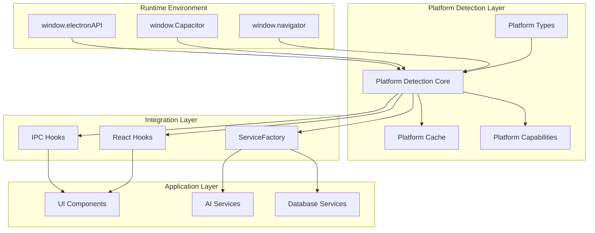
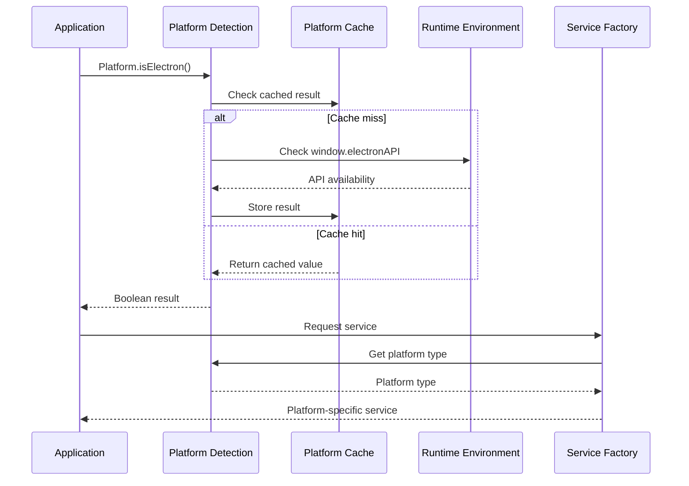
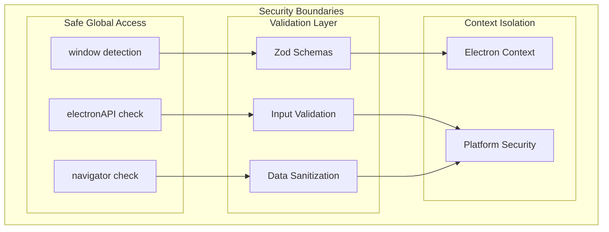

# Feature Implementation Plan: Platform Detection System

_Generated: 2025-07-12_
_Based on Feature Specification: 20250712-platform-detection-system-feature.md_

## Architecture Overview

The Platform Detection System provides a centralized, performant platform identification service that integrates seamlessly with the existing Fishbowl architecture. The system wraps the current `isElectronAPIAvailable()` function while extending it to support future Capacitor integration and granular platform detection.

### System Architecture

### Data Flow

### Security Architecture

## Technology Stack

### Core Technologies

- **Runtime:** Electron 37.x with context isolation enabled
- **Language:** TypeScript 5.x in strict mode
- **Frontend:** React 19.x with functional components and hooks
- **Build System:** Vite 7.x with esbuild for preload scripts
- **State Management:** Zustand 5.x for application state

### Libraries & Dependencies

- **Validation:** Zod 3.x schemas for type-safe data validation
- **Testing:** Vitest 3.x for unit tests with happy-dom for DOM mocking
- **Code Quality:** ESLint with @langadventurellc/tsla-linter, Prettier formatting
- **Performance:** Built-in metrics collection and optimization
- **Error Handling:** Custom error classes with categorization

### Patterns & Approaches

- **Architectural Patterns:** Process separation (main/renderer), ServiceFactory pattern
- **Design Patterns:** Singleton (platform cache), Type Guards, Hook patterns
- **Security Patterns:** Input validation with Zod, safe global object access
- **Testing Patterns:** Unit testing with Vitest, integration testing, mock environments
- **Error Handling:** Custom error classes with contextual information
- **Development Practices:** One export per file (enforced by linting), Research → Plan → Implement

### External Integrations

- **Electron APIs:** window.electronAPI for platform detection
- **Capacitor APIs:** window.Capacitor for future mobile support (foundation only)
- **Browser APIs:** window.navigator for web environment detection

## Security Considerations

- **Authentication:** No authentication required for platform detection
- **Authorization:** Read-only access to safe global objects (window, navigator)
- **Data Validation:** All platform detection inputs validated with Zod schemas
- **Sensitive Data:** Platform information sanitized before logging/storage
- **Security Headers:** Platform detection works within existing CSP constraints

## Relevant Files

### Core Platform Detection

- `src/shared/utils/platform/index.ts` - Main platform detection API exports
- `src/shared/utils/platform/detection.ts` - Core platform detection logic
- `src/shared/utils/platform/cache.ts` - Platform detection result caching
- `src/shared/utils/platform/capabilities.ts` - Feature capability checking

### Type System

- `src/shared/types/platform.ts` - Platform type definitions for cross-process use
- `src/shared/constants/platform.ts` - Platform constants for application-wide use
- `src/shared/utils/platform/types.ts` - Platform-specific type definitions

### React Integration

- `src/renderer/hooks/usePlatform/index.ts` - Hook exports following existing pattern
- `src/renderer/hooks/usePlatform/usePlatform.ts` - Main platform detection hook
- `src/renderer/hooks/usePlatform/usePlatformCapabilities.ts` - Capability checking hook

### Integration Points

- `src/renderer/services/ai/ServiceFactory.ts` - Enhanced with platform detection
- `src/renderer/hooks/useIpc/isElectronAPIAvailable.ts` - Wrapped by new system

### Validation Schemas

- `src/shared/types/validation/platformSchema/PlatformTypeSchema.ts` - Platform type validation
- `src/shared/types/validation/platformSchema/CapabilitySchema.ts` - Capability validation

### Tests

- `tests/unit/shared/utils/platform/` - Platform detection unit tests
- `tests/unit/renderer/hooks/usePlatform/` - React hooks unit tests
- `tests/integration/platform-detection-integration.test.ts` - System integration tests

## Implementation Notes

- Follow Research → Plan → Implement workflow for each task
- Read `20250712-platform-detection-system-feature.md` for feature requirements
- Look at specs in `docs/specifications/` for more details
- Use context7 to verify library documentation and best practices
- Search codebase for similar patterns before creating new implementations
- One export per file is enforced by linting - no exceptions
- Tests must be written in the same task as implementation
- Run `npm run lint && npm run format && npm run type-check` after each sub-task
- Security validation required for all global object access
- Platform detection must complete in under 1ms for cached results
- After completing each parent task, stop and await user confirmation to proceed

## Task Execution Reminders

When executing tasks, remember to:

1. **Research first** - Never jump straight to coding; examine existing patterns
2. **Check existing patterns** - Search codebase for similar implementations
3. **Validate security** - Every global object access must be validated
4. **Write tests immediately** - In the same task as implementation
5. **Run quality checks** - Format, lint, type-check after each sub-task
6. **One export per file** - This is strictly enforced by ESLint
7. **Follow hook patterns** - Use existing IPC hook patterns for consistency
8. **Integrate gradually** - Wrap existing functions rather than replacing them

## Implementation Tasks

- 1.0 Project Setup and Configuration
  - [x] 1.1 Create platform detection directory structure following project conventions
  - [x] 1.2 Set up barrel export files with proper TypeScript configuration
  - [x] 1.3 Create base test setup for platform detection with mock environments
  - [x] 1.4 Verify integration with existing build system and Vite configuration
  - [x] 1.5 Add platform detection to existing shared utils index exports

  ### Files created/modified:
  - `src/shared/utils/platform/index.ts` - Main platform detection barrel export with comprehensive documentation
  - `src/shared/utils/platform/detection.ts` - Core platform detection logic skeleton (task 2.2 implementation)
  - `src/shared/utils/platform/cache.ts` - Platform caching mechanism skeleton (task 2.5 implementation)
  - `src/shared/utils/platform/capabilities.ts` - Feature capability detection skeleton (tasks 4.1-4.7 implementation)
  - `src/shared/utils/platform/types.ts` - Platform-specific type definitions skeleton (tasks 3.1-3.7 implementation)
  - `src/shared/types/platform.ts` - Cross-process platform types skeleton (tasks 3.1-3.7 implementation)
  - `src/shared/constants/platform.ts` - Platform constants skeleton (task 2.1 implementation)
  - `tests/unit/shared/utils/platform/` - Test directory structure created
  - `src/renderer/hooks/usePlatform/` - React integration directory structure created
  - `tests/unit/renderer/hooks/usePlatform/` - React hooks test directory structure created
  - `src/shared/types/validation/platformSchema/` - Platform validation schema directory structure created
  - `src/shared/types/validation/platformSchema/index.ts` - Platform validation schema barrel export (task 1.2)
  - `src/renderer/hooks/usePlatform/index.ts` - Platform React hooks barrel export (task 1.2)
  - `src/shared/types/validation/index.ts` - Updated to include platform validation schemas (task 1.2)
  - `src/renderer/hooks/index.ts` - Updated to include platform hooks export (task 1.2)
  - `src/shared/utils/index.ts` - Updated to include platform detection utilities export (task 1.2)
  - `tests/unit/shared/utils/platform/mock-environments.ts` - Comprehensive platform mock environments for testing (task 1.3)
  - `tests/unit/shared/utils/platform/test-setup.ts` - Platform test setup with security and performance helpers (task 1.3)
  - `tests/unit/shared/utils/platform/isElectronAPIAvailable.test.ts` - Complete test suite for existing platform detection function (task 1.3)

- 2.0 Core Platform Detection Module
  - [x] 2.1 Create platform detection constants and enums
  - [x] 2.2 Implement core detection logic wrapping existing isElectronAPIAvailable()
  - [x] 2.3 Add Capacitor detection with window.Capacitor checking
  - [x] 2.4 Implement web platform detection with fallback logic
  - [x] 2.5 Create platform caching mechanism for performance optimization
  - [x] 2.6 Add granular platform detection for iOS/Android within Capacitor
  - [x] 2.7 Write comprehensive unit tests for all detection scenarios
  - [x] 2.8 Add input validation using Zod schemas for platform detection

  ### Files created/modified:
  - `src/shared/constants/platform/PlatformType.ts` - Primary platform types enum (task 2.1)
  - `src/shared/constants/platform/RuntimeEnvironment.ts` - Runtime environments enum (task 2.1)
  - `src/shared/constants/platform/OperatingSystem.ts` - Operating system platforms enum (task 2.1)
  - `src/shared/constants/platform/PLATFORM_DETECTION_CONFIG.ts` - Platform detection configuration constants (task 2.1)
  - `src/shared/constants/platform/PLATFORM_GLOBALS.ts` - Global object property names constants (task 2.1)
  - `src/shared/constants/platform/PLATFORM_CAPABILITIES.ts` - Platform capability feature flags (task 2.1)
  - `src/shared/constants/platform/PLATFORM_ERROR_CODES.ts` - Platform-specific error codes (task 2.1)
  - `src/shared/constants/platform/index.ts` - Barrel export for platform constants (task 2.1)
  - `src/shared/constants/platform.ts` - Updated to re-export from modular structure (task 2.1)
  - `tests/unit/shared/constants/platform.test.ts` - Comprehensive test suite for platform constants (task 2.1)
  - `src/shared/utils/platform/isElectronPlatform.ts` - Electron detection function wrapping existing `isElectronAPIAvailable()` (task 2.2)
  - `src/shared/utils/platform/isCapacitorPlatform.ts` - Capacitor mobile environment detection function with window.Capacitor checking (task 2.2, 2.3)
  - `src/shared/utils/platform/isWebPlatform.ts` - Enhanced web browser environment detection function with comprehensive fallback logic (task 2.2, 2.4)
  - `src/shared/utils/platform/detectPlatformType.ts` - Main platform type detection function returning enum values with Capacitor support (task 2.2, 2.3)
  - `src/shared/utils/platform/getPlatformInfo.ts` - Enhanced platform information function with Capacitor API detection (task 2.2, 2.3)
  - `src/shared/utils/platform/PlatformInfo.ts` - Platform information interface definition (task 2.2)
  - `src/shared/utils/platform/hasWindow.ts` - Safe window object existence check utility (task 2.2)
  - `src/shared/utils/platform/hasWindowProperty.ts` - Safe window property existence check utility used for Capacitor detection (task 2.2, 2.3)
  - `src/shared/utils/platform/hasDocument.ts` - Safe document object existence check with web browser feature validation (task 2.4)
  - `src/shared/utils/platform/hasWebNavigator.ts` - Web navigator feature detection for browser environment validation (task 2.4)
  - `src/shared/utils/platform/hasWebAPIs.ts` - Web browser-specific API detection utility with threshold-based validation (task 2.4)
  - `src/shared/utils/platform/hasWebLocation.ts` - Web location validation with protocol and hostname checking for browser identification (task 2.4)
  - `src/shared/utils/platform/detection.ts` - Updated to placeholder module (task 2.2)
  - `src/shared/utils/platform/index.ts` - Updated barrel export to include all core detection functions and new web detection utilities (task 2.2, 2.3, 2.4)
  - `tests/unit/shared/utils/platform/detection.test.ts` - Comprehensive test suite with Capacitor environment testing and mock-environments (task 2.2, 2.3)
  - `tests/unit/shared/utils/platform/web-platform-detection.test.ts` - Comprehensive test suite for enhanced web platform detection with multi-layer fallback logic (task 2.4)
  - `tests/unit/shared/utils/platform/mock-environments.ts` - Capacitor mock environment with window.Capacitor simulation (task 2.3)
  - `src/shared/utils/platform/isCapacitorIOS.ts` - iOS detection function for Capacitor mobile environment with safe global object access (task 2.6)
  - `src/shared/utils/platform/isCapacitorAndroid.ts` - Android detection function for Capacitor mobile environment with safe global object access (task 2.6)
  - `src/shared/utils/platform/getCapacitorOperatingSystem.ts` - Operating system detection function returning OperatingSystem enum values for Capacitor environment (task 2.6)
  - `src/shared/utils/platform/index.ts` - Updated barrel export to include granular Capacitor iOS/Android detection functions (task 2.6)
  - `tests/unit/shared/utils/platform/capacitor-granular-detection.test.ts` - Comprehensive test suite for granular iOS/Android detection within Capacitor with 26 test cases covering all scenarios (task 2.6)
  - `tests/unit/shared/utils/platform/comprehensive-platform-detection.test.ts` - Advanced comprehensive test suite covering stress testing, error injection, resource management, security boundaries, integration scenarios, edge cases, and performance validation with 24 test cases for platform detection robustness (task 2.7)
  - `src/shared/types/validation/platformSchema/PlatformTypeSchema.ts` - Zod schema for validating PlatformType enum values with custom error messages (task 2.8)
  - `src/shared/types/validation/platformSchema/OperatingSystemSchema.ts` - Zod schema for validating OperatingSystem enum values with custom error messages (task 2.8)
  - `src/shared/types/validation/platformSchema/RuntimeEnvironmentSchema.ts` - Zod schema for validating RuntimeEnvironment enum values with custom error messages (task 2.8)
  - `src/shared/types/validation/platformSchema/WindowPropertyNameSchema.ts` - Secure validation schema for window property names preventing prototype pollution and injection attacks (task 2.8)
  - `src/shared/types/validation/platformSchema/TimestampSchema.ts` - Timestamp validation schema with security checks and reasonable bounds validation (task 2.8)
  - `src/shared/types/validation/platformSchema/PlatformCacheConfigSchema.ts` - Cache configuration validation with resource exhaustion protection and bounds checking (task 2.8)
  - `src/shared/types/validation/platformSchema/PartialPlatformCacheConfigSchema.ts` - Partial cache configuration validation for constructor usage (task 2.8)
  - `src/shared/types/validation/platformSchema/PlatformInfoSchema.ts` - Comprehensive validation for PlatformInfo objects with logical consistency checks between platform type, detections, and environment (task 2.8)
  - `src/shared/types/validation/platformSchema/PlatformCacheEntrySchema.ts` - Cache entry validation ensuring data integrity and timestamp consistency (task 2.8)
  - `src/shared/types/validation/platformSchema/index.ts` - Updated barrel export to include all platform validation schemas (task 2.8)
  - `src/shared/utils/platform/hasWindowProperty.ts` - Updated to use WindowPropertyNameSchema for secure input validation (task 2.8)
  - `src/shared/utils/platform/PlatformCache.ts` - Updated constructor and setCachedResults methods to use validation schemas for security and data integrity (task 2.8)
  - `tests/unit/shared/types/validation/platformSchema.test.ts` - Comprehensive test suite for all platform validation schemas with 29 test cases covering enum validation, configuration bounds checking, data structure consistency, security validation, and edge cases (task 2.8)

- 3.0 Platform Types and Validation System
  - [x] 3.1 Define comprehensive TypeScript interfaces for platform types
  - [x] 3.2 Create type guards for platform-specific code blocks
  - [x] 3.3 Implement Zod schemas for platform detection validation
  - [x] 3.4 Add platform capability type definitions
  - [x] 3.5 Create utility types for conditional platform logic
  - [x] 3.6 Write tests for type guards and validation schemas
  - 3.7 Address PR comments and code quality issues
    - [x] 3.7.1 Fix isPlatformType type guard implementation to provide meaningful TypeScript type narrowing
    - [x] 3.7.2 Fix ConditionalOnPlatform conditional type logic to work with runtime platform detection
    - [x] 3.7.3 Remove test environment dependencies from validation schemas for consistent behavior
    - [ ] 3.7.4 Add comprehensive JSDoc documentation to complex interfaces and utility types

  ### Files to be created/modified (task 3.7):
  - `src/shared/utils/platform/isPlatformType.ts` - Fix type guard signature to provide meaningful type narrowing (task 3.7.1)
  - `src/shared/types/platform/conditional/ConditionalOnPlatform.ts` - Redesign conditional type logic for runtime platform detection (task 3.7.2)
  - `src/shared/types/platform/conditional/ExcludeOnPlatform.ts` - Update to work with fixed conditional logic (task 3.7.2)
  - `src/shared/types/platform/conditional/PlatformSpecificConfig.ts` - Update to work with fixed conditional logic (task 3.7.2)
  - `src/shared/types/validation/platformSchema/TimestampSchema.ts` - Remove test environment dependencies (task 3.7.3)
  - `src/shared/types/validation/platformSchema/PlatformCacheConfigSchema.ts` - Remove test environment dependencies (task 3.7.3)
  - `src/shared/types/validation/platformSchema/PlatformCacheEntrySchema.ts` - Remove test environment dependencies (task 3.7.3)
  - `src/shared/types/validation/platformSchema/isCacheTTLTestEnvironment.ts` - Remove or refactor to avoid production impact (task 3.7.3)
  - `src/shared/types/validation/platformSchema/isValidationTestEnvironment.ts` - Remove or refactor to avoid production impact (task 3.7.3)
  - `src/shared/types/platform/PlatformServiceRegistry.ts` - Add comprehensive JSDoc to properties (task 3.7.4)
  - `src/shared/types/platform/PlatformCapabilityDetectionConfig.ts` - Add detailed JSDoc to configuration options (task 3.7.4)
  - `src/shared/types/platform/PlatformServiceFactoryConfig.ts` - Add JSDoc explaining configuration properties (task 3.7.4)
  - `src/shared/types/platform/UsePlatformCapabilitiesActions.ts` - Add detailed method documentation and return type specifications (task 3.7.4)
  - `src/shared/types/platform/PlatformPerformanceBenchmark.ts` - Add JSDoc explaining metric calculations (task 3.7.4)
  - `src/shared/types/platform/conditional/PlatformCompatible.ts` - Add implementation guidance documentation (task 3.7.4)
  - `src/shared/types/platform/conditional/CapabilityAwareService.ts` - Add examples for capability-based services (task 3.7.4)
  - `tests/unit/shared/utils/platform/type-guards-fixed.test.ts` - Test suite for fixed type guard implementation (task 3.7.1)
  - `tests/unit/shared/types/platform-conditional-types-fixed.test.ts` - Test suite for fixed conditional types (task 3.7.2)
  - `tests/unit/shared/types/validation/platform-validation-consistency.test.ts` - Test suite ensuring consistent validation behavior (task 3.7.3)

  ### Files created/modified:
  - `src/shared/types/platform/PlatformDetectionResult.ts` - Platform detection operation result interface with confidence, timing, and metadata (task 3.1)
  - `src/shared/types/platform/PlatformDetectionContext.ts` - Environmental context interface for platform detection operations (task 3.1)
  - `src/shared/types/platform/PlatformMethodResult.ts` - Individual platform detection method result interface with evidence and performance metrics (task 3.1)
  - `src/shared/types/platform/PlatformDetectionSummary.ts` - Comprehensive summary interface for all platform detection operations (task 3.1)
  - `src/shared/types/platform/PlatformTypeGuard.ts` - Type guard function signature interface for platform type checking (task 3.1)
  - `src/shared/types/platform/ElectronTypeGuard.ts` - Electron-specific type guard function signature interface (task 3.1)
  - `src/shared/types/platform/CapacitorTypeGuard.ts` - Capacitor-specific type guard function signature interface (task 3.1)
  - `src/shared/types/platform/WebTypeGuard.ts` - Web browser-specific type guard function signature interface (task 3.1)
  - `src/shared/types/platform/PlatformTypeGuards.ts` - Collection interface for all platform type guard functions (task 3.1)
  - `src/shared/types/platform/UsePlatformState.ts` - React hook state interface following established State + Actions pattern (task 3.1)
  - `src/shared/types/platform/UsePlatformActions.ts` - React hook action methods interface with platform detection operations (task 3.1)
  - `src/shared/types/platform/UsePlatformReturn.ts` - Complete React hook return type combining state and actions (task 3.1)
  - `src/shared/types/platform/UsePlatformCapabilitiesState.ts` - Platform capabilities hook state interface for feature availability tracking (task 3.1)
  - `src/shared/types/platform/UsePlatformCapabilitiesActions.ts` - Platform capabilities hook action methods interface (task 3.1)
  - `src/shared/types/platform/UsePlatformCapabilitiesReturn.ts` - Complete capabilities hook return type interface (task 3.1)
  - `src/shared/types/platform/PlatformCapability.ts` - Platform capability definition interface with metadata and permissions (task 3.1)
  - `src/shared/types/platform/PlatformCapabilities.ts` - Organized collection of platform capabilities by category (task 3.1)
  - `src/shared/types/platform/CapabilityDetectionResult.ts` - Capability detection operation result with evidence and permissions (task 3.1)
  - `src/shared/types/platform/PlatformCapabilityAssessment.ts` - Comprehensive platform capability assessment interface (task 3.1)
  - `src/shared/types/platform/PlatformErrorType.ts` - Platform error type enumeration for structured error classification (task 3.1)
  - `src/shared/types/platform/PlatformError.ts` - Structured platform error interface with context and solutions (task 3.1)
  - `src/shared/types/platform/PlatformErrorContext.ts` - Platform error context interface with environmental details (task 3.1)
  - `src/shared/types/platform/PlatformErrorResult.ts` - Complete platform error result interface with recovery actions (task 3.1)
  - `src/shared/types/platform/PlatformPerformanceMetrics.ts` - Performance metrics interface supporting sub-1ms cached detection requirement (task 3.1)
  - `src/shared/types/platform/PlatformPerformanceConfig.ts` - Performance monitoring configuration interface (task 3.1)
  - `src/shared/types/platform/PlatformPerformanceBenchmark.ts` - Performance benchmarking interface for trend analysis (task 3.1)
  - `src/shared/types/platform/PlatformServiceDescriptor.ts` - Service descriptor interface for platform-aware service creation (task 3.1)
  - `src/shared/types/platform/PlatformServiceFactoryConfig.ts` - ServiceFactory configuration interface for platform-specific service creation (task 3.1)
  - `src/shared/types/platform/PlatformServiceCreationResult.ts` - Service creation result interface with detailed creation information (task 3.1)
  - `src/shared/types/platform/PlatformServiceRegistry.ts` - Service registry interface for managing platform-specific services (task 3.1)
  - `src/shared/types/platform/index.ts` - Comprehensive barrel export for all platform type interfaces including existing utilities (task 3.1)
  - `src/shared/types/platform.ts` - Updated cross-process platform types entry point with complete exports (task 3.1)
  - `tests/unit/shared/types/platform-interfaces.test.ts` - Interface validation tests ensuring type definitions compile and work correctly with 10 test cases covering constants, interfaces, and type compatibility (task 3.1)
  - `src/shared/utils/platform/isElectronEnvironment.ts` - Type guard function for Electron environment detection with TypeScript type narrowing (task 3.2)
  - `src/shared/utils/platform/isCapacitorEnvironment.ts` - Type guard function for Capacitor environment detection with TypeScript type narrowing (task 3.2)
  - `src/shared/utils/platform/isWebEnvironment.ts` - Type guard function for Web environment detection with TypeScript type narrowing (task 3.2)
  - `src/shared/utils/platform/isPlatformType.ts` - Generic type guard for platform type checking with input validation and security (task 3.2)
  - `src/shared/utils/platform/isKnownPlatform.ts` - Type guard to exclude UNKNOWN platform type from conditional blocks (task 3.2)
  - `src/shared/utils/platform/isPlatformContext.ts` - Type guard for validating platform context objects with comprehensive validation (task 3.2)
  - `src/shared/types/platform/ElectronEnvironment.ts` - Electron runtime environment type definition for type narrowing (task 3.2)
  - `src/shared/types/platform/NonElectronEnvironment.ts` - Non-Electron runtime environment type definition (task 3.2)
  - `src/shared/types/platform/CapacitorEnvironment.ts` - Capacitor runtime environment type definition for type narrowing (task 3.2)
  - `src/shared/types/platform/NonCapacitorEnvironment.ts` - Non-Capacitor runtime environment type definition (task 3.2)
  - `src/shared/types/platform/WebEnvironment.ts` - Web browser runtime environment type definition for type narrowing (task 3.2)
  - `src/shared/types/platform/NonWebEnvironment.ts` - Non-Web runtime environment type definition (task 3.2)
  - `src/shared/types/platform/RuntimeEnvironment.ts` - Union type for all runtime environment contexts (task 3.2)
  - `src/shared/types/platform/CapacitorRuntimeEnvironment.ts` - Union type for Capacitor-aware runtime environments (task 3.2)
  - `src/shared/types/platform/WebRuntimeEnvironment.ts` - Union type for Web-aware runtime environments (task 3.2)
  - `src/shared/types/platform/KnownPlatformType.ts` - Type excluding UNKNOWN platform for safe type narrowing (task 3.2)
  - `src/shared/types/platform/PlatformContextType.ts` - Platform context object type definition for validation (task 3.2)
  - `src/shared/utils/platform/index.ts` - Updated barrel export to include all type guard functions and environment types (task 3.2)
  - `tests/unit/shared/utils/platform/type-guards.test.ts` - Comprehensive test suite for all type guard functions with 39 test cases covering type narrowing, error handling, and integration scenarios (task 3.2)
  - `src/shared/types/validation/platformSchema/PlatformDetectionResultSchema.ts` - Validation schema for platform detection operation results with confidence bounds, detection method validation, and metadata consistency checks (task 3.3)
  - `src/shared/types/validation/platformSchema/PlatformDetectionContextSchema.ts` - Validation schema for platform detection environmental context with logical consistency checks for window/navigator/document relationships and security validation for user agent and platform strings (task 3.3)
  - `src/shared/types/validation/platformSchema/PlatformMethodResultSchema.ts` - Validation schema for individual platform detection method results with evidence validation, performance metrics tracking, and logical consistency between results and confidence levels (task 3.3)
  - `src/shared/types/validation/platformSchema/PlatformDetectionSummarySchema.ts` - Validation schema for comprehensive platform detection summaries with cross-validation of timing consistency, method uniqueness, and performance correlation checks (task 3.3)
  - `src/shared/types/validation/platformSchema/PlatformErrorTypeSchema.ts` - Enum validation schema for platform error type categorization (task 3.3)
  - `src/shared/types/validation/platformSchema/PlatformErrorSchema.ts` - Validation schema for structured platform error information with security validation, error classification, and recovery suggestion enforcement (task 3.3)
  - `src/shared/types/validation/platformSchema/PlatformErrorContextSchema.ts` - Validation schema for platform error context with environmental information validation, security checks for property names, and logical consistency between attempted and detected platforms (task 3.3)
  - `src/shared/types/validation/platformSchema/RecoveryActionSchema.ts` - Validation schema for platform error recovery actions with priority levels and automation flags (task 3.3)
  - `src/shared/types/validation/platformSchema/PlatformErrorResultSchema.ts` - Validation schema for complete platform error results with recovery action validation, retry logic consistency, and timestamp validation (task 3.3)
  - `src/shared/types/validation/platformSchema/PlatformPerformanceMetricsSchema.ts` - Validation schema for platform detection performance metrics supporting sub-1ms cached detection requirement with cache memory validation under 1KB and comprehensive performance bounds checking (task 3.3)
  - `src/shared/types/validation/platformSchema/CapabilityCategorySchema.ts` - Enum validation schema for platform capability categories (task 3.3)
  - `src/shared/types/validation/platformSchema/PermissionLevelSchema.ts` - Enum validation schema for platform capability permission levels (task 3.3)
  - `src/shared/types/validation/platformSchema/PlatformCapabilitySchema.ts` - Validation schema for platform capability definitions with metadata validation, permission consistency checks, and platform support matrix validation (task 3.3)
  - `src/shared/types/validation/platformSchema/DetectionStatusSchema.ts` - Enum validation schema for capability detection status values (task 3.3)
  - `src/shared/types/validation/platformSchema/CapabilityDetectionResultSchema.ts` - Validation schema for capability detection results with status consistency validation, evidence requirements for available capabilities, and error status correlation (task 3.3)
  - `src/shared/types/validation/platformSchema/index.ts` - Updated barrel export to include all new platform detection validation schemas organized by category (task 3.3)
  - `tests/unit/shared/types/validation/platform-detection-validation.test.ts` - Comprehensive test suite for all new platform detection validation schemas with 38 test cases covering schema validation, logical consistency checks, security validation, bounds checking, and error handling scenarios (task 3.3)
  - `src/shared/constants/platform/CapabilityCategory.ts` - Platform capability category enumeration with 8 categories for organizing capability definitions (task 3.4)
  - `src/shared/constants/platform/PermissionLevel.ts` - Platform capability permission level enumeration with 5 levels for access control (task 3.4)
  - `src/shared/constants/platform/DetectionStatus.ts` - Platform capability detection status enumeration with 6 statuses for capability availability tracking (task 3.4)
  - `src/shared/types/platform/PlatformCapabilityId.ts` - Type-safe platform capability identifier combining category and name (task 3.4)
  - `src/shared/types/platform/CapabilityCategoryMap.ts` - Type mapping capability categories to their specific capability names (task 3.4)
  - `src/shared/types/platform/CategoryCapabilityId.ts` - Generic type for category-specific capability identifiers with type safety (task 3.4)
  - `src/shared/types/platform/DetectionResultMap.ts` - Type mapping detection statuses to their corresponding result structures (task 3.4)
  - `src/shared/types/platform/TypedDetectionResult.ts` - Type-safe detection result for specific detection statuses (task 3.4)
  - `src/shared/types/platform/TypedCapabilityState.ts` - Platform capability state interface with type-safe status tracking (task 3.4)
  - `src/shared/types/platform/CapabilityPermissionRequirement.ts` - Interface for capability permission requirements and validation (task 3.4)
  - `src/shared/types/platform/PlatformCapabilityDetectionConfig.ts` - Configuration interface for platform capability detection operations (task 3.4)
  - `src/shared/constants/platform/index.ts` - Updated barrel export to include all new capability enums (task 3.4)
  - `src/shared/types/platform/index.ts` - Updated barrel export to include all new capability utility types (task 3.4)
  - `src/shared/constants/index.ts` - Updated to export platform constants for proper access throughout the application (task 3.4)
  - `tests/unit/shared/types/platform-capability-types.test.ts` - Comprehensive test suite for all new platform capability type definitions with 17 test cases covering enum validation, utility types, and type system integration (task 3.4)
  - `CapabilityCategory` enum with 8 categories (STORAGE, FILESYSTEM, NETWORKING, SYSTEM, UI, SECURITY, PERFORMANCE, PLATFORM_SPECIFIC)
  - `PermissionLevel` enum with 5 levels (NONE, READ, WRITE, ADMIN, SYSTEM)
  - `DetectionStatus` enum with 6 statuses (AVAILABLE, UNAVAILABLE, PERMISSION_DENIED, NOT_SUPPORTED, ERROR, UNKNOWN)
  - `PlatformCapabilityId` type for type-safe capability identifiers
  - `CapabilityCategoryMap` type mapping categories to specific capability names
  - `CategoryCapabilityId<T>` generic type for category-specific capability IDs
  - `DetectionResultMap` type mapping detection statuses to result structures
  - `TypedDetectionResult<T>` type-safe detection result for specific statuses
  - `TypedCapabilityState` interface for capability state with type-safe status
  - `CapabilityPermissionRequirement` interface for permission requirements
  - `PlatformCapabilityDetectionConfig` interface for detection configuration
  - `src/shared/types/platform/conditional/ConditionalOnPlatform.ts` - Utility type for conditionally including properties based on platform type (task 3.5)
  - `src/shared/types/platform/conditional/ExcludeOnPlatform.ts` - Utility type for excluding properties on specific platforms (task 3.5)
  - `src/shared/types/platform/conditional/PlatformSpecificConfig.ts` - Configuration objects with different shapes per platform (task 3.5)
  - `src/shared/types/platform/conditional/CapabilityConditional.ts` - Conditional types based on capability availability (task 3.5)
  - `src/shared/types/platform/conditional/PlatformApiSurface.ts` - API interfaces available for specific platforms (task 3.5)
  - `src/shared/types/platform/conditional/PlatformFallback.ts` - Fallback types for unsupported platforms (task 3.5)
  - `src/shared/types/platform/conditional/RequirePlatform.ts` - Types requiring specific platforms for usage (task 3.5)
  - `src/shared/types/platform/conditional/PlatformUnion.ts` - Union types across multiple platforms with discrimination (task 3.5)
  - `src/shared/types/platform/conditional/CapabilityAwareService.ts` - Services that change interface based on capability availability (task 3.5)
  - `src/shared/types/platform/conditional/PlatformCompatible.ts` - Types ensuring compatibility across specified platforms (task 3.5)
  - `src/shared/types/platform/conditional/index.ts` - Barrel export for conditional utility types (task 3.5)
  - `src/shared/types/platform/index.ts` - Updated to include conditional utility types exports (task 3.5)
  - `tests/unit/shared/types/platform-conditional-types.test.ts` - Comprehensive test suite for conditional utility types with 19 test cases covering type compilation, runtime behavior, and integration scenarios (task 3.5)
  - `tests/unit/shared/types/validation/platform-validation-helpers.test.ts` - Comprehensive test suite for validation helper functions with 20 test cases covering `isValidationTestEnvironment()` and `isCacheTTLTestEnvironment()` with environment mocking, edge cases, type safety validation, and integration scenarios (task 3.6)
  - `src/shared/types/platform/UnknownEnvironment.ts` - Unknown environment type definition (task 3.7.1)
  - `src/shared/types/platform/AllPlatformEnvironment.ts` - Comprehensive environment union type (task 3.7.1)
  - `src/shared/types/platform/PlatformEnvironmentMap.ts` - Platform type to environment interface mapping (task 3.7.1)
  - `src/shared/types/platform/index.ts` - Updated exports to include new environment types (task 3.7.1)
  - `src/shared/utils/platform/isPlatformType.ts` - Fixed type guard implementation with meaningful type narrowing (task 3.7.1)
  - `tests/unit/shared/utils/platform/type-guards-fixed.test.ts` - Comprehensive test suite for fixed type guard with 16 test cases (task 3.7.1)
  - `tests/unit/shared/utils/platform/type-guards.test.ts` - Updated existing tests for new function signature (task 3.7.1)
  - `src/shared/types/platform/conditional/ConditionalOnPlatform.ts` - Fixed conditional type logic and enhanced documentation
  - `src/shared/types/platform/conditional/ExcludeOnPlatform.ts` - Fixed conditional type logic and enhanced documentation
  - `src/shared/types/platform/conditional/PlatformSpecificConfig.ts` - Enhanced documentation with runtime examples
  - `tests/unit/shared/types/platform-conditional-types-fixed.test.ts` - New comprehensive test suite with 12 test cases
  - `src/shared/types/validation/platformSchema/TimestampSchema.ts` - Removed `isCacheTTLTestEnvironment()` import and conditional logic for consistent validation behavior (task 3.7.3)
  - `src/shared/types/validation/platformSchema/PlatformCacheConfigSchema.ts` - Removed `isCacheTTLTestEnvironment()` import and replaced conditional refinement with consistent `.min()` validation (task 3.7.3)
  - `src/shared/types/validation/platformSchema/PlatformCacheEntrySchema.ts` - Removed `isCacheTTLTestEnvironment()` import and conditional logic for timestamp proximity validation (task 3.7.3)
  - `src/shared/types/validation/platformSchema/isCacheTTLTestEnvironment.ts` - Deleted file (task 3.7.3)
  - `src/shared/types/validation/platformSchema/isValidationTestEnvironment.ts` - Deleted file (task 3.7.3)
  - `src/shared/types/validation/platformSchema/index.ts` - Removed exports for deleted test environment detection functions (task 3.7.3)
  - `tests/unit/shared/types/validation/platform-validation-helpers.test.ts` - Deleted test file for removed functions (task 3.7.3)
  - `tests/unit/shared/utils/platform/cache.test.ts` - Updated cache TTL test values from 50ms/100ms to 1000ms minimum to comply with production validation requirements (task 3.7.3)

- 4.0 Feature Capability Framework
  - [ ] 4.1 Design extensible capability checking API structure
  - [ ] 4.2 Implement secure storage capability detection
  - [ ] 4.3 Add file system access capability checking
  - [ ] 4.4 Create capability result caching mechanism
  - [ ] 4.5 Add capability validation with appropriate fallbacks
  - [ ] 4.6 Implement framework for adding future capabilities
  - [ ] 4.7 Write unit tests for all capability detection functions

  ### Files created/modified:
  - (to be filled in after task completion)

- 5.0 React Integration Utilities
  - [ ] 5.1 Create usePlatform hook following existing IPC hook patterns
  - [ ] 5.2 Implement usePlatformCapabilities hook with error handling
  - [ ] 5.3 Add conditional rendering utilities for platform-specific components
  - [ ] 5.4 Integrate platform hooks with existing error and loading state patterns
  - [ ] 5.5 Create platform-aware conditional import utilities
  - [ ] 5.6 Add React integration tests with mock platform environments
  - [ ] 5.7 Ensure hooks integrate seamlessly with existing IPC hook system

  ### Files created/modified:
  - (to be filled in after task completion)

- 6.0 ServiceFactory Integration
  - 6.1 ServiceFactory Platform Detection Integration
    - [ ] 6.1.1 Add platform detection to ServiceFactory constructor pattern
    - [ ] 6.1.2 Implement conditional service instantiation based on platform
    - [ ] 6.1.3 Create platform-specific service factory methods
    - [ ] 6.1.4 Add error handling for unsupported platform/service combinations
  - [ ] 6.2 Update existing service creation methods to use platform detection
  - [ ] 6.3 Add platform capability checking before service instantiation
  - [ ] 6.4 Create example platform-specific service implementations
  - [ ] 6.5 Write integration tests for ServiceFactory with platform detection

  ### Files created/modified:
  - (to be filled in after task completion)

- 7.0 Testing Infrastructure and Validation
  - [ ] 7.1 Create comprehensive mock environments for Electron, Capacitor, and web
  - [ ] 7.2 Implement performance benchmarks for platform detection speed (<1ms)
  - [ ] 7.3 Add memory usage validation for platform cache (<1KB)
  - [ ] 7.4 Create integration tests with existing IPC system
  - [ ] 7.5 Add platform detection reliability tests with multiple detection cycles
  - [ ] 7.6 Implement security validation tests for safe global object access
  - [ ] 7.7 Create bundle size validation for tree-shaking verification (<5KB)
  - [ ] 7.8 Add comprehensive error handling and recovery testing

  ### Files created/modified:
  - (to be filled in after task completion)

- 8.0 Documentation and Final Integration
  - [ ] 8.1 Create comprehensive API documentation for platform detection
  - [ ] 8.2 Add code examples and usage patterns for developers
  - [ ] 8.3 Update existing documentation to reference new platform detection
  - [ ] 8.4 Create migration guide for developers using isElectronAPIAvailable()
  - [ ] 8.5 Add JSDoc comments to all exported functions and types
  - [ ] 8.6 Verify backward compatibility with existing platform-dependent code
  - [ ] 8.7 Run final integration tests across all platform environments
  - [ ] 8.8 Validate all acceptance criteria from feature specification

  ### Files created/modified:
  - (to be filled in after task completion)

## Dependencies and Critical Path

### Critical Path Dependencies

1. **1.0 Project Setup** must complete before all other tasks
2. **2.0 Core Platform Detection** must complete before 4.0, 5.0, and 6.0
3. **3.0 Platform Types** must complete before 5.0 and 6.0
4. **4.0 Feature Capability Framework** required for 6.0 ServiceFactory integration
5. **5.0 React Integration** and **6.0 ServiceFactory Integration** can proceed in parallel after dependencies
6. **7.0 Testing Infrastructure** can begin after 2.0 and continue in parallel
7. **8.0 Documentation** requires completion of all implementation tasks

### Parallel Work Opportunities

- **2.0 Core Detection + 3.0 Platform Types** can be developed simultaneously
- **5.0 React Integration + 6.0 ServiceFactory** can proceed in parallel after core is complete
- **7.0 Testing** can begin incrementally as components are implemented
- **Documentation tasks** can be written alongside implementation

### External Dependencies

- **Existing codebase patterns** must be researched before implementation
- **ESLint configuration** must support one-export-per-file enforcement
- **Vitest configuration** must support platform mock environments
- **TypeScript configuration** must support strict mode across all modules

## Success Criteria

### Performance Targets

- Platform detection completes in under 1ms for cached results
- Memory footprint under 1KB for platform detection cache
- Bundle size impact under 5KB with tree-shaking enabled
- Zero impact on application startup time

### Quality Targets

- Test coverage exceeding 95% for platform detection utilities
- 100% TypeScript strict mode compliance
- Zero ESLint violations across all platform detection code
- All functional requirements from specification implemented and tested

### Integration Targets

- ServiceFactory successfully uses platform detection for service instantiation
- Existing `isElectronAPIAvailable()` function remains functional and tested
- Platform detection integrates with current error handling patterns
- No breaking changes to existing component interfaces
