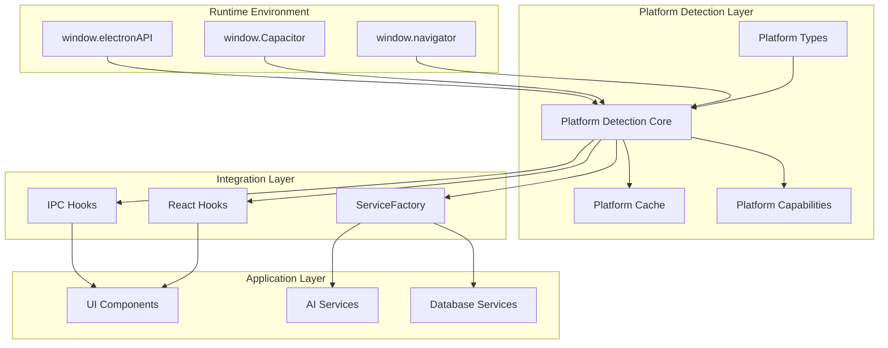
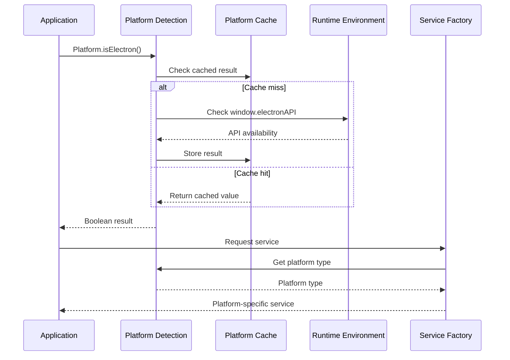
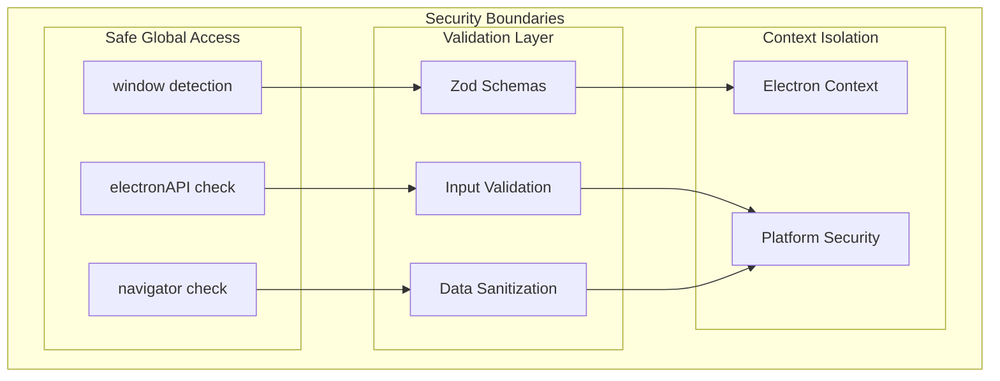

# Feature Implementation Plan: Platform Detection System

_Generated: 2025-07-12_
_Based on Feature Specification: 20250712-platform-detection-system-feature.md_

## Architecture Overview

The Platform Detection System provides a centralized, performant platform identification service that integrates seamlessly with the existing Fishbowl architecture. The system wraps the current `isElectronAPIAvailable()` function while extending it to support future Capacitor integration and granular platform detection.

### System Architecture

### Data Flow

### Security Architecture

## Technology Stack

### Core Technologies

- **Runtime:** Electron 37.x with context isolation enabled
- **Language:** TypeScript 5.x in strict mode
- **Frontend:** React 19.x with functional components and hooks
- **Build System:** Vite 7.x with esbuild for preload scripts
- **State Management:** Zustand 5.x for application state

### Libraries & Dependencies

- **Validation:** Zod 3.x schemas for type-safe data validation
- **Testing:** Vitest 3.x for unit tests with happy-dom for DOM mocking
- **Code Quality:** ESLint with @langadventurellc/tsla-linter, Prettier formatting
- **Performance:** Built-in metrics collection and optimization
- **Error Handling:** Custom error classes with categorization

### Patterns & Approaches

- **Architectural Patterns:** Process separation (main/renderer), ServiceFactory pattern
- **Design Patterns:** Singleton (platform cache), Type Guards, Hook patterns
- **Security Patterns:** Input validation with Zod, safe global object access
- **Testing Patterns:** Unit testing with Vitest, integration testing, mock environments
- **Error Handling:** Custom error classes with contextual information
- **Development Practices:** One export per file (enforced by linting), Research → Plan → Implement

### External Integrations

- **Electron APIs:** window.electronAPI for platform detection
- **Capacitor APIs:** window.Capacitor for future mobile support (foundation only)
- **Browser APIs:** window.navigator for web environment detection

## Security Considerations

- **Authentication:** No authentication required for platform detection
- **Authorization:** Read-only access to safe global objects (window, navigator)
- **Data Validation:** All platform detection inputs validated with Zod schemas
- **Sensitive Data:** Platform information sanitized before logging/storage
- **Security Headers:** Platform detection works within existing CSP constraints

## Relevant Files

### Core Platform Detection

- `src/shared/utils/platform/index.ts` - Main platform detection API exports
- `src/shared/utils/platform/detection.ts` - Core platform detection logic
- `src/shared/utils/platform/cache.ts` - Platform detection result caching
- `src/shared/utils/platform/capabilities.ts` - Feature capability checking

### Type System

- `src/shared/types/platform.ts` - Platform type definitions for cross-process use
- `src/shared/constants/platform.ts` - Platform constants for application-wide use
- `src/shared/utils/platform/types.ts` - Platform-specific type definitions

### React Integration

- `src/renderer/hooks/usePlatform/index.ts` - Hook exports following existing pattern
- `src/renderer/hooks/usePlatform/usePlatform.ts` - Main platform detection hook
- `src/renderer/hooks/usePlatform/usePlatformCapabilities.ts` - Capability checking hook

### Integration Points

- `src/renderer/services/ai/ServiceFactory.ts` - Enhanced with platform detection
- `src/renderer/hooks/useIpc/isElectronAPIAvailable.ts` - Wrapped by new system

### Validation Schemas

- `src/shared/types/validation/platformSchema/PlatformTypeSchema.ts` - Platform type validation
- `src/shared/types/validation/platformSchema/CapabilitySchema.ts` - Capability validation

### Tests

- `tests/unit/shared/utils/platform/` - Platform detection unit tests
- `tests/unit/renderer/hooks/usePlatform/` - React hooks unit tests
- `tests/integration/platform-detection-integration.test.ts` - System integration tests

## Implementation Notes

- Follow Research → Plan → Implement workflow for each task
- Use context7 to verify library documentation and best practices
- Search codebase for similar patterns before creating new implementations
- One export per file is enforced by linting - no exceptions
- Tests must be written in the same task as implementation
- Run `npm run lint && npm run format && npm run type-check` after each sub-task
- Security validation required for all global object access
- Platform detection must complete in under 1ms for cached results
- After completing each parent task, stop and await user confirmation to proceed

## Task Execution Reminders

When executing tasks, remember to:

1. **Research first** - Never jump straight to coding; examine existing patterns
2. **Check existing patterns** - Search codebase for similar implementations
3. **Validate security** - Every global object access must be validated
4. **Write tests immediately** - In the same task as implementation
5. **Run quality checks** - Format, lint, type-check after each sub-task
6. **One export per file** - This is strictly enforced by ESLint
7. **Follow hook patterns** - Use existing IPC hook patterns for consistency
8. **Integrate gradually** - Wrap existing functions rather than replacing them

## Implementation Tasks

- 1.0 Project Setup and Configuration
  - [x] 1.1 Create platform detection directory structure following project conventions
  - [x] 1.2 Set up barrel export files with proper TypeScript configuration
  - [x] 1.3 Create base test setup for platform detection with mock environments
  - [x] 1.4 Verify integration with existing build system and Vite configuration
  - [x] 1.5 Add platform detection to existing shared utils index exports

  ### Files created/modified:
  - `src/shared/utils/platform/index.ts` - Main platform detection barrel export with comprehensive documentation
  - `src/shared/utils/platform/detection.ts` - Core platform detection logic skeleton (task 2.2 implementation)
  - `src/shared/utils/platform/cache.ts` - Platform caching mechanism skeleton (task 2.5 implementation)
  - `src/shared/utils/platform/capabilities.ts` - Feature capability detection skeleton (tasks 4.1-4.7 implementation)
  - `src/shared/utils/platform/types.ts` - Platform-specific type definitions skeleton (tasks 3.1-3.7 implementation)
  - `src/shared/types/platform.ts` - Cross-process platform types skeleton (tasks 3.1-3.7 implementation)
  - `src/shared/constants/platform.ts` - Platform constants skeleton (task 2.1 implementation)
  - `tests/unit/shared/utils/platform/` - Test directory structure created
  - `src/renderer/hooks/usePlatform/` - React integration directory structure created
  - `tests/unit/renderer/hooks/usePlatform/` - React hooks test directory structure created
  - `src/shared/types/validation/platformSchema/` - Platform validation schema directory structure created
  - `src/shared/types/validation/platformSchema/index.ts` - Platform validation schema barrel export (task 1.2)
  - `src/renderer/hooks/usePlatform/index.ts` - Platform React hooks barrel export (task 1.2)
  - `src/shared/types/validation/index.ts` - Updated to include platform validation schemas (task 1.2)
  - `src/renderer/hooks/index.ts` - Updated to include platform hooks export (task 1.2)
  - `src/shared/utils/index.ts` - Updated to include platform detection utilities export (task 1.2)
  - `tests/unit/shared/utils/platform/mock-environments.ts` - Comprehensive platform mock environments for testing (task 1.3)
  - `tests/unit/shared/utils/platform/test-setup.ts` - Platform test setup with security and performance helpers (task 1.3)
  - `tests/unit/shared/utils/platform/isElectronAPIAvailable.test.ts` - Complete test suite for existing platform detection function (task 1.3)

- 2.0 Core Platform Detection Module
  - [x] 2.1 Create platform detection constants and enums
  - [x] 2.2 Implement core detection logic wrapping existing isElectronAPIAvailable()
  - [x] 2.3 Add Capacitor detection with window.Capacitor checking
  - [x] 2.4 Implement web platform detection with fallback logic
  - [x] 2.5 Create platform caching mechanism for performance optimization
  - [x] 2.6 Add granular platform detection for iOS/Android within Capacitor
  - [ ] 2.7 Write comprehensive unit tests for all detection scenarios
  - [ ] 2.8 Add input validation using Zod schemas for platform detection

  ### Files created/modified:
  - `src/shared/constants/platform/PlatformType.ts` - Primary platform types enum (task 2.1)
  - `src/shared/constants/platform/RuntimeEnvironment.ts` - Runtime environments enum (task 2.1)
  - `src/shared/constants/platform/OperatingSystem.ts` - Operating system platforms enum (task 2.1)
  - `src/shared/constants/platform/PLATFORM_DETECTION_CONFIG.ts` - Platform detection configuration constants (task 2.1)
  - `src/shared/constants/platform/PLATFORM_GLOBALS.ts` - Global object property names constants (task 2.1)
  - `src/shared/constants/platform/PLATFORM_CAPABILITIES.ts` - Platform capability feature flags (task 2.1)
  - `src/shared/constants/platform/PLATFORM_ERROR_CODES.ts` - Platform-specific error codes (task 2.1)
  - `src/shared/constants/platform/index.ts` - Barrel export for platform constants (task 2.1)
  - `src/shared/constants/platform.ts` - Updated to re-export from modular structure (task 2.1)
  - `tests/unit/shared/constants/platform.test.ts` - Comprehensive test suite for platform constants (task 2.1)
  - `src/shared/utils/platform/isElectronPlatform.ts` - Electron detection function wrapping existing `isElectronAPIAvailable()` (task 2.2)
  - `src/shared/utils/platform/isCapacitorPlatform.ts` - Capacitor mobile environment detection function with window.Capacitor checking (task 2.2, 2.3)
  - `src/shared/utils/platform/isWebPlatform.ts` - Enhanced web browser environment detection function with comprehensive fallback logic (task 2.2, 2.4)
  - `src/shared/utils/platform/detectPlatformType.ts` - Main platform type detection function returning enum values with Capacitor support (task 2.2, 2.3)
  - `src/shared/utils/platform/getPlatformInfo.ts` - Enhanced platform information function with Capacitor API detection (task 2.2, 2.3)
  - `src/shared/utils/platform/PlatformInfo.ts` - Platform information interface definition (task 2.2)
  - `src/shared/utils/platform/hasWindow.ts` - Safe window object existence check utility (task 2.2)
  - `src/shared/utils/platform/hasWindowProperty.ts` - Safe window property existence check utility used for Capacitor detection (task 2.2, 2.3)
  - `src/shared/utils/platform/hasDocument.ts` - Safe document object existence check with web browser feature validation (task 2.4)
  - `src/shared/utils/platform/hasWebNavigator.ts` - Web navigator feature detection for browser environment validation (task 2.4)
  - `src/shared/utils/platform/hasWebAPIs.ts` - Web browser-specific API detection utility with threshold-based validation (task 2.4)
  - `src/shared/utils/platform/hasWebLocation.ts` - Web location validation with protocol and hostname checking for browser identification (task 2.4)
  - `src/shared/utils/platform/detection.ts` - Updated to placeholder module (task 2.2)
  - `src/shared/utils/platform/index.ts` - Updated barrel export to include all core detection functions and new web detection utilities (task 2.2, 2.3, 2.4)
  - `tests/unit/shared/utils/platform/detection.test.ts` - Comprehensive test suite with Capacitor environment testing and mock-environments (task 2.2, 2.3)
  - `tests/unit/shared/utils/platform/web-platform-detection.test.ts` - Comprehensive test suite for enhanced web platform detection with multi-layer fallback logic (task 2.4)
  - `tests/unit/shared/utils/platform/mock-environments.ts` - Capacitor mock environment with window.Capacitor simulation (task 2.3)
  - `src/shared/utils/platform/isCapacitorIOS.ts` - iOS detection function for Capacitor mobile environment with safe global object access (task 2.6)
  - `src/shared/utils/platform/isCapacitorAndroid.ts` - Android detection function for Capacitor mobile environment with safe global object access (task 2.6)
  - `src/shared/utils/platform/getCapacitorOperatingSystem.ts` - Operating system detection function returning OperatingSystem enum values for Capacitor environment (task 2.6)
  - `src/shared/utils/platform/index.ts` - Updated barrel export to include granular Capacitor iOS/Android detection functions (task 2.6)
  - `tests/unit/shared/utils/platform/capacitor-granular-detection.test.ts` - Comprehensive test suite for granular iOS/Android detection within Capacitor with 26 test cases covering all scenarios (task 2.6)

- 3.0 Platform Types and Validation System
  - [ ] 3.1 Define comprehensive TypeScript interfaces for platform types
  - [ ] 3.2 Create type guards for platform-specific code blocks
  - [ ] 3.3 Implement Zod schemas for platform detection validation
  - [ ] 3.4 Add platform capability type definitions
  - [ ] 3.5 Create utility types for conditional platform logic
  - [ ] 3.6 Write tests for type guards and validation schemas
  - [ ] 3.7 Ensure TypeScript strict mode compliance across all types

  ### Files created/modified:
  - (to be filled in after task completion)

- 4.0 Feature Capability Framework
  - [ ] 4.1 Design extensible capability checking API structure
  - [ ] 4.2 Implement secure storage capability detection
  - [ ] 4.3 Add file system access capability checking
  - [ ] 4.4 Create capability result caching mechanism
  - [ ] 4.5 Add capability validation with appropriate fallbacks
  - [ ] 4.6 Implement framework for adding future capabilities
  - [ ] 4.7 Write unit tests for all capability detection functions

  ### Files created/modified:
  - (to be filled in after task completion)

- 5.0 React Integration Utilities
  - [ ] 5.1 Create usePlatform hook following existing IPC hook patterns
  - [ ] 5.2 Implement usePlatformCapabilities hook with error handling
  - [ ] 5.3 Add conditional rendering utilities for platform-specific components
  - [ ] 5.4 Integrate platform hooks with existing error and loading state patterns
  - [ ] 5.5 Create platform-aware conditional import utilities
  - [ ] 5.6 Add React integration tests with mock platform environments
  - [ ] 5.7 Ensure hooks integrate seamlessly with existing IPC hook system

  ### Files created/modified:
  - (to be filled in after task completion)

- 6.0 ServiceFactory Integration
  - 6.1 ServiceFactory Platform Detection Integration
    - [ ] 6.1.1 Add platform detection to ServiceFactory constructor pattern
    - [ ] 6.1.2 Implement conditional service instantiation based on platform
    - [ ] 6.1.3 Create platform-specific service factory methods
    - [ ] 6.1.4 Add error handling for unsupported platform/service combinations
  - [ ] 6.2 Update existing service creation methods to use platform detection
  - [ ] 6.3 Add platform capability checking before service instantiation
  - [ ] 6.4 Create example platform-specific service implementations
  - [ ] 6.5 Write integration tests for ServiceFactory with platform detection

  ### Files created/modified:
  - (to be filled in after task completion)

- 7.0 Testing Infrastructure and Validation
  - [ ] 7.1 Create comprehensive mock environments for Electron, Capacitor, and web
  - [ ] 7.2 Implement performance benchmarks for platform detection speed (<1ms)
  - [ ] 7.3 Add memory usage validation for platform cache (<1KB)
  - [ ] 7.4 Create integration tests with existing IPC system
  - [ ] 7.5 Add platform detection reliability tests with multiple detection cycles
  - [ ] 7.6 Implement security validation tests for safe global object access
  - [ ] 7.7 Create bundle size validation for tree-shaking verification (<5KB)
  - [ ] 7.8 Add comprehensive error handling and recovery testing

  ### Files created/modified:
  - (to be filled in after task completion)

- 8.0 Documentation and Final Integration
  - [ ] 8.1 Create comprehensive API documentation for platform detection
  - [ ] 8.2 Add code examples and usage patterns for developers
  - [ ] 8.3 Update existing documentation to reference new platform detection
  - [ ] 8.4 Create migration guide for developers using isElectronAPIAvailable()
  - [ ] 8.5 Add JSDoc comments to all exported functions and types
  - [ ] 8.6 Verify backward compatibility with existing platform-dependent code
  - [ ] 8.7 Run final integration tests across all platform environments
  - [ ] 8.8 Validate all acceptance criteria from feature specification

  ### Files created/modified:
  - (to be filled in after task completion)

## Dependencies and Critical Path

### Critical Path Dependencies

1. **1.0 Project Setup** must complete before all other tasks
2. **2.0 Core Platform Detection** must complete before 4.0, 5.0, and 6.0
3. **3.0 Platform Types** must complete before 5.0 and 6.0
4. **4.0 Feature Capability Framework** required for 6.0 ServiceFactory integration
5. **5.0 React Integration** and **6.0 ServiceFactory Integration** can proceed in parallel after dependencies
6. **7.0 Testing Infrastructure** can begin after 2.0 and continue in parallel
7. **8.0 Documentation** requires completion of all implementation tasks

### Parallel Work Opportunities

- **2.0 Core Detection + 3.0 Platform Types** can be developed simultaneously
- **5.0 React Integration + 6.0 ServiceFactory** can proceed in parallel after core is complete
- **7.0 Testing** can begin incrementally as components are implemented
- **Documentation tasks** can be written alongside implementation

### External Dependencies

- **Existing codebase patterns** must be researched before implementation
- **ESLint configuration** must support one-export-per-file enforcement
- **Vitest configuration** must support platform mock environments
- **TypeScript configuration** must support strict mode across all modules

## Success Criteria

### Performance Targets

- Platform detection completes in under 1ms for cached results
- Memory footprint under 1KB for platform detection cache
- Bundle size impact under 5KB with tree-shaking enabled
- Zero impact on application startup time

### Quality Targets

- Test coverage exceeding 95% for platform detection utilities
- 100% TypeScript strict mode compliance
- Zero ESLint violations across all platform detection code
- All functional requirements from specification implemented and tested

### Integration Targets

- ServiceFactory successfully uses platform detection for service instantiation
- Existing `isElectronAPIAvailable()` function remains functional and tested
- Platform detection integrates with current error handling patterns
- No breaking changes to existing component interfaces
