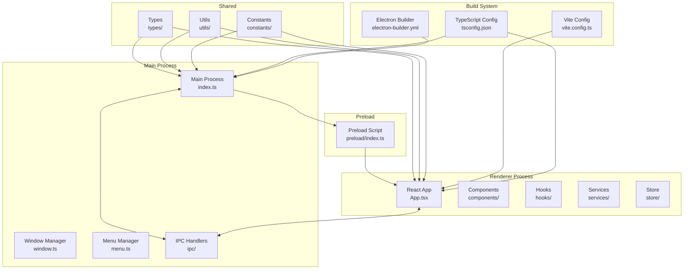
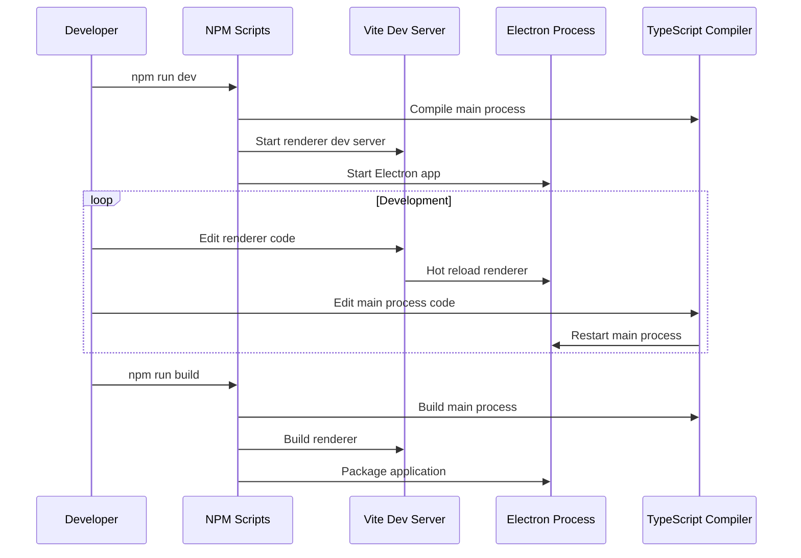

# Feature Implementation Plan: Electron Project Setup

_Generated: 2025-07-08_
_Based on Feature Specification: 20250708-electron-project-setup-feature.md_

## Architecture Overview

This implementation establishes a complete Electron application foundation with React 18+, TypeScript strict mode, and Vite build system. The architecture follows a secure process separation model with proper IPC communication and development tooling.

### System Architecture

### Development Workflow

## Technology Stack

### Core Technologies

- **Language/Runtime:** TypeScript 5.x with Node.js 18+
- **Framework:** Electron (latest stable) with React 18+
- **Build Tool:** Vite with React plugin
- **State Management:** Zustand (future implementation)

### Libraries & Dependencies

- **UI/Frontend:** React 18+, React DOM, CSS Modules
- **Build/Development:** Vite, TypeScript, Electron Builder
- **Code Quality:** ESLint, Prettier, Concurrently
- **Testing:** Not included in this phase (separate specification)

### Patterns & Approaches

- **Architectural Patterns:** Process separation, IPC bridge pattern
- **Security Patterns:** Context isolation, sandboxed renderer
- **Development Practices:** Strict TypeScript, feature-based organization
- **Build Patterns:** Separate main/renderer builds, path aliases

### External Integrations

- **Build Tools:** Electron Builder for packaging
- **Development Tools:** Concurrently for process management
- **IDE Integration:** VS Code configuration files

## Relevant Files

- `package.json` - Project dependencies and scripts
- `tsconfig.json` - Root TypeScript configuration
- `tsconfig.main.json` - Main process TypeScript configuration
- `tsconfig.renderer.json` - Renderer process TypeScript configuration
- `vite.config.ts` - Vite build configuration
- `electron-builder.yml` - Electron Builder packaging configuration
- `.eslintrc.js` - ESLint configuration
- `.prettierrc` - Prettier configuration
- `src/main/index.ts` - Main process entry point
- `src/main/window.ts` - Window management
- `src/main/menu.ts` - Application menu
- `src/main/ipc/handlers.ts` - IPC handlers for window controls and app info
- `src/main/ipc/windowEvents.ts` - Window event listeners
- `src/main/ipc/index.ts` - IPC barrel export
- `src/renderer/index.tsx` - Renderer entry point
- `src/renderer/App.tsx` - Root React component
- `src/renderer/index.html` - HTML template
- `src/preload/index.ts` - Preload script for IPC bridge
- `src/shared/types/index.ts` - Shared type definitions
- `src/shared/constants/index.ts` - Shared constants
- `assets/icon.png` - Application icon
- `.vscode/settings.json` - VS Code settings
- `.vscode/extensions.json` - Recommended VS Code extensions

## Implementation Notes

- Tests should be placed in `tests/` directory with separate unit and integration folders
- Use `npm test` for running tests (to be configured in later phase)
- Follow the project's strict TypeScript and ESLint conventions
- After completing each subtask, mark as complete and document file changes
- Run `npm run lint`, `npm run type-check`, and `npm run build` after each task
- After completing a parent task, stop and wait for user confirmation to proceed

## Implementation Tasks

- [x] 1.0 Project Foundation and Configuration
  - [x] 1.1 Initialize npm project and install core dependencies (Electron, React, TypeScript, Vite)
  - [x] 1.2 Configure package.json with proper scripts and metadata
  - [x] 1.3 Set up TypeScript configurations for main, renderer, and shared code
  - [x] 1.4 Configure Vite build system with React plugin and path aliases
  - [x] 1.5 Create basic project folder structure following architecture specification
  - [x] 1.6 Set up Electron Builder configuration for cross-platform packaging

  ### Files modified with description of changes
  - `package.json` - Initialized npm project with proper metadata, scripts, and dependencies including Electron, React, TypeScript, Vite, and development tooling
  - `tsconfig.json` - Root TypeScript configuration with strict mode, path aliases, and shared compiler options
  - `tsconfig.main.json` - Main process TypeScript configuration targeting Node.js/CommonJS
  - `tsconfig.preload.json` - Preload script TypeScript configuration with DOM types
  - `tsconfig.renderer.json` - Renderer process TypeScript configuration with React JSX support and DOM types
  - `vite.config.ts` - Vite configuration with React plugin, path aliases, and Electron-specific build settings
  - `electron-builder.yml` - Cross-platform packaging configuration for Windows, macOS, and Linux
  - `src/main/index.ts` - Main process entry point with window management and application lifecycle
  - `src/main/window.ts` - Browser window creation and management with security configurations
  - `src/main/menu.ts` - Application menu structure with platform-specific adjustments
  - `src/renderer/index.html` - HTML template for the renderer process
  - `src/renderer/index.tsx` - React application entry point with root mounting
  - `src/renderer/App.tsx` - Main React component with welcome screen and status display
  - `src/renderer/App.module.css` - CSS module for App component styling
  - `src/renderer/vite-env.d.ts` - TypeScript declarations for Vite environment and global types
  - `src/preload/index.ts` - Secure IPC bridge between main and renderer processes
  - `src/shared/types/index.ts` - Shared TypeScript type definitions
  - `src/shared/constants/index.ts` - Shared application constants
  - `src/shared/utils/index.ts` - Shared utility functions
  - `assets/icon.png` - Application icon placeholder

- [x] 2.0 Code Quality and Development Tooling
  - [x] 2.1 Configure ESLint with TypeScript and React rules according to coding standards (see `/Users/zach/code/vault-ui-web/` for reference of rules used by LangAdventure)
  - [x] 2.2 Add `"@langadventurellc/tsla-linter": "^2.0.0"` to package.json for custom linting rules
  - [x] 2.3 Set up Prettier configuration matching project formatting standards
  - [x] 2.4 Create VS Code workspace configuration with recommended extensions
  - [x] 2.5 Configure development scripts for concurrent main/renderer development
  - [x] 2.6 Set up pre-commit hooks for code quality enforcement

  ### Files modified with description of changes
  - `package.json` - Added ESLint, Prettier, TypeScript linting dependencies and custom tsla-linter package. Updated scripts for linting, formatting, and enhanced dev workflow with wait-on and concurrent electron process management
  - `.npmrc` - Added GitHub Package Registry configuration for @langadventurellc scoped packages
  - `eslint.config.mjs` - Comprehensive ESLint configuration with TypeScript, React, and custom plugins. Includes separate configurations for main/preload/renderer processes, test files, and proper ignore patterns
  - `.prettierrc` - Prettier configuration matching project formatting standards with consistent code style settings
  - `.vscode/settings.json` - VS Code workspace settings for proper TypeScript/ESLint integration, formatting on save, and project-specific configurations
  - `.vscode/extensions.json` - Recommended VS Code extensions for TypeScript, ESLint, Prettier, and Electron development
  - `.husky/pre-commit` - Pre-commit hook configuration to run lint-staged for code quality enforcement
  - `package.json` (lint-staged) - Added lint-staged configuration to run ESLint and Prettier on staged files before commit

- [x] 3.0 Electron Main Process Implementation
  - [x] 3.1 Create main process entry point with proper Electron initialization
  - [x] 3.2 Implement window management with security configurations (contextIsolation, etc.)
  - [x] 3.3 Create application menu with basic File/Edit/View/Help structure
  - [x] 3.4 Set up IPC handler structure for future inter-process communication
  - [x] 3.5 Configure proper process lifecycle management and cleanup

  ### Files modified with description of changes
  - `src/main/index.ts` - Enhanced main process entry point with IPC handlers setup, application menu integration, and window event management
  - `src/main/menu.ts` - Completed application menu implementation with functional File/Edit/View/Help structure, including About dialog and proper quit functionality
  - `src/main/ipc/handlers.ts` - Created IPC handlers for window controls (minimize, maximize, close) and application info (getVersion)
  - `src/main/ipc/windowEvents.ts` - Created window event listeners to emit focus, blur, and resize events to renderer process
  - `src/main/ipc/index.ts` - Barrel export file for IPC functionality to satisfy linting requirements for single-export-per-file

- [x] 4.0 React Renderer Process Setup
  - [x] 4.1 Create HTML template and renderer entry point
  - [x] 4.2 Set up React 19+ with proper root mounting and error boundaries
  - [x] 4.3 Create basic App component with routing structure
  - [x] 4.4 Implement basic component structure following feature-based organization
  - [x] 4.5 Set up CSS Modules configuration with theming support
  - [x] 4.6 Configure React development tools integration

  ### Files modified with description of changes
  - `src/renderer/index.html` - HTML template already existed, no changes needed
  - `src/renderer/index.tsx` - Updated to include ErrorBoundary and ThemeProvider wrappers around App component
  - `src/renderer/App.tsx` - Completely restructured to use React Router with routing to Home, Settings, and Chat pages, plus DevTools integration
  - `src/renderer/components/ErrorBoundary/ErrorBoundary.tsx` - Created comprehensive error boundary component with development error details and reload functionality
  - `src/renderer/components/ErrorBoundary/ErrorBoundary.module.css` - Styled error boundary with attractive gradient background and proper error state display
  - `src/renderer/components/ErrorBoundary/index.ts` - Barrel export for ErrorBoundary component
  - `src/renderer/components/Home/Home.tsx` - Created main landing page with feature overview, navigation links, and system status display
  - `src/renderer/components/Home/Home.module.css` - Styled home page with gradient background and modern card design
  - `src/renderer/components/Home/index.ts` - Barrel export for Home component
  - `src/renderer/components/Settings/Settings.tsx` - Created settings page with placeholder sections for future implementation
  - `src/renderer/components/Settings/Settings.module.css` - Styled settings page with consistent design language
  - `src/renderer/components/Settings/index.ts` - Barrel export for Settings component
  - `src/renderer/components/Chat/Chat.tsx` - Created chat interface with sidebar and message area placeholders
  - `src/renderer/components/Chat/Chat.module.css` - Styled chat interface with modern layout and agent list
  - `src/renderer/components/Chat/index.ts` - Barrel export for Chat component
  - `src/renderer/components/UI/Button/Button.tsx` - Created reusable Button component with multiple variants, sizes, and states
  - `src/renderer/components/UI/Button/Button.module.css` - Styled Button component with hover effects and accessibility features
  - `src/renderer/components/UI/Button/Button.types.ts` - TypeScript interface for Button component props
  - `src/renderer/components/UI/Button/index.ts` - Barrel export for Button component and types
  - `src/renderer/components/UI/index.ts` - Barrel export for all UI components
  - `src/renderer/components/index.ts` - Central barrel export for all components organized by category
  - `src/renderer/styles/themes.css` - Comprehensive CSS custom properties system for theming with light/dark theme support
  - `src/renderer/styles/globals.css` - Global styles including theme variables, typography, form elements, and utility classes
  - `src/renderer/hooks/Theme.types.ts` - TypeScript type definition for theme values
  - `src/renderer/hooks/ThemeContext.types.ts` - TypeScript interface for theme context
  - `src/renderer/hooks/ThemeProvider.types.ts` - TypeScript interface for theme provider props
  - `src/renderer/hooks/ThemeContext.ts` - React context for theme management
  - `src/renderer/hooks/useTheme.hook.ts` - Custom hook for accessing theme context
  - `src/renderer/hooks/ThemeProvider.tsx` - React provider component for theme context with localStorage persistence
  - `src/renderer/hooks/useTheme.index.ts` - Barrel export for theme-related functionality
  - `src/renderer/hooks/index.ts` - Central barrel export for all hooks
  - `src/renderer/components/UI/ThemeToggle/ThemeToggle.tsx` - Theme toggle component with icon and label
  - `src/renderer/components/UI/ThemeToggle/ThemeToggle.module.css` - Styled theme toggle button with hover effects
  - `src/renderer/components/UI/ThemeToggle/index.ts` - Barrel export for ThemeToggle component
  - `src/renderer/components/DevTools/DevTools.tsx` - Development tools panel with system information, theme controls, and keyboard shortcuts
  - `src/renderer/components/DevTools/DevTools.module.css` - Styled development tools panel with responsive design
  - `src/renderer/components/DevTools/index.ts` - Barrel export for DevTools component
  - `vite.config.ts` - Enhanced with React DevTools support, Fast Refresh, source maps, additional path aliases, and CSS modules configuration
  - `eslint.config.mjs` - Added exception for barrel file with multiple exports
  - `package.json` - Added react-router-dom dependency for routing functionality

- [ ] 5.0 Secure IPC Bridge Implementation
  - [ ] 5.1 Create preload script with secure IPC bridge
  - [ ] 5.2 Define shared types for IPC communication
  - [ ] 5.3 Implement type-safe IPC wrapper utilities
  - [ ] 5.4 Set up basic IPC channels for window management
  - [ ] 5.5 Create renderer-side IPC hooks for React integration
  - [ ] 5.6 Test IPC communication security and functionality

  ### Files modified with description of changes
  - (to be filled in after task completion)

- [ ] 6.0 Build System Integration and Testing
  - [ ] 6.1 Configure development build pipeline with hot reloading
  - [ ] 6.2 Set up production build process with optimization
  - [ ] 6.3 Configure Electron Builder for current platform packaging
  - [ ] 6.4 Create application icons and metadata
  - [ ] 6.5 Test complete development workflow (dev, build, package)
  - [ ] 6.6 Validate security configurations and performance metrics

  ### Files modified with description of changes
  - (to be filled in after task completion)
