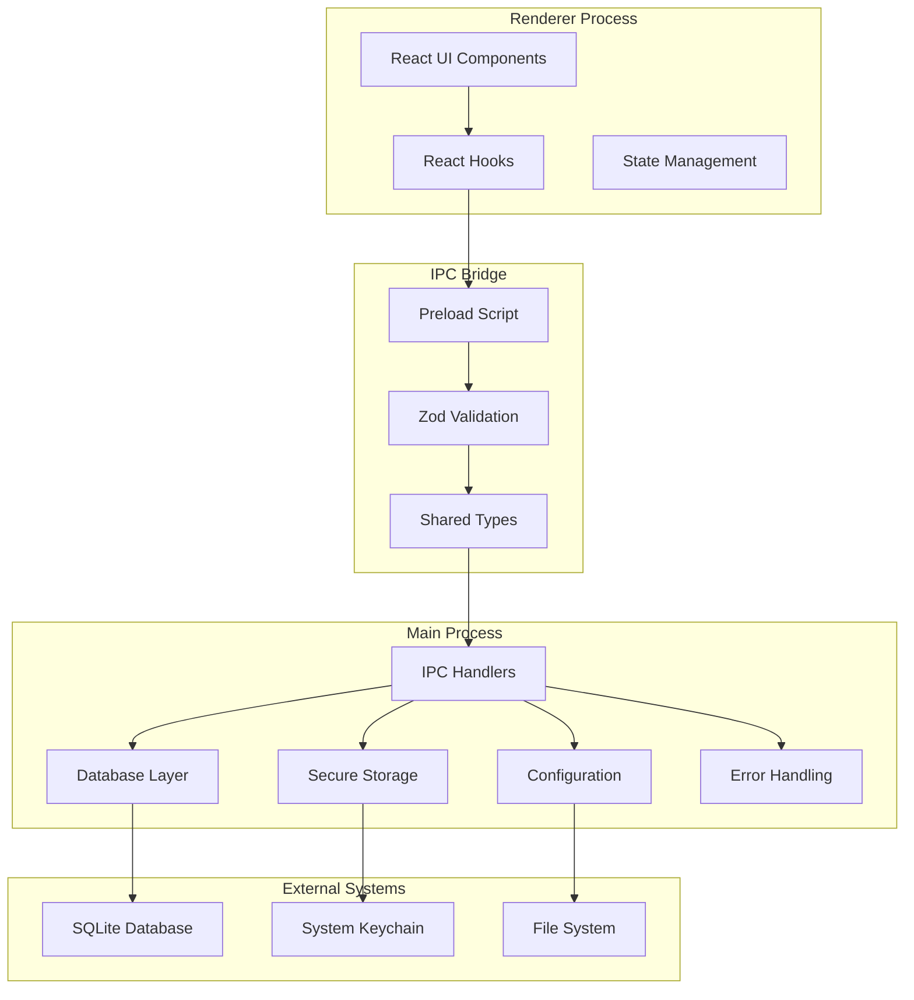
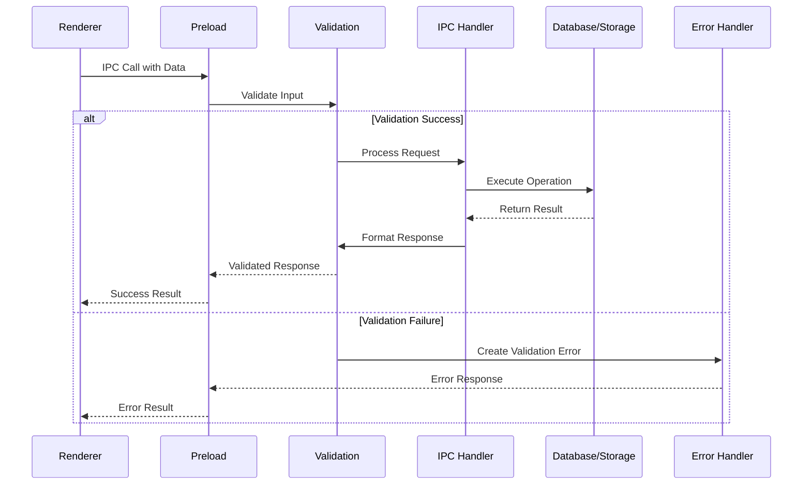

# Feature Implementation Plan: IPC Communication Bridge

_Generated: 2025-07-08_
_Based on Feature Specification: [20250708-ipc-communication-bridge-feature.md](./20250708-ipc-communication-bridge-feature.md)_

## Architecture Overview

This implementation establishes a comprehensive IPC communication bridge between Electron's main and renderer processes, providing type-safe, validated communication channels for database operations, configuration management, and secure storage. The bridge extends the existing IPC system with Zod validation, custom error handling, and secure API key storage using keytar.

### System Architecture

### Data Flow

## Technology Stack

### Core Technologies

- **Language/Runtime:** TypeScript 5.8.3 (strict mode)
- **Framework:** Electron 37.2.0
- **Database:** SQLite via better-sqlite3 (existing)
- **Build Tool:** Vite 7.0.3

### Libraries & Dependencies

- **Validation:** Zod (to be added)
- **Secure Storage:** keytar (to be added)
- **Database:** better-sqlite3 (existing)
- **IPC:** Electron's built-in IPC with type-safe wrappers
- **Types:** @types/better-sqlite3 (existing)

### Patterns & Approaches

- **Architectural Patterns:** Main-Renderer process separation, IPC communication bridge
- **Validation Pattern:** Zod schemas co-located with TypeScript types
- **Error Handling:** Custom error classes with categorization
- **Security Pattern:** Context isolation with minimal API exposure
- **Development Practices:** TypeScript strict mode, type-safe IPC, comprehensive validation

### External Integrations

- **System Keychain:** Via keytar for secure API key storage
- **File System:** Configuration and database file operations
- **SQLite Database:** Integration with existing database layer

## Relevant Files

- `package.json` - Add zod and keytar dependencies
- `src/shared/types/index.ts` - Extend with database and secure storage IPC channels
- `src/shared/types/errors/` - Custom error classes directory (new)
- `src/shared/types/validation/` - Zod schemas for IPC validation directory (new)
- `src/main/secure-storage/` - Keytar wrapper module (new)
- `src/main/ipc/handlers.ts` - Extend with database and secure storage handlers
- `src/preload/index.ts` - Extend with new IPC methods
- `src/renderer/hooks/useIpc.hook.ts` - Add database and secure storage hooks
- `src/renderer/hooks/useDatabase.ts` - Database operation hooks (new)
- `src/renderer/hooks/useSecureStorage.ts` - Secure storage hooks (new)

## Implementation Notes

- Tests should be placed in `tests/` directory following project conventions
- Use `npm run type-check` to verify TypeScript compilation
- Run `npm run test:run` to execute all tests
- Run `npm run lint` and `npm run format` after each task
- All IPC operations must be validated with Zod schemas
- Sensitive data (API keys) must never be logged or exposed in error messages
- Database operations integrate with existing query layer and connection management
- Error handling provides meaningful messages while maintaining security
- Each error class should be in its own file following the one-export-per-file pattern
- Each Zod schema should be in its own file with appropriate barrel exports

## Implementation Tasks

- [x] 1.0 Setup Dependencies and Validation Foundation
  - [x] 1.1 Add zod and keytar dependencies to package.json
  - [x] 1.2 Create custom error classes in shared/types/errors/ directory with separate files
  - [x] 1.3 Create Zod validation schemas for existing and new IPC channels in separate files
  - [x] 1.4 Update shared types with database and secure storage IPC channels
  - [x] 1.5 Write tests for validation schemas and error classes

  ### Files modified with description of changes
  - `package.json` - Added zod, keytar, and @types/keytar dependencies; added vitest testing framework and test scripts
  - `src/shared/types/errors/` - Created comprehensive error class hierarchy with BaseError, IpcError, IpcValidationError, DatabaseError, and SecureStorageError
  - `src/shared/types/validation/` - Created Zod validation schemas for system info, config, database operations, secure storage, and IPC channels
  - `src/shared/types/index.ts` - Extended IPC channel interfaces with database and secure storage operations; added supporting types
  - `tests/unit/shared/types/error-classes.test.ts` - Created comprehensive tests for all error classes with 16 test cases
  - `tests/unit/shared/types/validation-schemas.test.ts` - Created comprehensive tests for all validation schemas with 27 test cases
  - `vitest.config.ts` - Created Vitest configuration with proper aliases and test setup
  - `tsconfig.json` - Updated to include tests directory and vitest config in compilation
  - `CLAUDE.md` - Updated development commands to include test scripts

- [ ] 2.0 Implement Secure Storage Module
  - [ ] 2.1 Create secure storage module with keytar wrapper
  - [ ] 2.2 Implement credential management for multiple AI providers
  - [ ] 2.3 Add secure storage IPC handlers in main process
  - [ ] 2.4 Create comprehensive error handling for secure storage operations
  - [ ] 2.5 Write tests for secure storage module and IPC handlers

  ### Files modified with description of changes
  - (to be filled in after task completion)

- [ ] 3.0 Extend IPC System with Database Operations
  - [ ] 3.1 Add database IPC handlers using existing database query layer
  - [ ] 3.2 Implement transaction handling for complex database operations
  - [ ] 3.3 Add input validation and sanitization for all database operations
  - [ ] 3.4 Create comprehensive error handling for database operations
  - [ ] 3.5 Write tests for database IPC handlers and validation

  ### Files modified with description of changes
  - (to be filled in after task completion)

- [ ] 4.0 Update Preload Script and Type Safety
  - [ ] 4.1 Extend preload script with database and secure storage methods
  - [ ] 4.2 Implement comprehensive input validation in preload layer
  - [ ] 4.3 Add performance monitoring for IPC operations
  - [ ] 4.4 Enhance security measures and sanitization
  - [ ] 4.5 Write tests for preload script functionality

  ### Files modified with description of changes
  - (to be filled in after task completion)

- [ ] 5.0 Create Renderer Integration Hooks
  - [ ] 5.1 Create React hooks for database operations
  - [ ] 5.2 Create React hooks for secure storage operations
  - [ ] 5.3 Extend existing IPC hooks with new functionality
  - [ ] 5.4 Implement error handling and loading states in hooks
  - [ ] 5.5 Write tests for all React hooks

  ### Files modified with description of changes
  - (to be filled in after task completion)

- [ ] 6.0 Integration Testing and Performance Optimization
  - [ ] 6.1 Create comprehensive integration tests for IPC system
  - [ ] 6.2 Implement performance monitoring and optimization
  - [ ] 6.3 Add error recovery and graceful degradation
  - [ ] 6.4 Create security audit and validation tests
  - [ ] 6.5 Document IPC API and usage patterns

  ### Files modified with description of changes
  - (to be filled in after task completion)
