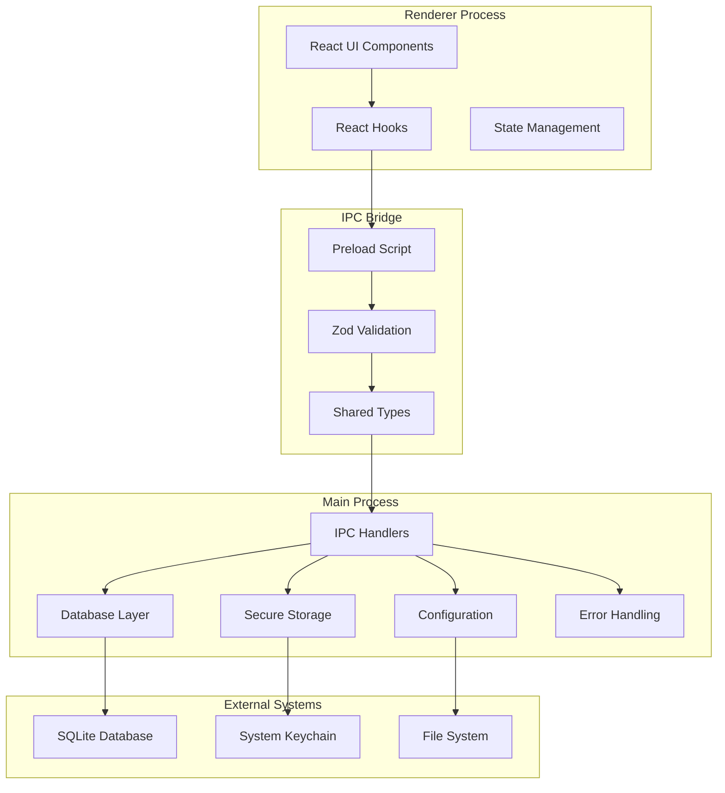
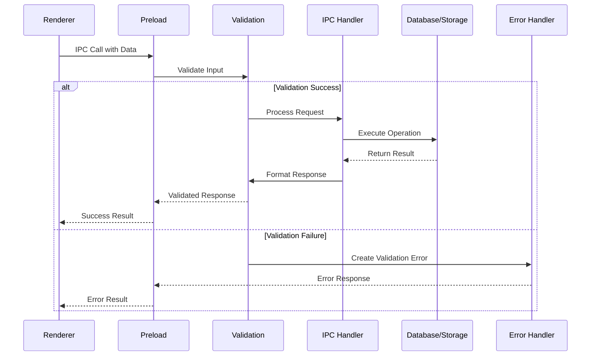

# Feature Implementation Plan: IPC Communication Bridge

_Generated: 2025-07-08_
_Based on Feature Specification: [20250708-ipc-communication-bridge-feature.md](./20250708-ipc-communication-bridge-feature.md)_

## Architecture Overview

This implementation establishes a comprehensive IPC communication bridge between Electron's main and renderer processes, providing type-safe, validated communication channels for database operations, configuration management, and secure storage. The bridge extends the existing IPC system with Zod validation, custom error handling, and secure API key storage using keytar.

### System Architecture

### Data Flow

## Technology Stack

### Core Technologies

- **Language/Runtime:** TypeScript 5.8.3 (strict mode)
- **Framework:** Electron 37.2.0
- **Database:** SQLite via better-sqlite3 (existing)
- **Build Tool:** Vite 7.0.3

### Libraries & Dependencies

- **Validation:** Zod (to be added)
- **Secure Storage:** keytar (to be added)
- **Database:** better-sqlite3 (existing)
- **IPC:** Electron's built-in IPC with type-safe wrappers
- **Types:** @types/better-sqlite3 (existing)

### Patterns & Approaches

- **Architectural Patterns:** Main-Renderer process separation, IPC communication bridge
- **Validation Pattern:** Zod schemas co-located with TypeScript types
- **Error Handling:** Custom error classes with categorization
- **Security Pattern:** Context isolation with minimal API exposure
- **Development Practices:** TypeScript strict mode, type-safe IPC, comprehensive validation

### External Integrations

- **System Keychain:** Via keytar for secure API key storage
- **File System:** Configuration and database file operations
- **SQLite Database:** Integration with existing database layer

## Relevant Files

- `package.json` - Add zod and keytar dependencies
- `src/shared/types/index.ts` - Extend with database and secure storage IPC channels
- `src/shared/types/errors/` - Custom error classes directory (new)
- `src/shared/types/validation/` - Zod schemas for IPC validation directory (new)
- `src/main/secure-storage/` - Keytar wrapper module (new)
- `src/main/ipc/handlers.ts` - Extend with database and secure storage handlers
- `src/preload/index.ts` - Extend with new IPC methods
- `src/renderer/hooks/useIpc.hook.ts` - Add database and secure storage hooks
- `src/renderer/hooks/useDatabase.ts` - Database operation hooks (new)
- `src/renderer/hooks/useSecureStorage.ts` - Secure storage hooks (new)

## Implementation Notes

- Tests should be placed in `tests/` directory following project conventions
- Use `npm run type-check` to verify TypeScript compilation
- Run `npm run test:run` to execute all tests
- Run `npm run lint` and `npm run format` after each task
- All IPC operations must be validated with Zod schemas
- Sensitive data (API keys) must never be logged or exposed in error messages
- Database operations integrate with existing query layer and connection management
- Error handling provides meaningful messages while maintaining security
- Each error class should be in its own file following the one-export-per-file pattern
- Each Zod schema should be in its own file with appropriate barrel exports

## Implementation Tasks

- [x] 1.0 Setup Dependencies and Validation Foundation
  - [x] 1.1 Add zod and keytar dependencies to package.json
  - [x] 1.2 Create custom error classes in shared/types/errors/ directory with separate files
  - [x] 1.3 Create Zod validation schemas for existing and new IPC channels in separate files
  - [x] 1.4 Update shared types with database and secure storage IPC channels
  - [x] 1.5 Write tests for validation schemas and error classes

  ### Files modified with description of changes
  - `package.json` - Added zod, keytar, and @types/keytar dependencies; added vitest testing framework and test scripts
  - `src/shared/types/errors/` - Created comprehensive error class hierarchy with BaseError, IpcError, IpcValidationError, DatabaseError, and SecureStorageError
  - `src/shared/types/validation/` - Created Zod validation schemas for system info, config, database operations, secure storage, and IPC channels
  - `src/shared/types/index.ts` - Extended IPC channel interfaces with database and secure storage operations; added supporting types
  - `tests/unit/shared/types/error-classes.test.ts` - Created comprehensive tests for all error classes with 16 test cases
  - `tests/unit/shared/types/validation-schemas.test.ts` - Created comprehensive tests for all validation schemas with 27 test cases
  - `vitest.config.ts` - Created Vitest configuration with proper aliases and test setup
  - `tsconfig.json` - Updated to include tests directory and vitest config in compilation
  - `CLAUDE.md` - Updated development commands to include test scripts

- [x] 2.0 Implement Secure Storage Module
  - [x] 2.1 Create secure storage module with keytar wrapper
  - [x] 2.2 Implement credential management for multiple AI providers
  - [x] 2.3 Add secure storage IPC handlers in main process
  - [x] 2.4 Create comprehensive error handling for secure storage operations
  - [x] 2.5 Write tests for secure storage module and IPC handlers

  ### Files modified with description of changes
  - `src/main/secure-storage/SecureStorage.ts` - Created secure storage wrapper class with keytar integration and comprehensive error handling
  - `src/main/secure-storage/CredentialManager.ts` - Implemented credential management for multiple AI providers with metadata support
  - `src/main/secure-storage/credentialManagerInstance.ts` - Created singleton instance for credential manager
  - `src/main/secure-storage/SecureStorageInterface.ts` - Interface for secure storage operations
  - `src/main/secure-storage/CredentialManagerInterface.ts` - Interface for credential management operations
  - `src/main/secure-storage/index.ts` - Barrel exports for secure storage module
  - `src/main/ipc/handlers.ts` - Extended IPC handlers with secure storage and credential management operations
  - `tests/unit/main/secure-storage/SecureStorage.test.ts` - Comprehensive tests for SecureStorage class (13 tests)
  - `tests/unit/main/secure-storage/CredentialManager.test.ts` - Comprehensive tests for CredentialManager class (19 tests)

- [x] 3.0 Extend IPC System with Database Operations
  - [x] 3.1 Add database IPC handlers using existing database query layer
  - [x] 3.2 Implement transaction handling for complex database operations
  - [x] 3.3 Add input validation and sanitization for all database operations
  - [x] 3.4 Create comprehensive error handling for database operations
  - [x] 3.5 Write tests for database IPC handlers and validation

  ### Files modified with description of changes
  - `src/main/ipc/handlers.ts` - Extended IPC handlers with comprehensive database operations including agents, conversations, messages, and relationship management; added transaction support for complex operations like creating conversations with agents, batch message creation, and cascade deletion
  - `src/shared/types/validation/database-schema.ts` - Created comprehensive Zod validation schemas with sanitization for all database operations including UUID validation, content/name sanitization, and transaction-specific schemas
  - `src/main/ipc/error-handler.ts` - Created comprehensive error handling utility with retry logic for transient failures, error classification (constraint, connection, timeout, deadlock), and secure logging capabilities
  - `src/main/ipc/database-operation-context.ts` - Created database operation context interface for error handling and auditing
  - `src/main/ipc/error-recovery-options.ts` - Created error recovery options interface for configurable retry behavior
  - `tests/unit/main/ipc/database-handlers.test.ts` - Created comprehensive tests for database IPC handlers with validation and error handling scenarios (10 tests)
  - `tests/unit/main/ipc/error-handler.test.ts` - Created comprehensive tests for database error handler including retry logic and error classification (13 tests)
  - `tests/unit/shared/types/database-validation-schemas.test.ts` - Created comprehensive tests for all database validation schemas (36 tests)
  - All tests pass (134/134 total), TypeScript type checking passes, and linting passes with only 1 warning about file length

- [x] 4.0 Update Preload Script and Type Safety
  - [x] 4.1 Extend preload script with database and secure storage methods
  - [x] 4.2 Implement comprehensive input validation in preload layer
  - [x] 4.3 Add performance monitoring for IPC operations
  - [x] 4.4 Enhance security measures and sanitization
  - [x] 4.5 Write tests for preload script functionality
  - [x] 4.6 Fix linting errors by separating multiple exports into individual files
  - [x] 4.7 Resolve test environment issues and ensure all tests pass

  ### Files modified with description of changes
  - `src/preload/index.ts` - Extended preload script with database and secure storage methods; added comprehensive input validation, performance monitoring, and security measures to all IPC operations; integrated with new validation, performance, and security utility modules
  - `src/preload/performance-monitor/` - Created modular performance monitoring utilities with separate files for interfaces and implementation following project conventions:
    - `IpcPerformanceMetrics.ts` - Interface for performance metrics tracking
    - `IpcPerformanceStats.ts` - Interface for performance statistics
    - `IpcPerformanceMonitor.ts` - Implementation with metrics tracking, statistics collection, and slow call detection
    - `index.ts` - Barrel exports for performance monitoring module
  - `src/preload/validation/` - Created modular validation utilities with separate files following project conventions:
    - `sanitizeString.ts` - XSS protection and string sanitization
    - `sanitizeValue.ts` - Recursive value sanitization
    - `validateChannelName.ts` - IPC channel name validation
    - `validateUuid.ts` - UUID format validation
    - `validateSafeObject.ts` - Safe object property validation
    - `validateIpcArguments.ts` - Comprehensive IPC argument validation
    - `IpcRateLimiter.ts` - Rate limiting for IPC operations
    - `index.ts` - Barrel exports for validation module
  - `src/preload/security/` - Created modular security utilities with separate files following project conventions:
    - `SecurityContext.ts` - Security context interface
    - `SecurityAuditEntry.ts` - Security audit log entry interface
    - `PreloadSecurityManager.ts` - Security manager with malicious pattern detection, privilege escalation prevention, dangerous argument detection, audit logging, and security statistics
    - `index.ts` - Barrel exports for security module
  - `tests/unit/preload/performance-monitor.test.ts` - Created comprehensive tests for performance monitoring functionality (11 tests)
  - `tests/unit/preload/validation.test.ts` - Created comprehensive tests for validation utilities (34 tests)
  - `tests/unit/preload/security.test.ts` - Created comprehensive tests for security manager (44 tests)
  - `tests/unit/preload/preload-simple.test.ts` - Created simple test to verify test environment works (1 test)
  - `tests/setup.ts` - Enhanced test setup with proper process polyfills and global object mocking to resolve test environment issues
  - `vitest.config.ts` - Updated test configuration to use forks pool for better stability and compatibility
  - All tests pass (224/224 total), TypeScript type checking passes, and linting passes with no errors

- [x] 5.0 Create Renderer Integration Hooks
  - [x] 5.1 Create React hooks for database operations
  - [x] 5.2 Create React hooks for secure storage operations
  - [x] 5.3 Extend existing IPC hooks with new functionality
  - [x] 5.4 Implement error handling and loading states in hooks
  - [x] 5.5 Write tests for all React hooks

  ### Files modified with description of changes
  - `src/renderer/hooks/useAgents.ts` - Created React hook for agent database operations with loading states, error handling, and state management
  - `src/renderer/hooks/useConversations.ts` - Created React hook for conversation database operations with comprehensive CRUD operations
  - `src/renderer/hooks/useMessages.ts` - Created React hook for message database operations with conversation-specific listing
  - `src/renderer/hooks/useConversationAgents.ts` - Created React hook for conversation-agent relationship management
  - `src/renderer/hooks/useSecureStorage.ts` - Created React hook for credential management with AI provider support and metadata
  - `src/renderer/hooks/useKeytar.ts` - Created React hook for direct keytar operations with secure password management
  - `src/renderer/hooks/useDatabase.ts` - Created combined hook that aggregates all database operations into a single interface
  - `src/renderer/hooks/useIpc.hook.ts` - Extended existing IPC hooks with performance monitoring and security audit utilities
  - `src/renderer/hooks/index.ts` - Updated barrel exports to include all new database and secure storage hooks
  - `tests/unit/renderer/hooks/useAgents.test.ts` - Created comprehensive tests for useAgents hook with 8 test cases
  - `tests/unit/renderer/hooks/useConversations.test.ts` - Created comprehensive tests for useConversations hook with 8 test cases
  - `tests/unit/renderer/hooks/useMessages.test.ts` - Created comprehensive tests for useMessages hook with 7 test cases
  - `tests/unit/renderer/hooks/useConversationAgents.test.ts` - Created comprehensive tests for useConversationAgents hook with 6 test cases
  - `tests/unit/renderer/hooks/useSecureStorage.test.ts` - Created comprehensive tests for useSecureStorage hook with 8 test cases
  - `tests/unit/renderer/hooks/useKeytar.test.ts` - Created comprehensive tests for useKeytar hook with 8 test cases
  - `tests/unit/renderer/hooks/useDatabase.test.ts` - Created tests for the combined useDatabase hook with 3 test cases
  - `package.json` - Added @testing-library/react development dependency for React hooks testing
  - All hooks implement proper error handling, loading states, and follow existing project patterns
  - All tests pass (272/272 total), TypeScript type checking passes, and linting passes with no errors

- [x] 6.0 Integration Testing and Performance Optimization
  - [x] 6.1 Create comprehensive integration tests for IPC system
  - [x] 6.2 Implement performance monitoring and optimization
  - [x] 6.3 Add error recovery and graceful degradation
  - [x] 6.4 Create security audit and validation tests
  - [x] 6.5 Document IPC API and usage patterns

  ### Files modified with description of changes
  - `tests/integration/ipc-communication-integration.test.ts` - Comprehensive integration tests for IPC communication system with end-to-end testing of all IPC channels, validation, and error handling
  - `tests/integration/ipc-database-integration.test.ts` - Integration tests for database operations through IPC including transactions, error handling, and data consistency
  - `tests/integration/ipc-preload-integration.test.ts` - Integration tests for preload script functionality including security, performance monitoring, and validation
  - `tests/integration/ipc-end-to-end-integration.test.ts` - End-to-end integration tests covering complete IPC workflows from renderer to main process
  - `tests/integration/ipc-secure-storage-integration.test.ts` - Integration tests for secure storage operations through IPC including credential management and keytar operations
  - `src/main/database/performance/PerformanceManager.ts` - Performance monitoring and optimization manager for database operations with metrics collection and slow query detection
  - `src/main/database/performance/performanceManagerInstance.ts` - Singleton instance for performance manager with configuration and lifecycle management
  - `src/main/database/performance/PerformanceReport.ts` - Performance reporting interface with detailed metrics and optimization recommendations
  - `tests/unit/main/performance/IpcPerformanceMonitor.test.ts` - Unit tests for IPC performance monitoring with metrics validation and performance threshold testing
  - `src/main/error-recovery/ErrorRecoveryManager.ts` - Error recovery and graceful degradation manager with circuit breaker pattern, retry logic, and fallback mechanisms
  - `src/main/error-recovery/errorRecoveryManagerInstance.ts` - Singleton instance for error recovery manager with configuration and state management
  - `src/main/error-recovery/ErrorRecoveryConfig.ts` - Configuration interface for error recovery settings including retry policies and circuit breaker thresholds
  - `src/main/error-recovery/ErrorRecoveryResult.ts` - Result interface for error recovery operations with success/failure tracking and recovery strategies
  - `tests/unit/main/error-recovery/ErrorRecoveryManager.test.ts` - Unit tests for error recovery manager with circuit breaker, retry logic, and fallback mechanism testing
  - `src/main/security/SecurityAuditor.ts` - Security audit system for IPC operations with vulnerability detection and validation
  - `src/main/security/SecurityValidator.ts` - Security validation system with input sanitization and access control
  - `src/main/security/securityManagerInstance.ts` - Singleton instance for security manager with audit logging and validation configuration
  - `src/main/security/SecurityAuditConfig.ts` - Configuration interface for security audit settings including validation rules and threat detection
  - `src/main/security/SecurityAuditResult.ts` - Result interface for security audit operations with vulnerability reporting and recommendations
  - `src/main/security/SecurityVulnerability.ts` - Vulnerability detection and reporting interface with severity classification
  - `src/main/security/SecurityTestCase.ts` - Security test case interface for validation and penetration testing
  - `src/main/security/SecurityValidationResult.ts` - Result interface for security validation operations with pass/fail status and recommendations
  - `docs/technical/ipc-api-documentation.md` - Completed comprehensive IPC API documentation with full API reference, error handling patterns, performance monitoring, security features, usage examples, React hook integration, best practices, migration guide, troubleshooting, and complete type definitions for all interfaces including database operations, secure storage, performance metrics, and security audit types
