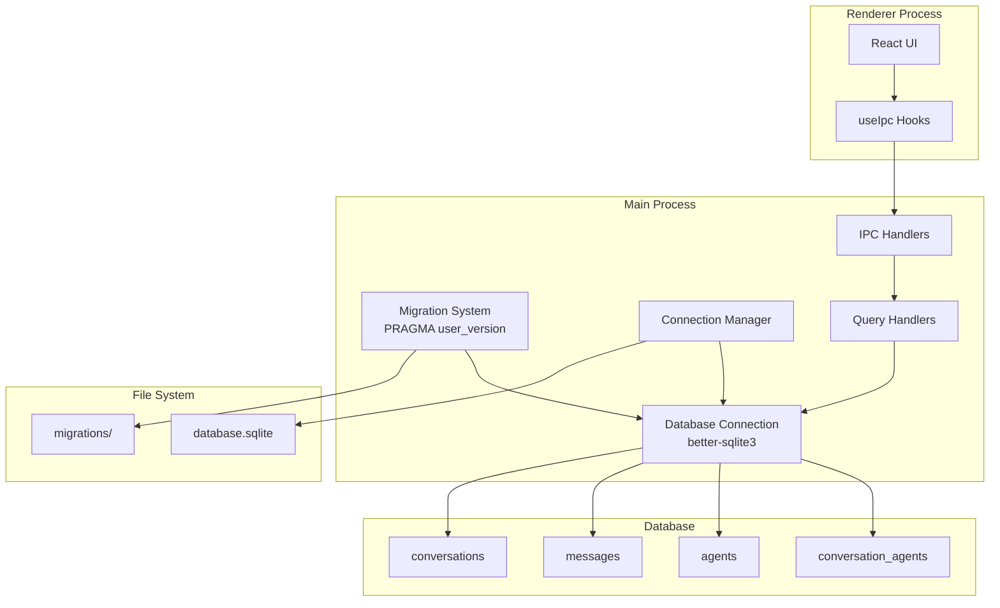
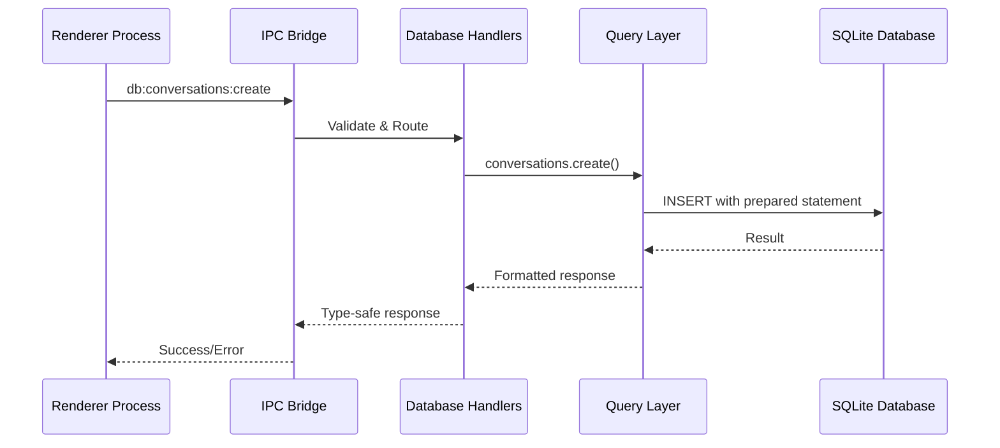
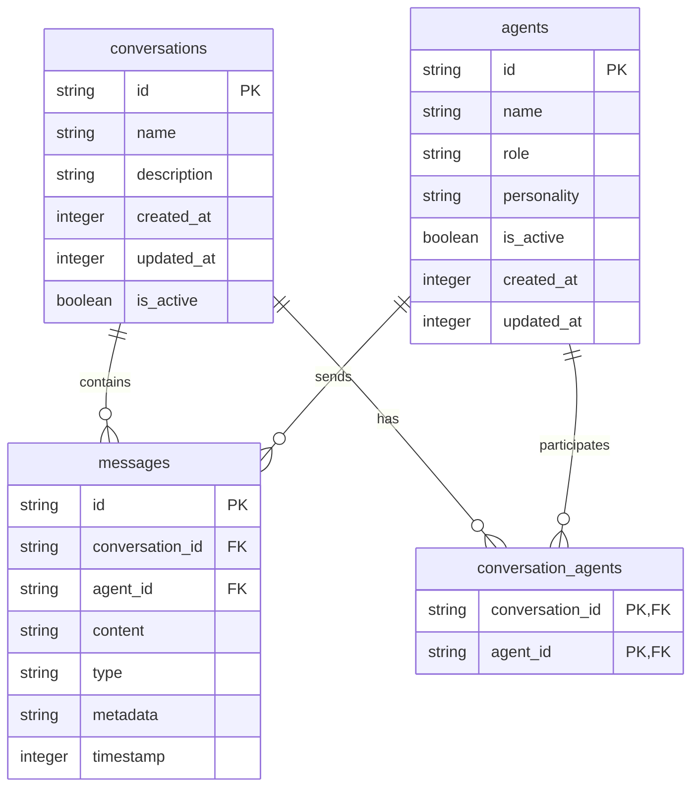

# Feature Implementation Plan: SQLite Database Setup

_Generated: 2025-07-08_
_Based on Feature Specification: [20250708-sqlite-database-setup-feature.md](./20250708-sqlite-database-setup-feature.md)_

## Architecture Overview

This implementation establishes a SQLite database system in the Electron main process using better-sqlite3 for persistent storage of conversations, messages, and agent configurations. The system uses a single database connection initialized at startup, custom migration system with `PRAGMA user_version`, and extends the existing IPC architecture for type-safe database operations.

### System Architecture

### Data Flow

### Database Schema

## Technology Stack

### Core Technologies

- **Language/Runtime:** TypeScript 5.8.3 (strict mode)
- **Framework:** Electron 37.2.0
- **Database:** SQLite via better-sqlite3
- **Build Tool:** Vite 7.0.3

### Libraries & Dependencies

- **Database:** better-sqlite3 (to be added)
- **Types:** @types/better-sqlite3 (to be added)
- **IPC:** Electron's built-in IPC with existing type-safe wrappers
- **Testing:** To be determined (Phase 2)

### Patterns & Approaches

- **Architectural Patterns:** Main-Renderer process separation, IPC communication
- **Database Patterns:** Single connection, prepared statements, transaction management
- **Migration Pattern:** Sequential numbered SQL files with PRAGMA user_version
- **Development Practices:** TypeScript strict mode, type-safe IPC, comprehensive error handling

### External Integrations

- **File System:** userData directory for database storage
- **Migration Files:** SQL files in src/main/database/migrations/
- **Configuration:** Integration with existing config system

## Relevant Files

- `package.json` - Add better-sqlite3 dependencies
- `src/shared/types/index.ts` - Update Agent, Message, Conversation interfaces and add pagination types
- `src/main/database/connection/` - Database connection management (modular)
- `src/main/database/migrations-system/` - Migration system implementation (modular)
- `src/main/database/schema/` - Database schema definitions (modular)
- `src/main/database/queries/conversations/` - Conversation CRUD operations (modular)
- `src/main/database/queries/messages/` - Message CRUD operations (modular)
- `src/main/database/queries/agents/` - Agent CRUD operations (modular)
- `src/main/database/migrations/001-initial.sql` - Initial schema migration (created)
- `src/main/database/migrations/002-indexes.sql` - Performance indexes (created)
- `src/main/database/validation/` - Database validation system (created)
- `src/main/database/transactions/` - Transaction management system (created)
- `src/main/database/performance/` - Performance monitoring system (created)
- `src/main/ipc/handlers.ts` - Extend with database IPC handlers
- `src/main/index.ts` - Initialize database on app startup (updated)
- `src/preload/index.ts` - Expose database IPC methods
- `src/renderer/hooks/useDatabase.ts` - Database operation hooks (created)
- `src/renderer/hooks/useAgents.ts` - Agent operations hook with pagination (enhanced)
- `src/renderer/hooks/useConversations.ts` - Conversation operations hook (created)
- `src/renderer/hooks/useMessages.ts` - Message operations hook (created)
- `src/renderer/hooks/useConversationAgents.ts` - Conversation-agent relationship hook (created)
- `src/renderer/hooks/DatabaseContext.ts` - Database context definitions (created)
- `src/renderer/hooks/DatabaseProvider.tsx` - Database provider component (created)
- `src/renderer/utils/pagination.ts` - Pagination utility functions (created)
- `src/renderer/utils/database.ts` - Database operation utilities (created)
- `src/renderer/utils/error-handling.ts` - Error handling system (created)
- `src/renderer/utils/index.ts` - Utilities barrel export (created)

## Implementation Notes

- Tests should be placed in `tests/` directory following project conventions
- Use `npm run type-check` to verify TypeScript compilation
- Run `npm run test:run` to execute all tests
- Run `npm run lint` and `npm run format` after each task
- Database initialization occurs in main process startup sequence
- Migration system uses PRAGMA user_version for simplicity and control
- Single database connection instance reused throughout application lifecycle
- Direct type mapping between database schema and TypeScript interfaces

## Implementation Tasks

- [x] 1.0 Setup Dependencies and Database Foundation
  - [x] 1.1 Add better-sqlite3 and related dependencies to package.json
  - [x] 1.2 Create database directory structure and initial files
  - [x] 1.3 Update TypeScript interfaces to match database schema
  - [x] 1.4 Create database connection management system
  - [x] 1.5 Implement basic migration system using PRAGMA user_version

  ### Files modified with description of changes
  - `package.json` - Added better-sqlite3 and @types/better-sqlite3 dependencies
  - `src/shared/types/index.ts` - Updated Agent, Message, and Conversation interfaces to match database schema, added ConversationAgent type
  - `src/main/database/connection/` - Created modular connection management system with separate files for initializeDatabase, getDatabase, closeDatabase, and shared state management
  - `src/main/database/migrations-system/` - Created migration system with separate files for getCurrentVersion, setVersion, loadMigrations, runMigrations, and Migration interface
  - `src/main/database/schema/` - Created database schema type definitions in separate files for DatabaseAgent, DatabaseConversation, DatabaseMessage, and DatabaseConversationAgent
  - `src/main/database/queries/conversations/` - Created conversation CRUD operations with separate files for each function (createConversation, getConversationById, getActiveConversations, updateConversation, deleteConversation)
  - `src/main/database/queries/messages/` - Created message CRUD operations with separate files for each function (createMessage, getMessageById, getMessagesByConversationId, updateMessage, deleteMessage, createMessages)
  - `src/main/database/queries/agents/` - Created agent CRUD operations with separate files for each function (createAgent, getAgentById, getActiveAgents, updateAgent, deleteAgent, getAgentsByConversationId)
  - `src/main/database/index.ts` - Main database module barrel file exporting all database functionality
  - All database modules follow the one-export-per-file pattern with appropriate barrel files for organization

- [x] 2.0 Create Database Schema and Migration System
  - [x] 2.1 Create initial migration SQL files for schema creation
  - [x] 2.2 Create performance indexes migration
  - [x] 2.3 Implement migration execution and version tracking
  - [x] 2.4 Add database initialization to main process startup
  - [x] 2.5 Create database schema validation and error handling

  ### Files modified with description of changes
  - `src/main/database/migrations/001-initial.sql` - Created initial database schema migration with all core tables (conversations, agents, messages, conversation_agents) and foreign key constraints
  - `src/main/database/migrations/002-indexes.sql` - Created performance indexes migration for optimal query performance on active flags, timestamps, and foreign key relationships
  - `src/main/database/migrations-system/runMigrations.ts` - Enhanced with comprehensive error handling, migration sequence validation, and detailed logging for successful migration execution
  - `src/main/database/validation/` - Created modular validation system with separate files for each validation function and error classes (DatabaseValidationError, DatabaseIntegrityError, validateConversation, validateAgent, validateMessage, validateConversationAgent, validateDatabaseSchema)
  - `src/main/database/index.ts` - Updated to export validation module
  - `src/main/index.ts` - Added complete database initialization sequence to main process startup with proper error handling, including database initialization, migration execution, and schema validation

- [x] 3.0 Implement Database Query Layer
  - [x] 3.1 Create conversation CRUD operations with prepared statements
  - [x] 3.2 Create message CRUD operations with batch insert support
  - [x] 3.3 Create agent CRUD operations with soft delete functionality
  - [x] 3.4 Implement transaction management for complex operations
  - [x] 3.5 Add query optimization and performance monitoring

  ### Files modified with description of changes
  - `src/main/database/transactions/TransactionOptions.ts` - Created transaction options interface with readOnly, immediate, and exclusive options
  - `src/main/database/transactions/TransactionManager.ts` - Created transaction manager class with methods for executing transactions with different isolation levels
  - `src/main/database/transactions/transactionManagerInstance.ts` - Global transaction manager instance
  - `src/main/database/transactions/createConversationWithAgents.ts` - Function to create conversation with associated agents in a single transaction
  - `src/main/database/transactions/deleteConversationAndRelatedData.ts` - Function to delete conversation and all related data atomically
  - `src/main/database/transactions/createMessagesAndUpdateConversation.ts` - Function to create multiple messages and update conversation timestamp atomically
  - `src/main/database/transactions/transferMessages.ts` - Function to transfer messages between conversations
  - `src/main/database/transactions/archiveConversation.ts` - Function to archive conversation (soft delete)
  - `src/main/database/transactions/restoreConversation.ts` - Function to restore archived conversation
  - `src/main/database/performance/QueryMetrics.ts` - Interface for query performance metrics
  - `src/main/database/performance/QueryStats.ts` - Interface for query statistics
  - `src/main/database/performance/QueryPlan.ts` - Interface for query execution plans
  - `src/main/database/performance/IndexInfo.ts` - Interface for database index information
  - `src/main/database/performance/TableInfo.ts` - Interface for table statistics
  - `src/main/database/performance/QueryMonitor.ts` - Class for monitoring query performance and execution metrics
  - `src/main/database/performance/queryMonitorInstance.ts` - Global query monitor instance
  - `src/main/database/performance/QueryOptimizer.ts` - Class for query optimization utilities and recommendations
  - `src/main/database/performance/queryOptimizerInstance.ts` - Global query optimizer instance
  - `src/main/database/performance/PerformanceReport.ts` - Interface for comprehensive performance reports
  - `src/main/database/performance/PerformanceManager.ts` - Class for managing database performance, optimization, and reporting
  - `src/main/database/performance/performanceManagerInstance.ts` - Global performance manager instance
  - `src/main/database/transactions/index.ts` - Updated barrel file to export all transaction management functionality
  - `src/main/database/performance/index.ts` - Updated barrel file to export all performance monitoring functionality
  - `src/main/database/index.ts` - Updated to export transactions and performance modules

- [x] 4.0 Create Renderer Database Integration
  - [x] 4.1 Create React hooks for database operations
  - [x] 4.2 Implement pagination support for large result sets
  - [x] 4.3 Add database error handling in renderer process
  - [x] 4.4 Create database operation utilities and helpers
  - [x] 4.5 Add database state management integration

  ### Files modified with description of changes
  - `src/shared/types/index.ts` - Added comprehensive pagination types including PaginationMetadata, PaginatedResult, PaginationRequest, and PaginationOptions
  - `src/renderer/utils/pagination.ts` - Created complete pagination utility library with functions for pagination-to-filter conversion, pagination metadata creation, validation, and pagination controls
  - `src/renderer/utils/database.ts` - Created database operation utilities including data validation functions, filter utilities, data transformation utilities, caching, and batch operation support
  - `src/renderer/utils/error-handling.ts` - Created comprehensive error handling system with DatabaseError class, error classification, retry mechanisms, error tracking, and notification utilities
  - `src/renderer/utils/index.ts` - Created barrel export file with explicit re-exports to avoid naming conflicts between database and error-handling utilities
  - `src/renderer/hooks/useAgents.ts` - Enhanced with pagination support, caching, error tracking, and data validation
  - `src/renderer/hooks/DatabaseContext.ts` - Created centralized database context interface with state and actions for all database operations
  - `src/renderer/hooks/DatabaseProvider.tsx` - Created database provider component with centralized state management, error tracking, auto-sync, online/offline detection, and cache management
  - `src/renderer/hooks/index.ts` - Updated to export database context and provider components
  - All database operations now support pagination, caching, comprehensive error handling, and state management integration

- [ ] 5.0 Performance Optimization and Testing
  - [x] 5.1 Enable WAL mode and implement checkpoint management
  - [x] 5.2 Optimize database queries with proper indexing
  - [x] 5.3 Implement database backup and recovery functionality
  - [ ] 5.4 Create comprehensive database tests (unit)
  - [ ] 5.5 Create comprehensive database tests (integration)
  - [ ] 5.6 Add performance monitoring and optimization

  ### Files modified with description of changes
  - `src/main/database/backup/` - Created comprehensive backup and recovery system with modular architecture including BackupManager, BackupOptions, RestoreOptions, BackupResult, RestoreResult, BackupMetadata, and utility functions for file operations, validation, and cleanup
  - `src/main/database/backup/BackupManager.ts` - Core backup manager class with full backup creation, restoration, validation, cleanup, and statistics functionality
  - `src/main/database/backup/validateBackupIntegrity.ts` - SQLite integrity validation using PRAGMA integrity_check and table existence verification
  - `src/main/database/backup/listBackups.ts` - Backup listing with metadata extraction and sorting by timestamp
  - `src/main/database/backup/cleanupOldBackups.ts` - Automated cleanup of old backups based on retention policy
  - `src/main/database/backup/createBackupFile.ts` - Database file copying with WAL and SHM file support
  - `src/main/database/backup/backupManagerInstance.ts` - Global backup manager instance with default configuration
  - `src/main/database/index.ts` - Updated to export backup module
  - `src/shared/types/index.ts` - Added backup-related types (BackupOptions, RestoreOptions, BackupResult, RestoreResult, BackupMetadata, BackupStats) and IPC channel definitions
  - `src/main/ipc/handlers/database/backup/` - Created IPC handlers for all backup operations (create, restore, list, delete, validate, cleanup, stats)
  - `src/main/ipc/handlers.ts` - Added backup IPC handlers with performance monitoring integration
  - `src/main/ipc/handlers/index.ts` - Updated to export backup handlers
  - `src/preload/index.ts` - Exposed backup IPC methods to renderer process with security validation
  - `src/renderer/hooks/useBackup/` - Created modular backup hook with separate files for UseBackupState, UseBackupActions, UseBackupReturn, and main useBackup implementation
  - `src/renderer/hooks/useBackup/useBackup.ts` - Comprehensive React hook for backup operations with state management, error handling, and automatic refresh
  - `src/renderer/hooks/index.ts` - Updated to export backup hook and types
  - All backup modules follow the one-export-per-file pattern with appropriate barrel files for organization
  - Created comprehensive backup and recovery system with full database file copying, WAL/SHM file support, integrity validation, retention policies, and automated cleanup
  - Backup system includes checksum calculation, file size tracking, metadata storage, and error recovery mechanisms
  - Integrated with existing database checkpoint system for optimal backup timing
  - Added React hooks for frontend integration with loading states, error handling, and real-time updates
  - System supports custom backup directories, retention policies, and validation before restore operations
  - `src/main/database/migrations/003-query-optimization.sql` - Created comprehensive query optimization migration with advanced composite indexes, partial indexes, and covering indexes for optimal query performance
  - `src/main/database/optimization/QueryAnalysisResult.ts` - Created interface for query analysis results with performance metrics, execution plans, and recommendations
  - `src/main/database/optimization/OptimizationReport.ts` - Created interface for comprehensive optimization reports with metrics and suggestions
  - `src/main/database/optimization/QueryAnalyzer.ts` - Created advanced query analysis system with performance monitoring, inefficiency scoring, and optimization recommendations
  - `src/main/database/optimization/QueryOptimizationService.ts` - Created query optimization service with database analysis, performance optimization, and reporting capabilities
  - `src/main/database/optimization/queryOptimizationServiceInstance.ts` - Global query optimization service instance
  - `src/main/database/optimization/QueryHelper.ts` - Created query helper utilities with performance monitoring, optimized query patterns, and pagination support
  - `src/main/database/optimization/index.ts` - Barrel export file for optimization module
  - `src/main/database/index.ts` - Updated to export optimization module
  - `src/main/database/queries/conversations/getActiveConversations.ts` - Enhanced with pagination support and optimized query patterns
  - `src/main/database/queries/agents/getActiveAgents.ts` - Enhanced with pagination support and optimized query patterns
  - `src/main/database/queries/agents/getAgentsByConversationId.ts` - Optimized JOIN query from LEFT JOIN to INNER JOIN for better performance
  - All optimization modules follow the one-export-per-file pattern with appropriate barrel files for organization
  - Created comprehensive query optimization system with analysis, monitoring, and reporting capabilities
  - Added 10+ advanced database indexes including composite indexes, partial indexes, and covering indexes
  - Implemented query performance monitoring with slow query detection and optimization recommendations
  - Enhanced existing query functions with pagination support and optimized query patterns

  ### Files modified with description of changes
  - `src/main/database/checkpoint/CheckpointManager.ts` - Created comprehensive checkpoint management system with WAL monitoring, automatic checkpoints, and manual checkpoint operations
  - `src/main/database/checkpoint/CheckpointMode.ts` - Defined checkpoint mode type (PASSIVE, FULL, RESTART, TRUNCATE)
  - `src/main/database/checkpoint/CheckpointResult.ts` - Defined checkpoint operation result interface
  - `src/main/database/checkpoint/CheckpointOptions.ts` - Defined checkpoint manager configuration options
  - `src/main/database/checkpoint/CheckpointConfig.ts` - Defined comprehensive checkpoint configuration interface
  - `src/main/database/checkpoint/DEFAULT_CHECKPOINT_CONFIG.ts` - Default checkpoint configuration with sensible defaults
  - `src/main/database/checkpoint/checkpointManagerInstance.ts` - Global checkpoint manager instance with default configuration
  - `src/main/database/checkpoint/enableWalMode.ts` - Function to enable WAL mode with optimal settings (synchronous=NORMAL, 16MB cache, memory temp store, 256MB mmap)
  - `src/main/database/checkpoint/configureAutoCheckpoint.ts` - Function to configure WAL auto-checkpoint threshold
  - `src/main/database/checkpoint/getWalInfo.ts` - Function to retrieve WAL mode information and statistics
  - `src/main/database/checkpoint/performManualCheckpoint.ts` - Function to perform manual checkpoint operations
  - `src/main/database/checkpoint/isWalMode.ts` - Function to check if database is in WAL mode
  - `src/main/database/checkpoint/index.ts` - Barrel export file for checkpoint management system
  - `src/main/database/connection/initializeDatabase.ts` - Updated to use new checkpoint utilities for WAL mode configuration
  - `src/main/database/index.ts` - Updated to export checkpoint module
  - `src/main/index.ts` - Updated to start checkpoint manager on app startup and stop on shutdown
  - All checkpoint modules follow the one-export-per-file pattern with appropriate barrel files for organization
  - WAL mode is now enabled with optimal performance settings: synchronous=NORMAL, 16MB cache, memory temp store, 256MB mmap
  - Checkpoint manager monitors WAL file size every 30 seconds and triggers checkpoints when file exceeds 64MB
  - Supports all checkpoint modes (PASSIVE, FULL, RESTART, TRUNCATE) with configurable behavior
