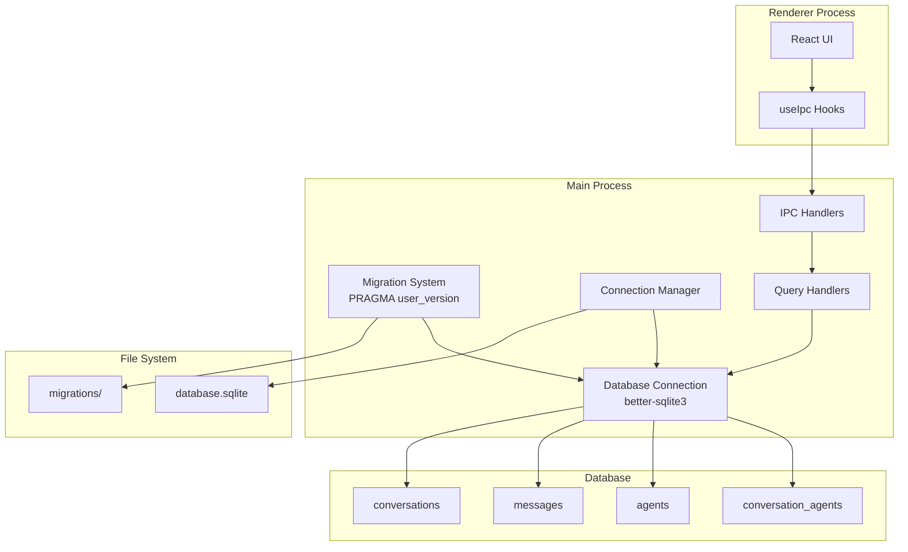
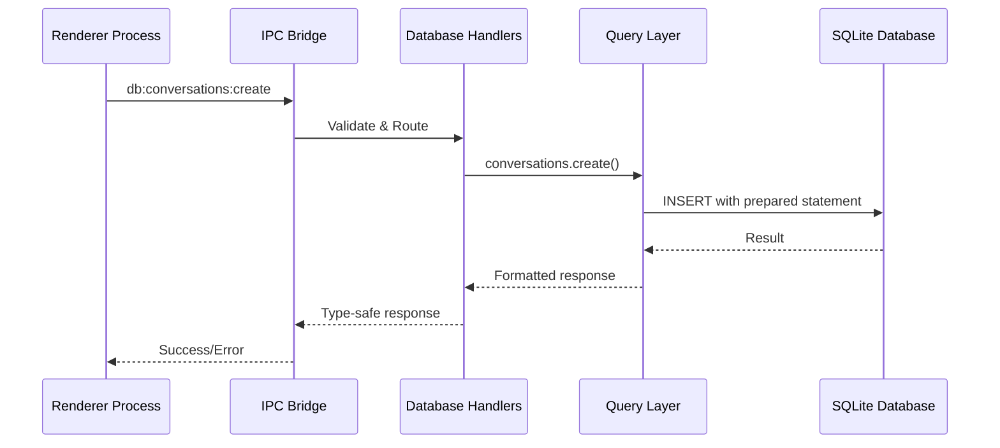
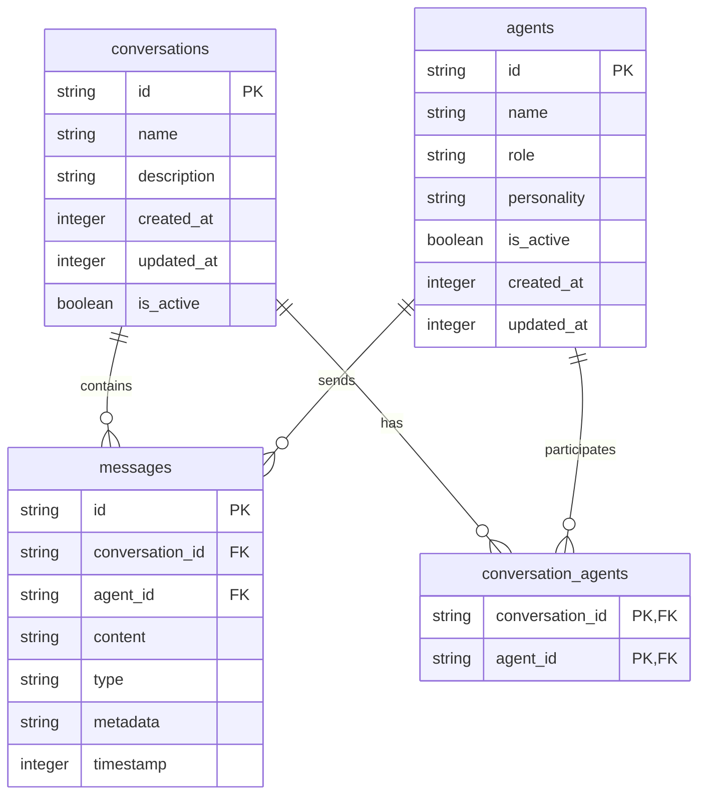

# Feature Implementation Plan: SQLite Database Setup

_Generated: 2025-07-08_
_Based on Feature Specification: [20250708-sqlite-database-setup-feature.md](./20250708-sqlite-database-setup-feature.md)_

## Architecture Overview

This implementation establishes a SQLite database system in the Electron main process using better-sqlite3 for persistent storage of conversations, messages, and agent configurations. The system uses a single database connection initialized at startup, custom migration system with `PRAGMA user_version`, and extends the existing IPC architecture for type-safe database operations.

### System Architecture

### Data Flow

### Database Schema

## Technology Stack

### Core Technologies

- **Language/Runtime:** TypeScript 5.8.3 (strict mode)
- **Framework:** Electron 37.2.0
- **Database:** SQLite via better-sqlite3
- **Build Tool:** Vite 7.0.3

### Libraries & Dependencies

- **Database:** better-sqlite3 (to be added)
- **Types:** @types/better-sqlite3 (to be added)
- **IPC:** Electron's built-in IPC with existing type-safe wrappers
- **Testing:** To be determined (Phase 2)

### Patterns & Approaches

- **Architectural Patterns:** Main-Renderer process separation, IPC communication
- **Database Patterns:** Single connection, prepared statements, transaction management
- **Migration Pattern:** Sequential numbered SQL files with PRAGMA user_version
- **Development Practices:** TypeScript strict mode, type-safe IPC, comprehensive error handling

### External Integrations

- **File System:** userData directory for database storage
- **Migration Files:** SQL files in src/main/database/migrations/
- **Configuration:** Integration with existing config system

## Relevant Files

- `package.json` - Add better-sqlite3 dependencies
- `src/shared/types/index.ts` - Update Agent, Message, Conversation interfaces
- `src/main/database/connection/` - Database connection management (modular)
- `src/main/database/migrations-system/` - Migration system implementation (modular)
- `src/main/database/schema/` - Database schema definitions (modular)
- `src/main/database/queries/conversations/` - Conversation CRUD operations (modular)
- `src/main/database/queries/messages/` - Message CRUD operations (modular)
- `src/main/database/queries/agents/` - Agent CRUD operations (modular)
- `src/main/database/migrations/001-initial.sql` - Initial schema migration (created)
- `src/main/database/migrations/002-indexes.sql` - Performance indexes (created)
- `src/main/database/validation/` - Database validation system (created)
- `src/main/ipc/handlers.ts` - Extend with database IPC handlers
- `src/main/index.ts` - Initialize database on app startup (updated)
- `src/preload/index.ts` - Expose database IPC methods
- `src/renderer/hooks/useDatabase.ts` - Database operation hooks (new)

## Implementation Notes

- Tests should be placed in `src/main/database/__tests__/` following the project's conventions
- Use `npm run type-check` to verify TypeScript compilation
- Run `npm run lint` and `npm run format` after each task
- Database initialization occurs in main process startup sequence
- Migration system uses PRAGMA user_version for simplicity and control
- Single database connection instance reused throughout application lifecycle
- Direct type mapping between database schema and TypeScript interfaces

## Implementation Tasks

- [x] 1.0 Setup Dependencies and Database Foundation
  - [x] 1.1 Add better-sqlite3 and related dependencies to package.json
  - [x] 1.2 Create database directory structure and initial files
  - [x] 1.3 Update TypeScript interfaces to match database schema
  - [x] 1.4 Create database connection management system
  - [x] 1.5 Implement basic migration system using PRAGMA user_version

  ### Files modified with description of changes
  - `package.json` - Added better-sqlite3 and @types/better-sqlite3 dependencies
  - `src/shared/types/index.ts` - Updated Agent, Message, and Conversation interfaces to match database schema, added ConversationAgent type
  - `src/main/database/connection/` - Created modular connection management system with separate files for initializeDatabase, getDatabase, closeDatabase, and shared state management
  - `src/main/database/migrations-system/` - Created migration system with separate files for getCurrentVersion, setVersion, loadMigrations, runMigrations, and Migration interface
  - `src/main/database/schema/` - Created database schema type definitions in separate files for DatabaseAgent, DatabaseConversation, DatabaseMessage, and DatabaseConversationAgent
  - `src/main/database/queries/conversations/` - Created conversation CRUD operations with separate files for each function (createConversation, getConversationById, getActiveConversations, updateConversation, deleteConversation)
  - `src/main/database/queries/messages/` - Created message CRUD operations with separate files for each function (createMessage, getMessageById, getMessagesByConversationId, updateMessage, deleteMessage, createMessages)
  - `src/main/database/queries/agents/` - Created agent CRUD operations with separate files for each function (createAgent, getAgentById, getActiveAgents, updateAgent, deleteAgent, getAgentsByConversationId)
  - `src/main/database/index.ts` - Main database module barrel file exporting all database functionality
  - All database modules follow the one-export-per-file pattern with appropriate barrel files for organization

- [x] 2.0 Create Database Schema and Migration System
  - [x] 2.1 Create initial migration SQL files for schema creation
  - [x] 2.2 Create performance indexes migration
  - [x] 2.3 Implement migration execution and version tracking
  - [x] 2.4 Add database initialization to main process startup
  - [x] 2.5 Create database schema validation and error handling

  ### Files modified with description of changes
  - `src/main/database/migrations/001-initial.sql` - Created initial database schema migration with all core tables (conversations, agents, messages, conversation_agents) and foreign key constraints
  - `src/main/database/migrations/002-indexes.sql` - Created performance indexes migration for optimal query performance on active flags, timestamps, and foreign key relationships
  - `src/main/database/migrations-system/runMigrations.ts` - Enhanced with comprehensive error handling, migration sequence validation, and detailed logging for successful migration execution
  - `src/main/database/validation/` - Created modular validation system with separate files for each validation function and error classes (DatabaseValidationError, DatabaseIntegrityError, validateConversation, validateAgent, validateMessage, validateConversationAgent, validateDatabaseSchema)
  - `src/main/database/index.ts` - Updated to export validation module
  - `src/main/index.ts` - Added complete database initialization sequence to main process startup with proper error handling, including database initialization, migration execution, and schema validation

- [x] 3.0 Implement Database Query Layer
  - [x] 3.1 Create conversation CRUD operations with prepared statements
  - [x] 3.2 Create message CRUD operations with batch insert support
  - [x] 3.3 Create agent CRUD operations with soft delete functionality
  - [x] 3.4 Implement transaction management for complex operations
  - [x] 3.5 Add query optimization and performance monitoring

  ### Files modified with description of changes
  - `src/main/database/transactions/TransactionOptions.ts` - Created transaction options interface with readOnly, immediate, and exclusive options
  - `src/main/database/transactions/TransactionManager.ts` - Created transaction manager class with methods for executing transactions with different isolation levels
  - `src/main/database/transactions/transactionManagerInstance.ts` - Global transaction manager instance
  - `src/main/database/transactions/createConversationWithAgents.ts` - Function to create conversation with associated agents in a single transaction
  - `src/main/database/transactions/deleteConversationAndRelatedData.ts` - Function to delete conversation and all related data atomically
  - `src/main/database/transactions/createMessagesAndUpdateConversation.ts` - Function to create multiple messages and update conversation timestamp atomically
  - `src/main/database/transactions/transferMessages.ts` - Function to transfer messages between conversations
  - `src/main/database/transactions/archiveConversation.ts` - Function to archive conversation (soft delete)
  - `src/main/database/transactions/restoreConversation.ts` - Function to restore archived conversation
  - `src/main/database/performance/QueryMetrics.ts` - Interface for query performance metrics
  - `src/main/database/performance/QueryStats.ts` - Interface for query statistics
  - `src/main/database/performance/QueryPlan.ts` - Interface for query execution plans
  - `src/main/database/performance/IndexInfo.ts` - Interface for database index information
  - `src/main/database/performance/TableInfo.ts` - Interface for table statistics
  - `src/main/database/performance/QueryMonitor.ts` - Class for monitoring query performance and execution metrics
  - `src/main/database/performance/queryMonitorInstance.ts` - Global query monitor instance
  - `src/main/database/performance/QueryOptimizer.ts` - Class for query optimization utilities and recommendations
  - `src/main/database/performance/queryOptimizerInstance.ts` - Global query optimizer instance
  - `src/main/database/performance/PerformanceReport.ts` - Interface for comprehensive performance reports
  - `src/main/database/performance/PerformanceManager.ts` - Class for managing database performance, optimization, and reporting
  - `src/main/database/performance/performanceManagerInstance.ts` - Global performance manager instance
  - `src/main/database/transactions/index.ts` - Updated barrel file to export all transaction management functionality
  - `src/main/database/performance/index.ts` - Updated barrel file to export all performance monitoring functionality
  - `src/main/database/index.ts` - Updated to export transactions and performance modules

- [ ] 4.0 Extend IPC System for Database Operations
  - [ ] 4.1 Add database IPC channel definitions to shared types
  - [ ] 4.2 Implement database IPC handlers in main process
  - [ ] 4.3 Add database methods to preload script
  - [ ] 4.4 Create input validation and sanitization for database operations
  - [ ] 4.5 Implement error handling and response formatting

  ### Files modified with description of changes
  - (to be filled in after task completion)

- [ ] 5.0 Create Renderer Database Integration
  - [ ] 5.1 Create React hooks for database operations
  - [ ] 5.2 Implement pagination support for large result sets
  - [ ] 5.3 Add database error handling in renderer process
  - [ ] 5.4 Create database operation utilities and helpers
  - [ ] 5.5 Add database state management integration

  ### Files modified with description of changes
  - (to be filled in after task completion)

- [ ] 6.0 Performance Optimization and Testing
  - [ ] 6.1 Enable WAL mode and implement checkpoint management
  - [ ] 6.2 Optimize database queries with proper indexing
  - [ ] 6.3 Implement database backup and recovery functionality
  - [ ] 6.4 Create comprehensive database tests (unit and integration)
  - [ ] 6.5 Add performance monitoring and optimization

  ### Files modified with description of changes
  - (to be filled in after task completion)
