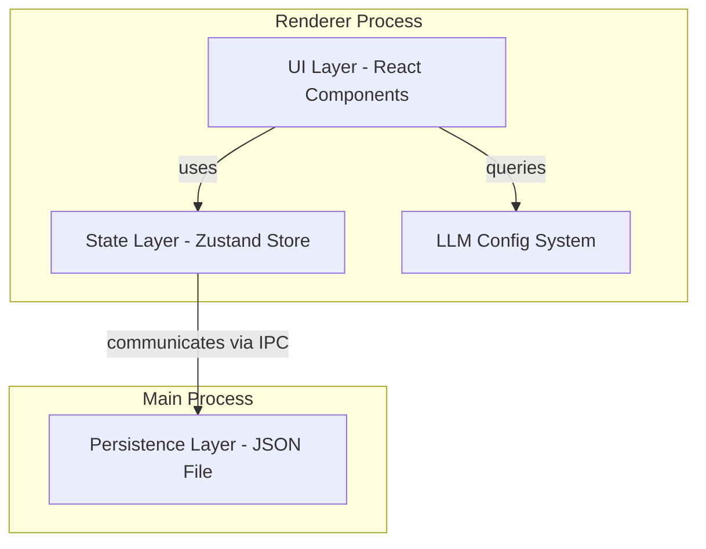

## Executive Summary

Implement a comprehensive agent management system within the settings model that allows users to create, configure, and manage AI agents with specific models, roles, personalities, and LLM configuration parameters. The system will follow established patterns from the existing roles and personalities implementations.

## Functional Requirements

### Agent Data Model

Each agent configuration will store:

- **Name**: Unique identifier for the agent (required, 2-100 characters)
- **LLM Model**: Selected from models available through configured LLM providers
  - Models are determined by the LLM configurations that have been set up in the system
  - Each LLM configuration defines a provider (OpenAI or Anthropic) with its API key
  - The model dropdown should show models from all configured providers
  - Model format should include both the model name and provider (e.g., "GPT-4 (OpenAI)")
- **Role**: Reference to existing role definitions in the system
- **Personality**: Reference to existing personality definitions in the system
- **LLM Configuration**:
  - Temperature (0-2, step 0.1)
  - Max Tokens (1-4000)
  - Top P (0-1, step 0.01)
- **System Prompt**: Optional custom system prompt (max 5000 characters)

### Model Selection Integration

The model selection dropdown must:

- Query the available LLM configurations from the system using `useLlmConfig` hook
- Derive available models based on configured providers:
  - **OpenAI**: GPT-4, GPT-3.5 Turbo, etc.
  - **Anthropic**: Claude 3.5 Sonnet, Claude 3 Haiku, etc.
- Display models only from providers that have been configured with API keys
- Show provider name alongside model name for clarity
- Handle case where no LLM configurations exist (show appropriate message)

### User Interface Structure

The agent section will have two main tabs:

1. **Library Tab**: Display and manage saved agents
   - List view of all agents with cards showing name, model, role
   - Create new agent button
   - Edit and delete functionality for each agent
   - No search functionality (removed from prototype)
2. **Defaults Tab**: Configure default settings for new agents
   - Temperature slider with description
   - Max tokens input field
   - Top P slider with description
   - Reset to defaults button
   - Settings preview panel

### Core Functionality

- **CRUD Operations**: Create, Read, Update, Delete agents
- **Persistence**: Store agents in JSON file in user data directory
- **Validation**: Zod schema validation for all agent data
- **Form Management**: React Hook Form for agent creation/editing
- **State Management**: Zustand store for reactive state
- **IPC Communication**: Electron IPC handlers for main/renderer process communication

## Technical Requirements

### Component Architecture

The agent management system uses a modular component architecture with dedicated selection components:

**Selection Components** (Reusable, single-responsibility):

- **ModelSelect**: Queries LLM configurations and displays available models
- **RoleSelect**: Loads roles from useRolesStore and provides dropdown selection
- **PersonalitySelect**: Loads personalities from usePersonalitiesStore and provides dropdown selection

Each selection component:

- Manages its own data fetching and loading states
- Provides consistent error handling
- Follows the same UI patterns (using shadcn/ui Select components)
- Emits simple onChange events with selected values
- Handles empty states gracefully

**Benefits of this approach**:

- Form components remain simple and focused
- Selection logic is reusable across different forms
- Testing is easier with isolated components
- Consistent behavior across the application

### Architecture Overview

Follow the established three-layer architecture pattern:



### Technology Stack

- **Frontend**: React with TypeScript
- **State Management**: Zustand
- **Form Handling**: React Hook Form with Zod validation
- **Persistence**: JSON file storage using FileStorageService
- **IPC**: Electron IPC for main/renderer communication
- **Styling**: Tailwind CSS with shadcn/ui components
- **LLM Integration**: useLlmConfig hook for provider/model data

### File Structure Pattern

Following existing patterns from roles and personalities:

```
packages/ui-shared/
├── src/
│   ├── stores/
│   │   ├── useAgentsStore.ts
│   │   ├── AgentsState.ts
│   │   └── AgentsActions.ts
│   ├── types/
│   │   └── settings/
│   │       ├── AgentFormData.ts
│   │       ├── AgentViewModel.ts
│   │       ├── AgentsSectionProps.ts
│   │       ├── RoleSelectProps.ts
│   │       └── PersonalitySelectProps.ts
│   ├── schemas/
│   │   └── agentSchema.ts
│   └── mapping/
│       └── agents/
│           ├── mapAgentsPersistenceToUI.ts
│           └── mapAgentsUIToPersistence.ts

packages/shared/
├── src/
│   └── types/
│       └── agents/
│           └── PersistedAgentsSettingsData.ts

apps/desktop/
├── src/
│   ├── electron/
│   │   └── agentsHandlers.ts
│   ├── data/
│   │   └── repositories/
│   │       ├── AgentsRepository.ts
│   │       └── agentsRepositoryManager.ts
│   └── components/
│       └── settings/
│           ├── agents/
│           │   ├── AgentsSection.tsx (modified)
│           │   ├── AgentForm.tsx (simplified)
│           │   ├── AgentCard.tsx (existing)
│           │   └── LibraryTab.tsx (new)
│           ├── ModelSelect.tsx (enhanced)
│           ├── RoleSelect.tsx (new)
│           └── PersonalitySelect.tsx (new)
```

## Non-Functional Requirements

### Code Quality Standards

- **Simplicity**: Follow KISS, YAGNI, and SRP principles
- **Pattern Consistency**: Reuse existing patterns from roles/personalities
- **No Over-Engineering**: No lock files, transactional support, or backups
- **Testing**: Unit tests only, no integration or performance testing
- **Clean Code**: Functions ≤ 20 LOC, files ≤ 400 LOC

### Performance Requirements

- Form validation should be instant (< 100ms)
- File operations should complete within 500ms
- UI should remain responsive during all operations

### Security Requirements

- Validate all user input with Zod schemas
- Sanitize file paths to prevent directory traversal
- No storage of sensitive data in plain text

## Detailed Acceptance Criteria

### Agent Creation

- User can create a new agent with all required fields
- Name must be unique across all agents
- **Model selection dropdown populated from LLM configurations**:
  - Shows only models from configured providers
  - Displays provider name with each model
  - Shows message if no LLM configs exist
  - Updates dynamically when LLM configs change
- **Role selection dropdown (RoleSelect component)**:
  - Populates from existing roles via useRolesStore
  - Shows role name and truncated description
  - Handles loading and error states
  - Validates selection is required
- **Personality selection dropdown (PersonalitySelect component)**:
  - Populates from existing personalities via usePersonalitiesStore
  - Shows personality name
  - Handles loading and error states
  - Validates selection is required
- LLM configuration sliders provide real-time feedback
- System prompt is optional and has character counter
- Form validates on submit with clear error messages
- Successfully created agents appear in the library immediately

### Agent Editing

- User can edit existing agents from the library
- Form pre-populates with current agent data
- Name uniqueness validation excludes current agent
- **Model dropdown shows current model even if provider no longer configured**
- Changes are validated before saving
- Unsaved changes trigger confirmation dialog on cancel
- Successfully edited agents update in the library immediately

### Agent Deletion

- User can delete agents from the library
- Deletion requires confirmation dialog
- Deleted agents are immediately removed from the library
- No orphaned references remain after deletion

### Defaults Management

- Default settings apply to new agent creation
- Temperature slider shows descriptive text for current value
- Max tokens input validates numeric range (1-4000)
- Top P slider shows descriptive text for current value
- Reset button restores factory defaults with confirmation
- Settings preview shows human-readable descriptions

### Data Persistence

- Agents persist across application restarts
- File corruption handling with fallback to empty state
- Atomic writes prevent data loss during saves
- Auto-save with debouncing (500ms delay)

### UI/UX Requirements

- Keyboard navigation support for all interactive elements
- Screen reader announcements for state changes
- Loading states during async operations
- Error messages displayed prominently
- Success feedback for user actions
- Responsive design for different screen sizes

## Integration Requirements

### Dependencies on Existing Systems

- **LLM Config System**: Model selection must query configured providers
- **Roles System**: Agent references must validate against existing roles
- **Personalities System**: Agent references must validate against existing personalities
- **Settings Modal**: Integrate with existing navigation structure
- **File Storage Service**: Use existing file operation utilities

### Component Implementation Details

**ModelSelect Component**:

```typescript
interface ModelSelectProps {
  value: string;
  onChange: (value: string) => void;
  disabled?: boolean;
}
// Uses useLlmConfig hook to get configurations
// Maps providers to available models
// Shows "No LLM configurations" when empty
```

**RoleSelect Component**:

```typescript
interface RoleSelectProps {
  value: string;
  onChange: (value: string) => void;
  disabled?: boolean;
  placeholder?: string;
}
// Uses useRolesStore to get available roles
// Shows role name with optional description preview
// Handles loading and error states
```

**PersonalitySelect Component**:

```typescript
interface PersonalitySelectProps {
  value: string;
  onChange: (value: string) => void;
  disabled?: boolean;
  placeholder?: string;
}
// Uses usePersonalitiesStore to get available personalities
// Shows personality name
// Handles loading and error states
```

### Model Provider Mapping

Define clear mapping between providers and their available models:

```typescript
// Example model mapping structure
const PROVIDER_MODELS = {
  openai: [
    { id: "gpt-4", name: "GPT-4" },
    { id: "gpt-3.5-turbo", name: "GPT-3.5 Turbo" },
  ],
  anthropic: [
    { id: "claude-3-5-sonnet", name: "Claude 3.5 Sonnet" },
    { id: "claude-3-haiku", name: "Claude 3 Haiku" },
  ],
};
```

### API Contracts

- IPC channel names follow pattern: `agents:load`, `agents:save`, `agents:reset`
- Data structures compatible with existing persistence patterns
- Error handling consistent with other settings sections

## Constraints and Limitations

### Technical Constraints

- No backwards compatibility required (greenfield)
- No migration from existing data needed
- Single JSON file for all agents storage
- No real-time collaboration features
- Models limited to those available from configured providers

### Design Constraints

- Remove search functionality from library
- Remove templates tab entirely
- Keep UI consistent with existing settings sections
- Use existing component library (shadcn/ui)

## Success Metrics

- All CRUD operations complete without errors
- Form validation prevents invalid data entry
- Data persists correctly across sessions
- UI remains responsive during all operations
- Code follows established patterns consistently
- Model selection correctly reflects configured LLM providers
