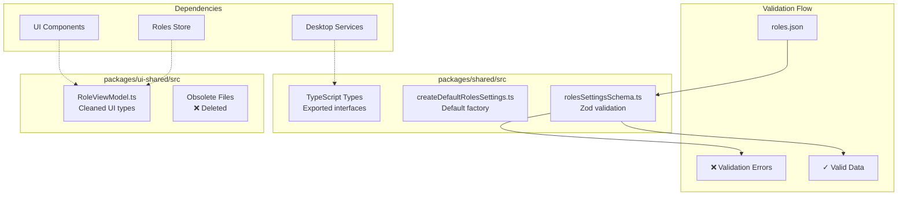

# Data Foundation and Schema Design Epic

## Purpose and Goals

Establish the foundational data layer for roles settings by creating proper schemas, types, and cleaning up existing demo code. This epic provides the type-safe, validated foundation that all other components will build upon.

## Major Components and Deliverables

### Schema and Type Definitions (`packages/shared`)

- **Roles Settings Schema**: Zod schema for `roles.json` file structure with proper validation
- **Default Configuration**: Function to create default empty roles configuration
- **TypeScript Types**: Exported types for persistence layer consumption

### Code Cleanup (`packages/ui-shared`)

- **Remove Obsolete Files**: Delete localStorage-based persistence and role category utilities
- **Update Type Definitions**: Clean up existing role types to match new simple structure
- **Remove Demo Code**: Eliminate custom vs predefined role concepts and related utilities

### Schema Integration

- **File Structure Definition**: Define exact JSON structure for `roles.json`
- **Version Management**: Include schema versioning for future compatibility
- **Validation Rules**: Implement all field constraints (character limits, required fields, etc.)

## Detailed Acceptance Criteria

### Functional Requirements

- [ ] **Schema Validation**: `roles.json` structure validates against Zod schema with proper error messages
- [ ] **Type Safety**: All persistence types exported and available for use by other packages
- [ ] **Default Generation**: `createDefaultRolesSettings()` function produces valid empty configuration
- [ ] **Field Validation**: All role field constraints properly enforced (name 1-100 chars, description max 500, etc.)
- [ ] **Nullable Timestamps**: Schema handles null `createdAt`/`updatedAt` for direct JSON edits
- [ ] **Schema Versioning**: Version field included for future schema migrations

### Technical Requirements

- [ ] **Clean Architecture**: All schema code in `packages/shared` following existing patterns
- [ ] **No Breaking Dependencies**: Other packages can import new types without issues
- [ ] **Zod Integration**: Schemas integrate properly with existing Zod patterns in codebase
- [ ] **TypeScript Coverage**: Full type coverage with no `any` types

### Code Cleanup Requirements

- [ ] **Obsolete File Removal**: All localStorage and role category files deleted
- [ ] **Import Updates**: All references to removed files updated or removed
- [ ] **Type Consistency**: Role types consistent across all remaining files
- [ ] **No Dead Code**: No unused code or commented-out sections remain

## Technical Considerations

- Must follow exact patterns from existing settings schemas (general, appearance, advanced)
- Schema must be flexible enough to handle direct JSON file edits gracefully
- Types must be consumable by both UI-shared and desktop packages
- Validation must provide helpful error messages for debugging

## Dependencies

- **Prerequisites**: None - this is the foundation epic
- **Dependents**: All other epics depend on this completing first

## Estimated Scale

- **Files to Create**: 3-4 new schema/type files
- **Files to Modify**: 2-3 existing type files
- **Files to Delete**: 5-6 obsolete utility files
- **Estimated Features**: 3-4 features

## Architecture Diagram

## User Stories

- **As a developer**, I need reliable type definitions so I can build type-safe roles functionality
- **As a developer**, I need schema validation so I can handle invalid JSON files gracefully
- **As a user**, I need the system to validate my role data so I get helpful error messages for invalid inputs
- **As a user editing JSON directly**, I need the system to handle my manual edits without crashing

## Non-functional Requirements

### Code Quality

- All schemas must have 100% TypeScript coverage
- Zod schemas must provide meaningful error messages
- Code must pass all linting and formatting checks

### Performance

- Schema validation must complete in <10ms for typical role data
- Type definitions must not impact bundle size significantly

### Maintainability

- Schema structure must be easily extendable for future role fields
- Clear separation between UI and persistence types
- Consistent naming conventions with existing settings patterns

## Success Metrics

- Clean TypeScript compilation with no errors
- All obsolete files successfully removed without breaking imports
- Schema validation catches all invalid role data with helpful messages
- Default configuration generator produces valid, empty roles structure
- Type definitions enable type-safe development in dependent epics
