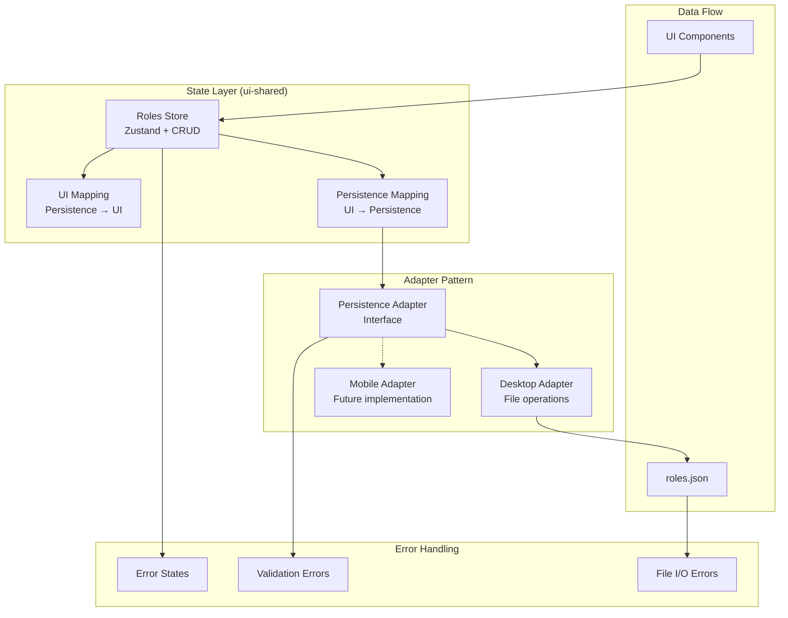

# File Persistence and State Management Epic

## Purpose and Goals

Implement the shared business logic layer for roles management, including state management, data mapping, and the adapter patterns that enable both desktop and mobile platforms to manage roles consistently. This epic provides the core functionality that abstracts away platform-specific persistence details.

## Major Components and Deliverables

### State Management (`packages/ui-shared`)

- **Updated Roles Store**: Replace localStorage with file-based persistence using adapter pattern
- **State Management Logic**: CRUD operations, loading states, error handling following existing settings patterns
- **Store Interface**: Clean API for UI components to interact with roles data

### Data Mapping Layer (`packages/ui-shared`)

- **UI to Persistence Mapping**: Transform UI role models to persistence format
- **Persistence to UI Mapping**: Transform file data to UI-friendly format
- **Null Handling**: Gracefully handle missing timestamps from direct JSON edits
- **Validation Integration**: Connect Zod schemas to store operations

### Business Logic Abstraction

- **Platform Agnostic**: Core logic that works for both desktop and future mobile implementation
- **Adapter Pattern**: Clean interface for platform-specific persistence implementations
- **Error Handling**: Comprehensive error handling for file operations and validation failures

## Detailed Acceptance Criteria

### State Management Requirements

- [ ] **Roles CRUD Operations**: Create, read, update, delete roles through store interface
- [ ] **Loading States**: Proper loading indicators during async operations
- [ ] **Error Handling**: Clear error states with actionable error messages
- [ ] **Auto-save Behavior**: Changes automatically persist without manual save buttons
- [ ] **Optimistic Updates**: UI updates immediately with rollback on errors
- [ ] **State Consistency**: Store state remains consistent across all operations

### Data Mapping Requirements

- [ ] **UI to Persistence Transform**: Role view models properly convert to persistence format
- [ ] **Persistence to UI Transform**: File data correctly maps to UI role models
- [ ] **Timestamp Handling**: Null timestamps handled gracefully, new timestamps generated appropriately
- [ ] **Validation Integration**: All data validates against schemas before persistence
- [ ] **Field Constraints**: Name, description, and system prompt constraints enforced
- [ ] **ID Generation**: Unique IDs generated for new roles

### Business Logic Requirements

- [ ] **Platform Independence**: Logic works without platform-specific dependencies
- [ ] **Clean Interfaces**: Well-defined contracts between store and persistence layers
- [ ] **Error Propagation**: File operation errors properly surface to UI
- [ ] **Concurrent Operations**: Handle multiple simultaneous role operations safely
- [ ] **Data Integrity**: Ensure data consistency during complex operations

## Technical Considerations

### Integration with Existing Patterns

- Follow exact patterns from general/appearance/advanced settings stores
- Use same error handling and loading state patterns
- Maintain consistency with existing Zustand store implementations
- Integrate with existing validation patterns

### Adapter Pattern Implementation

```typescript
interface RolesPersistenceAdapter {
  load(): Promise<PersistedRolesSettingsData>;
  save(data: PersistedRolesSettingsData): Promise<void>;
}
```

### Error Handling Strategy

- File operation errors: Network, permissions, disk space
- Validation errors: Invalid role data, schema violations
- Concurrent operation errors: Race conditions, state conflicts

## Dependencies

- **Prerequisites**: E-data-foundation-and-schema (schemas and types must exist)
- **Dependents**: Desktop Integration epic, UI Components epic

## Estimated Scale

- **Files to Create**: 4-5 new mapping and adapter files
- **Files to Modify**: 1-2 existing store files (major refactor)
- **Files to Delete**: 1 localStorage persistence file
- **Estimated Features**: 4-6 features

## Architecture Diagram



## User Stories

- **As a user**, I want my role changes to save automatically so I don't lose my work
- **As a user**, I want clear error messages when something goes wrong so I can fix issues
- **As a user**, I want the interface to stay responsive during role operations so I can continue working
- **As a developer**, I need clean separation between UI and persistence so I can test components independently
- **As a developer**, I need the same business logic to work on both desktop and mobile platforms

## Non-functional Requirements

### Performance

- Role loading must complete within 100ms for files with up to 100 roles
- Role saving must be non-blocking with proper progress indication
- Store operations must not block UI interactions
- Memory usage should remain constant regardless of number of roles

### Reliability

- Store must handle concurrent operations without data corruption
- All async operations must have proper error handling and recovery
- State must remain consistent even during error conditions
- No data loss during failed save operations

### Maintainability

- Clean separation between UI state management and persistence logic
- Adapter pattern enables easy testing with mock implementations
- Clear error boundaries and error reporting
- Code follows existing store patterns for consistency

## Integration Points

### With Schema Foundation Epic

- Uses Zod schemas for validation
- Imports TypeScript types for all operations
- Relies on schema validation for data integrity

### With Desktop Integration Epic

- Provides adapter interface for desktop file operations
- Defines error handling contracts
- Specifies data format requirements

### With UI Components Epic

- Exposes store interface for component consumption
- Provides loading states and error handling
- Defines role data format for UI

## Success Metrics

- All role CRUD operations work through store interface
- Store maintains consistent state across all operations
- Error conditions properly handled with user-friendly messages
- Loading states provide clear feedback during async operations
- Store performance meets requirements under typical usage
- Business logic can be easily tested in isolation
