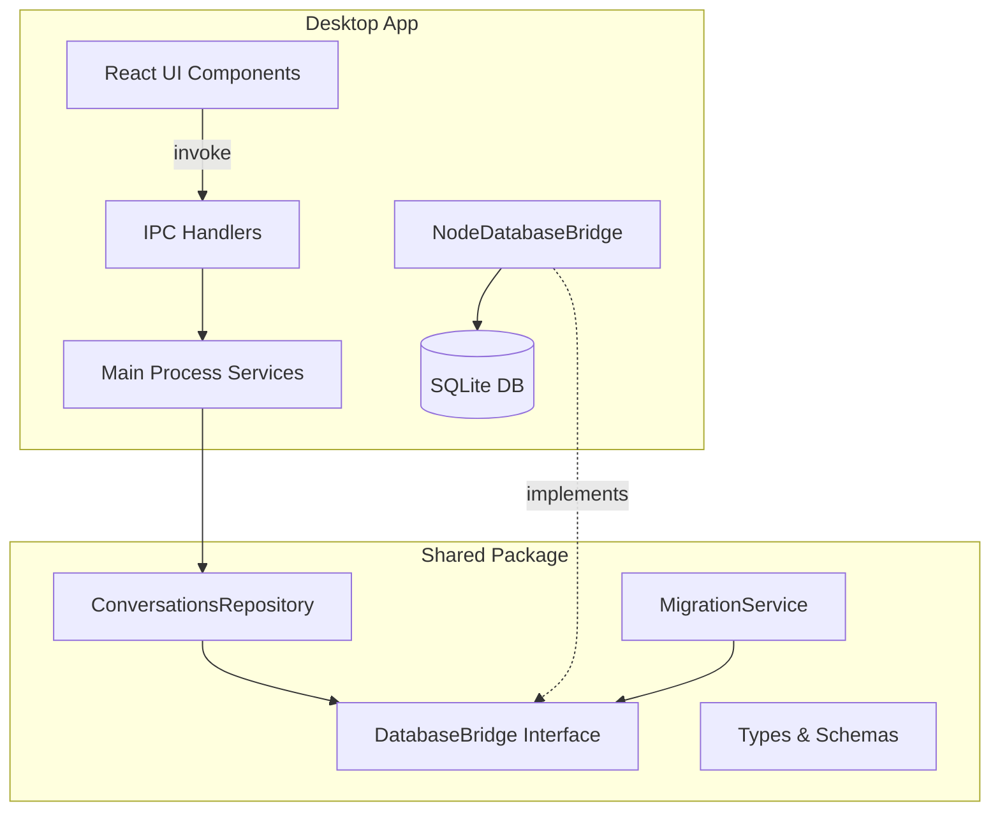

# SQLite Database Integration for Fishbowl Desktop

## Executive Summary

Implement SQLite database persistence for the Fishbowl desktop application to store conversations locally. This project establishes the foundational data layer using a platform bridge pattern that will support both desktop (Electron) and future mobile (React Native) implementations. The initial MVP focuses on creating a minimal conversations table with a simple forward-only migration system.

## Functional Requirements

### Core Database Functionality

- **Local data persistence** using SQLite for storing application data
- **Conversations management** with ability to create, read, update, and delete conversation records
- **Migration system** to manage database schema changes over time
- **Platform abstraction** through bridge pattern for desktop/mobile compatibility

### MVP Scope (Phase 1)

- Single `conversations` table with minimal fields (id, title, created_at, updated_at)
- Create new conversation functionality triggered by UI button
- Forward-only migration system (no rollback capability)
- Desktop-only implementation using better-sqlite3

### Future Expansion (Not in MVP)

- Messages table for storing conversation content
- Agent associations and metadata
- Full CRUD operations for conversations
- Mobile platform support using expo-sqlite

## Technical Requirements

### Technology Stack

- **Desktop Database**: better-sqlite3 (synchronous, performant, TypeScript-friendly)
- **Mobile Database**: expo-sqlite (future implementation)
- **Migration Format**: Numbered SQL files (001_create_conversations.sql, etc.)
- **Database Location**: User data directory (`userData/fishbowl.db`)

### Architecture Overview



### Platform Bridge Pattern

The implementation follows the established pattern in the codebase:

1. **DatabaseBridge Interface** (shared package)
   - Abstract database operations (query, execute, transaction)
   - Migration running capabilities
   - Platform-agnostic API

2. **NodeDatabaseBridge** (desktop implementation)
   - Implements DatabaseBridge using better-sqlite3
   - Runs in Electron main process for security
   - Handles file system operations

3. **Repository Pattern**
   - ConversationsRepository in shared package
   - Business logic independent of platform
   - Uses dependency injection with DatabaseBridge

### Migration System Design

**Simple Forward-Only Approach:**

- SQL files in `/migrations/` directory
- Numbered format: `001_initial_schema.sql`, `002_add_feature.sql`
- Migrations table tracks applied migrations
- Run on application startup
- No rollback capability (intentional simplicity)

**Migration Table Structure:**

```sql
CREATE TABLE IF NOT EXISTS migrations (
    id INTEGER PRIMARY KEY,
    filename TEXT NOT NULL UNIQUE,
    applied_at DATETIME DEFAULT CURRENT_TIMESTAMP
);
```

## Data Model

### Conversations Table (MVP)

```sql
CREATE TABLE conversations (
    id TEXT PRIMARY KEY,  -- UUID
    title TEXT NOT NULL,
    created_at DATETIME DEFAULT CURRENT_TIMESTAMP,
    updated_at DATETIME DEFAULT CURRENT_TIMESTAMP
);
```

### Future Tables (Post-MVP)

- `messages` - Conversation messages with agent associations
- `agents` - Agent configurations used in conversations
- `message_metadata` - Additional message data (reactions, edits, etc.)

## Integration Requirements

### IPC Communication

- New IPC channel: `conversations:create`
- Follow existing IPC handler patterns in the codebase
- Return standardized response format with success/error states

### UI Integration

- Connect "New Conversation" button in Home.tsx
- Use existing button component from shadcn/ui
- Display success/error feedback to user

### Error Handling

- Graceful database initialization failures
- Migration error reporting
- Transaction rollback on errors
- User-friendly error messages

## Acceptance Criteria

### Database Setup

- [ ] Database file created in correct user data directory
- [ ] Database persists between application restarts
- [ ] Migrations run automatically on startup
- [ ] Migration tracking prevents duplicate execution

### Conversation Creation

- [ ] Clicking "New Conversation" creates database record
- [ ] New conversation has unique UUID
- [ ] Title defaults to "New Conversation" or timestamp
- [ ] Created/updated timestamps are set correctly
- [ ] Success feedback shown to user

### Code Quality

- [ ] Follows existing bridge pattern architecture
- [ ] TypeScript types for all database operations
- [ ] Unit tests for repository methods
- [ ] Integration tests for IPC handlers
- [ ] Error scenarios properly handled

### Platform Compatibility

- [ ] DatabaseBridge interface supports future mobile implementation
- [ ] No platform-specific code in shared package
- [ ] Repository logic is platform-agnostic
- [ ] Migration system works across platforms

## Development Phases

### Phase 1: MVP Implementation (Current)

1. Install better-sqlite3 dependency
2. Create DatabaseBridge interface
3. Implement NodeDatabaseBridge for desktop
4. Create migration runner service
5. Add conversations table migration
6. Implement ConversationsRepository
7. Wire up IPC handlers
8. Connect UI button
9. Test implementation

### Phase 2: Extended Functionality (Future)

- Add messages table and relationships
- Implement full CRUD operations
- Add conversation search/filtering
- Include conversation metadata

### Phase 3: Mobile Support (Future)

- Implement ExpoDatabaseBridge
- Test migration compatibility
- Ensure data sync capabilities

## Success Metrics

- Database operations complete in <100ms
- Zero data loss between sessions
- Migrations execute successfully on first run
- Clean separation between platform and business logic
- All tests passing (unit and integration)

## Constraints and Considerations

### Performance

- Keep JSON conversation data under 10MB per record (future consideration)
- Index frequently queried fields
- Use transactions for multi-step operations

### Security

- Database runs in main process only (not renderer)
- Validate all input from renderer process
- Use parameterized queries to prevent SQL injection

### Maintainability

- Simple migration system (50-100 lines of code)
- Clear separation of concerns
- Well-documented interfaces
- Follow existing code patterns in the repository
