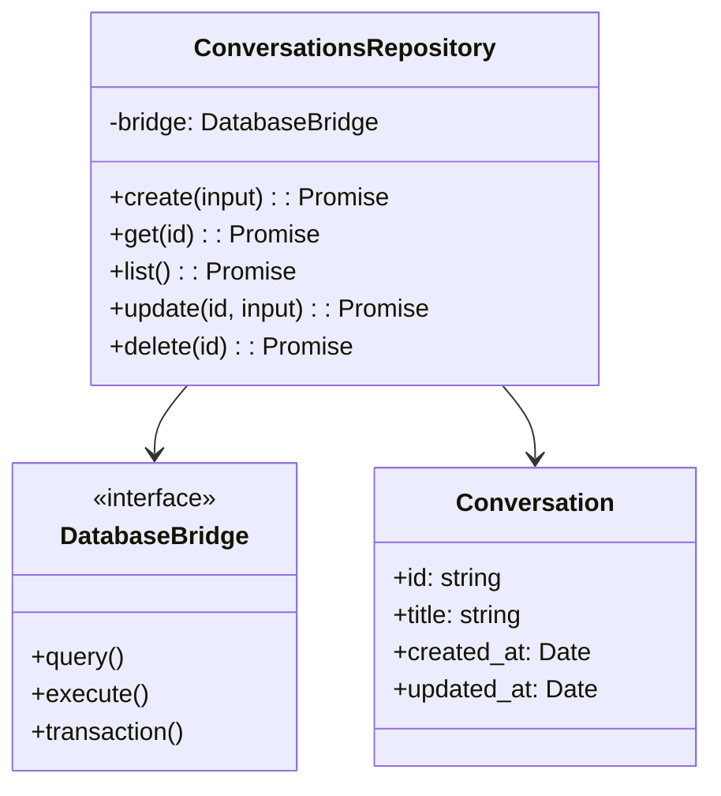

# Conversations Repository Layer

## Purpose and Goals

Implement the business logic layer for managing conversations through a repository pattern. This epic delivers a platform-agnostic ConversationsRepository that handles all conversation-related database operations using the DatabaseBridge interface, maintaining clean separation between business logic and database implementation.

## Major Components and Deliverables

### 1. Conversation Types and Schemas

- TypeScript interfaces for Conversation entity
- Zod schemas for validation
- Type definitions for create/update operations

### 2. ConversationsRepository Implementation

- CRUD operations for conversations
- Business logic validation
- UUID generation for conversation IDs
- Timestamp management

### 3. Repository Integration

- Dependency injection with DatabaseBridge
- Service registration in main process
- Error handling and validation

## Detailed Acceptance Criteria

### Type Definitions

- [ ] Conversation interface with id, title, created_at, updated_at
- [ ] CreateConversationInput type for new conversations
- [ ] UpdateConversationInput type for updates
- [ ] ConversationResult type with success/error states

### Repository Implementation

- [ ] ConversationsRepository class in shared package
- [ ] Constructor accepts DatabaseBridge dependency
- [ ] create() method generates UUID and timestamps
- [ ] get() method retrieves by ID
- [ ] list() method returns all conversations
- [ ] update() method updates title and updated_at
- [ ] delete() method removes conversation

### Business Logic

- [ ] Auto-generate UUID v4 for new conversations
- [ ] Default title to "New Conversation" if not provided
- [ ] Validate title length (max 255 characters)
- [ ] Auto-update updated_at timestamp
- [ ] Prevent duplicate conversation IDs

### Error Handling

- [ ] Custom ConversationNotFoundError
- [ ] Validation errors for invalid input
- [ ] Database error wrapping
- [ ] Meaningful error messages

### Testing Requirements

- [ ] Unit tests for all repository methods
- [ ] Test UUID generation
- [ ] Test timestamp updates
- [ ] Test validation logic
- [ ] Mock DatabaseBridge for testing
- [ ] Test error scenarios

## Technical Considerations

### Repository Architecture

### Data Flow

1. Repository receives business operation request
2. Validates input using Zod schemas
3. Transforms to SQL operations
4. Executes via DatabaseBridge
5. Maps results to domain objects
6. Returns typed results

### Key Design Decisions

- Repository in shared package (platform-agnostic)
- UUID v4 for conversation IDs
- Zod for runtime validation
- Simple CRUD operations for MVP

## Dependencies on Other Epics

- Requires E-database-infrastructure-setup for DatabaseBridge

## Scale Estimation

- Approximately 2-3 features
- 8-10 individual tasks
- Core business logic work

## User Stories

- As a user, I need to create new conversations so I can start chatting
- As a user, I need to see all my conversations so I can continue previous chats
- As a developer, I need a clean repository API so I can manage conversations consistently

## Non-functional Requirements

- Repository operations complete in <100ms
- Support for 10,000+ conversations
- Type-safe operations with full TypeScript support
- Consistent error handling across all methods
