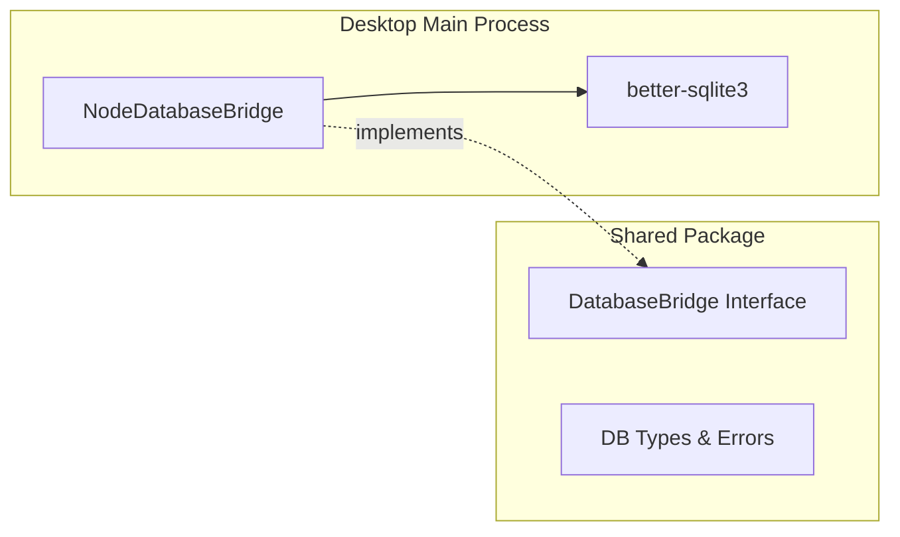

# Database Infrastructure Setup

## Purpose and Goals

Establish the core database infrastructure for the Fishbowl desktop application using SQLite and the platform bridge pattern. This epic creates the foundational abstraction layer that enables database operations while maintaining clean separation between platform-specific implementations and shared business logic.

## Major Components and Deliverables

### 1. DatabaseBridge Interface (Shared Package)

- Define platform-agnostic database operations interface
- Core methods: query, execute, transaction, batch operations
- Type definitions for database results and errors
- Connection management interface

### 2. NodeDatabaseBridge Implementation (Desktop)

- Concrete implementation using better-sqlite3
- Lives in `apps/desktop/src/main/services/`
- Handles SQLite connection and operations
- Implements all DatabaseBridge methods

### 3. Database Service Initialization

- Database file creation in user data directory
- Connection pooling/management
- Startup initialization in main process
- Error recovery mechanisms

## Detailed Acceptance Criteria

### Interface Design

- [ ] DatabaseBridge interface defined in `packages/shared/src/services/database/`
- [ ] TypeScript types for all database operations
- [ ] Generic query result types supporting type safety
- [ ] Error types for common database failures

### Desktop Implementation

- [ ] NodeDatabaseBridge implements all interface methods
- [ ] better-sqlite3 dependency installed and configured
- [ ] Database file created at `userData/fishbowl.db`
- [ ] Synchronous operations using better-sqlite3 API
- [ ] Parameterized query support to prevent SQL injection

### Connection Management

- [ ] Database opens on app startup
- [ ] Graceful handling of file permissions issues
- [ ] Database closes properly on app shutdown
- [ ] Connection state tracking

### Error Handling

- [ ] Custom error types for database operations
- [ ] Meaningful error messages for debugging
- [ ] Recovery from transient failures
- [ ] Logging of database errors

### Testing Requirements

- [ ] Unit tests for DatabaseBridge interface compliance
- [ ] Unit tests for NodeDatabaseBridge methods
- [ ] Mock database for testing repositories
- [ ] Test coverage > 80% for new code

## Technical Considerations

### Architecture Pattern

### Key Design Decisions

- Use synchronous better-sqlite3 API for simplicity
- Single database file for all application data
- Main process only (no renderer access)
- Follow existing FileSystemBridge pattern

### Dependencies

- better-sqlite3: ^11.x
- TypeScript types for better-sqlite3

## Scale Estimation

- Approximately 3-4 features
- 8-10 individual tasks
- Core infrastructure work

## User Stories

- As a developer, I need a clean database abstraction so I can write platform-agnostic business logic
- As the application, I need reliable database initialization so data persists between sessions
- As a developer, I need proper TypeScript types so I can write type-safe database code

## Non-functional Requirements

- Database operations complete in <50ms for simple queries
- Support for concurrent read operations
- Graceful degradation if database is corrupted
- Clear error messages for debugging
