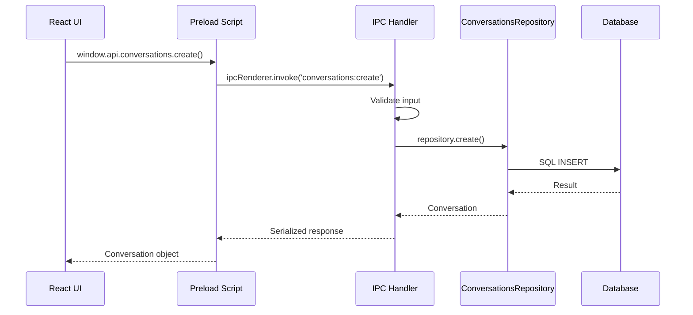

# IPC Communication Layer

## Purpose and Goals

Establish secure inter-process communication between the Electron renderer process and main process for conversation operations. This epic implements IPC handlers following existing patterns in the codebase, enabling the UI to interact with the database layer while maintaining security boundaries.

## Major Components and Deliverables

### 1. IPC Handler Implementation

- Conversation IPC handlers in main process
- Channel definitions and constants
- Request/response type definitions
- Error serialization

### 2. Preload Script Updates

- Expose conversation API to renderer
- Type-safe IPC methods
- Context bridge configuration

### 3. Renderer Hooks

- React hooks for conversation operations
- Error handling and retry logic
- Loading states management

## Detailed Acceptance Criteria

### IPC Handlers

- [ ] conversationsHandlers.ts following existing pattern
- [ ] Handler for conversations:create channel
- [ ] Handler for conversations:list channel
- [ ] Handler for conversations:get channel
- [ ] Validate all input from renderer
- [ ] Sanitize responses to renderer

### Channel Definitions

- [ ] CONVERSATION_CHANNELS constant object
- [ ] Type definitions for each channel
- [ ] Request/response interfaces
- [ ] Error response format

### Preload API

- [ ] Add conversations object to window.api
- [ ] create() method returns Promise
- [ ] list() method returns Promise
- [ ] get(id) method returns Promise
- [ ] Type definitions exported

### Security

- [ ] Input validation in handlers
- [ ] No direct SQL from renderer
- [ ] Sanitized error messages
- [ ] Rate limiting consideration

### Error Handling

- [ ] Serialize errors for IPC transport
- [ ] Preserve error types across IPC
- [ ] User-friendly error messages
- [ ] Logging in main process

### Testing Requirements

- [ ] Unit tests for IPC handlers
- [ ] Test input validation
- [ ] Test error serialization
- [ ] Mock IPC for testing
- [ ] Test security boundaries

## Technical Considerations

### IPC Architecture



### Channel Structure

```typescript
const CONVERSATION_CHANNELS = {
  CREATE: "conversations:create",
  LIST: "conversations:list",
  GET: "conversations:get",
  UPDATE: "conversations:update",
  DELETE: "conversations:delete",
} as const;
```

### Error Response Format

```typescript
interface IPCErrorResponse {
  success: false;
  error: {
    code: string;
    message: string;
    details?: unknown;
  };
}
```

### Key Design Decisions

- Follow existing IPC patterns in codebase
- Async/await with ipcRenderer.invoke
- Standardized response format
- Comprehensive input validation

## Dependencies on Other Epics

- Requires E-conversations-repository-layer for repository
- Requires E-migration-system-implementatio for database setup

## Scale Estimation

- Approximately 3-4 features
- 10-12 individual tasks
- Integration work

## User Stories

- As the UI, I need to communicate with the database layer securely
- As a developer, I need type-safe IPC methods for conversations
- As the application, I need validated inputs from the renderer process

## Non-functional Requirements

- IPC round-trip <50ms for simple operations
- Graceful handling of main process errors
- Type safety across process boundary
- Consistent with existing IPC patterns
