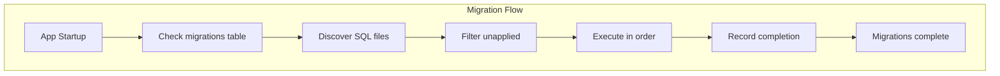

# Migration System Implementation

## Purpose and Goals

Implement a simple, forward-only migration system to manage database schema changes over time. This epic delivers a lightweight migration runner that executes SQL files in sequence, tracking which migrations have been applied to prevent duplicate execution.

## Major Components and Deliverables

### 1. Migration Service (Shared Package)

- Migration runner logic using DatabaseBridge
- Migration file discovery and ordering
- Applied migration tracking
- Schema version management

### 2. Migration File Structure

- SQL migration files in `/migrations/` directory
- Numbered naming convention (001_name.sql)
- Initial conversations table migration

### 3. Migration Execution

- Automatic migration on app startup
- Transaction-wrapped migration execution
- Progress tracking and logging

## Detailed Acceptance Criteria

### Migration Service

- [ ] MigrationService class in shared package
- [ ] Uses DatabaseBridge for database operations
- [ ] Discovers migration files from specified directory
- [ ] Sorts migrations by numeric prefix
- [ ] Tracks applied migrations in database

### Migration Tracking

- [ ] Creates `migrations` table automatically
- [ ] Records filename and timestamp for each migration
- [ ] Prevents duplicate migration execution
- [ ] Queries for pending migrations

### Migration Execution

- [ ] Runs migrations in numeric order
- [ ] Each migration wrapped in transaction
- [ ] Rolls back on migration failure
- [ ] Continues from last successful migration

### Initial Migration

- [ ] 001_create_conversations.sql file created
- [ ] Creates conversations table with correct schema
- [ ] Includes proper indexes
- [ ] Sets up triggers for updated_at timestamp

### Error Handling

- [ ] Clear error messages for migration failures
- [ ] Logs which migration failed
- [ ] Prevents app startup on critical migration failure
- [ ] Recovery instructions in error messages

### Testing Requirements

- [ ] Unit tests for migration discovery
- [ ] Unit tests for migration ordering
- [ ] Unit tests for tracking logic
- [ ] Test migrations with mock database
- [ ] Test failure scenarios

## Technical Considerations

### Migration System Architecture



### Migration Table Schema

```sql
CREATE TABLE IF NOT EXISTS migrations (
    id INTEGER PRIMARY KEY AUTOINCREMENT,
    filename TEXT NOT NULL UNIQUE,
    checksum TEXT,
    applied_at DATETIME DEFAULT CURRENT_TIMESTAMP
);
```

### File Naming Convention

- Format: `XXX_description.sql`
- XXX: Three-digit number (001, 002, etc.)
- Example: `001_create_conversations.sql`

### Key Design Decisions

- Forward-only migrations (no rollback)
- Simple numeric ordering
- Transaction per migration
- 50-100 lines of code total

## Dependencies on Other Epics

- Requires E-database-infrastructure-setup for DatabaseBridge

## Scale Estimation

- Approximately 2-3 features
- 6-8 individual tasks
- Focused scope

## User Stories

- As a developer, I need automatic schema updates so the database evolves with the application
- As the application, I need migration tracking so I don't run migrations twice
- As a developer, I need clear migration errors so I can debug schema issues

## Non-functional Requirements

- Migrations complete within 5 seconds on startup
- Support for 100+ migration files
- Atomic migration execution (all or nothing)
- Clear logging of migration progress
