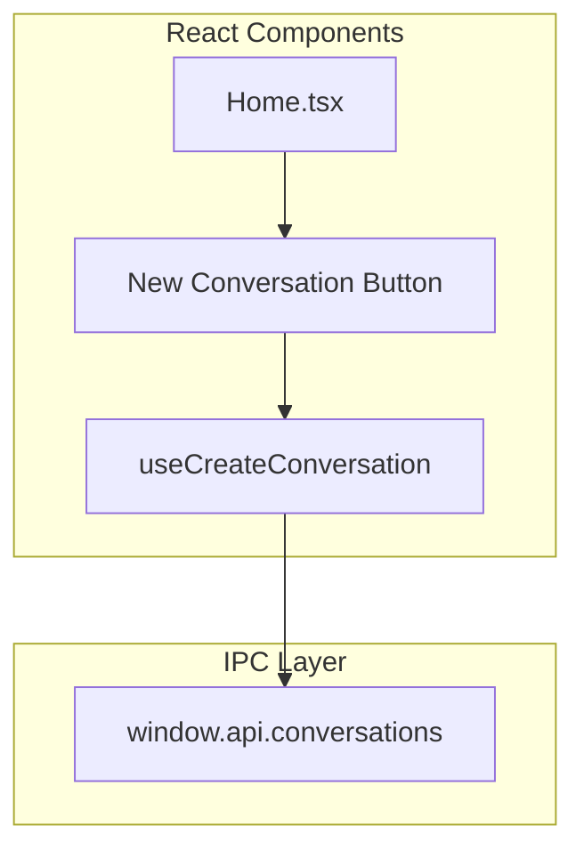

# UI Integration

## Purpose and Goals

Connect the user interface to the conversation database functionality, implementing the "New Conversation" button and related UI feedback. This epic delivers the visible user-facing features that allow users to create and manage conversations through the desktop application interface.

## Major Components and Deliverables

### 1. New Conversation Button

- Button component in Home.tsx
- Click handler implementation
- Loading and disabled states
- Success/error feedback

### 2. React Hooks

- useCreateConversation hook
- Error handling and retry
- Optimistic updates
- State management

### 3. User Feedback

- Success notifications
- Error messages
- Loading indicators
- Transition animations

## Detailed Acceptance Criteria

### Button Implementation

- [ ] "New Conversation" button added to Home.tsx
- [ ] Uses existing shadcn/ui Button component
- [ ] Positioned appropriately in layout
- [ ] Disabled during creation process
- [ ] Accessible keyboard shortcuts

### Hook Implementation

- [ ] useCreateConversation custom hook
- [ ] Calls window.api.conversations.create()
- [ ] Returns loading, error, and data states
- [ ] Handles async operation properly
- [ ] Memoizes callbacks appropriately

### User Feedback

- [ ] Loading spinner during creation
- [ ] Success toast/notification on completion
- [ ] Error message display on failure
- [ ] Retry option on error
- [ ] Clear visual state changes

### State Management

- [ ] Button disabled while creating
- [ ] Prevents double-clicks
- [ ] Updates conversation list on success
- [ ] Maintains UI consistency

### Error Handling

- [ ] Display user-friendly error messages
- [ ] Log detailed errors for debugging
- [ ] Provide actionable error feedback
- [ ] Graceful degradation

### Testing Requirements

- [ ] Unit tests for React hooks
- [ ] Test button click handling
- [ ] Test loading states
- [ ] Test error scenarios
- [ ] Mock window.api for testing

## Technical Considerations

### Component Architecture



### Hook Implementation Pattern

```typescript
function useCreateConversation() {
  const [loading, setLoading] = useState(false);
  const [error, setError] = useState(null);

  const createConversation = useCallback(async () => {
    setLoading(true);
    setError(null);
    try {
      const result = await window.api.conversations.create();
      // Handle success
      return result;
    } catch (err) {
      setError(err);
    } finally {
      setLoading(false);
    }
  }, []);

  return { createConversation, loading, error };
}
```

### UI States

1. **Idle**: Button enabled, ready for click
2. **Loading**: Button disabled, spinner shown
3. **Success**: Brief success indicator, return to idle
4. **Error**: Error message shown, retry available

### Key Design Decisions

- Use existing UI components (shadcn/ui)
- Follow existing React patterns
- Simple user feedback mechanisms
- No complex state management (MVP)

## Dependencies on Other Epics

- Requires E-ipc-communication-layer for API access
- All database infrastructure must be complete

## Scale Estimation

- Approximately 2 features
- 5-6 individual tasks
- UI implementation work

## User Stories

- As a user, I want to create a new conversation with one click
- As a user, I need to know when conversation creation succeeds or fails
- As a user, I want responsive feedback during the creation process

## Non-functional Requirements

- Button response within 100ms of click
- Clear visual feedback for all states
- Accessible to keyboard users
- Consistent with application design system
