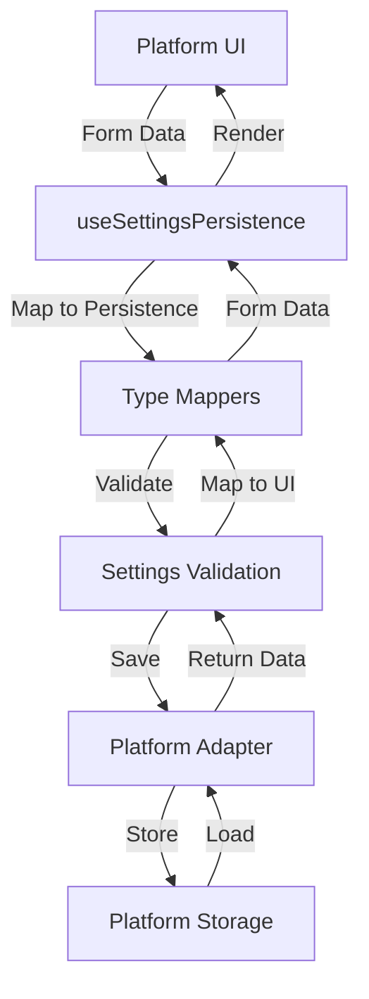

# Settings Integration Guide

This guide explains how to integrate the settings persistence system into your platform application.

## Overview

The settings system provides atomic save/load operations for all application settings through a unified API. Platform applications implement a storage adapter while the shared hooks handle validation, mapping, and error handling.

The system follows a three-layer architecture:

- **Platform Layer**: Desktop/mobile apps with UI components
- **UI-Shared Layer**: Cross-platform hooks, mapping, and interfaces
- **Shared Layer**: Business logic and persistence types

## Quick Start

### 1. Implement the Storage Adapter

```typescript
import { SettingsPersistenceAdapter } from "@fishbowl-ai/ui-shared";

const desktopAdapter: SettingsPersistenceAdapter = {
  async save(settings) {
    // Platform-specific save logic
    // Example: write to file system, secure storage, etc.
    await writeSettingsToFile(settings);
  },
  async load() {
    // Platform-specific load logic
    // Example: read from file system, secure storage, etc.
    return await readSettingsFromFile();
  },
  async reset() {
    // Platform-specific reset logic
    // Example: delete settings file, clear storage, etc.
    await deleteSettingsFile();
  },
};
```

### 2. Use the Settings Hook

```typescript
import { useSettingsPersistence } from "@fishbowl-ai/ui-shared";

function SettingsPage() {
  const { settings, isLoading, error, saveSettings, resetSettings } =
    useSettingsPersistence({
      adapter: desktopAdapter,
      onError: (error) => console.error("Settings error:", error),
    });

  const handleSave = async (formData) => {
    try {
      await saveSettings(formData);
      // Settings saved successfully
    } catch (error) {
      // Handle save error
    }
  };

  if (isLoading) return <div>Loading settings...</div>;
  if (error) return <div>Error: {error.message}</div>;

  // Use settings in your UI
  return <SettingsForm initialValues={settings} onSave={handleSave} />;
}
```

## Architecture

### Data Flow



### Type System

The system uses separate type definitions for UI and persistence:

- **UI Types**: Optimized for form components and user interaction
- **Persistence Types**: Optimized for storage and serialization
- **Mappers**: Handle bidirectional conversion between type systems

```typescript
// UI Types (from ui-shared)
interface GeneralSettingsFormData {
  responseDelay: number; // UI slider value (0-10)
  maxMessages: number; // UI input value
  checkForUpdates: boolean; // UI checkbox
}

// Persistence Types (from shared)
interface GeneralSettingsPersisted {
  responseDelayMs: number; // Stored in milliseconds
  maxMessages: number; // Same as UI
  checkForUpdates: boolean; // Same as UI
}
```

## API Reference

### Hooks

#### useSettingsPersistence

Main hook for atomic settings operations.

```typescript
function useSettingsPersistence(
  options: UseSettingsPersistenceOptions,
): UseSettingsPersistenceReturn;
```

**Options:**

- `adapter: SettingsPersistenceAdapter` - Platform-specific storage implementation
- `onError?: (error: SettingsError) => void` - Optional error handler

**Returns:**

- `settings: SettingsFormData | null` - Current settings or null if not loaded
- `isLoading: boolean` - Loading state for async operations
- `error: SettingsError | null` - Current error state
- `saveSettings: (settings: SettingsFormData) => Promise<void>` - Save all settings atomically
- `loadSettings: () => Promise<void>` - Load all settings from storage
- `resetSettings: () => Promise<void>` - Reset to default values

#### useSettingsMapper

Hook providing bidirectional mapping functions.

```typescript
function useSettingsMapper(): UseSettingsMapperReturn;
```

**Returns:**

- `mapToPersistence: (ui: SettingsFormData) => PersistedSettingsData` - Convert UI to persistence format
- `mapToUI: (persisted: PersistedSettingsData) => SettingsFormData` - Convert persistence to UI format

#### useSettingsValidation

Hook for complete settings validation.

```typescript
function useSettingsValidation(): UseSettingsValidationReturn;
```

**Returns:**

- `validateSettings: (settings: SettingsFormData) => SettingsValidationResult` - Validate complete settings object
- `hasErrors: (result: SettingsValidationResult) => boolean` - Check if validation has errors

### Interfaces

#### SettingsPersistenceAdapter

Interface that platform applications must implement.

```typescript
interface SettingsPersistenceAdapter {
  save(settings: PersistedSettingsData): Promise<void>;
  load(): Promise<PersistedSettingsData>;
  reset(): Promise<void>;
}
```

#### SettingsPersistenceConfig

Configuration for persistence behavior.

```typescript
interface SettingsPersistenceConfig {
  autoSave?: boolean;
  saveDelay?: number;
  retryAttempts?: number;
}
```

### Error Types

#### SettingsError

Main error type for settings operations.

```typescript
class SettingsError extends Error {
  code: SettingsErrorCode;
  context?: Record<string, unknown>;
}
```

#### SettingsErrorCode

Enumeration of possible error codes:

- `PERSISTENCE_ERROR` - Storage operation failed
- `VALIDATION_ERROR` - Settings validation failed
- `MAPPING_ERROR` - Type conversion failed
- `ADAPTER_ERROR` - Platform adapter error

## Error Handling

### Error Types and Recovery

```typescript
const { error } = useSettingsPersistence({
  adapter: myAdapter,
  onError: (error) => {
    switch (error.code) {
      case SettingsErrorCode.PERSISTENCE_ERROR:
        // Storage failed - show retry option
        showRetryToast();
        break;
      case SettingsErrorCode.VALIDATION_ERROR:
        // Invalid data - show validation errors
        showValidationErrors(error.context);
        break;
      case SettingsErrorCode.MAPPING_ERROR:
        // Type conversion failed - log and use defaults
        console.error("Mapping error:", error);
        useDefaultSettings();
        break;
      default:
        // Unknown error - show generic message
        showErrorToast("Settings operation failed");
    }
  },
});
```

### Error Transformation

The system provides utilities to transform low-level errors into user-friendly messages:

```typescript
import {
  transformPersistenceError,
  transformValidationError,
} from "@fishbowl-ai/ui-shared";

// Transform file system errors
const userError = transformPersistenceError(fsError);

// Transform Zod validation errors
const userError = transformValidationError(zodError);
```

## Examples

### Desktop Implementation

```typescript
// Desktop adapter using Electron
import { app } from "electron";
import { promises as fs } from "fs";
import { join } from "path";

const desktopAdapter: SettingsPersistenceAdapter = {
  async save(settings) {
    const userDataPath = app.getPath("userData");
    const settingsPath = join(userDataPath, "preferences.json");
    await fs.writeFile(settingsPath, JSON.stringify(settings, null, 2));
  },

  async load() {
    const userDataPath = app.getPath("userData");
    const settingsPath = join(userDataPath, "preferences.json");

    try {
      const data = await fs.readFile(settingsPath, "utf-8");
      return JSON.parse(data);
    } catch (error) {
      if (error.code === "ENOENT") {
        // File doesn't exist, return defaults
        return getDefaultSettings();
      }
      throw error;
    }
  },

  async reset() {
    const userDataPath = app.getPath("userData");
    const settingsPath = join(userDataPath, "preferences.json");
    await fs.unlink(settingsPath).catch(() => {
      // File might not exist, ignore error
    });
  },
};
```

### React Component Integration

```typescript
import React from 'react';
import { useSettingsPersistence } from '@fishbowl-ai/ui-shared';

function SettingsModal({ isOpen, onClose }) {
  const {
    settings,
    isLoading,
    error,
    saveSettings
  } = useSettingsPersistence({
    adapter: desktopAdapter,
    onError: (error) => {
      toast.error(`Settings error: ${error.message}`);
    },
  });

  const handleSubmit = async (formData) => {
    try {
      await saveSettings(formData);
      toast.success('Settings saved successfully');
      onClose();
    } catch (error) {
      // Error already handled by onError callback
    }
  };

  if (!isOpen) return null;

  return (
    <Modal>
      <SettingsForm
        initialValues={settings}
        isLoading={isLoading}
        error={error}
        onSubmit={handleSubmit}
        onCancel={onClose}
      />
    </Modal>
  );
}
```

### Validation Integration

```typescript
import { useSettingsValidation } from '@fishbowl-ai/ui-shared';

function SettingsForm({ initialValues, onSubmit }) {
  const { validateSettings, hasErrors } = useSettingsValidation();
  const [formData, setFormData] = useState(initialValues);
  const [validationResult, setValidationResult] = useState(null);

  const handleSubmit = async (e) => {
    e.preventDefault();

    // Validate before submission
    const result = validateSettings(formData);
    setValidationResult(result);

    if (!hasErrors(result)) {
      await onSubmit(formData);
    }
  };

  return (
    <form onSubmit={handleSubmit}>
      {/* Form fields with validation errors */}
      {validationResult?.general?.responseDelay && (
        <span className="error">
          {validationResult.general.responseDelay}
        </span>
      )}

      <button type="submit">Save Settings</button>
    </form>
  );
}
```

## Testing Recommendations

### Unit Testing

Test your adapter implementation:

```typescript
import { describe, it, expect, beforeEach } from "vitest";

describe("DesktopSettingsAdapter", () => {
  let adapter: SettingsPersistenceAdapter;

  beforeEach(() => {
    adapter = createDesktopAdapter();
  });

  it("should save and load settings", async () => {
    const testSettings = createTestSettings();

    await adapter.save(testSettings);
    const loaded = await adapter.load();

    expect(loaded).toEqual(testSettings);
  });

  it("should handle missing settings file", async () => {
    // Ensure no settings file exists
    await adapter.reset();

    const settings = await adapter.load();

    // Should return defaults, not throw
    expect(settings).toBeDefined();
  });
});
```

### Integration Testing

Test the complete flow:

```typescript
import { renderHook, act } from "@testing-library/react";
import { useSettingsPersistence } from "@fishbowl-ai/ui-shared";

it("should persist settings through complete cycle", async () => {
  const mockAdapter = createMockAdapter();

  const { result } = renderHook(() =>
    useSettingsPersistence({ adapter: mockAdapter }),
  );

  // Save settings
  await act(async () => {
    await result.current.saveSettings(testSettings);
  });

  // Load settings
  await act(async () => {
    await result.current.loadSettings();
  });

  expect(result.current.settings).toEqual(testSettings);
});
```

## Performance Considerations

### Optimization Strategies

1. **Debounced Saves**: Avoid saving on every form field change
2. **Memoization**: The hooks use React.useMemo and useCallback internally
3. **Batch Operations**: All settings are saved/loaded atomically
4. **Error Recovery**: Failed operations don't corrupt existing settings

### Memory Usage

- Settings data is kept in memory while the hook is mounted
- Large settings objects should be paginated or split
- Use React.memo for settings form components to prevent unnecessary re-renders

### Storage Considerations

```typescript
// Good: Atomic operations
await saveSettings(allSettings);

// Bad: Multiple separate saves
await saveGeneralSettings(settings.general);
await saveAppearanceSettings(settings.appearance);
await saveAdvancedSettings(settings.advanced);
```

## Migration Guide

### Upgrading from Previous Versions

If migrating from a custom settings implementation:

1. **Implement the adapter interface** for your platform
2. **Replace direct storage calls** with the settings hooks
3. **Update type definitions** to match the new type system
4. **Add error handling** for the new error types

### Breaking Changes

Version 2.0 introduces:

- Atomic operations only (no partial saves/loads)
- New error handling system
- Separate UI and persistence types
- Required adapter implementation

## Troubleshooting

### Common Issues

**Settings not persisting:**

- Check that `saveSettings` is awaited
- Verify adapter implementation
- Check file permissions (desktop)

**Type errors:**

- Ensure shared packages are built: `pnpm build:libs`
- Check import paths
- Verify adapter interface implementation

**Validation errors:**

- Check that all required fields are provided
- Verify data types match expected formats
- Review error messages in validation result

**Performance issues:**

- Use debounced save operations
- Implement React.memo for form components
- Check for unnecessary re-renders

### Debug Mode

Enable debug logging:

```typescript
const { settings } = useSettingsPersistence({
  adapter: myAdapter,
  onError: (error) => {
    console.error("Settings error:", error);
    console.log("Error context:", error.context);
  },
});
```

## Contributing

When adding new settings:

1. Add types to both UI and persistence type definitions
2. Update mappers to handle the new fields
3. Add validation rules
4. Update documentation
5. Write tests for the new functionality

## License

This settings system is part of the Fishbowl project and follows the same license terms.
