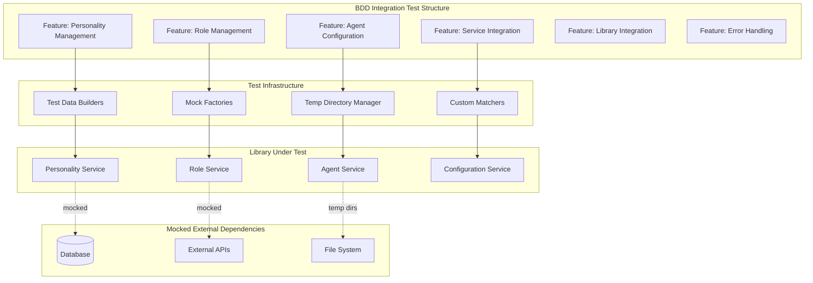
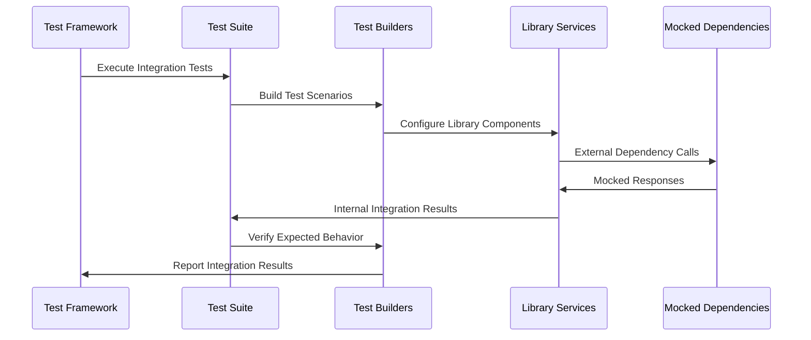

# BDD Testing Infrastructure Epic

## Purpose and Goals

Establish a comprehensive BDD (Behavior-Driven Development) testing foundation for the Agent Configuration and Management System using Jest integration tests. This epic implements the complete test suite structure with all tests initially skipped (`it.skip`), defining the expected behavior and acceptance criteria for all system components before any implementation begins.

**Integration Definition**: These tests verify integration between internal library components (services, models, utilities) while mocking external dependencies (databases, APIs, external file systems). File operations may use temporary directories for test isolation.

## Major Components and Deliverables

### Integration Test Suite Structure

- **Personality Management Tests**: CRUD operations, validation, and business logic integration
- **Role Management Tests**: Predefined and custom role management with service integration
- **Agent Configuration Tests**: Complex composition with cross-service references and validation
- **Configuration Service Tests**: Multi-service coordination and internal file operations
- **Library Integration Tests**: Component interaction and error propagation

### BDD Test Organization

```
packages/shared/src/__tests__/integration/
├── features/
│   ├── personality-management/
│   │   ├── personality-management-crud.integration.spec.ts
│   │   ├── personality-management-validation.integration.spec.ts
│   │   └── personality-management-templates.integration.spec.ts
│   ├── role-management/
│   │   ├── role-management-predefined.integration.spec.ts
│   │   ├── role-management-custom.integration.spec.ts
│   │   └── role-management-validation.integration.spec.ts
│   ├── agent-configuration/
│   │   ├── agent-configuration-creation.integration.spec.ts
│   │   ├── agent-configuration-references.integration.spec.ts
│   │   └── agent-configuration-model-config.integration.spec.ts
│   ├── configuration-service-integration/
│   │   ├── cross-service-crud.integration.spec.ts
│   │   ├── configuration-file-operations.integration.spec.ts
│   │   └── service-coordination.integration.spec.ts
│   ├── library-integration/
│   │   ├── component-interaction.integration.spec.ts
│   │   ├── error-propagation.integration.spec.ts
│   │   └── library-initialization.integration.spec.ts
│   └── error-handling/
│       ├── validation-errors.integration.spec.ts
│       ├── reference-errors.integration.spec.ts
│       └── configuration-errors.integration.spec.ts
├── support/
│   ├── test-helpers.ts
│   ├── test-data-builders.ts
│   ├── mock-factories.ts
│   ├── temp-directory-manager.ts
│   └── custom-matchers.ts
└── fixtures/
    ├── personality-examples.json
    ├── role-examples.json
    └── agent-examples.json
```

## Detailed Acceptance Criteria

### AC-1: Test Structure & Organization

**AC-1.1: Feature-Based Test Organization**

- Given: A comprehensive Agent Configuration library specification
- When: Integration tests are organized by business features
- Then:
  - Each feature has its own directory with focused test files
  - Test files follow naming: `feature-capability.integration.spec.ts`
  - Tests are organized by business capability, not technical layers
  - File names clearly indicate the feature and capability being tested

**AC-1.2: BDD Pattern Implementation**

- Given: Jest integration test framework
- When: All tests follow BDD structure with describe/it blocks
- Then:
  - Feature level: `describe('Feature: [Feature Name]', () => {})`
  - Scenario level: `describe('Scenario: [Scenario Description]', () => {})`
  - Test level: `it.skip('should [expected behavior]', async () => {})`
  - Each test has clear Given-When-Then comments within the test body

### AC-2: Test Coverage & Scenarios

**AC-2.1: Personality Management Integration Coverage**

- Given: Big Five personality model with 14 behavioral traits
- When: Personality integration tests are written
- Then:
  - All CRUD operations are tested through service layer integration
  - Validation scenarios test business rule enforcement across components
  - Template personality loading integrates file operations with validation
  - Custom personality creation tests cross-component data flow

**AC-2.2: Role Management Integration Coverage**

- Given: 10 predefined roles and custom role capability
- When: Role integration tests are written
- Then:
  - Predefined role loading integrates file operations with immutability rules
  - Custom role CRUD operations test service layer coordination
  - Role validation integrates business rules with data persistence
  - Template vs custom role differentiation tests component interaction

**AC-2.3: Agent Configuration Integration Coverage**

- Given: Agents combining personality, role, and model configuration
- When: Agent integration tests are written
- Then:
  - Agent creation tests cross-service reference validation
  - Configuration composition tests multi-service coordination
  - Model parameter validation integrates with configuration services
  - Agent template functionality tests end-to-end library workflows

**AC-2.4: Error Handling Integration Coverage**

- Given: Complex cross-component error scenarios
- When: Error handling integration tests are written
- Then:
  - Invalid reference errors test cross-service validation
  - Configuration validation errors test business rule enforcement
  - File operation errors test graceful degradation
  - Error propagation tests maintain context across components

### AC-3: Infrastructure & Tooling

**AC-3.1: Test Support Infrastructure**

- Given: Complex library component integration requirements
- When: Test support utilities are implemented
- Then:
  - Test data builders generate realistic configuration objects with fluent API
  - Mock factories provide consistent external dependency mocking
  - Temporary directory manager handles file operation test isolation
  - Custom Jest matchers simplify configuration and error assertions

**AC-3.2: Test Data Management**

- Given: Need for consistent test data across integration scenarios
- When: Test fixtures and builders are created
- Then:
  - JSON fixtures provide realistic example configurations
  - Builder pattern enables complex test scenario construction
  - Test isolation prevents data leakage between integration tests
  - Cleanup mechanisms reset library state between test runs

**AC-3.3: Mock Strategy Implementation**

- Given: External dependencies that must be isolated
- When: Mocking strategy is implemented
- Then:
  - Database operations are mocked at the data layer
  - External API calls are intercepted and mocked
  - File system operations use temporary directories where needed
  - Network requests are completely mocked out

### AC-4: Integration & Cross-Service Testing

**AC-4.1: Internal Service Integration**

- Given: Multiple configuration services that coordinate
- When: Cross-service integration tests are written
- Then:
  - Agent creation with personality/role dependencies tests service coordination
  - Configuration consistency across internal services is verified
  - Transaction-like operations across multiple components are tested
  - Internal API contracts between services are validated

**AC-4.2: Component Interaction Testing**

- Given: Library components that must work together
- When: Component integration tests are written
- Then:
  - Data flow between components is tested end-to-end
  - Component initialization order and dependencies are verified
  - Error boundaries between components are tested
  - Library-wide configuration affects component behavior correctly

## Technical Considerations

### Test Framework Configuration

- **Jest Configuration**: Optimized for integration testing with 30-second timeouts
- **Test Environment**: Node.js environment with temporary file system access
- **Mocking Strategy**: Mock external dependencies, test real internal integration
- **Parallel Execution**: Test isolation supports parallel execution within suites

### File System Testing Approach

- **Temporary Directories**: Each test suite uses isolated temp directories via helper
- **Atomic Operations**: Test configuration file consistency and rollback scenarios
- **Cleanup Strategy**: Automatic cleanup via `afterEach` and `afterAll` hooks
- **Cross-Platform Compatibility**: Use Node.js path utilities for platform independence

### Integration Test Patterns

- **Service Layer Integration**: Focus on business logic coordination between services
- **End-to-End Library Workflows**: User workflow simulation through public APIs
- **Error Propagation Testing**: Verify errors propagate correctly with context
- **Performance Expectations**: Configuration operations complete within reasonable time

### Mock Strategy Details

```typescript
// Example mocking approach
jest.mock("../external/database-client", () => ({
  DatabaseClient: jest.fn().mockImplementation(() => ({
    save: jest.fn().mockResolvedValue({ id: "test-id" }),
    find: jest.fn().mockResolvedValue([]),
    delete: jest.fn().mockResolvedValue(true),
  })),
}));

// File operations use temp directories
const tempDir = await testDirManager.createTempDirectory();
const configService = new ConfigurationService({
  configPath: tempDir,
});
```

## Dependencies on Other Epics

This epic has **NO dependencies** - it establishes the testing foundation that all other epics will reference:

- **Data Models Epic**: Will unskip type validation and model integration tests
- **Configuration Management Epic**: Will unskip service coordination and CRUD tests
- **Library Integration Epic**: Will unskip component interaction and workflow tests
- **Verification Epic**: Will verify all tests are enabled and passing

## Estimated Scale

**Features Breakdown:**

1. **Personality Management Features** (3 features)
2. **Role Management Features** (3 features)
3. **Agent Configuration Features** (3 features)
4. **Configuration Service Integration Features** (3 features)
5. **Library Integration Features** (2 features)
6. **Error Handling Features** (3 features)

**Total: 17 features** with comprehensive integration test coverage

## Architecture Diagrams

### BDD Integration Test Architecture



### Integration Test Flow



## User Stories

### Epic User Stories

**As a library developer**, I want comprehensive BDD integration tests so that I can confidently implement features knowing how internal components should work together.

**As a library user**, I want well-tested component integration so that I can trust the library's behavior in my applications.

**As a future maintainer**, I want behavior-driven integration tests so that I can understand component relationships and safely refactor internal implementations.

**As a quality assurance engineer**, I want integration test scenarios so that I can verify business requirements are met through component coordination.

## Non-functional Requirements

### Test Execution Performance

- **Test Suite Execution**: Complete integration test suite runs in under 2 minutes
- **Individual Test Speed**: Each integration test completes within 10 seconds
- **Parallel Execution**: Test suites can run in parallel without interference
- **Resource Cleanup**: Automatic cleanup prevents memory leaks and temp file accumulation

### Test Maintainability

- **Clear Test Names**: Business-focused test descriptions with capability context
- **Readable Assertions**: Custom matchers improve configuration and error assertions
- **Consistent Patterns**: Standardized Given-When-Then structure across all features
- **Builder Pattern**: Fluent test data creation for complex scenarios

### Test Reliability

- **Test Isolation**: No shared state between tests, each test runs independently
- **Deterministic Results**: Mocked dependencies ensure consistent results
- **Error Scenario Coverage**: Comprehensive error propagation and handling validation
- **Cross-Platform**: Tests work on Windows, macOS, and Linux development environments

## Success Metrics

### Functional Success Metrics

- All planned integration test scenarios are implemented with `it.skip`
- Test structure follows BDD patterns consistently across all features
- Test infrastructure enables efficient complex scenario development
- Mock strategy provides reliable external dependency isolation

### Quality Success Metrics

- 100% of acceptance criteria have corresponding skipped integration tests
- Test organization enables parallel epic development without conflicts
- Test readability allows business stakeholder review and validation
- Test builder pattern supports rapid scenario variation and testing

### Development Success Metrics

- Other epics can easily identify and unskip relevant integration tests
- Test failures provide clear guidance for component integration implementation
- Test setup enables rapid development iteration with fast feedback loops
- Test maintenance overhead is minimized through consistent patterns and helpers

### Log
