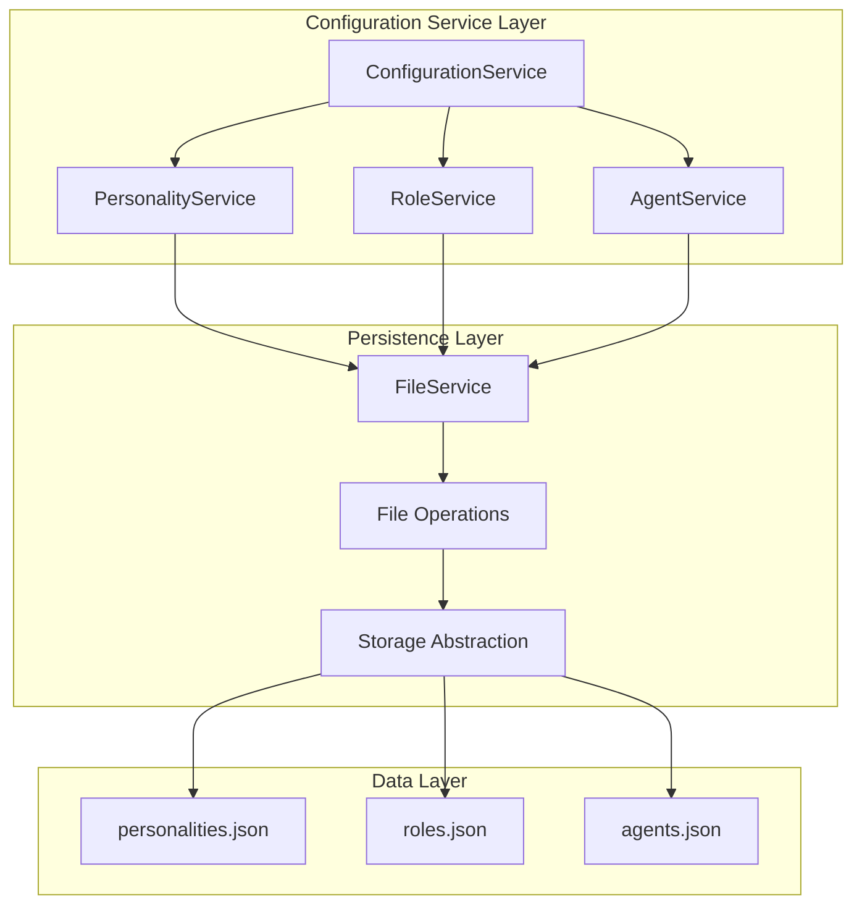
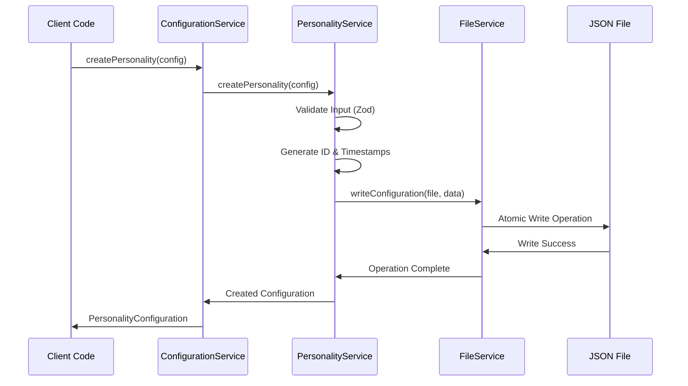
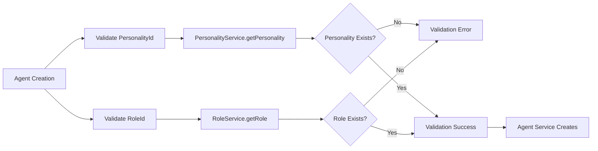

# Configuration Management Services Epic

## Purpose and Goals

Implement the core business logic services for managing personality, role, and agent configurations through CRUD operations, file-based persistence, and cross-service integration. This epic delivers the complete service layer that handles configuration lifecycle management with atomic file operations, dependency validation, and error handling.

## Major Components and Deliverables

### Service Layer Implementation

- **PersonalityService**: CRUD operations for personality configurations with Big Five + behavioral traits
- **RoleService**: Management of predefined and custom roles with system prompts
- **AgentService**: Complex agent configuration with personality/role references and model config
- **ConfigurationService**: Unified service interface aggregating all configuration operations

### File-Based Persistence Layer

- **FileService**: Atomic JSON file operations with backup-and-replace strategy
- **Storage Architecture**: Structured file organization in `app-data/config/` directory
- **Data Integrity**: Transaction-like file operations preventing corruption
- **Platform Abstraction**: Cross-platform file system operations through bridge pattern

### Business Logic Implementation

- **Validation Integration**: Zod schema validation at service boundaries
- **Cross-Reference Management**: Dependency checking and referential integrity
- **Template Management**: Predefined configuration templates and user-created configurations
- **Error Handling**: Comprehensive error scenarios with structured logging

## Detailed Acceptance Criteria

### AC-1: Personality Service Implementation

**AC-1.1: Personality CRUD Operations**

- Given: PersonalityConfiguration interface and validation schema
- When: PersonalityService CRUD methods are implemented
- Then:
  - `createPersonality()` validates input and generates unique ID with timestamps
  - `getPersonality(id)` returns configuration or null for non-existent IDs
  - `getAllPersonalities()` returns array of all personality configurations
  - `updatePersonality(id, updates)` merges changes with existing configuration
  - `deletePersonality(id)` removes configuration and updates JSON file atomically

**AC-1.2: Personality Business Logic**

- Given: Big Five personality model with behavioral traits
- When: Personality operations are performed
- Then:
  - All trait values validated as 0-100 integers during creation/update
  - Template personalities cannot be deleted (isTemplate: true protection)
  - Custom instructions field accepts optional string content
  - Personality configurations persist across service restarts

**AC-1.3: Personality File Operations**

- Given: File-based storage in `personalities.json`
- When: Personality configurations are modified
- Then:
  - File operations use atomic write strategy (backup-and-replace)
  - JSON structure maintains array of personality objects
  - File corruption prevention through temporary file operations
  - Error handling for file system permission issues

### AC-2: Role Service Implementation

**AC-2.1: Role CRUD Operations**

- Given: RoleConfiguration interface with predefined/custom distinction
- When: RoleService CRUD methods are implemented
- Then:
  - `createRole()` creates custom roles with `isTemplate: false`
  - `getRole(id)` retrieves predefined or custom roles by ID
  - `getAllRoles()` returns combined list of predefined and custom roles
  - `updateRole(id, updates)` allows modification of custom roles only
  - `deleteRole(id)` prevents deletion of predefined roles (isTemplate: true)

**AC-2.2: Predefined Role Management**

- Given: 10 predefined roles with specialized system prompts
- When: RoleService initializes
- Then:
  - All predefined roles are loaded with correct system prompts and focus areas
  - Predefined roles marked with `isTemplate: true` for immutability
  - Role definitions include: Technical Advisor, Project Manager, Creative Director, Storyteller, Analyst, Coach, Critic, Business Strategist, Financial Advisor, Generalist
  - Predefined role system prompts provide clear behavioral guidance

**AC-2.3: Custom Role Management**

- Given: User-defined custom roles capability
- When: Custom roles are managed
- Then:
  - Custom roles created with `isTemplate: false` for modification
  - SystemPrompt and focusAreas fields fully customizable
  - Custom role validation ensures non-empty system prompts
  - Custom roles persist independently of predefined roles

### AC-3: Agent Service Implementation

**AC-3.1: Agent CRUD Operations**

- Given: AgentConfiguration with personality, role, and model references
- When: AgentService CRUD methods are implemented
- Then:
  - `createAgent()` validates all references and creates complete agent configuration
  - `getAgent(id)` returns agent with all reference data resolved
  - `getAllAgents()` returns array of all agent configurations
  - `updateAgent(id, updates)` validates references and updates configuration
  - `deleteAgent(id)` removes agent configuration atomically

**AC-3.2: Agent Reference Validation**

- Given: Agent configurations reference personality and role by ID
- When: Agent operations validate references
- Then:
  - PersonalityId existence validated during agent creation/update
  - RoleId existence validated during agent creation/update
  - Reference validation errors provide specific missing ID information
  - Invalid references prevent agent configuration persistence

**AC-3.3: Agent Model Configuration**

- Given: AgentModelConfig with provider-specific parameters
- When: Agent model configurations are managed
- Then:
  - Supported providers validated (openai, anthropic, google)
  - Temperature validated within 0.0-2.0 range with default 0.7
  - Optional parameters (topP, frequencyPenalty, presencePenalty) validated within appropriate ranges
  - Model configuration serializes correctly to JSON storage

### AC-4: Configuration Service Integration

**AC-4.1: Unified Service Interface**

- Given: Individual personality, role, and agent services
- When: ConfigurationService aggregates operations
- Then:
  - Single service interface provides access to all configuration types
  - Method delegation to appropriate specialized services
  - Consistent error handling patterns across all operations
  - Transaction-like operations for complex multi-service changes

**AC-4.2: Cross-Service Dependencies**

- Given: Agent configurations depend on personality and role existence
- When: Cross-service operations are performed
- Then:
  - Agent creation validates personality and role ID existence
  - Personality/role deletion checks for dependent agent configurations
  - Dependency conflicts prevent deletion with informative error messages
  - Service initialization loads all configuration types consistently

### AC-5: File System Operations

**AC-5.1: Atomic File Operations**

- Given: JSON file storage for configuration persistence
- When: File operations are performed
- Then:
  - Write operations use backup-and-replace strategy to prevent corruption
  - Temporary files created for atomic updates
  - File operation failures roll back cleanly without partial updates
  - Concurrent access protection prevents file corruption

**AC-5.2: Storage Structure Management**

- Given: Organized file structure in `app-data/config/`
- When: File storage is managed
- Then:
  - Directory structure created automatically if missing
  - JSON files organized by configuration type (personalities.json, roles.json, agents.json)
  - File format consistency maintained across all configuration types
  - Storage initialization handles missing or corrupted files gracefully

## Technical Considerations

### Service Architecture Patterns

- **Dependency Injection**: Services accept configurable file paths and storage backends
- **Single Responsibility**: Each service focuses on one configuration type
- **Composition Pattern**: ConfigurationService aggregates specialized services
- **Bridge Pattern**: Platform-specific file operations abstracted through interface

### Error Handling Strategy

- **Structured Error Types**: Custom error classes for different failure scenarios
- **Error Aggregation**: Multiple validation errors collected and reported together
- **Logging Integration**: All errors logged with structured format for debugging
- **Graceful Degradation**: Service continues operation when possible after non-critical errors

### Performance Optimization

- **Lazy Loading**: Configuration data loaded on demand
- **In-Memory Caching**: Recently accessed configurations cached for performance
- **Batch Operations**: Multiple configuration changes grouped for efficiency
- **File Watch Integration**: Optional file system watching for external changes

## Dependencies on Other Epics

### Prerequisites

- **Data Models and Validation**: Requires TypeScript interfaces and Zod schemas

### Enables

- **System Integration**: Provides services for AI service and database integration
- **BDD Testing Infrastructure**: Enables unskipping of service-related integration tests

## Estimated Scale

**Features Breakdown:**

1. **Personality Service Features** (3 features: CRUD, business logic, file operations)
2. **Role Service Features** (3 features: CRUD, predefined management, custom management)
3. **Agent Service Features** (3 features: CRUD, reference validation, model config)
4. **Configuration Service Features** (2 features: unified interface, cross-service dependencies)
5. **File System Features** (3 features: atomic operations, storage structure, error handling)

**Total: 14 features** providing comprehensive configuration management

## Architecture Diagrams

### Service Layer Architecture

### Service Operation Flow

### Cross-Reference Validation Flow

## User Stories

### Epic User Stories

**As a developer**, I want robust configuration services so that I can manage agent configurations through a clean, type-safe API with proper error handling.

**As a system administrator**, I want reliable file-based storage so that configurations persist safely across application restarts and system failures.

**As an application user**, I want my agent configurations to maintain referential integrity so that agents always reference valid personalities and roles.

**As a quality engineer**, I want comprehensive service testing so that configuration operations work correctly under all expected scenarios.

## Non-functional Requirements

### Service Performance Requirements

- **Configuration Loading**: Service initialization completes within 500ms
- **CRUD Operations**: Individual operations complete within 100ms
- **Batch Operations**: Multiple configuration changes processed efficiently
- **Memory Usage**: Service memory footprint remains under 50MB for typical usage

### Data Integrity Requirements

- **Atomic Operations**: File operations prevent partial updates and corruption
- **Referential Integrity**: Cross-service references validated consistently
- **Transaction Safety**: Service state remains consistent during concurrent operations
- **Backup Strategy**: Configuration data protected against accidental loss

### Error Handling Requirements

- **Comprehensive Coverage**: All failure scenarios handled with appropriate responses
- **User-Friendly Messages**: Error messages provide actionable feedback
- **Logging Strategy**: Structured logging enables effective debugging
- **Recovery Mechanisms**: Service recovers gracefully from transient failures

## Success Metrics

### Functional Success Metrics

- All CRUD operations work correctly for personality, role, and agent configurations
- Cross-reference validation prevents invalid agent configurations
- File operations maintain data integrity under normal and error conditions
- Service integration enables complete configuration management workflows

### Quality Success Metrics

- Integration tests achieve >95% coverage for service layer functionality
- Error handling covers all identified failure scenarios
- Service performance meets established benchmarks under typical load
- Configuration data consistency maintained across service restarts

### Development Success Metrics

- System Integration epic can proceed with confident service dependencies
- Service APIs enable efficient UI development in platform-specific applications
- Configuration management supports real-world usage scenarios
- Service architecture enables future enhancements without breaking changes

## Instructions for Subsequent Epics

### For System Integration Epic

- Use ConfigurationService as the primary interface for configuration operations
- Integrate configuration validation errors with user feedback systems
- Reference configurations by ID in database and AI service integrations
- Follow error handling patterns established in this epic

### For Integration Testing

- Unskip service-related tests in BDD Testing Infrastructure
- Use real file system operations with temporary directories for integration tests
- Test cross-service reference validation scenarios
- Verify error handling and logging functionality

### Service Usage Patterns

- Always validate input at service boundaries using Zod schemas
- Handle service errors appropriately with user-friendly messages
- Use ConfigurationService for unified access to all configuration types
- Follow established patterns for async service operations and error handling

### Log
