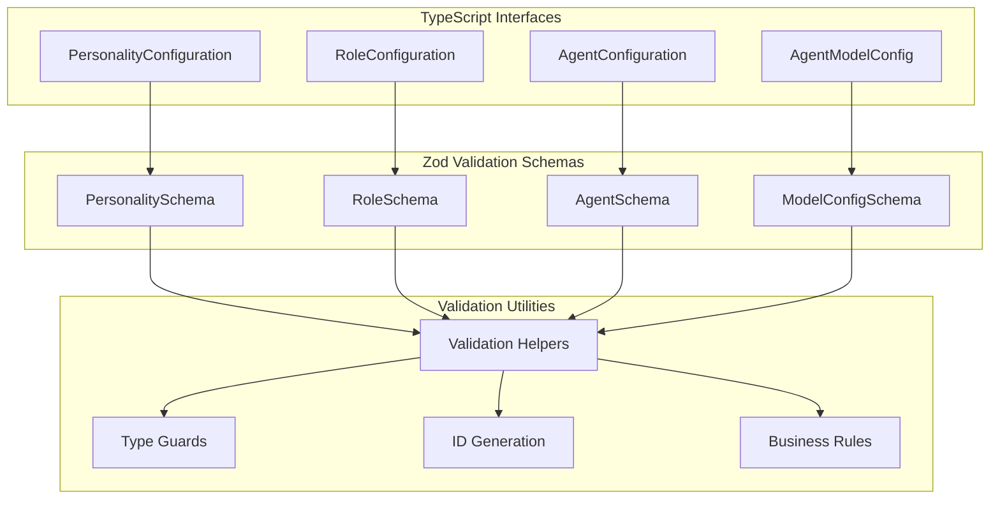
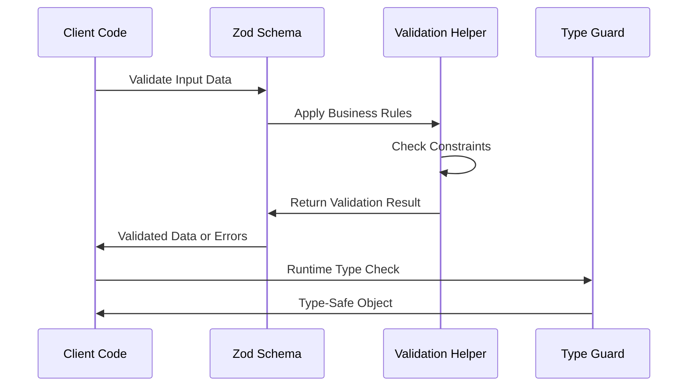

# Data Models and Validation Epic

## Purpose and Goals

Implement the foundational data models, TypeScript interfaces, and Zod validation schemas for the Agent Configuration and Management System. This epic establishes the core type system that ensures data integrity across personality configurations, role definitions, and agent specifications, providing runtime validation and compile-time type safety.

## Major Components and Deliverables

### TypeScript Interface Definitions

- **PersonalityConfiguration**: Big Five traits + 14 behavioral sliders with metadata
- **RoleConfiguration**: Predefined and custom role structures with system prompts
- **AgentConfiguration**: Composite agent definition with references and model config
- **AgentModelConfig**: AI provider and parameter specifications

### Zod Validation Schemas

- **Runtime Type Checking**: Comprehensive schema validation for all configuration types
- **Input Sanitization**: Secure validation with proper error handling
- **Business Rule Enforcement**: Domain-specific validation rules (0-100 ranges, required fields)
- **Cross-Reference Validation**: Validation of ID references and dependencies

### Utility Functions

- **ID Generation**: Consistent UUID generation for all configuration objects
- **Validation Helpers**: Common validation patterns and error formatting
- **Type Guards**: Runtime type checking utilities for enhanced type safety

## Detailed Acceptance Criteria

### AC-1: TypeScript Interface Implementation

**AC-1.1: PersonalityConfiguration Interface**

- Given: Big Five personality model with 14 behavioral traits requirement
- When: PersonalityConfiguration interface is implemented
- Then:
  - All Big Five traits (openness, conscientiousness, extraversion, agreeableness, neuroticism) are typed as numbers (0-100)
  - All 14 behavioral sliders are typed as numbers (0-100) with clear names
  - Optional customInstructions field accepts string input
  - Metadata fields (id, name, description, isTemplate, timestamps) are properly typed
  - Interface exports are available from barrel export

**AC-1.2: RoleConfiguration Interface**

- Given: Predefined and custom role management requirements
- When: RoleConfiguration interface is implemented
- Then:
  - Core fields (id, name, description, systemPrompt) are properly typed
  - focusAreas field accepts string array for role specializations
  - isTemplate boolean distinguishes predefined from custom roles
  - Metadata timestamps follow consistent pattern
  - Interface supports both predefined and user-created role scenarios

**AC-1.3: AgentConfiguration Interface**

- Given: Agent composition from personality, role, and model components
- When: AgentConfiguration and AgentModelConfig interfaces are implemented
- Then:
  - Agent references personality and role via ID strings
  - AgentModelConfig supports provider-specific parameter sets
  - Model parameters (temperature, topP, penalties) have appropriate numeric types
  - Color field for UI theming is typed as string
  - Configuration composition enables complete agent specification

### AC-2: Zod Schema Validation Implementation

**AC-2.1: Personality Validation Schema**

- Given: PersonalityConfiguration interface requirements
- When: Zod schema for personality validation is implemented
- Then:
  - All trait values are validated as integers between 0-100 inclusive
  - Required fields throw descriptive errors when missing
  - Optional customInstructions field accepts empty or string values
  - ID format validation ensures consistent UUID pattern
  - Schema validation provides actionable error messages

**AC-2.2: Role Validation Schema**

- Given: Role management with predefined/custom distinction
- When: Zod schema for role validation is implemented
- Then:
  - SystemPrompt field requires non-empty string content
  - FocusAreas array validates string elements
  - Template role immutability can be enforced through validation
  - Custom role validation allows full modification
  - Schema supports both creation and update scenarios

**AC-2.3: Agent Validation Schema**

- Given: Agent configuration with cross-references
- When: Zod schema for agent validation is implemented
- Then:
  - PersonalityId and roleId reference validation (format, not existence)
  - Model provider validation against supported provider list
  - Parameter ranges validated (temperature 0.0-2.0, topP 0.0-1.0, penalties -2.0 to 2.0)
  - Color field validated as hex color format
  - Nested AgentModelConfig validation integrated

### AC-3: Validation Helper Implementation

**AC-3.1: Common Validation Utilities**

- Given: Shared validation patterns across configuration types
- When: Validation helper functions are implemented
- Then:
  - Range validation helper for 0-100 integer constraints
  - ID format validation for consistent UUID patterns
  - Error formatting utilities for user-friendly messages
  - Validation result aggregation for multiple field errors

**AC-3.2: Business Rule Validation**

- Given: Domain-specific business rules for configurations
- When: Business rule validation is implemented
- Then:
  - Personality trait interdependency validation if applicable
  - Role focus area consistency checking
  - Agent configuration completeness validation
  - Custom validation rules for future extensibility

### AC-4: Type Safety and Runtime Checking

**AC-4.1: Type Guard Implementation**

- Given: Need for runtime type checking beyond Zod schemas
- When: Type guard functions are implemented
- Then:
  - isPersonalityConfiguration type guard for runtime checking
  - isRoleConfiguration type guard for object discrimination
  - isAgentConfiguration type guard for composite validation
  - Type guards integrate with TypeScript type narrowing

**AC-4.2: ID Generation and Validation**

- Given: Consistent identification requirements across all configurations
- When: ID generation utilities are implemented
- Then:
  - generateId() function produces consistent UUID format
  - validateId() function ensures ID format compliance
  - ID generation includes optional prefix support for different types
  - Generated IDs are guaranteed unique within reasonable probability

## Technical Considerations

### TypeScript Configuration

- **Strict Mode**: All interfaces and types use strict TypeScript settings
- **NoUncheckedIndexedAccess**: Prevents undefined access errors
- **Exact Types**: Interface definitions prevent excess property errors
- **Import/Export Strategy**: Barrel exports for clean module boundaries

### Zod Schema Design

- **Performance Optimization**: Efficient schema compilation and reuse
- **Error Message Customization**: Business-friendly validation messages
- **Schema Composition**: Reusable schema components for common patterns
- **Transform Functions**: Data normalization during validation

### Validation Strategy

- **Fail-Fast Approach**: Early validation prevents invalid data propagation
- **Comprehensive Error Reporting**: Multiple validation errors collected and reported
- **Sanitization**: Input cleaning while preserving data integrity
- **Version Compatibility**: Schema evolution strategy for future updates

## Dependencies on Other Epics

### Prerequisites

- **BDD Testing Infrastructure**: Provides test framework for validation testing

### Enables

- **Configuration Management Services**: Requires these types for service implementation
- **System Integration**: Needs validated data models for external system integration

## Estimated Scale

**Features Breakdown:**

1. **Personality Type System** (2 features: interface + validation)
2. **Role Type System** (2 features: interface + validation)
3. **Agent Type System** (2 features: interface + validation)
4. **Validation Infrastructure** (2 features: utilities + business rules)
5. **Type Safety Utilities** (2 features: type guards + ID management)

**Total: 10 features** focused on foundational type system and validation

## Architecture Diagrams

### Type System Architecture

### Validation Flow

## User Stories

### Epic User Stories

**As a developer**, I want strongly-typed configuration interfaces so that I can build services with compile-time safety and clear data contracts.

**As a system administrator**, I want robust input validation so that invalid configuration data is caught early and provides clear error messages.

**As a quality engineer**, I want comprehensive validation testing so that data integrity is maintained across all system components.

**As a future maintainer**, I want well-documented type definitions so that I can understand data structures and safely modify validation logic.

## Non-functional Requirements

### Type Safety Requirements

- **Compile-time Safety**: All configuration operations use strongly-typed interfaces
- **Runtime Validation**: Zod schemas catch invalid data at system boundaries
- **Null Safety**: Optional fields properly typed to prevent undefined access
- **Type Inference**: Minimal type annotations required in consuming code

### Validation Performance

- **Schema Compilation**: Zod schemas compile efficiently for repeated use
- **Validation Speed**: Input validation completes in under 10ms for typical objects
- **Memory Efficiency**: Schema objects reused to minimize memory allocation
- **Error Collection**: Multiple validation errors collected without performance penalty

### Maintainability Requirements

- **Schema Evolution**: Validation schemas support backward-compatible changes
- **Clear Error Messages**: Business-friendly validation feedback
- **Consistent Patterns**: Standardized validation approach across all types
- **Documentation**: Type definitions include JSDoc comments for IDE support

## Success Metrics

### Functional Success Metrics

- All configuration types have corresponding TypeScript interfaces and Zod schemas
- Validation catches 100% of invalid input scenarios identified in tests
- Type safety prevents runtime errors in configuration handling
- ID generation produces unique identifiers consistently

### Quality Success Metrics

- Integration tests for validation logic achieve >95% coverage
- Validation error messages provide actionable feedback for all scenarios
- Type definitions support IDE autocompletion and error detection
- Schema validation performance meets established benchmarks

### Development Success Metrics

- Configuration Management epic can begin implementation immediately
- Type definitions enable confident service layer development
- Validation infrastructure supports iterative development and testing
- Documentation enables other developers to extend type system

## Instructions for Subsequent Epics

### For Configuration Management Services Epic

- Import types from `@fishbowl-ai/shared/types`
- Use Zod schemas for all input validation in service methods
- Implement validation error handling using provided utilities
- Follow type-safe patterns established in this epic

### For Integration Testing

- Unskip validation-related tests in BDD Testing Infrastructure
- Use test data factories that produce type-safe configuration objects
- Verify validation error scenarios identified in this epic
- Test cross-reference validation patterns for agent configurations

### Error Handling Patterns

- Always validate input data at service boundaries using Zod schemas
- Collect and format multiple validation errors for user feedback
- Use type guards for runtime checking in complex scenarios
- Implement consistent error response patterns across all services

### Log
