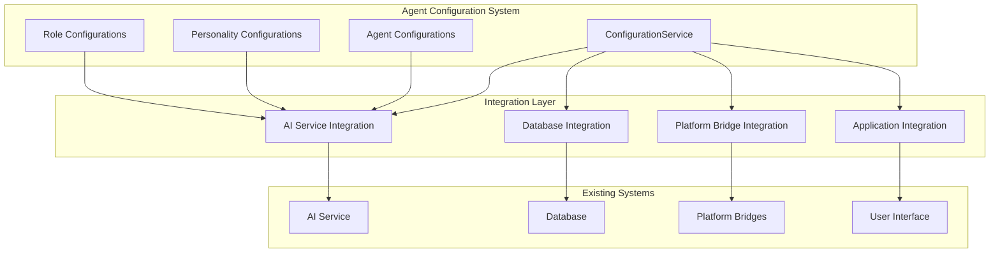
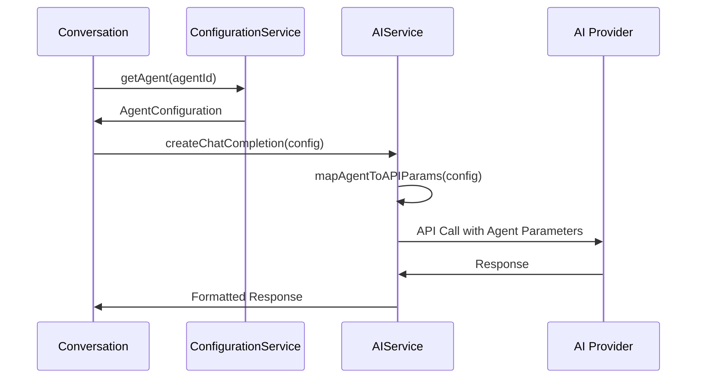
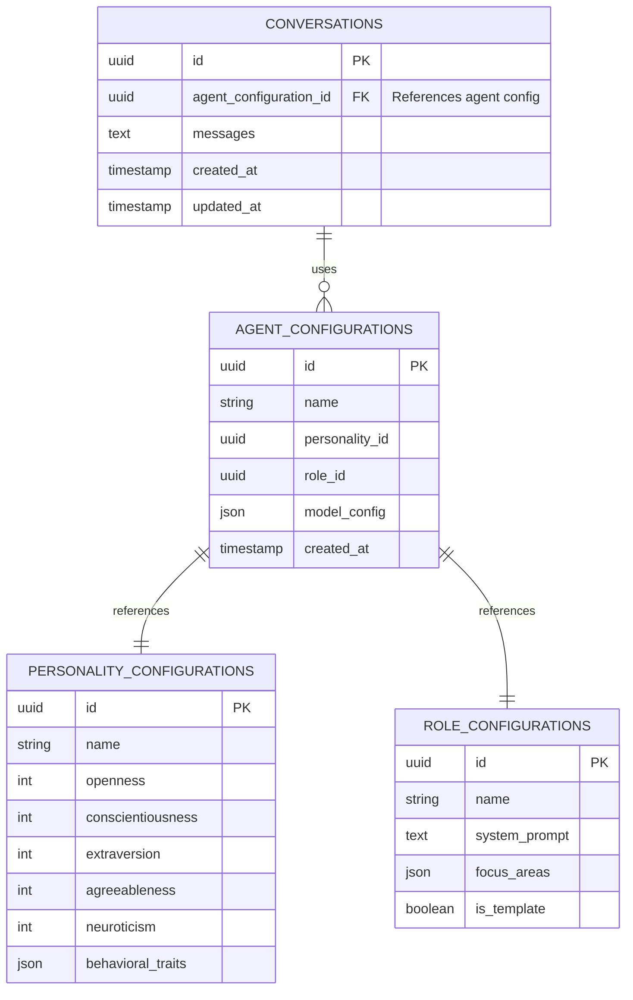

# System Integration Epic

## Purpose and Goals

Integrate the Agent Configuration and Management System with existing Fishbowl infrastructure including AI services, database systems, and platform-specific bridges. This epic ensures seamless operation within the broader application ecosystem while maintaining clean architectural boundaries and enabling real-world usage scenarios.

## Major Components and Deliverables

### AI Service Integration

- **AIService Configuration**: Agent model configurations integrated with existing AI service layer
- **Provider Validation**: Model availability and capability validation against AI service providers
- **Configuration Mapping**: Agent configuration parameters mapped to AI service API requirements
- **Runtime Integration**: Agent configurations consumed by conversation and chat systems

### Database Integration

- **Schema Extensions**: Agent configuration references added to conversation database
- **Migration Support**: Database migrations for agent configuration foreign keys
- **Relationship Management**: Agent configurations linked to conversation history and user data
- **Data Consistency**: Configuration changes propagated to dependent database records

### Platform Bridge Integration

- **File System Abstraction**: Configuration file operations abstracted for cross-platform compatibility
- **Storage Bridge Implementation**: Platform-specific secure storage for sensitive configuration data
- **Permission Management**: File system permissions handled consistently across desktop and mobile
- **Configuration Synchronization**: Multi-device configuration sync through platform bridges

### Application Integration Points

- **Service Registration**: Configuration services registered with dependency injection container
- **Error Propagation**: Configuration errors integrated with application error handling
- **Logging Integration**: Configuration operations integrated with structured application logging
- **Performance Monitoring**: Configuration service performance metrics collected

## Detailed Acceptance Criteria

### AC-1: AI Service Integration

**AC-1.1: Agent Configuration to AI Service Mapping**

- Given: Existing AIService class and AgentConfiguration with model parameters
- When: Agent configurations are used for AI service operations
- Then:
  - Agent model provider (openai, anthropic, google) maps to AIService provider configuration
  - Agent temperature, topP, and penalty parameters passed to AI service API calls
  - Model ID validation against available models for each provider
  - Configuration parameter validation occurs at integration boundary

**AC-1.2: Provider Capability Validation**

- Given: Agent model configurations with provider-specific parameters
- When: Agent configurations are validated against AI service capabilities
- Then:
  - Provider availability checked during agent configuration creation
  - Model ID existence validated against provider model lists
  - Parameter ranges validated against provider-specific constraints
  - Streaming support and other capabilities verified for agent configurations

**AC-1.3: Runtime AI Service Integration**

- Given: Agent configurations used in conversation systems
- When: AI service calls are made with agent configurations
- Then:
  - Agent personality traits influence system prompt generation
  - Agent role system prompts integrated into conversation context
  - Agent model parameters applied to AI service API calls
  - Configuration errors handled gracefully without breaking conversations

### AC-2: Database Integration

**AC-2.1: Database Schema Integration**

- Given: Existing conversation database schema
- When: Agent configuration references are added
- Then:
  - Conversation table includes agent_configuration_id foreign key
  - Agent configuration IDs stored as references, not embedded data
  - Database constraints ensure referential integrity
  - Migration scripts handle existing conversation data gracefully

**AC-2.2: Configuration Reference Management**

- Given: Database relationships between conversations and agent configurations
- When: Agent configurations are modified or deleted
- Then:
  - Configuration updates do not affect existing conversation history
  - Agent deletion prevents removal if referenced by active conversations
  - Configuration versioning considered for conversation history integrity
  - Database queries efficiently resolve agent configuration details

**AC-2.3: Data Consistency and Migration**

- Given: Existing conversation data and new agent configuration system
- When: Database migrations are applied
- Then:
  - Existing conversations can be associated with default agent configurations
  - Migration scripts create appropriate default configurations if needed
  - Data migration preserves conversation history and context
  - Rollback procedures restore system to previous state if needed

### AC-3: Platform Bridge Integration

**AC-3.1: File System Bridge Implementation**

- Given: Cross-platform deployment requirements (desktop/mobile)
- When: Configuration file operations are performed
- Then:
  - File operations abstracted through platform-specific bridge implementations
  - Desktop bridge uses Electron secure storage for sensitive data
  - Mobile bridge uses Expo SecureStore for sensitive configuration
  - Configuration file paths resolved correctly on all platforms

**AC-3.2: Storage Security Integration**

- Given: Configuration data including potentially sensitive information
- When: Configurations are persisted across platforms
- Then:
  - Sensitive configuration data (API keys, tokens) stored in platform secure storage
  - Non-sensitive configuration data stored in accessible JSON files
  - Storage security policies enforced consistently across platforms
  - Configuration access controlled by platform permission systems

**AC-3.3: Cross-Platform Synchronization**

- Given: Multi-device usage scenarios
- When: Configuration synchronization is implemented
- Then:
  - Configuration changes sync across devices through platform bridges
  - Conflict resolution handles simultaneous configuration updates
  - Sync operations maintain configuration data integrity
  - Platform-specific sync mechanisms (iCloud, Google Drive) integrated appropriately

### AC-4: Application Integration Points

**AC-4.1: Service Integration and Dependency Injection**

- Given: Existing application service architecture
- When: Configuration services are integrated
- Then:
  - ConfigurationService registered with application dependency injection container
  - Service lifecycle managed consistently with other application services
  - Service initialization occurs during application startup
  - Service cleanup handled during application shutdown

**AC-4.2: Error Handling Integration**

- Given: Application-wide error handling and user feedback systems
- When: Configuration errors occur
- Then:
  - Configuration validation errors integrated with application error reporting
  - User-friendly error messages displayed in platform-specific UI components
  - Error logging follows application logging standards and formats
  - Error recovery mechanisms integrated with application retry policies

**AC-4.3: Performance and Monitoring Integration**

- Given: Application performance monitoring and metrics collection
- When: Configuration operations are performed
- Then:
  - Configuration service performance metrics collected and reported
  - Operation latency and success rates monitored
  - Resource usage (memory, disk) tracked for configuration operations
  - Performance alerts configured for configuration service degradation

## Technical Considerations

### Integration Architecture Patterns

- **Adapter Pattern**: Existing services adapted to use new configuration system
- **Bridge Pattern**: Platform-specific implementations hidden behind common interfaces
- **Observer Pattern**: Configuration changes notify dependent systems
- **Factory Pattern**: Agent configurations used to create properly configured AI service instances

### Backward Compatibility Strategy

- **Graceful Migration**: Existing system continues operation during configuration system integration
- **Default Configurations**: Reasonable defaults provided for systems not yet using agent configurations
- **Phased Integration**: Integration proceeds incrementally without breaking existing functionality
- **Rollback Capability**: Integration changes can be reverted if issues arise

### Error Handling and Resilience

- **Circuit Breaker**: Configuration service failures don't cascade to dependent systems
- **Fallback Mechanisms**: Default configurations used when configuration service unavailable
- **Retry Logic**: Transient configuration service failures handled with appropriate retries
- **Degraded Mode**: Application continues with reduced functionality when configuration system unavailable

## Dependencies on Other Epics

### Prerequisites

- **Configuration Management Services**: Requires complete service implementation

### Enables

- **Verification and Quality Assurance**: Provides integrated system for final testing

## Estimated Scale

**Features Breakdown:**

1. **AI Service Integration Features** (3 features: mapping, validation, runtime integration)
2. **Database Integration Features** (3 features: schema, references, migration)
3. **Platform Bridge Features** (3 features: file system, security, sync)
4. **Application Integration Features** (3 features: service registration, error handling, monitoring)

**Total: 12 features** for comprehensive system integration

## Architecture Diagrams

### System Integration Overview

### AI Service Integration Flow

### Database Integration Schema

## User Stories

### Epic User Stories

**As a user**, I want my agent configurations to work seamlessly with conversations so that I can use my custom agents in real interactions.

**As a developer**, I want agent configurations integrated with existing services so that I can build features using established patterns and interfaces.

**As a system administrator**, I want configuration data properly integrated with the database so that data relationships are maintained and performance is optimal.

**As a mobile user**, I want my agent configurations to sync across devices so that I can access my custom agents on any platform.

## Non-functional Requirements

### Integration Performance Requirements

- **Service Startup**: Configuration service integration adds <2 seconds to application startup
- **AI Service Calls**: Agent configuration lookup adds <50ms to AI service request latency
- **Database Operations**: Configuration queries complete within 100ms
- **Sync Operations**: Cross-device sync completes within 30 seconds for typical configuration sets

### Data Integrity Requirements

- **Referential Integrity**: Database constraints prevent orphaned configuration references
- **Transaction Safety**: Configuration updates maintain consistency across all integrated systems
- **Backup Integration**: Configuration data included in application backup/restore procedures
- **Conflict Resolution**: Multi-device sync conflicts resolved automatically when possible

### Security Integration Requirements

- **Secure Storage**: Sensitive configuration data protected using platform security mechanisms
- **Access Control**: Configuration access controlled through existing application authentication
- **Data Encryption**: Configuration data encrypted in transit and at rest
- **Audit Trail**: Configuration changes logged for security and compliance

## Success Metrics

### Functional Success Metrics

- Agent configurations successfully used in live conversations with AI services
- Database integration maintains referential integrity under normal operations
- Platform bridges enable consistent configuration access across desktop and mobile
- Application integration provides seamless user experience

### Quality Success Metrics

- Integration tests verify end-to-end functionality with real external systems
- Error handling gracefully manages failures in integrated systems
- Performance metrics meet established benchmarks under realistic load
- Security measures protect configuration data appropriately

### Development Success Metrics

- Integration enables immediate use of agent configurations in production
- Established patterns enable future enhancement without breaking existing integration
- Documentation supports developers extending integration to new systems
- Integration architecture supports testing and development workflows

## Instructions for Subsequent Epics

### For Verification and Quality Assurance Epic

- Unskip all system integration tests in BDD Testing Infrastructure
- Verify end-to-end workflows including AI service calls and database operations
- Test cross-platform configuration sync and platform bridge functionality
- Validate performance and security requirements are met

### For Future Development

- Use established integration patterns for new configuration types
- Follow security and performance patterns established in this epic
- Extend monitoring and logging as new integration points are added
- Maintain backward compatibility when modifying integration interfaces

### Integration Testing Guidelines

- Test with real AI service providers in development environment
- Use test databases that mirror production schema
- Verify platform bridge functionality on actual target platforms
- Include integration tests in continuous integration pipeline

### Log
