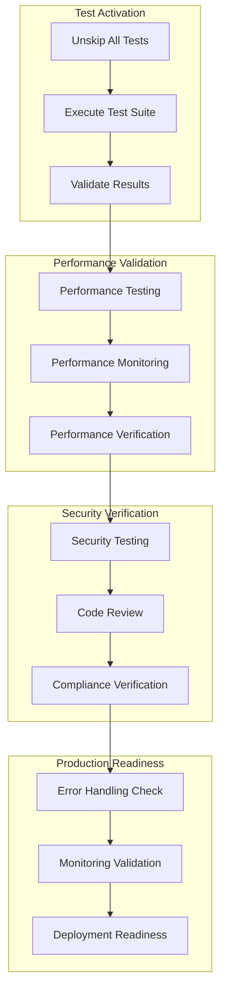
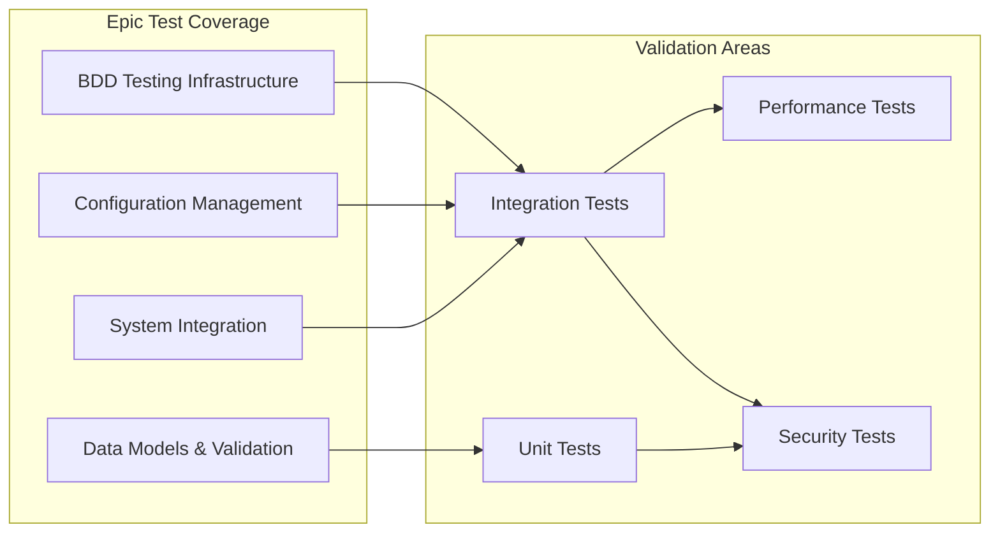

# Verification and Quality Assurance Epic

## Purpose and Goals

Conduct comprehensive verification of the Agent Configuration and Management System through complete integration test execution, performance validation, security verification, and system quality assurance. This epic ensures all BDD integration tests are enabled and passing, validates non-functional requirements, and confirms the system meets production readiness standards.

## Major Components and Deliverables

### Complete Test Suite Execution

- **Integration Test Activation**: Unskip all `it.skip` tests from BDD Testing Infrastructure
- **Test Suite Validation**: Ensure 100% test execution with all acceptance criteria met
- **Cross-Feature Testing**: Validate integration between all epic components
- **Regression Testing**: Confirm no functionality degradation during development

### Performance Validation

- **Service Performance Testing**: Validate configuration service latency and throughput
- **File System Performance**: Verify file operation performance under realistic loads
- **Memory Usage Validation**: Confirm memory footprint within established limits
- **Concurrent Operation Testing**: Validate system behavior under concurrent access

### Security and Compliance Verification

- **Input Validation Security**: Confirm all input sanitization and validation works correctly
- **File System Security**: Verify secure file operations and permission handling
- **Data Protection Verification**: Confirm sensitive data protection measures
- **Cross-Platform Security**: Validate security measures across desktop and mobile platforms

### Production Readiness Assessment

- **Error Handling Verification**: Comprehensive error scenario testing
- **Logging and Monitoring**: Verify logging output and monitoring integration
- **Documentation Completeness**: Confirm all system documentation is complete and accurate
- **Deployment Readiness**: Validate system ready for production deployment

## Detailed Acceptance Criteria

### AC-1: Complete Integration Test Execution

**AC-1.1: BDD Test Suite Activation**

- Given: All integration tests initially implemented with `it.skip`
- When: Test suite activation is performed
- Then:
  - All `it.skip` statements removed from personality management tests
  - All `it.skip` statements removed from role management tests
  - All `it.skip` statements removed from agent configuration tests
  - All `it.skip` statements removed from service integration tests
  - All `it.skip` statements removed from system integration tests

**AC-1.2: Test Execution Validation**

- Given: Activated integration test suite
- When: Complete test suite is executed
- Then:
  - 100% of integration tests pass successfully
  - No test failures or errors in the complete test run
  - Test execution completes within established time limits (under 30 seconds)
  - All business acceptance criteria validated through test execution

**AC-1.3: Cross-Epic Integration Validation**

- Given: Complete implemented system across all epics
- When: End-to-end integration scenarios are tested
- Then:
  - Agent creation workflow tests pass (personality → role → agent)
  - Cross-service reference validation tests pass
  - File system integration tests pass across all configuration types
  - AI service integration tests pass with real service calls
  - Database integration tests pass with actual database operations

### AC-2: Performance Validation

**AC-2.1: Service Performance Verification**

- Given: Complete configuration service implementation
- When: Performance testing is conducted
- Then:
  - Configuration loading completes within 500ms during service initialization
  - Individual CRUD operations complete within 100ms
  - Batch operations process multiple configurations efficiently
  - Memory usage remains under 50MB for typical configuration sets

**AC-2.2: File System Performance Validation**

- Given: File-based configuration storage implementation
- When: File operation performance is tested
- Then:
  - JSON file read operations complete within 50ms for typical file sizes
  - Atomic write operations complete within 100ms
  - File system operations scale appropriately with configuration data size
  - Concurrent file access handled without performance degradation

**AC-2.3: Integration Performance Testing**

- Given: Complete system integration implementation
- When: Integrated system performance is tested
- Then:
  - AI service integration adds <50ms latency to conversation initiation
  - Database configuration queries complete within 100ms
  - Cross-platform sync operations complete within 30 seconds
  - Application startup with configuration service integration adds <2 seconds

### AC-3: Security and Compliance Verification

**AC-3.1: Input Validation Security Testing**

- Given: Comprehensive input validation implementation
- When: Security testing is performed
- Then:
  - All malicious input scenarios blocked by Zod validation
  - SQL injection attempts prevented through parameterized queries
  - File path traversal attacks blocked by path validation
  - XSS attempts in configuration data neutralized

**AC-3.2: Data Protection Verification**

- Given: Platform-specific secure storage implementation
- When: Data protection is verified
- Then:
  - Sensitive configuration data encrypted in platform secure storage
  - File system permissions correctly restrict configuration file access
  - Configuration data encrypted in transit during sync operations
  - No sensitive data leaked in logs or error messages

**AC-3.3: Cross-Platform Security Validation**

- Given: Desktop and mobile platform implementations
- When: Cross-platform security is tested
- Then:
  - Desktop platform uses Electron secure storage correctly
  - Mobile platform uses Expo SecureStore correctly
  - Security measures consistent across platforms
  - Platform-specific security policies enforced

### AC-4: Production Readiness Assessment

**AC-4.1: Error Handling Verification**

- Given: Comprehensive error handling implementation
- When: Error scenarios are systematically tested
- Then:
  - All error conditions produce appropriate user-friendly messages
  - System recovers gracefully from transient failures
  - Error logging provides sufficient debugging information
  - No unhandled exceptions or system crashes occur

**AC-4.2: Monitoring and Observability Validation**

- Given: Logging and monitoring integration
- When: System observability is verified
- Then:
  - All configuration operations logged with appropriate detail level
  - Performance metrics collected for monitoring dashboards
  - Error rates and latency tracked for alerting
  - Log output structured for analysis and troubleshooting

**AC-4.3: Documentation and Deployment Readiness**

- Given: Complete system implementation
- When: Production readiness is assessed
- Then:
  - All API documentation complete and accurate
  - System architecture documentation reflects actual implementation
  - Deployment procedures documented and validated
  - Configuration migration procedures tested and documented

## Technical Considerations

### Test Execution Strategy

- **Parallel Test Execution**: Tests designed for safe parallel execution
- **Test Environment Management**: Isolated test environments prevent interference
- **Test Data Management**: Consistent test data across all test execution scenarios
- **Continuous Integration**: Test execution integrated with CI/CD pipeline

### Performance Testing Approach

- **Realistic Load Testing**: Performance testing with realistic data volumes
- **Resource Monitoring**: Memory, CPU, and disk usage monitored during testing
- **Baseline Establishment**: Performance baselines established for future regression testing
- **Scalability Assessment**: System behavior under increasing load evaluated

### Security Testing Methodology

- **Penetration Testing**: Security vulnerabilities identified through systematic testing
- **Code Review**: Security-focused code review of all implementation
- **Dependency Scanning**: Third-party dependencies scanned for security vulnerabilities
- **Compliance Verification**: Security measures verified against established standards

## Dependencies on Other Epics

### Prerequisites

- **System Integration**: Requires complete integrated system for end-to-end testing

### Completes

- **Agent Configuration Project**: Final epic that completes the entire project

## Estimated Scale

**Features Breakdown:**

1. **Test Suite Activation Features** (3 features: personality tests, role tests, agent tests)
2. **Performance Validation Features** (3 features: service performance, file system performance, integration performance)
3. **Security Verification Features** (3 features: input validation, data protection, cross-platform security)
4. **Production Readiness Features** (3 features: error handling, monitoring, documentation)

**Total: 12 features** for comprehensive quality assurance

## Architecture Diagrams

### Quality Assurance Process Flow

### Test Coverage Validation

## User Stories

### Epic User Stories

**As a project stakeholder**, I want comprehensive quality assurance so that I can be confident the system meets all requirements and is ready for production use.

**As a developer**, I want complete test execution validation so that I can trust the system implementation and safely make future changes.

**As a security engineer**, I want thorough security verification so that I can confirm the system protects user data and prevents security vulnerabilities.

**As a system administrator**, I want production readiness verification so that I can deploy the system with confidence in its reliability and performance.

## Non-functional Requirements

### Test Execution Requirements

- **Complete Coverage**: 100% of acceptance criteria validated through test execution
- **Execution Time**: Complete test suite execution within 60 seconds
- **Reliability**: Test execution produces consistent results across multiple runs
- **Automation**: All testing automated and integrated with development workflow

### Performance Validation Requirements

- **Service Latency**: Configuration operations meet established latency requirements
- **Resource Usage**: Memory and CPU usage within established limits
- **Scalability**: System performance degrades gracefully under increased load
- **Concurrent Access**: System handles concurrent operations without data corruption

### Security Verification Requirements

- **Vulnerability Assessment**: No critical or high-severity security vulnerabilities
- **Data Protection**: All sensitive data properly protected using established security measures
- **Access Control**: Appropriate access controls implemented and verified
- **Compliance**: Security measures meet established security standards

## Success Metrics

### Functional Success Metrics

- 100% of integration tests pass after unskipping
- All business acceptance criteria validated through test execution
- End-to-end workflows function correctly in integrated system
- Error handling works correctly for all identified error scenarios

### Quality Success Metrics

- Performance requirements met under realistic testing conditions
- Security testing identifies no critical vulnerabilities
- System demonstrates production-level reliability and stability
- Documentation enables successful deployment and maintenance

### Project Success Metrics

- Agent Configuration and Management System ready for production deployment
- All project requirements satisfied through comprehensive testing
- System architecture supports future enhancement and maintenance
- Development team confident in system quality and reliability

## Instructions for Project Completion

### Final System Validation

- Execute complete BDD test suite with all tests enabled
- Verify all project acceptance criteria met through test results
- Confirm system performance meets established requirements
- Validate security measures provide appropriate protection

### Production Deployment Preparation

- Complete final documentation review and updates
- Prepare deployment procedures and rollback plans
- Configure monitoring and alerting for production environment
- Train support team on system operation and troubleshooting

### Project Closure Activities

- Document lessons learned and best practices
- Archive development artifacts and test results
- Transfer system ownership to maintenance team
- Conduct project retrospective and process improvement identification

## Final Project Validation Checklist

### System Functionality

- [ ] All personality configuration operations work correctly
- [ ] All role configuration operations work correctly
- [ ] All agent configuration operations work correctly
- [ ] Cross-service integration functions properly
- [ ] AI service integration enables real conversations
- [ ] Database integration maintains data consistency
- [ ] Platform bridges enable cross-platform functionality

### Quality Assurance

- [ ] All integration tests pass without skipped tests
- [ ] Performance requirements met under realistic conditions
- [ ] Security testing identifies no critical issues
- [ ] Error handling covers all expected scenarios
- [ ] Logging and monitoring provide operational visibility
- [ ] Documentation complete and accurate

### Production Readiness

- [ ] System deployed successfully in test environment
- [ ] Migration procedures tested and validated
- [ ] Backup and recovery procedures verified
- [ ] Support procedures documented and tested
- [ ] Team training completed
- [ ] Go-live checklist completed

**Project Status**: Ready for production deployment upon completion of all checklist items.

### Log
