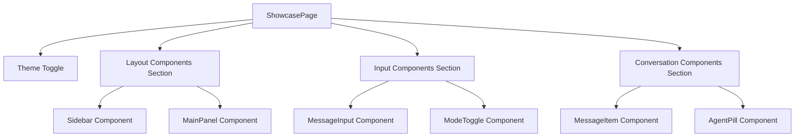

# Component Library Showcase Epic

## Purpose and Goals

Create a simple showcase page where components can be manually added and displayed for visual testing and validation during development. This is a basic React page that shows components in isolation with minimal setup - just a place to view and test components as they're built.

## Major Components and Deliverables

### Basic Showcase Page

- **ShowcasePage**: Simple React page that displays components
- **Component Sections**: Manual sections for different component categories
- **Theme Toggle**: Basic light/dark mode switch for testing themes
- **Sample Data**: Simple mock data objects for testing component props

### Simple Setup

- **Manual Component Addition**: Components added to showcase by importing and rendering them
- **Basic Styling**: Minimal styling to display components clearly
- **Hot Reload**: Standard Vite hot reload (no special configuration needed)

## Detailed Acceptance Criteria

### Basic Showcase Requirements

✅ **Simple Page**: Single React page that displays components in sections  
✅ **Manual Addition**: Components added by importing and rendering them manually  
✅ **Theme Toggle**: Basic button to switch between light/dark themes  
✅ **Component Isolation**: Each component renders correctly with sample props  
✅ **Basic Layout**: Clean, simple layout that shows components clearly

### Development Requirements

✅ **Build Integration**: Showcase page builds with existing Vite setup  
✅ **Hot Reload**: Standard hot reload works when components change  
✅ **Theme Support**: Components respond to theme changes  
✅ **Sample Data**: Basic mock data for testing component props

## Architecture Diagrams

### Simple Showcase Structure

## User Stories

**As a developer**, I want a simple page where I can manually add and view components so that I can test them as I build them.

**As a component author**, I want to quickly see how my component looks and behaves so that I can verify it works correctly.

**As a designer**, I want to see components in light and dark themes so that I can verify the design is implemented correctly.

## Non-functional Requirements

### Performance Standards

- **Load Time**: Page loads quickly with standard Vite performance
- **Theme Switching**: Light/dark mode switches immediately

### Development Experience

- **Setup Time**: New developers can run showcase in under 2 minutes
- **Hot Reload**: Component changes reflect immediately
- **Integration**: Showcase runs alongside development without conflicts

## Integration Requirements

### Development Environment Integration

✅ **Vite Integration**: Showcase page builds with existing Vite configuration  
✅ **Hot Module Replacement**: Standard hot reload works  
✅ **Theme System**: Uses same CSS custom properties as main application  
✅ **Simple Setup**: No complex configuration needed

## Dependencies and Constraints

### Prerequisites

- None (foundational epic for development workflow)

### Technical Constraints

- **Framework**: Must work with existing React + TypeScript + Vite stack
- **Theme System**: Must use existing CSS custom properties for theming
- **Simplicity**: Keep implementation as simple as possible - no complex frameworks
- **Build Integration**: Must not interfere with main application build process

## Success Metrics

### Functional Success

- **Page Loads**: Showcase page loads and displays correctly
- **Manual Addition**: Components can be imported and added to the page easily
- **Theme Toggle**: Light/dark mode switching works
- **Component Display**: Components render correctly with sample props

### Development Success

- **Simple Setup**: Developers can add components to showcase quickly
- **Visual Verification**: Components can be visually tested during development
- **Hot Reload**: Changes to components update immediately in showcase
- **Build Integration**: Showcase builds and runs alongside main development without issues

This epic creates a simple showcase page that enables immediate visual testing of components during development - just a basic page where components can be manually added and viewed.

### Log
