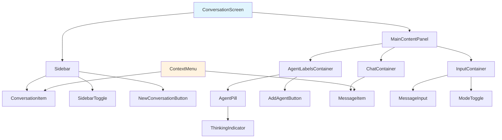
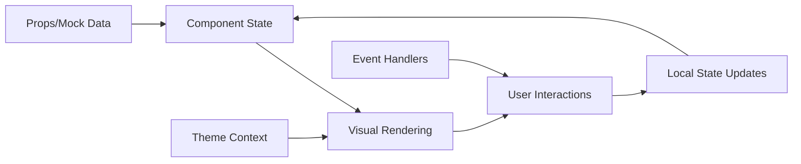
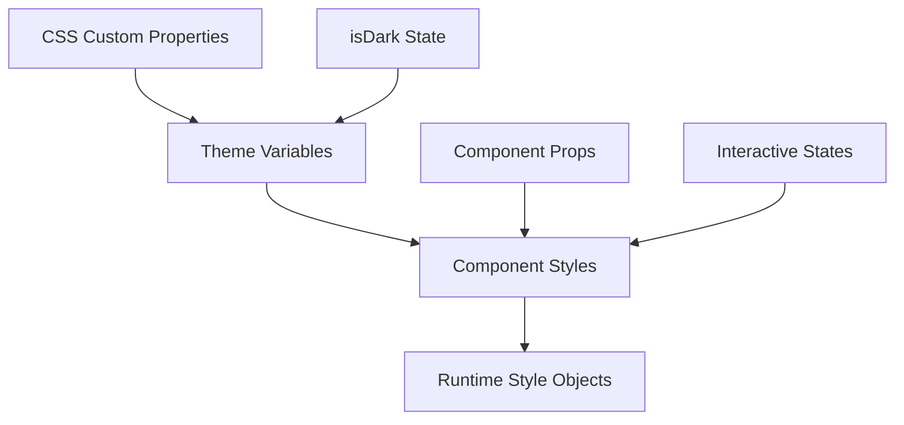
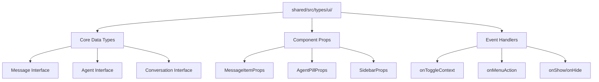
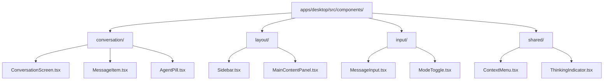

# Core Component Extraction Epic

## Purpose and Goals

Extract and implement the core React components from the existing DesignPrototype by decomposing the monolithic component (~1300 lines) into distinct, reusable components following SOLID principles. This epic includes creating TypeScript interfaces and file organization alongside component extraction, with each component being added to the showcase page for immediate visual validation. Focus on Phase 1 development using CSS-in-JS styling while maintaining perfect visual fidelity to the original design.

## Major Components and Deliverables

### Foundation Infrastructure

- **TypeScript Interface System**: Create comprehensive TypeScript interfaces in `@fishbowl-ai/shared/src/types/ui/`
- **File Organization Structure**: Establish organized directory structure in `apps/desktop/src/components/`
- **Component Props Interfaces**: Define strongly-typed props for all planned components alongside component creation
- **Showcase Integration**: Add each component to the showcase page as it's created for immediate visual validation

### Screen-Level Components

- **ConversationScreen**: Root component managing overall layout and state coordination
- **Sidebar**: Left panel container with collapse/expand functionality and conversation management
- **MainContentPanel**: Primary content area coordinating agent labels, chat, and input areas

### Core UI Components

- **MessageItem**: Complete message display supporting user/agent/system types with interactive controls
- **AgentPill**: Individual agent indicator with color coding, role display, and thinking state animation
- **ConversationItem**: Sidebar conversation row with context menu and activity status
- **ContextMenu**: Reusable dropdown menu system for both messages and conversations

### Interactive Elements

- **SidebarToggle**: Expand/collapse control with smooth animations
- **MessageInput**: Text input area with send button and auto-resize functionality
- **ModeToggle**: Manual/Auto mode switcher with visual state feedback
- **ThinkingIndicator**: Pulsing dot animation for agent thinking states

## Detailed Acceptance Criteria

### Visual Fidelity Requirements

✅ **Theme Support**: Light/dark mode support via CSS custom properties  
✅ **Responsive Behavior**: Proper sizing, overflow handling, and layout adaptation  
✅ **Interactive States**: Hover, active, disabled, expanded states preserved  
✅ **Animations**: All existing transitions and pulse effects maintained  
✅ **Typography**: Font hierarchy, spacing, and text styling preserved

### Component Architecture Requirements

✅ **SOLID Principles**: Each component follows single responsibility principle  
✅ **Low Coupling**: Minimal dependencies between components  
✅ **Internal Composition**: Complex components composed of sub-components internally  
✅ **TypeScript Integration**: All components have strongly-typed props interfaces created alongside implementation  
✅ **State Management**: Local state only, no global state dependencies

### TypeScript Interface Requirements

✅ **Core Data Structures**: Message, Agent, Conversation interfaces defined with proper typing  
✅ **Component Props**: TypeScript prop interfaces created for each component during extraction  
✅ **Cross-Platform Export**: Interfaces properly exported from `@fishbowl-ai/shared` package  
✅ **Type Safety**: All interfaces pass TypeScript strict mode validation  
✅ **Documentation**: Each interface includes JSDoc comments for clear usage guidance

### File Organization Requirements

✅ **Directory Structure**: Logical organization by functional area (conversation/, layout/, input/, shared/)  
✅ **Index Files**: Barrel exports for each directory to enable clean imports  
✅ **Path Mapping**: TypeScript configured for `@/components/ui/*` import paths  
✅ **Naming Conventions**: Consistent PascalCase component naming with descriptive names

### Showcase Integration Requirements

✅ **Component Addition**: Each component added to showcase page as it's created  
✅ **Sample Data**: Basic mock data created for testing component props  
✅ **Visual Validation**: Components verified visually in showcase before considering complete  
✅ **Theme Testing**: Components tested in both light and dark themes via showcase

### Interaction Requirements

✅ **Context Menus**: Ellipsis buttons open/close menus with proper positioning  
✅ **Visual State Toggles**: Message context inclusion buttons change appearance  
✅ **Expandable Content**: Long messages show/hide additional content  
✅ **Mode Switching**: Manual/Auto toggle updates visual state  
✅ **Sidebar Control**: Collapse/expand animation with proper state management  
✅ **Menu Positioning**: Context menus avoid viewport clipping

### Technical Implementation Requirements

✅ **CSS Custom Properties**: Existing theme system integration maintained  
✅ **TypeScript Strict**: All components pass TypeScript strict mode checks  
✅ **Performance**: No unnecessary re-renders or memory leaks  
✅ **Accessibility**: Keyboard navigation and screen reader support preserved  
✅ **Error Boundaries**: Graceful handling of component errors

## Architecture Diagrams

### Component Hierarchy and Data Flow

### State Management Pattern

### CSS-in-JS Architecture

### Type System Architecture

### File Organization Structure

## User Stories

**As a component consumer**, I want isolated components that render correctly so that I can use them in the component library showcase.

**As a developer**, I want components with clear props interfaces so that I can understand how to use each component.

**As a designer**, I want pixel-perfect visual fidelity so that the component library matches the approved design system.

**As a user**, I want all interactive elements to work as expected so that the components feel responsive and polished.

**As a maintainer**, I want low-coupled components so that I can modify one component without affecting others.

**As a developer**, I want strongly-typed component interfaces so that I can use these components safely across desktop and mobile platforms.

**As a component author**, I want a clear file organization structure so that I can easily locate and maintain related components.

**As a team member**, I want consistent import patterns so that I can quickly understand and navigate the component codebase.

**As a component developer**, I want to add each component to the showcase as I create it so that I can immediately verify it works correctly and looks right.

## Non-functional Requirements

### Performance Standards

- **Render Time**: Components render within 16ms for 60fps performance
- **Memory Usage**: No memory leaks from event listeners or refs
- **Bundle Size**: Extracted components should not increase bundle size vs monolithic version
- **Re-render Optimization**: Minimize unnecessary re-renders through proper React patterns

### Quality Standards

- **Type Safety**: 100% TypeScript coverage with no `any` types
- **Code Coverage**: 90%+ test coverage for component logic
- **Accessibility**: WCAG 2.1 AA compliance maintained
- **Browser Support**: Works in all modern browsers (Chrome, Firefox, Safari, Edge)

### Maintainability Requirements

- **Component Size**: Individual components under 200 lines of code
- **Complexity**: Cyclomatic complexity under 10 per component
- **Documentation**: Each component has usage examples and prop documentation
- **Consistent Patterns**: All components follow established architectural patterns

## Integration Requirements

### Component Library Integration

✅ **Showcase Addition**: Each component manually added to showcase page as it's created  
✅ **Visual Verification**: All components verified visually in showcase before completion  
✅ **Props Documentation**: Component props are self-documenting through TypeScript  
✅ **Theme Testing**: Components tested in both light and dark themes in showcase

### Build System Integration

✅ **Vite Compatibility**: All components build successfully with existing Vite setup  
✅ **Hot Reload**: Component changes trigger proper hot reload in development  
✅ **Tree Shaking**: Unused components can be tree-shaken from bundle  
✅ **Source Maps**: Debugging information preserved for development

## Dependencies and Constraints

### Prerequisites

- **E-component-library-showcase**: Showcase framework must be ready for immediate component testing and validation

### Technical Constraints

- **Styling System**: Must use CSS-in-JS with CSS custom properties (no Tailwind in Phase 1)
- **State Management**: Components must work without external state management systems
- **Build System**: Must work with existing Vite + TypeScript + React setup
- **Performance**: Cannot degrade from current DesignPrototype performance baseline

### Scope Limitations

- **No Functional Logic**: Components display data but don't process or persist it
- **No Global State**: All state changes are local visual updates only
- **No API Integration**: Components work with mock/prop data only
- **Desktop Only**: Initial extraction targets Electron app only

## Success Metrics

### Functional Metrics

- **Component Count**: 15+ distinct components extracted successfully
- **Visual Parity**: 100% visual match with DesignPrototype in component showcase
- **Interaction Coverage**: All interactive elements respond appropriately
- **Theme Compatibility**: Components work in both light and dark themes

### Technical Metrics

- **Build Success**: 100% successful builds with no TypeScript errors
- **Test Pass Rate**: All component tests pass consistently
- **Performance**: No performance regression from baseline measurements
- **Code Quality**: ESLint and Prettier checks pass for all components

### Infrastructure Metrics

- **Type Coverage**: 100% of extracted components have TypeScript interfaces
- **Import Resolution**: All planned import paths resolve correctly
- **Cross-Platform Compatibility**: Interfaces work for both desktop and mobile implementations
- **Development Experience**: Fast IDE intellisense and autocomplete for all components

### Showcase Integration Metrics

- **Component Coverage**: 100% of extracted components added to showcase page
- **Visual Validation**: All components visually verified in showcase before completion
- **Theme Coverage**: All components tested in both light and dark themes
- **Manual Integration**: Developers can easily add new components to showcase

This epic delivers the core value of the project by transforming a monolithic prototype into a library of reusable, well-architected components that maintain perfect visual fidelity while enabling future enhancement and cross-platform reuse.

### Log
