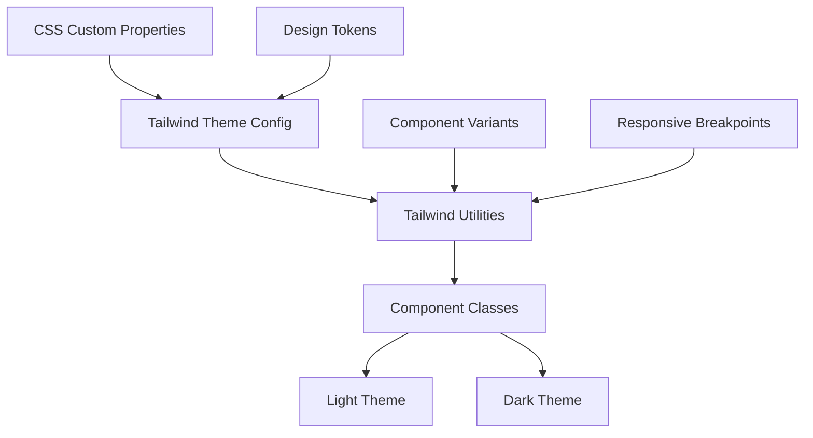
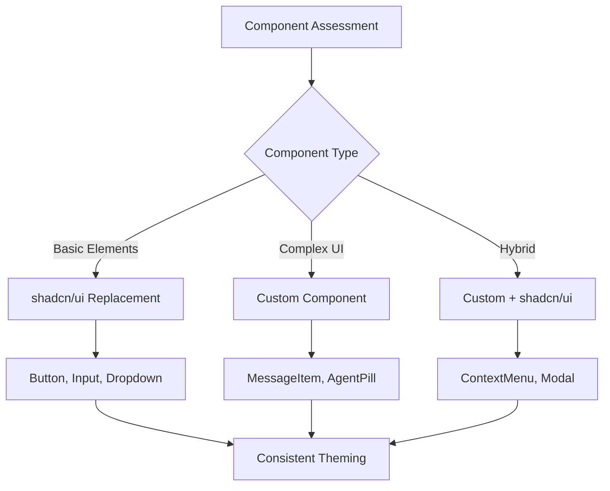
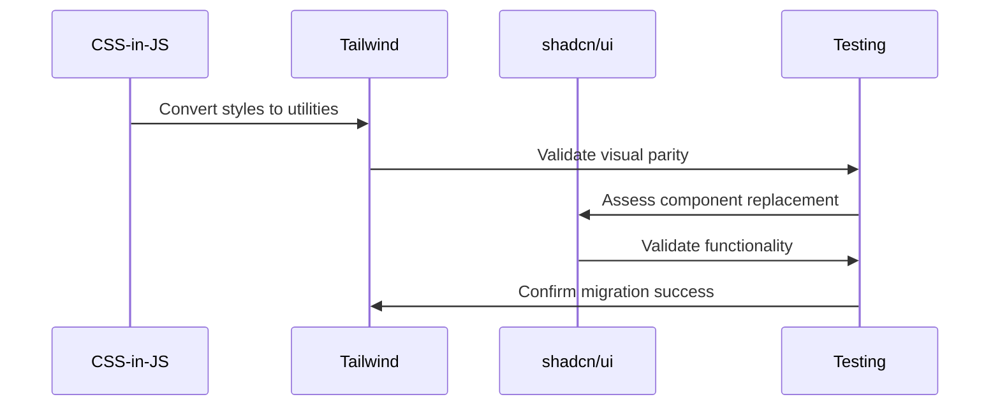

# Tailwind and shadcn/ui Integration Epic

## Purpose and Goals

Migrate the component styling system from CSS-in-JS to Tailwind CSS and integrate shadcn/ui components where appropriate, representing Phase 2 of the project. This epic focuses on modernizing the styling approach while maintaining perfect visual parity and component functionality.

## Major Components and Deliverables

### Tailwind CSS Setup and Configuration

- **Build System Integration**: Configure Tailwind CSS in the Vite build pipeline
- **Theme Configuration**: Map existing CSS custom properties to Tailwind theme configuration
- **Design Token Migration**: Convert current design system to Tailwind design tokens
- **PostCSS Setup**: Configure PostCSS for Tailwind processing and optimization

### Component Styling Migration

- **CSS-in-JS to Tailwind**: Convert all existing component styles to Tailwind utility classes
- **Visual Parity Validation**: Ensure pixel-perfect matching throughout migration
- **Responsive Utilities**: Leverage Tailwind responsive utilities for better maintainability
- **Animation Classes**: Convert custom animations to Tailwind animation utilities

### shadcn/ui Component Integration

- **Component Assessment**: Evaluate which components benefit from shadcn/ui replacement
- **Basic Element Replacement**: Replace buttons, inputs, dropdowns with shadcn/ui primitives
- **Theme Integration**: Configure shadcn/ui theming to match existing design system
- **Custom Component Enhancement**: Enhance complex components with shadcn/ui internals where beneficial

### Hybrid Architecture Implementation

- **Component Strategy**: Maintain custom components for complex UI while using shadcn/ui for primitives
- **Consistency Framework**: Ensure design consistency between custom and shadcn/ui components
- **Integration Patterns**: Establish patterns for mixing custom and shadcn/ui components
- **Documentation Updates**: Update component documentation to reflect new implementation approaches

## Detailed Acceptance Criteria

### Tailwind CSS Setup Requirements

✅ **Build Integration**: Tailwind CSS processes correctly in Vite build pipeline  
✅ **Theme Configuration**: All CSS custom properties mapped to Tailwind theme  
✅ **Design Token Parity**: Tailwind theme produces identical visual output to CSS custom properties  
✅ **Development Experience**: Tailwind intellisense works in VSCode/development environment  
✅ **Build Optimization**: Tailwind CSS is properly purged and optimized for production

### Styling Migration Requirements

✅ **Visual Fidelity**: 100% visual parity maintained during migration  
✅ **Component Coverage**: All components successfully migrated from CSS-in-JS to Tailwind  
✅ **Performance**: Bundle size equal or smaller than CSS-in-JS implementation  
✅ **Maintainability**: Tailwind classes more maintainable than equivalent CSS-in-JS  
✅ **Responsive Behavior**: All responsive breakpoints work identically to original

### shadcn/ui Integration Requirements

✅ **Component Replacement**: Basic elements (buttons, inputs, dropdowns) replaced with shadcn/ui  
✅ **Theme Consistency**: shadcn/ui components match existing design system  
✅ **Accessibility**: shadcn/ui components maintain or improve accessibility standards  
✅ **Functionality**: All interactive behaviors preserved or enhanced  
✅ **Documentation**: Usage patterns documented for shadcn/ui integrations

### Architecture Requirements

✅ **Hybrid Strategy**: Clear separation between custom and shadcn/ui components  
✅ **Design Consistency**: Unified visual language across component types  
✅ **Integration Patterns**: Documented patterns for combining component types  
✅ **Future Extensibility**: Architecture supports adding more shadcn/ui components

## Architecture Diagrams

### Tailwind Integration Architecture

### shadcn/ui Integration Strategy

### Migration Process Flow

## User Stories

**As a developer**, I want modern CSS utilities so that I can style components more efficiently and consistently.

**As a designer**, I want design system consistency so that all components follow the same visual language regardless of implementation.

**As a maintainer**, I want better developer experience so that styling changes are easier to implement and review.

**As a component consumer**, I want enhanced accessibility so that shadcn/ui components provide better user experience.

**As a team member**, I want clear documentation so that I understand when to use custom vs shadcn/ui components.

## Non-functional Requirements

### Performance Standards

- **Bundle Size**: Overall bundle size should not increase significantly
- **Runtime Performance**: No performance degradation from styling system change
- **Build Time**: Tailwind processing should not significantly slow build times
- **Development Speed**: Hot reload should work efficiently with Tailwind

### Developer Experience

- **Learning Curve**: Team can adopt Tailwind patterns within 1 week
- **Tooling Support**: Full IDE support for Tailwind classes and IntelliSense
- **Debugging**: Easy to debug styling issues with browser developer tools
- **Documentation**: Clear guidelines for when to use different styling approaches

### Maintainability Standards

- **Code Consistency**: All components follow consistent Tailwind patterns
- **Design System**: Clear mapping between design tokens and Tailwind utilities
- **Component Variants**: Systematic approach to component variations and states
- **Future Updates**: Easy to update design system through Tailwind configuration

## Integration Requirements

### Design System Continuity

✅ **Visual Consistency**: No visual changes visible to end users  
✅ **Theme Support**: Light/dark mode continues to work identically  
✅ **Animation Parity**: All transitions and animations preserved  
✅ **Responsive Behavior**: All responsive breakpoints function identically

### Component Library Integration

✅ **Showcase Updates**: Component library showcase reflects new implementation  
✅ **Props Interface**: Component props interfaces remain unchanged  
✅ **Usage Patterns**: Component usage examples updated for new styling approach  
✅ **Performance**: Component rendering performance maintained or improved

### Development Workflow Integration

✅ **Build System**: No changes required to existing development workflow  
✅ **Testing**: All existing tests continue to pass without modification  
✅ **Hot Reload**: Development experience remains smooth and responsive  
✅ **Code Quality**: ESLint and other quality checks continue to work

## Dependencies and Constraints

### Prerequisites

- **E-component-library-showcase**: Component showcase must be complete for migration validation

### Technical Constraints

- **Visual Parity**: Zero tolerance for visual regressions during migration
- **Build System**: Must work with existing Vite + TypeScript setup
- **Component Interface**: Cannot break existing component props interfaces
- **Theme System**: Must maintain compatibility with existing CSS custom properties

### Migration Constraints

- **Incremental Migration**: Components migrated gradually to minimize risk
- **Rollback Capability**: Ability to rollback individual components if issues arise
- **Testing Coverage**: Comprehensive visual regression testing throughout migration
- **Documentation**: All changes documented for team knowledge transfer

## Success Metrics

### Technical Success

- **Migration Coverage**: 100% of components successfully migrated to Tailwind
- **Visual Regression**: Zero visual differences detected in automated testing
- **Performance**: Bundle size maintained or reduced
- **Build Success**: All builds pass with new styling system

### Team Adoption Success

- **Developer Satisfaction**: Team prefers new styling approach over CSS-in-JS
- **Development Speed**: Styling changes implemented faster with Tailwind
- **Code Review**: Styling changes easier to review and understand
- **Knowledge Transfer**: New team members can contribute to styling faster

### Design System Success

- **Consistency**: More consistent component styling across the library
- **Maintainability**: Design system updates easier to implement globally
- **Extensibility**: Easier to add new components following established patterns
- **Documentation**: Clear guidelines for styling new components

### shadcn/ui Integration Success

- **Component Quality**: shadcn/ui components integrate seamlessly with custom components
- **Accessibility**: Improved accessibility scores from shadcn/ui component usage
- **Feature Parity**: All functionality preserved or enhanced
- **Team Confidence**: Team comfortable using and extending shadcn/ui components

This epic completes the project's technical evolution by modernizing the styling system and establishing patterns for scalable component development while maintaining the visual excellence achieved in earlier phases.

### Log
