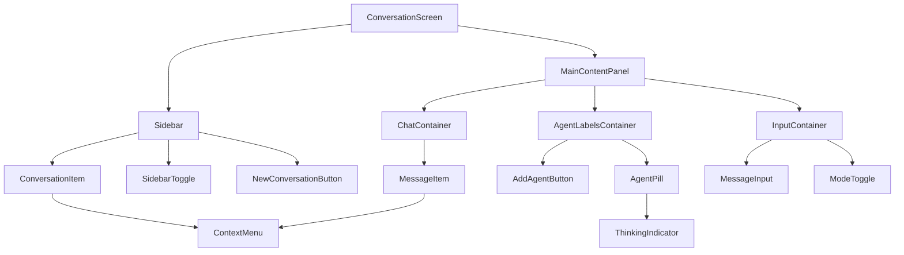
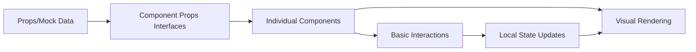

# Conversation UI Component Decomposition Project

## Executive Summary

Transform the existing monolithic DesignPrototype component (~1300 lines) of the main conversation screen into a library of reusable React components following SOLID principles with minimal coupling. The deliverable is a component library showcase that demonstrates visual fidelity and basic interactions for each component in isolation.

## Project Goals

### Primary Objective

Decompose the conversation screen prototype into distinct, reusable React components that will be showcased in a component library screen within the Fishbowl application.

### Success Criteria

- ✅ Visual components render correctly in isolation
- ✅ Basic interactions work (menus open, buttons click, visual states toggle)
- ✅ Components follow SOLID principles with low coupling
- ✅ TypeScript prop interfaces enable cross-platform reuse
- ✅ No functional behavior or data persistence required

## Technical Architecture

### Technology Stack

- **Framework**: React 19.1.0 + TypeScript 5.8.3+
- **Styling**: CSS-in-JS (Phase 1) → Tailwind CSS + shadcn/ui (Phase 2)
- **Build Tool**: Vite 7.0.5+ (existing setup)
- **Package Structure**: Monorepo with pnpm workspaces
- **Component Location**: `apps/desktop/src/components/ui/`
- **Shared Types**: `@fishbowl-ai/shared/src/types/ui/`

### Architecture Principles

- **Single Responsibility**: Each component handles one logical UI concern
- **Low Coupling**: Minimal dependencies between components
- **Internal Composition**: Components can be internally composed of sub-components
- **Cross-Platform Types**: Shared TypeScript interfaces for desktop/mobile reuse
- **Theme Consistency**: Leverage existing CSS custom properties system

## Detailed Requirements

### Phase 1: Component Extraction (Epoch 1)

Convert existing HTML/CSS-in-JS into discrete React components:

#### Screen-Level Components

- **ConversationScreen** - Root component managing overall layout
- **Sidebar** - Left panel container with collapse/expand functionality
- **MainContentPanel** - Primary content area container

#### Sidebar Components

- **ConversationItem** - Individual conversation row with name, timestamp, and context menu
- **SidebarToggle** - Expand/collapse button with positioning logic
- **NewConversationButton** - Add conversation action button

#### Main Content Components

**Agent Labels Section:**

- **AgentLabelsContainer** - Top bar layout with horizontal scrolling
- **AgentPill** - Individual agent indicator with color, role, and thinking state
- **AddAgentButton** - Plus button for adding new agents
- **ThinkingIndicator** - Pulsing dot animation component

**Chat Area:**

- **ChatContainer** - Scrollable message area with proper overflow handling
- **MessageItem** - Complete message display (user/agent/system types) with header, content, and controls

**Input Area:**

- **InputContainer** - Bottom section layout container
- **MessageInput** - Text area with send button (may be 1-2 internal components)
- **ModeToggle** - Manual/Auto mode switcher with visual states

#### Reusable Components

- **ContextMenu** - Dropdown menu system (shared by MessageItem and ConversationItem)

### Phase 2: Tailwind CSS + shadcn/ui Integration (Epoch 2)

Migrate styling system and integrate shadcn/ui components:

#### Tailwind CSS Migration

- **Setup Tailwind CSS** in the desktop app build system
- **Configure theme integration** to work with existing design tokens
- **Convert CSS-in-JS styles** to Tailwind utility classes
- **Maintain visual parity** during the styling system transition

#### shadcn/ui Component Integration

- **Replace basic elements** (buttons, inputs, dropdowns) with shadcn/ui primitives
- **Integrate shadcn/ui theming** with existing light/dark mode system
- **Keep complex components custom** (MessageItem, AgentPill) but leverage shadcn/ui internals where appropriate
- **Ensure design consistency** between custom and shadcn/ui components

## Component Specifications

### Visual Fidelity Requirements

Each component must match the existing DesignPrototype visual design:

- **Theme Support**: Light/dark mode via CSS custom properties
- **Responsive Behavior**: Proper sizing and overflow handling
- **Interactive States**: Hover, active, disabled, expanded states
- **Animations**: Preserve existing transitions and pulse effects
- **Typography**: Match existing font hierarchy and spacing

### Interaction Requirements (Basic Level)

- **Context Menus**: Clickable ellipsis buttons open/close menus
- **Visual State Toggles**: Message context inclusion buttons change appearance
- **Expandable Content**: Long messages show/hide additional content
- **Mode Switching**: Manual/Auto toggle updates visual state
- **Sidebar Control**: Collapse/expand sidebar with animation
- **No Data Persistence**: Interactions affect only visual state, no backend calls

### TypeScript Interface Requirements

#### Shared Type Definitions (`@fishbowl-ai/shared/src/types/ui/`)

```typescript
// Core data structures
interface Message {
  id: string;
  agent: string;
  role: string;
  content: string;
  timestamp: string;
  type: "user" | "agent" | "system";
  isActive: boolean;
  agentColor: string;
}

interface Agent {
  name: string;
  role: string;
  color: string;
  isThinking: boolean;
}

interface Conversation {
  name: string;
  lastActivity: string;
  isActive: boolean;
}

// Component prop interfaces
interface MessageItemProps {
  message: Message;
  onToggleContext: (id: string) => void;
  onMenuAction: (action: string, id: string) => void;
  // ... additional props
}

interface AgentPillProps {
  agent: Agent;
  // ... additional props
}

// ... additional prop interfaces for each component
```

## Architecture Diagrams

### Component Hierarchy



### Data Flow



## Development Strategy

### Implementation Approach

1. **Extract components incrementally** from DesignPrototype
2. **Maintain visual parity** with existing design at each step
3. **Create TypeScript interfaces** alongside component extraction
4. **Test components in isolation** using component library showcase
5. **Preserve existing theme system** and CSS custom properties
6. **Document component APIs** for future shadcn/ui integration

### File Organization

```
apps/desktop/src/components/ui/
├── conversation/
│   ├── ConversationScreen.tsx
│   ├── MessageItem.tsx
│   ├── AgentPill.tsx
│   └── ...
├── layout/
│   ├── Sidebar.tsx
│   ├── MainContentPanel.tsx
│   └── ...
├── input/
│   ├── MessageInput.tsx
│   ├── ModeToggle.tsx
│   └── ...
└── shared/
    ├── ContextMenu.tsx
    ├── ThinkingIndicator.tsx
    └── ...
```

### Quality Standards

- **TypeScript strict mode** compliance
- **Zero console errors** in component library showcase
- **Responsive design** maintained across screen sizes
- **Accessibility** preserved from original prototype
- **Performance** - no unnecessary re-renders or memory leaks

## Acceptance Criteria

### Functional Requirements

✅ **Component Isolation**: Each component renders correctly in component library showcase  
✅ **Visual Fidelity**: Components match DesignPrototype appearance exactly  
✅ **Basic Interactions**: All clickable elements respond appropriately  
✅ **Theme Support**: Light/dark mode works across all components  
✅ **Type Safety**: All components have properly typed props interfaces  
✅ **Cross-Platform Types**: Shared interfaces work for both desktop/mobile

### Technical Requirements

✅ **SOLID Principles**: Components follow single responsibility and low coupling  
✅ **Internal Composition**: Complex components properly composed of sub-components  
✅ **CSS Custom Properties**: Existing theme system integration maintained  
✅ **Performance**: No performance regressions from original prototype  
✅ **Code Quality**: ESLint, Prettier, and TypeScript checks pass

### Integration Requirements

✅ **Monorepo Compatibility**: Components work within existing build system  
✅ **Import Paths**: Proper TypeScript path mapping for clean imports  
✅ **Shared Package Integration**: Types properly exported from `@fishbowl-ai/shared`  
✅ **Component Library Ready**: All components showcase-ready for library screen

### Phase Completion Criteria

**Phase 1 Complete**: All components extracted with CSS-in-JS styling and basic interactions  
**Phase 2 Complete**: Components migrated to Tailwind CSS with shadcn/ui integration

## Constraints and Limitations

### Scope Boundaries

- **No functional logic**: Components display data but don't process or persist it
- **No theme toggle component**: Light/dark switching handled elsewhere in app
- **No state management**: All state changes are local visual updates only
- **No API integration**: Components work with mock/prop data only

### Technical Constraints

- **Desktop-only initially**: Components built for Electron app first
- **Existing build system**: Must work with current Vite + TypeScript setup
- **Theme system**: Must use existing CSS custom properties (no new theme approach)
- **Performance**: Cannot degrade from current DesignPrototype performance

This project establishes the foundation for a robust, reusable component system while maintaining the visual excellence and user experience of the existing conversation interface.

### Log
