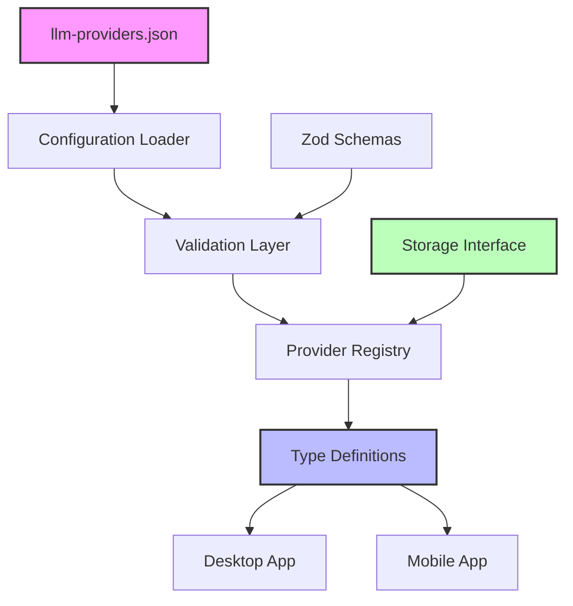

## Purpose and Goals

Establish the cross-platform configuration infrastructure for dynamic LLM providers in the shared package. This epic creates the foundation for JSON-driven provider configuration that works across both desktop and mobile platforms.

See: `docs/specifications/llm_providers.json` for sample JSON schema.

## Major Components and Deliverables

1. **Type System and Interfaces**
   - LLM provider configuration types
   - Provider metadata interfaces
   - Field configuration schemas
   - Model definition structures

2. **JSON Configuration Schema**
   - Provider configuration file format
   - Field type definitions (secure-text, text, checkbox)
   - Validation schemas using Zod
   - Default provider configurations

3. **Configuration Loading Service**
   - Cross-platform configuration loader
   - Provider registry management
   - Configuration validation
   - Error handling for invalid configurations

4. **Provider Management Types**
   - Runtime provider instance types
   - Provider configuration state interfaces
   - Cross-platform storage interfaces for provider configs

## Detailed Acceptance Criteria

### Type System

- ✓ Complete TypeScript interfaces for provider configurations
- ✓ Support for extensible field types
- ✓ Type-safe provider metadata (id, name, models)
- ✓ Validation schemas match TypeScript types exactly

### JSON Schema

- ✓ Well-documented JSON schema for provider definitions
- ✓ Support for all required field types and metadata
- ✓ Extensible structure for future provider additions
- ✓ Backward compatibility considerations

### Configuration Loading

- ✓ Service loads and validates JSON configurations
- ✓ Graceful handling of missing or invalid files
- ✓ Provider registry accessible across platforms
- ✓ Hot-reloading capability for development

### Integration Points

- ✓ Interfaces compatible with existing SettingsRepository pattern
- ✓ Types integrate with current LlmConfigData structure
- ✓ Clear contracts for platform-specific storage implementations

## Architecture Diagram

## Technical Considerations

- All code in `packages/shared` for cross-platform compatibility
- No UI components or platform-specific code
- Use existing patterns from SettingsRepository
- Maintain backward compatibility with current LlmConfigData
- Consider future extensibility for new provider types

## Dependencies on Other Epics

None - this is the foundational epic

## Estimated Scale

- 3-4 features
- ~15-20 tasks
- Foundation for all other epics

## Non-functional Requirements

### Performance

- Configuration parsing < 50ms
- Type validation < 10ms per provider
- Zero runtime overhead for type checking

### Extensibility

- New providers addable without code changes
- New field types supportable with minimal changes
- Forward-compatible JSON schema

### Code Quality

- 100% TypeScript strict mode compliance
- Comprehensive unit test coverage
- Clear documentation for all interfaces

### Log
