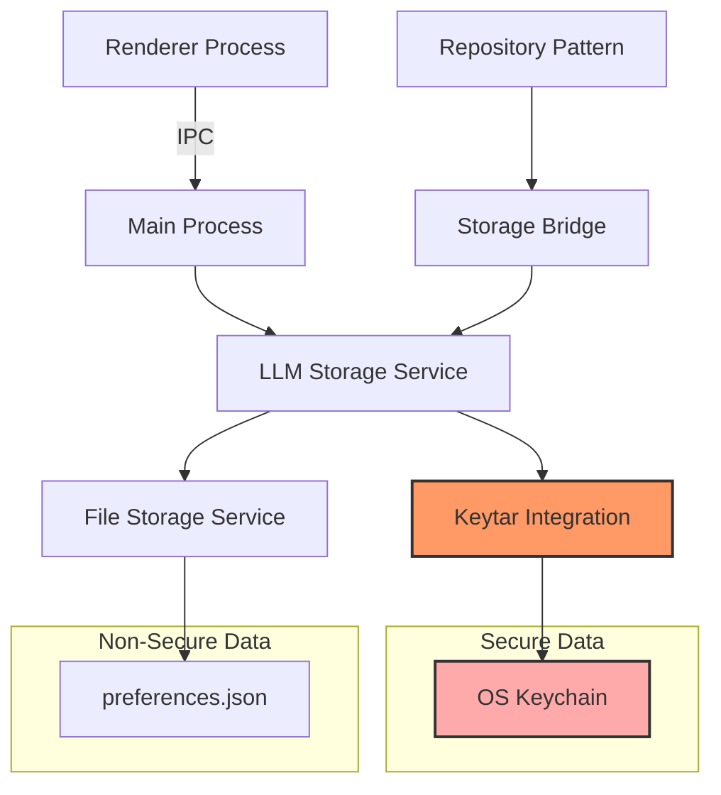
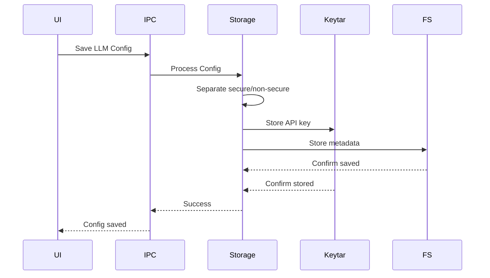

## Purpose and Goals

Implement secure storage for LLM provider configurations on the desktop platform using Electron's keytar integration. This epic provides platform-specific secure storage while maintaining clean interfaces for future mobile implementation.

## Major Components and Deliverables

1. **Keytar Integration Service**
   - Electron keytar wrapper service
   - Secure credential storage/retrieval
   - Cross-platform keychain support (Windows/Mac/Linux)
   - Error handling for keychain access

2. **Desktop Storage Bridge Implementation**
   - LLM-specific storage bridge extending FileSystemBridge pattern
   - Separation of secure (API keys) and non-secure data
   - Atomic operations for configuration updates
   - Migration utilities for existing configurations

3. **IPC Channel Extensions**
   - New IPC channels for LLM configuration operations
   - Secure data serialization/deserialization
   - Main/renderer process communication
   - Type-safe IPC contracts

4. **Storage Repository Integration**
   - LLM configuration repository following existing patterns
   - Integration with settings system
   - State synchronization with UI
   - Backup and recovery mechanisms

## Detailed Acceptance Criteria

### Keytar Integration

- ✓ API keys stored securely in OS keychain
- ✓ Support for Windows Credential Manager
- ✓ Support for macOS Keychain
- ✓ Support for Linux Secret Service API
- ✓ Graceful fallback for unsupported systems

### Storage Operations

- ✓ Create configuration with secure key storage
- ✓ Read configuration with key retrieval
- ✓ Update configuration maintaining key security
- ✓ Delete configuration and associated keys
- ✓ List all configurations (without exposing keys)

### Security Requirements

- ✓ API keys never stored in plain text files
- ✓ Keys never exposed in logs or error messages
- ✓ Secure key format: `fishbowl.<provider-id>.<config-id>`
- ✓ Keys cleared from memory after use
- ✓ No keys in browser DevTools or IPC messages

### Error Handling

- ✓ Clear errors when keychain access denied
- ✓ Helpful messages for permission issues
- ✓ Graceful degradation without keychain
- ✓ Recovery options for corrupted storage

## Architecture Diagram

## Data Flow Diagram

## Technical Considerations

- Desktop-specific code in `apps/desktop` only
- Use existing IPC patterns from settingsHandlers
- Maintain compatibility with current storage systems
- Consider keychain permission prompts on first use
- Plan for future mobile storage interface compatibility

## Dependencies on Other Epics

- **E-configuration-infrastructure**: Requires type definitions and interfaces

## Estimated Scale

- 4-5 features
- ~20-25 tasks
- Critical path for secure functionality

## Non-functional Requirements

### Performance

- Key retrieval < 100ms
- Storage operations < 200ms
- No UI blocking during keychain access
- Efficient memory usage for key handling

### Security

- Meets industry standards for credential storage
- No plain text API keys anywhere
- Secure inter-process communication
- Protection against memory dumps

### Platform Support

- Windows 10/11 compatibility
- macOS 10.15+ support
- Ubuntu/Debian keyring support
- Graceful fallback for unsupported systems

### Log
