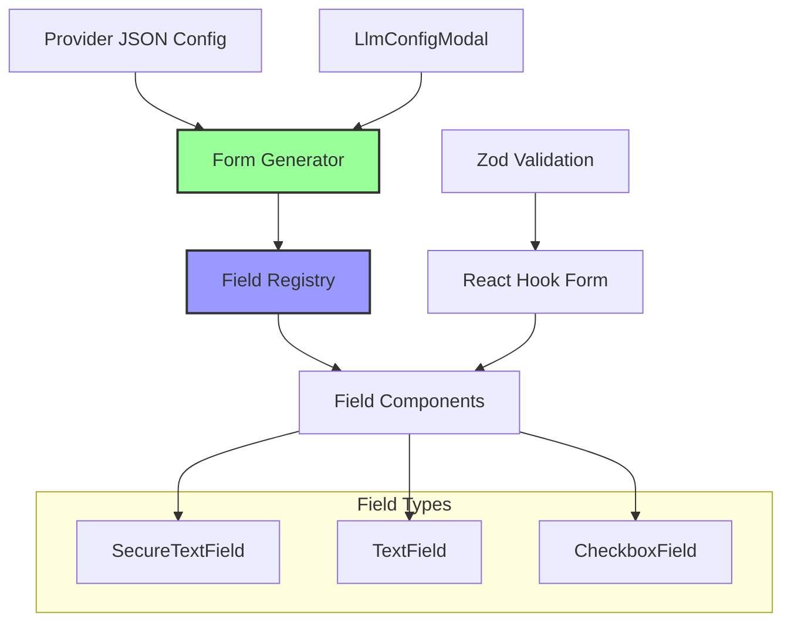
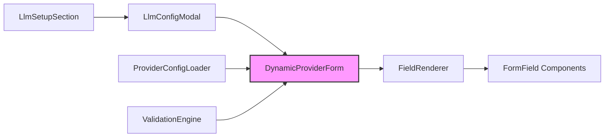

## Purpose and Goals

Create a dynamic form generation system that renders provider configuration forms based on JSON definitions. This epic focuses on the desktop UI implementation while maintaining patterns that could be adapted for mobile platforms.

## Major Components and Deliverables

1. **Dynamic Form Components**
   - Field type renderer system
   - Secure text input with show/hide toggle
   - Standard text input for URLs
   - Checkbox component for boolean options
   - Extensible component registry

2. **Form Generation Engine**
   - JSON-to-React component mapping
   - Dynamic validation rule application
   - Field dependency management
   - Conditional field rendering

3. **Provider Configuration UI Updates**
   - Update LlmConfigModal for dynamic fields
   - Provider dropdown populated from JSON
   - Empty state handling for no providers
   - Loading states during configuration reads

4. **Validation and Error Handling**
   - Dynamic Zod schema generation
   - Field-level validation messages
   - Form-level validation coordination
   - User-friendly error displays

## Detailed Acceptance Criteria

### Form Generation

- ✓ Forms generated entirely from JSON configuration
- ✓ All field types render correctly
- ✓ Field order preserved from configuration
- ✓ Labels, placeholders, and help text display properly
- ✓ Default values populate on form load

### Field Components

- ✓ Secure text fields hide/show API keys
- ✓ Text fields support all standard features
- ✓ Checkboxes toggle boolean values
- ✓ All fields integrate with React Hook Form
- ✓ Consistent styling with existing UI

### Provider Management

- ✓ Provider dropdown shows all from JSON
- ✓ "Add Another Provider" shows available options
- ✓ Each configuration gets unique ID
- ✓ Multiple configs of same provider supported
- ✓ Empty state guides user to add first provider

### Validation

- ✓ Required fields enforce non-empty values
- ✓ Field-specific validation rules apply
- ✓ Validation messages clear and helpful
- ✓ Form submission blocked until valid
- ✓ Real-time validation feedback

## Architecture Diagram

## Component Structure

## Technical Considerations

- Use existing shadcn/ui form components
- Maintain current LlmConfigModal structure
- Leverage React Hook Form patterns
- Keep field components reusable
- Consider future mobile form needs

## User Stories

1. **As a user**, I want to see form fields specific to my chosen provider
2. **As a user**, I want clear labels and help text for each field
3. **As a user**, I want immediate validation feedback
4. **As a developer**, I want to add new field types easily
5. **As a user**, I want my entered values preserved during edits

## Dependencies on Other Epics

- **E-configuration-infrastructure**: Requires JSON schemas and type definitions

## Estimated Scale

- 3-4 features
- ~15-20 tasks
- UI-focused implementation

## Non-functional Requirements

### Performance

- Form generation < 50ms
- Field rendering < 16ms (60fps)
- Validation feedback < 100ms
- No UI jank during form updates

### Usability

- Consistent with existing UI patterns
- Accessible form controls
- Keyboard navigation support
- Screen reader compatibility

### Maintainability

- Clear component boundaries
- Reusable field components
- Extensible for new field types
- Well-documented component API

### Log
