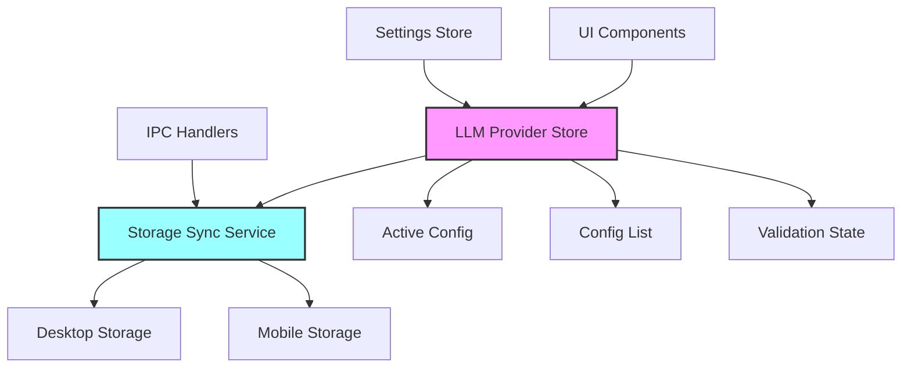
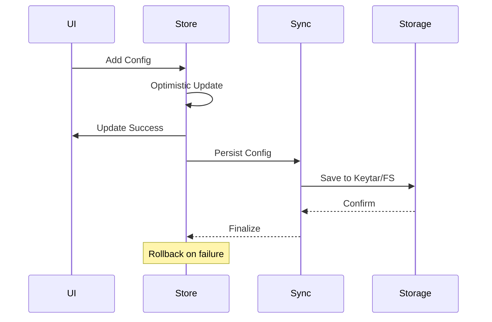

## Purpose and Goals

Integrate LLM provider configurations with the application's state management system using Zustand. This epic creates the necessary stores, actions, and synchronization mechanisms to manage provider configurations across the application lifecycle.

## Major Components and Deliverables

1. **LLM Provider Store (Shared Package)**
   - Cross-platform Zustand store for provider configs
   - Configuration CRUD operations
   - Active provider selection
   - Configuration validation state

2. **Store-Storage Synchronization**
   - Bi-directional sync with secure storage
   - Optimistic updates with rollback
   - Conflict resolution strategies
   - Background persistence

3. **UI State Integration**
   - Connect forms to provider store
   - Real-time configuration updates
   - Loading and error states
   - Multi-window synchronization

4. **Settings Integration**
   - Extend PersistedSettingsData for LLM configs
   - Migration for existing settings
   - Settings UI integration
   - Import/export capabilities

## Detailed Acceptance Criteria

### Store Implementation

- ✓ Zustand store in shared package (non-UI)
- ✓ Complete CRUD operations for configs
- ✓ Selection state for active provider
- ✓ Validation state management
- ✓ Optimistic update patterns

### Storage Synchronization

- ✓ Load configurations on app startup
- ✓ Save changes automatically
- ✓ Handle storage failures gracefully
- ✓ Sync across multiple windows
- ✓ Preserve data integrity

### UI Integration

- ✓ Forms update store directly
- ✓ UI reflects store changes immediately
- ✓ Loading states during operations
- ✓ Error states with recovery options
- ✓ No UI state in component local state

### Settings System

- ✓ LLM configs part of app settings
- ✓ Included in settings export
- ✓ Respect settings reset functionality
- ✓ Version migration support

## Architecture Diagram

## State Flow Diagram

## Technical Considerations

- Store in `packages/shared` for cross-platform use
- No UI logic in the store
- Use existing storage patterns
- Consider React Native compatibility
- Plan for offline functionality

## User Stories

1. **As a user**, I want my configurations available immediately on app start
2. **As a user**, I want changes saved automatically without manual action
3. **As a user**, I want to see loading states during save operations
4. **As a developer**, I want a single source of truth for configurations
5. **As a user**, I want my configs preserved across app updates

## Dependencies on Other Epics

- **E-configuration-infrastructure**: Requires types and interfaces
- **E-desktop-secure-storage**: Requires storage implementation

## Estimated Scale

- 3-4 features
- ~18-22 tasks
- Complex state synchronization

## Non-functional Requirements

### Performance

- Store operations < 1ms
- Sync operations non-blocking
- Startup load < 500ms
- Memory efficient for large configs

### Reliability

- No data loss on crashes
- Atomic operations
- Rollback capabilities
- Conflict resolution

### Developer Experience

- Type-safe store interface
- Clear action names
- Comprehensive logging
- Easy testing setup

### Log
