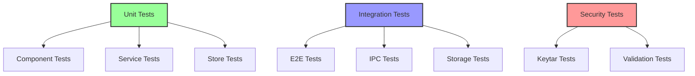
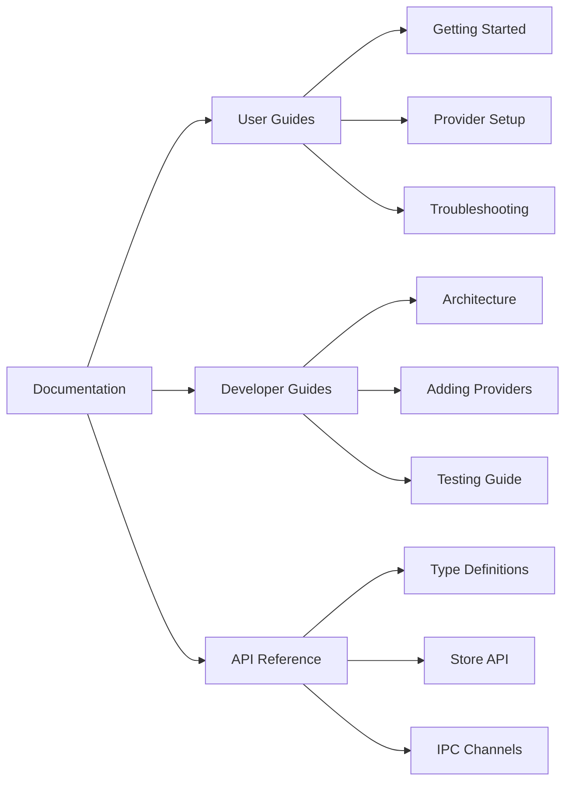

## Purpose and Goals

Ensure comprehensive testing coverage and documentation for the dynamic LLM provider system. This epic establishes quality assurance practices, automated testing, and clear documentation for users and developers.

## Major Components and Deliverables

1. **Unit Testing Suite**
   - Configuration loader tests
   - Storage service tests
   - Form generation tests
   - Store operation tests
   - Validation logic tests

2. **Integration Testing**
   - End-to-end configuration flow
   - Storage persistence verification
   - Multi-window synchronization
   - Settings integration tests
   - IPC communication tests

3. **Security Testing**
   - API key protection verification
   - Secure storage validation
   - Memory leak prevention
   - Permission handling tests

4. **Documentation**
   - User guide for LLM setup
   - Developer guide for adding providers
   - JSON schema documentation
   - API reference documentation
   - Migration guide from hardcoded system

## Detailed Acceptance Criteria

### Unit Tests

- ✓ 90%+ code coverage for new code
- ✓ All happy paths tested
- ✓ Error conditions validated
- ✓ Edge cases covered
- ✓ Mocked dependencies properly

### Integration Tests

- ✓ Complete user workflows tested
- ✓ Cross-component interactions verified
- ✓ Persistence across restarts
- ✓ Multi-window scenarios
- ✓ Platform-specific features tested

### Security Tests

- ✓ No plain text keys in storage
- ✓ Keys not visible in DevTools
- ✓ Memory properly cleared
- ✓ Keychain permissions handled
- ✓ Injection attacks prevented

### Documentation

- ✓ Clear setup instructions for users
- ✓ Provider addition guide for developers
- ✓ Troubleshooting section
- ✓ API documentation complete
- ✓ Code examples provided

## Testing Architecture

## Documentation Structure

## Technical Considerations

- Use Jest for unit testing
- Use Playwright for E2E tests
- Mock keytar in test environments
- Document in Markdown format
- Include code examples

## User Stories

1. **As a developer**, I want confidence that my changes don't break existing functionality
2. **As a user**, I want clear instructions for setting up providers
3. **As a developer**, I want to understand how to add new providers
4. **As a QA engineer**, I want comprehensive test coverage
5. **As a security auditor**, I want proof of secure key handling

## Dependencies on Other Epics

- All other epics must be complete for full testing

## Estimated Scale

- 4-5 features
- ~25-30 tasks
- Ongoing maintenance required

## Non-functional Requirements

### Quality Standards

- Zero failing tests in CI
- Documentation reviewed and approved
- Security tests mandatory
- Performance benchmarks included

### Maintainability

- Tests easy to update
- Documentation versioned
- Clear test naming
- Minimal test duplication

### Coverage Requirements

- Unit test coverage > 90%
- Integration test coverage > 80%
- Critical paths 100% covered
- Security scenarios comprehensive

### Log
