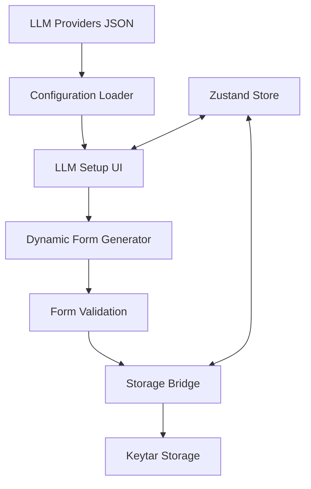
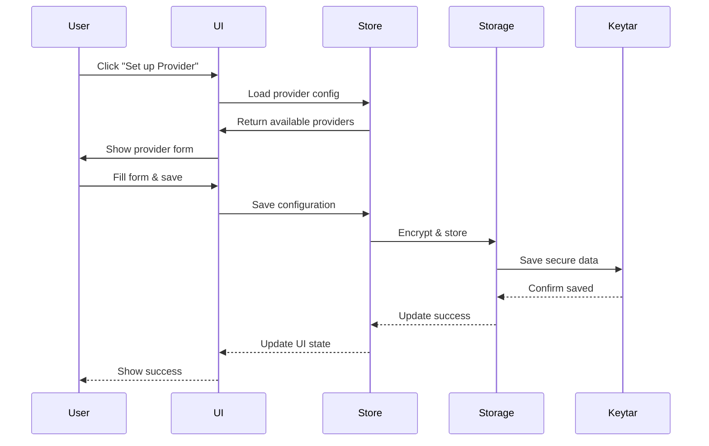
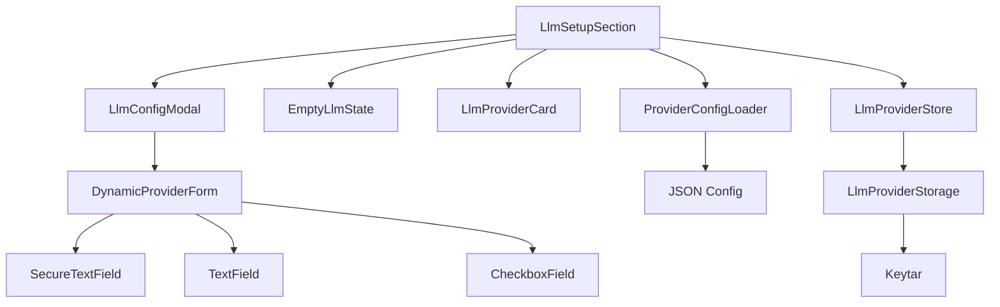

## Executive Summary

Implement a dynamic LLM provider configuration system for the Fishbowl desktop application's settings modal. This system will replace the current hard-coded provider dropdown with a JSON-driven configuration that enables easy addition of new AI providers without code changes. The implementation includes secure API key storage using keytar and an extensible form field system to support various provider requirements.

## Detailed Functional Requirements

### 1. Dynamic Provider Configuration

**Configuration File Management:**

- Create a JSON configuration file bundled with the application at `apps/desktop/assets/llm-providers.json`
- Configuration defines available providers, their models, and form field requirements
- No runtime updates to the configuration - changes require application rebuild
- Support provider-specific field types: secure-text, text, checkbox

**Provider Structure:**

- Each provider includes: id, name, available models, and field configurations
- Field configurations support: type, label, placeholder, required flag, helper text, and default values
- Extensible design to support future providers (Google Gemini, Ollama, etc.)

### 2. LLM Setup Tab Enhancement

**Dynamic Form Generation:**

- Read provider configuration from JSON file at component initialization
- Generate form fields dynamically based on provider's field configuration
- Support field types:
  - `secure-text`: Password input with show/hide toggle (for API keys)
  - `text`: Regular text input (for base URLs)
  - `checkbox`: Boolean toggle (for auth header options)
- Apply basic validation: required fields must be non-empty

**Provider Selection:**

- Empty state shows dropdown populated from JSON configuration
- "Add Another Provider" dropdown shows all available providers
- Each provider configuration gets a unique ID (auto-generated if not exists)

### 3. Secure Storage Implementation

**Desktop Storage with Keytar:**

- Use keytar for secure API key storage on desktop platform
- Storage key format: `fishbowl.<provider-id>.<config-id>`
- Store each configuration independently for easy management
- Implement storage bridge pattern for platform abstraction

**Storage Operations:**

- Save: Encrypt and store configuration when user saves
- Load: Retrieve and decrypt configurations on app startup
- Update: Overwrite existing configuration with same ID
- Delete: Remove configuration from secure storage

### 4. Integration Requirements

**Settings System Integration:**

- Integrate with existing settings modal and navigation
- Maintain current UI/UX patterns from LlmSetupSection component
- Use existing form handling with React Hook Form
- Apply existing shadcn/ui components and styling

**State Management:**

- Create Zustand store for LLM provider configurations
- Sync UI state with secure storage on save/delete actions
- Handle loading state while retrieving stored configurations
- Maintain configuration list in memory for quick access

## Technical Requirements and Constraints

### Architecture Overview



### File Structure

```
apps/desktop/
├── assets/
│   └── llm-providers.json
├── src/
│   ├── components/settings/
│   │   └── llm-setup/
│   │       ├── DynamicProviderForm.tsx
│   │       └── ProviderConfigLoader.tsx
│   └── services/
│       └── llmProviderStorage.ts
packages/shared/
├── src/
│   ├── stores/
│   │   └── llmProviderStore.ts
│   └── types/
│       └── llmProvider.ts
```

### Component Architecture

**ProviderConfigLoader:**

- Loads and parses llm-providers.json
- Provides configuration to UI components
- Handles configuration errors gracefully

**DynamicProviderForm:**

- Generates form fields based on provider configuration
- Implements field type renderers
- Handles form validation and submission

**LlmProviderStorage Service:**

- Implements secure storage operations using keytar
- Provides async methods for CRUD operations
- Handles encryption/decryption transparently

## User Stories

1. **As a user**, I want to configure any supported LLM provider without waiting for code updates
2. **As a user**, I want my API keys stored securely and not visible in plain text
3. **As a user**, I want provider-specific options (like base URLs) to be available when needed
4. **As a developer**, I want to add new providers by updating JSON configuration only
5. **As a user**, I want to manage multiple configurations of the same provider type

## Detailed Acceptance Criteria

### Configuration Loading

- ✓ JSON configuration loads successfully on component mount
- ✓ Missing or invalid JSON shows appropriate error state
- ✓ Provider list in dropdown matches JSON configuration
- ✓ Form fields generate correctly for each provider type

### Dynamic Form Behavior

- ✓ Required fields show validation errors when empty
- ✓ Field types render appropriate input components
- ✓ Default values populate correctly from configuration
- ✓ Helper text displays below each field
- ✓ Form submission disabled until required fields filled

### Secure Storage

- ✓ API keys save to keytar on form submission
- ✓ Stored configurations load on app startup
- ✓ Edit operation retrieves and decrypts stored values
- ✓ Delete operation removes from both UI and keytar
- ✓ Storage errors show user-friendly messages

### UI Integration

- ✓ Empty state shows when no configurations exist
- ✓ Provider cards display for each configuration
- ✓ Add/Edit/Delete operations work seamlessly
- ✓ UI updates immediately after storage operations
- ✓ Loading states show during async operations

## Architecture Diagrams

### Data Flow



### Component Hierarchy



## Non-functional Requirements

### Performance

- Configuration loading < 100ms
- Form generation < 50ms
- Storage operations < 500ms
- No UI blocking during async operations

### Security

- API keys never logged or displayed in plain text
- Keytar handles OS-level encryption
- Configuration IDs use cryptographically secure random generation
- No sensitive data in browser DevTools

### Extensibility

- New providers require only JSON updates
- New field types follow established pattern
- Storage bridge supports future platforms
- Validation rules configurable per field

### Code Quality

- TypeScript strict mode compliance
- Comprehensive error handling
- Unit tests for storage operations
- Integration tests for form generation

## Implementation Notes

### Phase 1: Core Infrastructure

1. Create type definitions for provider configuration
2. Implement configuration loader
3. Set up Zustand store for provider state
4. Create storage bridge interface

### Phase 2: Dynamic Forms

1. Implement dynamic form generator
2. Create field type components
3. Add validation logic
4. Connect to existing modal system

### Phase 3: Secure Storage

1. Implement keytar integration
2. Create storage service
3. Add encryption/decryption
4. Handle storage errors

### Phase 4: Integration

1. Update existing LlmSetupSection
2. Connect to Zustand store
3. Add loading states
4. Implement error boundaries

## Success Metrics

- Zero hard-coded provider logic in UI components
- All provider configuration driven by JSON
- Secure storage working across Windows/Mac/Linux
- New providers addable without touching TypeScript code
- Existing UI functionality preserved and enhanced

### Log
