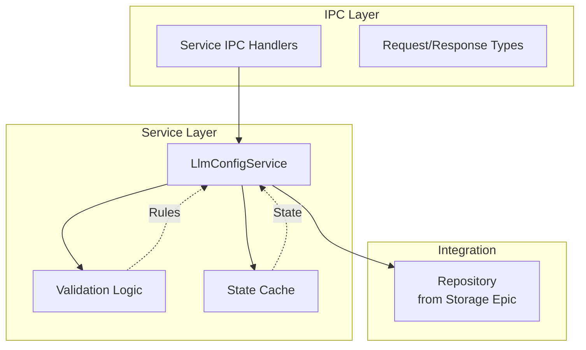

# Business Logic and Service Layer

## Purpose and Goals

Implement the core business logic for managing LLM configurations, including CRUD operations, validation, state management, and service orchestration. This layer provides the business rules and operations that sit between the storage layer and the UI layer.

## Major Components and Deliverables

### 1. LLM Configuration Service

- Implementation of `LlmConfigService.ts` in main process
- Complete CRUD operations (Create, Read, Update, Delete, List)
- Business rule enforcement
- Configuration validation logic
- State management and caching

### 2. Data Validation

- Zod schemas for LLM configuration types
- Input validation for all operations
- API key format validation
- Custom name and URL validation
- Error message standardization

### 3. Service IPC Handlers

- IPC handlers for service operations
- Request/response type definitions
- Error handling and serialization
- Channel definitions for operations

### 4. State Management

- In-memory configuration cache
- State synchronization logic
- Configuration loading on startup
- Change propagation mechanisms

## Detailed Acceptance Criteria

### Service Operations

- ✓ Create operation adds new configuration with validation
- ✓ Read operation retrieves single configuration by ID
- ✓ Update operation modifies existing configuration
- ✓ Delete operation removes configuration completely
- ✓ List operation returns all configurations
- ✓ All operations include proper error handling

### Validation Requirements

- ✓ Zod schemas validate all input data
- ✓ Required fields are enforced (customName, provider, apiKey)
- ✓ API key format is validated per provider requirements
- ✓ Base URLs are validated as proper URLs
- ✓ Invalid data rejected with clear error messages

### Business Rules

- ✓ Duplicate configuration names are prevented
- ✓ Provider-specific validation rules applied
- ✓ Configuration limits enforced if needed
- ✓ Default values applied where appropriate
- ✓ State consistency maintained across operations

### State Management

- ✓ Configurations loaded on app startup
- ✓ In-memory cache stays synchronized with storage
- ✓ Changes propagated to all consumers
- ✓ Cache invalidation on updates
- ✓ Efficient retrieval from cache

## Technical Considerations

### Architecture Pattern



### Service Interface Design

```typescript
interface LlmConfigService {
  create(config: LlmConfigInput): Promise<LlmConfig>;
  read(id: string): Promise<LlmConfig>;
  update(id: string, updates: Partial<LlmConfigInput>): Promise<LlmConfig>;
  delete(id: string): Promise<void>;
  list(): Promise<LlmConfig[]>;
  initialize(): Promise<void>;
}
```

### Key Design Decisions

- Service layer owns all business logic
- Validation happens before storage operations
- Caching for performance optimization
- Clean separation from storage concerns
- Follow existing service patterns in codebase

### File Structure

```
apps/desktop/src/
├── electron/
│   ├── services/
│   │   └── LlmConfigService.ts
│   └── llmConfigHandlers.ts (service-specific handlers)
└── types/
    └── llmConfig.ts (desktop-specific types)

packages/shared/src/
└── types/
    └── llmConfig.ts (shared schemas and types)
```

## Dependencies

- **E-storage-and-repository-layer**: Requires repository implementation for data persistence

## Estimated Scale

- 4-5 features covering service implementation, validation, state management, and IPC integration
- Core business logic for all LLM operations

## User Stories

1. **As a user**, I want validation of my configuration so that I don't enter invalid data
2. **As a user**, I want immediate feedback on errors so that I can correct them
3. **As a developer**, I need centralized business logic so that rules are consistently applied
4. **As a system**, I need efficient state management so that performance is optimal

## Non-functional Requirements

### Performance

- Service operations complete within 50ms (excluding storage)
- Efficient caching reduces storage calls
- Batch operations where appropriate
- Minimal memory footprint for cache

### Reliability

- Comprehensive error handling
- Graceful degradation strategies
- State recovery mechanisms
- Detailed logging for debugging

### Maintainability

- Clean separation of concerns
- Well-documented business rules
- Testable service methods
- Consistent error patterns

### Scalability

- Support for multiple configurations per provider
- Efficient handling of configuration lists
- Cache size management
- Prepared for future feature additions

### Log
