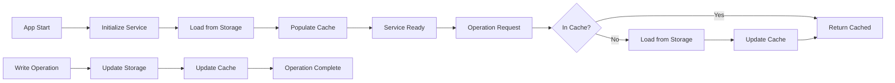

# State Management System

## Purpose and Functionality

Implement an efficient in-memory state management system for LLM configurations that provides caching, synchronization, and change propagation. This system ensures fast access to configurations without repeated storage calls and maintains consistency across the application.

## Key Components to Implement

### 1. Configuration Cache

- In-memory cache within the LlmConfigService
- Efficient storage and retrieval mechanisms
- Cache invalidation strategies
- Memory management for scalability

### 2. State Synchronization

- Loading configurations on application startup
- Keeping cache synchronized with storage
- Handling concurrent modifications
- Ensuring data consistency

### 3. Change Propagation

- Notifying consumers of configuration changes
- Event-based update mechanism
- Efficient update distribution
- Preventing unnecessary re-renders

### 4. Initialization Logic

- Startup configuration loading
- Error recovery mechanisms
- Default state handling
- Graceful degradation

## Detailed Acceptance Criteria

### Cache Implementation

- ✓ In-memory Map or object for configuration storage
- ✓ O(1) lookup time for configuration by ID
- ✓ Cache populated on service initialization
- ✓ Cache updated on all write operations
- ✓ Memory-efficient storage structure

### Synchronization Logic

- ✓ Cache loads all configurations on startup
- ✓ Create operations update cache immediately
- ✓ Update operations refresh cache entry
- ✓ Delete operations remove from cache
- ✓ List operations use cache when possible

### Change Management

- ✓ Service emits events on configuration changes
- ✓ Changes are atomic (cache and storage in sync)
- ✓ Failed operations don't corrupt cache
- ✓ Rollback capability for failed updates
- ✓ Cache can be manually refreshed if needed

### Initialization Behavior

- ✓ Service initializes cache on first use
- ✓ Handles empty configuration state
- ✓ Recovers from corrupted storage
- ✓ Logs initialization status
- ✓ Non-blocking initialization

## Technical Requirements

### Cache Structure

```typescript
class LlmConfigService {
  private cache: Map<string, LlmConfig> = new Map();
  private initialized: boolean = false;

  async initialize(): Promise<void> {
    if (this.initialized) return;

    try {
      // Load all configurations from storage
      const configs = await this.storageService.loadAll();

      // Populate cache
      configs.forEach((config) => {
        this.cache.set(config.id, config);
      });

      this.initialized = true;
      logger.info(`Loaded ${configs.length} LLM configurations`);
    } catch (error) {
      logger.error("Failed to initialize LLM config cache", error);
      // Continue with empty cache
      this.initialized = true;
    }
  }
}
```

### Cache Operations

```typescript
// Read from cache
async read(id: string): Promise<LlmConfig | null> {
  await this.ensureInitialized();
  return this.cache.get(id) || null;
}

// Update cache on write
async create(input: LlmConfigInput): Promise<LlmConfig> {
  await this.ensureInitialized();

  const config = await this.createConfiguration(input);

  // Update cache
  this.cache.set(config.id, config);

  return config;
}

// List from cache
async list(): Promise<LlmConfig[]> {
  await this.ensureInitialized();
  return Array.from(this.cache.values());
}
```

### State Consistency

```typescript
// Ensure atomic updates
async update(id: string, updates: Partial<LlmConfigInput>): Promise<LlmConfig> {
  await this.ensureInitialized();

  const existing = this.cache.get(id);
  if (!existing) {
    throw new ConfigNotFoundError(`Configuration ${id} not found`);
  }

  // Create updated config
  const updated = { ...existing, ...updates, updatedAt: new Date().toISOString() };

  try {
    // Save to storage first
    await this.storageService.save(updated);

    // Update cache only if storage succeeds
    this.cache.set(id, updated);

    return updated;

  } catch (error) {
    // Cache remains unchanged on failure
    logger.error('Failed to update configuration', { id, error });
    throw error;
  }
}
```

### Initialization Pattern

```typescript
private async ensureInitialized(): Promise<void> {
  if (!this.initialized) {
    await this.initialize();
  }
}

// Lazy initialization on first operation
async list(): Promise<LlmConfig[]> {
  await this.ensureInitialized();
  return Array.from(this.cache.values());
}
```

## Implementation Guidance

### State Management Strategy

1. Use Map for O(1) lookups
2. Keep cache as single source of truth after initialization
3. Always update storage before cache
4. Handle partial failures gracefully
5. Provide cache refresh capability

### Memory Management

- Monitor cache size
- Implement cache limits if needed
- Use weak references where appropriate
- Clear cache on app shutdown
- Avoid memory leaks

### Error Recovery

```typescript
async initialize(): Promise<void> {
  try {
    const configs = await this.storageService.loadAll();
    this.populateCache(configs);
  } catch (error) {
    // Log error but continue with empty cache
    logger.error('Cache initialization failed, starting with empty cache', error);
    this.cache.clear();
  }
  this.initialized = true;
}
```

### Performance Optimization

- Load all configs in single storage read
- Use cache for all read operations
- Batch updates when possible
- Avoid unnecessary cache iterations
- Lazy initialization pattern

## Testing Requirements

### Unit Tests

- Test cache initialization
- Test cache operations (CRUD)
- Test state synchronization
- Test error recovery
- Test memory management

### Test Scenarios

1. Cache initializes with existing configurations
2. Cache initializes with empty storage
3. Cache handles storage errors during init
4. Create updates cache correctly
5. Update maintains cache consistency
6. Delete removes from cache
7. List returns cached values
8. Concurrent operations handled safely
9. Failed operations don't corrupt cache
10. Cache can be refreshed manually

## Security Considerations

- Don't cache sensitive data unnecessarily
- Clear cache on security events
- Validate cached data integrity
- Prevent cache poisoning
- Memory-safe operations

## Performance Requirements

### Cache Performance

- Initialization < 100ms for 100 configs
- Cache lookups < 1ms
- Cache updates < 5ms
- Memory usage < 1MB for 100 configs
- No memory leaks

### Optimization Targets

- Minimize storage calls
- Efficient memory usage
- Fast startup time
- Quick operation response
- Scalable to 1000+ configs

## Integration Requirements

### Service Integration

- Cache integrated into LlmConfigService
- Transparent to service consumers
- Maintains existing service interface
- Compatible with IPC handlers

### Storage Integration

- Initial load from storage
- Write-through cache pattern
- Handle storage failures gracefully
- Sync on storage changes

## State Flow Diagram



## Dependencies on Other Features

- Depends on F-core-llm-configuration-service for integration
- Uses storage service from the storage layer epic
- Provides caching for F-ipc-communication-layer operations

### Log
