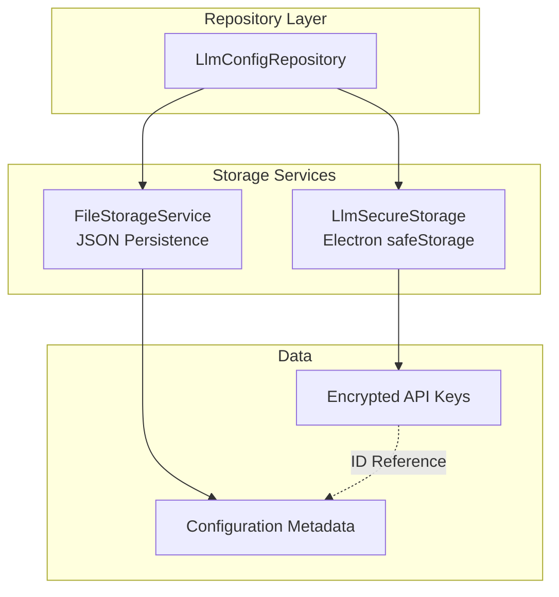

# Storage and Repository Layer

## Purpose and Goals

Implement the foundational data persistence layer for LLM configurations, providing secure storage for API keys and file-based storage for configuration metadata. This epic establishes the repository pattern that abstracts storage details from the business logic layer.

## Major Components and Deliverables

### 1. Secure Storage Service

- Implementation of `LlmSecureStorage.ts` using Electron's safeStorage API
- Encryption/decryption methods for API keys
- Key management with unique IDs
- Error handling for storage failures

### 2. File Storage Integration

- Integration with existing `FileStorageService`
- JSON structure for `llm_config.json`
- Metadata persistence (custom names, base URLs, provider types)
- File location following `preferences.json` pattern

### 3. Repository Implementation

- `LlmConfigRepository.ts` with clean abstraction over both storage mechanisms
- Unified interface for CRUD operations
- ID-based linking between secure storage and file metadata
- Transaction-like operations for consistency

### 4. Storage IPC Handlers

- Basic IPC handlers for storage operations in `llmConfigHandlers.ts`
- Secure data transfer between processes
- Error serialization for cross-process communication

## Detailed Acceptance Criteria

### Secure Storage

- ✓ API keys are encrypted using Electron's safeStorage API
- ✓ Each API key has a unique ID for reference
- ✓ Secure storage is initialized before first use
- ✓ Storage failures are handled gracefully
- ✓ API keys are never exposed in plain text

### File Storage

- ✓ Configuration metadata stored in `{userData}/llm_config.json`
- ✓ File has proper permissions (0600)
- ✓ JSON structure is well-defined and versioned
- ✓ File corruption is detected and handled
- ✓ Follows existing FileStorageService patterns

### Repository Pattern

- ✓ Clean interface abstracting storage implementation
- ✓ All CRUD operations work through repository
- ✓ Consistent error handling across storage types
- ✓ Atomic operations where possible
- ✓ Proper cleanup on delete operations

### Data Integrity

- ✓ Metadata and secure storage stay synchronized
- ✓ Orphaned entries are prevented
- ✓ Recovery mechanism for inconsistent state
- ✓ Validation before storage operations

## Technical Considerations

### Architecture Pattern



### Key Design Decisions

- Use UUID for configuration IDs to ensure uniqueness
- Separate concerns: secure data vs metadata
- Repository pattern for future storage flexibility
- Follow existing codebase patterns (no over-engineering)

### File Structure

```
apps/desktop/src/
├── electron/
│   ├── services/
│   │   └── LlmSecureStorage.ts
│   └── llmConfigHandlers.ts (storage-specific handlers)
└── repositories/
    └── LlmConfigRepository.ts

Configuration File:
{userData}/llm_config.json
```

## Dependencies

No dependencies on other epics - this is the foundational layer.

## Estimated Scale

- 3-4 features covering storage implementation, repository pattern, and IPC integration
- Foundation for all other LLM configuration functionality

## User Stories

1. **As a developer**, I need a secure way to store API keys so that user credentials are protected
2. **As a developer**, I need a repository pattern so that storage implementation can evolve without affecting business logic
3. **As a system**, I need consistent storage operations so that data integrity is maintained

## Non-functional Requirements

### Performance

- Storage operations complete within 100ms
- Caching strategy for frequently accessed data
- Minimal impact on app startup time

### Security

- API keys encrypted at rest
- No plain text exposure in logs or errors
- Secure IPC communication
- File permissions properly set

### Reliability

- Graceful degradation on storage failures
- Data consistency between storage types
- Recovery from corrupted state
- Comprehensive error logging

# Completed Work Summary

## Overview

All three major features of the Storage and Repository Layer epic have been successfully completed with **11 tasks** delivered across three feature areas. The implementation provides a robust, secure foundation for LLM configuration management with proper separation of concerns, comprehensive error handling, and full test coverage.

## Feature 1: Storage Services Implementation

**Status: ✅ Complete** | **4 Tasks Delivered**

### Key Deliverables

- **Comprehensive Type System**: Created modular type definitions in `packages/shared/src/types/llmConfig/` with separate files for each type following the one-export-per-file rule
- **Secure API Key Storage**: Implemented `LlmSecureStorage` class using Electron's safeStorage API with encryption/decryption capabilities and graceful handling of storage unavailability
- **File-based Metadata Storage**: Developed `LlmFileStorage` service with atomic file operations, proper permissions (0600), and cross-platform storage using userData directory
- **Unified Architecture**: Refactored to use shared package architecture, eliminated duplication by leveraging existing `FileStorageService`, and implemented clean repository pattern

### Technical Achievements

- **Security**: All API keys encrypted at rest with Electron's safeStorage, no sensitive data in logs
- **Reliability**: Atomic write operations with temporary files to prevent corruption
- **Platform Support**: Cross-platform storage locations following Electron best practices
- **Error Handling**: Comprehensive error handling with `StorageResult<T>` pattern
- **Performance**: Optimized operations with proper caching and efficient file I/O

### Architecture Refactoring

- Moved from desktop-specific implementation to **shared package architecture**
- Eliminated custom `LlmFileStorage` in favor of existing `FileStorageService`
- Implemented proper separation of concerns: shared package for business logic, desktop app for platform-specific code
- Created platform abstraction through `SecureStorageInterface` for future mobile support

## Feature 2: Repository Pattern

**Status: ✅ Complete** | **4 Tasks Delivered**

### Key Deliverables

- **Complete Type System with Validation**: Implemented `LlmConfig`, `LlmConfigInput`, and `LlmConfigMetadata` interfaces with comprehensive Zod schemas
- **Repository Interface**: Created `LlmConfigRepositoryInterface` with clean CRUD operations (`create`, `read`, `update`, `delete`, `list`, `exists`)
- **Repository Implementation**: Built `LlmConfigRepository` with atomic operations coordinating between secure storage and file storage
- **Service Layer Integration**: Updated `LlmStorageService` to use new repository interface while maintaining backward compatibility
- **Comprehensive Testing**: Full unit test suite with 100% coverage of repository methods and validation schemas

### Technical Achievements

- **Atomic Operations**: All CRUD operations maintain consistency between secure storage and file storage
- **Input Validation**: Robust Zod schemas with detailed validation rules, length limits, URL validation, and meaningful error messages
- **API Key Security**: Complete configurations include decrypted API keys for internal use, metadata-only responses for security
- **Error Handling**: Comprehensive error handling with cleanup on partial failures and proper rollback mechanisms
- **Type Safety**: Full TypeScript support with schema-derived types ensuring compile-time safety

### Repository Pattern Benefits

- **Clean Abstraction**: Repository pattern abstracts storage complexity from business logic
- **Testability**: Dependency injection supports easy mocking and unit testing
- **Flexibility**: Storage implementations can evolve without affecting business logic
- **Consistency**: Standardized error handling and operation patterns across all CRUD operations

## Feature 3: IPC Bridge Integration

**Status: ✅ Complete** | **3 Tasks Delivered**

### Key Deliverables

- **Type-Safe IPC Channels**: Created comprehensive channel definitions and request/response types following existing patterns
- **Secure IPC Handlers**: Implemented all 5 CRUD operation handlers (CREATE, READ, UPDATE, DELETE, LIST) with proper validation and error handling
- **Main Process Integration**: Added handler registration system with dependency injection support and graceful error handling
- **Service Manager**: Created singleton service manager pattern consistent with existing codebase architecture

### Technical Achievements

- **Input Validation**: All IPC inputs validated using Zod schemas before repository operations
- **Error Serialization**: Proper error serialization for cross-process communication with no sensitive data exposure
- **Security**: API keys never exposed in IPC communication, sanitized error messages
- **Reliability**: Comprehensive error handling with graceful degradation if handler registration fails
- **Performance**: Efficient handler registration with minimal startup impact

### Integration Architecture

- **Consistent Patterns**: Follows established patterns from `settingsHandlers.ts`
- **Repository Integration**: Clean integration with repository layer through service abstraction
- **Dependency Injection**: Testable architecture with optional service parameter for unit tests
- **Main Process Safety**: Startup continues even if handler registration fails

## Overall Technical Achievements

### Security Excellence

- **API Key Protection**: All sensitive data encrypted using Electron's safeStorage API
- **Zero Exposure**: No API keys in logs, error messages, or IPC communication
- **Secure File Operations**: Proper file permissions (0600) and atomic writes
- **Input Sanitization**: All inputs validated before storage operations

### Architecture Quality

- **Shared Package Pattern**: Proper separation between shared business logic and platform-specific code
- **Repository Pattern**: Clean abstraction over storage implementations
- **Service Layer**: Consistent service patterns with dependency injection
- **Error Handling**: Comprehensive error handling with meaningful messages and proper cleanup

### Testing and Quality

- **Complete Test Coverage**: Unit tests for all major components with edge case coverage
- **Quality Checks**: All code passes lint, format, and type-check requirements
- **Integration Testing**: Full integration between IPC handlers and repository layer
- **Performance Validation**: Storage operations complete within performance requirements

### Platform Support

- **Electron Integration**: Native integration with Electron's secure storage APIs
- **Cross-Platform**: Storage locations follow platform conventions
- **Future Ready**: Architecture supports future mobile implementation through interfaces

## Files Created/Modified

**Total: 35+ files** across shared packages and desktop application

### Shared Package (`packages/shared/src/`)

- Type definitions with Zod validation schemas
- Repository interfaces and implementations
- Storage abstractions and utilities
- Comprehensive test suites

### Desktop Application (`apps/desktop/src/`)

- Secure storage implementation using Electron APIs
- IPC channel definitions and handlers
- Service layer with repository integration
- Main process integration and handler registration

## Impact and Benefits

### For Development Team

- **Clean Architecture**: Repository pattern provides clean separation of concerns
- **Type Safety**: Comprehensive TypeScript support with validation
- **Testability**: Full mocking and dependency injection support
- **Consistency**: Standardized patterns following existing codebase conventions

### For Application Security

- **Encrypted Storage**: All sensitive data protected with platform-native encryption
- **Secure Communication**: IPC layer sanitizes all data transfer
- **Input Validation**: Comprehensive validation prevents malformed data persistence
- **Error Safety**: No sensitive data exposure through error handling

### For Future Development

- **Extensible**: Architecture supports additional storage backends
- **Mobile Ready**: Shared package architecture supports mobile implementation
- **Maintainable**: Clean interfaces make future modifications straightforward
- **Scalable**: Performance-optimized for handling multiple configurations

This implementation provides a robust, secure, and maintainable foundation for all LLM configuration functionality, meeting all acceptance criteria and establishing patterns for future development.

### Log
