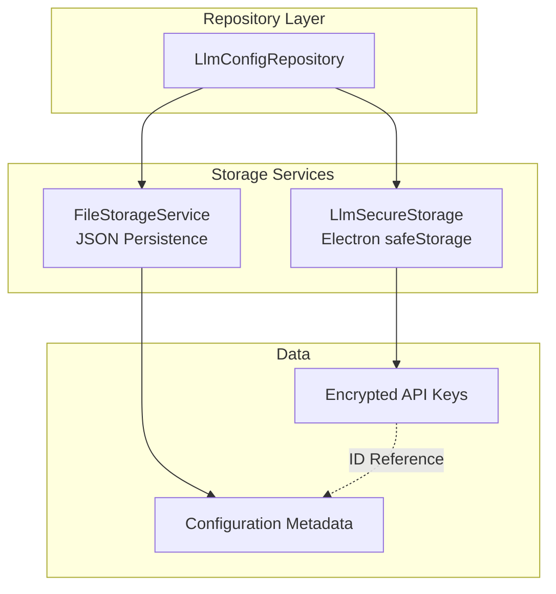

# Storage and Repository Layer

## Purpose and Goals

Implement the foundational data persistence layer for LLM configurations, providing secure storage for API keys and file-based storage for configuration metadata. This epic establishes the repository pattern that abstracts storage details from the business logic layer.

## Major Components and Deliverables

### 1. Secure Storage Service

- Implementation of `LlmSecureStorage.ts` using Electron's safeStorage API
- Encryption/decryption methods for API keys
- Key management with unique IDs
- Error handling for storage failures

### 2. File Storage Integration

- Integration with existing `FileStorageService`
- JSON structure for `llm_config.json`
- Metadata persistence (custom names, base URLs, provider types)
- File location following `preferences.json` pattern

### 3. Repository Implementation

- `LlmConfigRepository.ts` with clean abstraction over both storage mechanisms
- Unified interface for CRUD operations
- ID-based linking between secure storage and file metadata
- Transaction-like operations for consistency

### 4. Storage IPC Handlers

- Basic IPC handlers for storage operations in `llmConfigHandlers.ts`
- Secure data transfer between processes
- Error serialization for cross-process communication

## Detailed Acceptance Criteria

### Secure Storage

- ✓ API keys are encrypted using Electron's safeStorage API
- ✓ Each API key has a unique ID for reference
- ✓ Secure storage is initialized before first use
- ✓ Storage failures are handled gracefully
- ✓ API keys are never exposed in plain text

### File Storage

- ✓ Configuration metadata stored in `{userData}/llm_config.json`
- ✓ File has proper permissions (0600)
- ✓ JSON structure is well-defined and versioned
- ✓ File corruption is detected and handled
- ✓ Follows existing FileStorageService patterns

### Repository Pattern

- ✓ Clean interface abstracting storage implementation
- ✓ All CRUD operations work through repository
- ✓ Consistent error handling across storage types
- ✓ Atomic operations where possible
- ✓ Proper cleanup on delete operations

### Data Integrity

- ✓ Metadata and secure storage stay synchronized
- ✓ Orphaned entries are prevented
- ✓ Recovery mechanism for inconsistent state
- ✓ Validation before storage operations

## Technical Considerations

### Architecture Pattern



### Key Design Decisions

- Use UUID for configuration IDs to ensure uniqueness
- Separate concerns: secure data vs metadata
- Repository pattern for future storage flexibility
- Follow existing codebase patterns (no over-engineering)

### File Structure

```
apps/desktop/src/
├── electron/
│   ├── services/
│   │   └── LlmSecureStorage.ts
│   └── llmConfigHandlers.ts (storage-specific handlers)
└── repositories/
    └── LlmConfigRepository.ts

Configuration File:
{userData}/llm_config.json
```

## Dependencies

No dependencies on other epics - this is the foundational layer.

## Estimated Scale

- 3-4 features covering storage implementation, repository pattern, and IPC integration
- Foundation for all other LLM configuration functionality

## User Stories

1. **As a developer**, I need a secure way to store API keys so that user credentials are protected
2. **As a developer**, I need a repository pattern so that storage implementation can evolve without affecting business logic
3. **As a system**, I need consistent storage operations so that data integrity is maintained

## Non-functional Requirements

### Performance

- Storage operations complete within 100ms
- Caching strategy for frequently accessed data
- Minimal impact on app startup time

### Security

- API keys encrypted at rest
- No plain text exposure in logs or errors
- Secure IPC communication
- File permissions properly set

### Reliability

- Graceful degradation on storage failures
- Data consistency between storage types
- Recovery from corrupted state
- Comprehensive error logging

### Log
