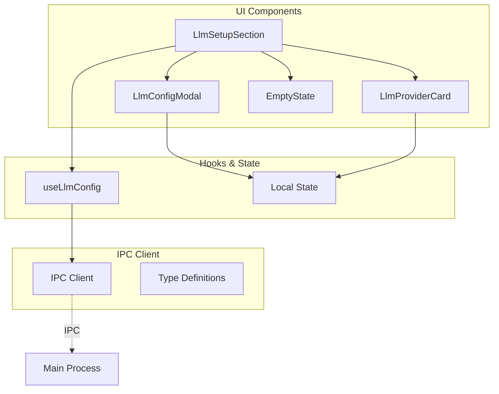
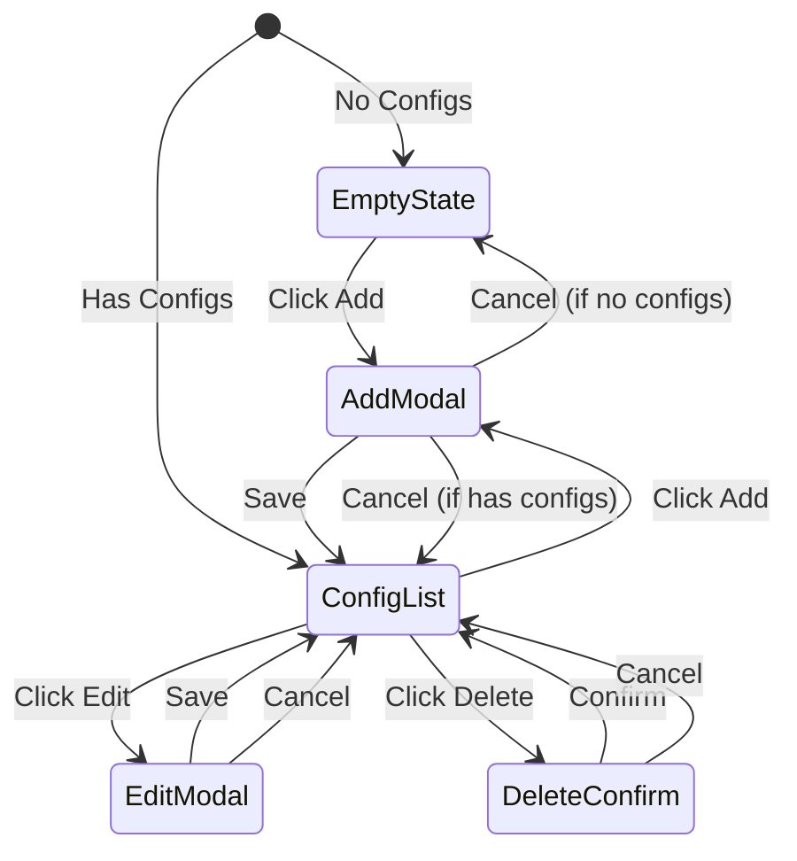

# UI and Frontend Integration

## Purpose and Goals

Implement the user interface and frontend integration for LLM configuration management. This epic delivers the React components, hooks, and IPC client integration that enables users to configure, view, edit, and delete LLM provider settings through the desktop application's UI.

## Major Components and Deliverables

### 1. React Components

- Update existing `LlmSetupSection` component for configuration management
- Configuration card components for displaying providers
- Modal components for add/edit operations
- Empty state component for no configurations
- Delete confirmation dialogs

### 2. React Hooks

- Implementation of `useLlmConfig` hook for data access
- State management within components
- Loading and error state handling
- Optimistic UI updates

### 3. IPC Client Integration

- Frontend IPC client for communication with main process
- Type-safe request/response handling
- Error handling and user feedback
- Async operation management

### 4. UI State Management

- Local component state for forms
- Configuration list management
- Modal open/close states
- Form validation and error display

## Detailed Acceptance Criteria

### Component Requirements

- ✓ LlmSetupSection displays all configured providers
- ✓ Configuration cards show provider details clearly
- ✓ Add button opens configuration modal
- ✓ Edit action opens pre-filled modal
- ✓ Delete action shows confirmation dialog
- ✓ Empty state shown when no configurations exist

### User Interactions

- ✓ Can add new LLM provider configuration
- ✓ Can edit existing configuration
- ✓ Can delete configuration with confirmation
- ✓ Form validation provides immediate feedback
- ✓ Loading states during async operations
- ✓ Error messages displayed clearly

### Data Flow

- ✓ Configurations load on component mount
- ✓ Changes persist immediately to storage
- ✓ UI updates optimistically where appropriate
- ✓ Multiple components stay synchronized
- ✓ Refresh works without data loss

### Form Handling

- ✓ All required fields validated before submit
- ✓ API key input masked for security
- ✓ Custom name field with character limits
- ✓ Provider selection from dropdown
- ✓ Optional fields clearly marked

## Technical Considerations

### Component Architecture



### UI Flow Diagram



### Key Design Decisions

- Use existing UI patterns from settings pages
- Shadcn/ui components for consistency
- Optimistic updates for better UX
- Client-side validation before IPC calls
- Follow existing hook patterns

### File Structure

```
apps/desktop/src/
├── components/
│   └── settings/
│       └── llm-setup/
│           ├── LlmSetupSection.tsx
│           ├── LlmProviderCard.tsx
│           ├── LlmConfigModal.tsx
│           └── EmptyLlmState.tsx
├── hooks/
│   └── useLlmConfig.ts
└── lib/
    └── ipc/
        └── llmConfigClient.ts
```

## Dependencies

- **E-business-logic-and-service-layer**: Requires service layer for operations
- **E-storage-and-repository-layer**: Indirectly depends on storage through service

## Estimated Scale

- 3-4 features covering components, hooks, and IPC client integration
- Complete UI implementation for LLM configuration

## User Stories

1. **As a user**, I want an intuitive UI to manage my LLM configurations
2. **As a user**, I want immediate visual feedback when performing actions
3. **As a user**, I want clear error messages when something goes wrong
4. **As a user**, I want my API keys to be masked in the UI for security
5. **As a user**, I want to see all my configured providers at a glance

## Non-functional Requirements

### User Experience

- Responsive UI with loading states
- Clear visual hierarchy
- Consistent with existing app design
- Accessible keyboard navigation
- Mobile-responsive layout

### Performance

- Component renders within 16ms
- Optimistic updates for perceived speed
- Debounced form validation
- Efficient re-renders

### Security

- API keys masked in UI
- No sensitive data in component state
- Secure IPC communication
- XSS prevention in user inputs

### Accessibility

- ARIA labels for screen readers
- Keyboard navigation support
- Focus management in modals
- Color contrast compliance

### Testing

- E2E tests for complete workflows
- Component interaction tests
- Hook behavior tests
- IPC communication tests

### Log
