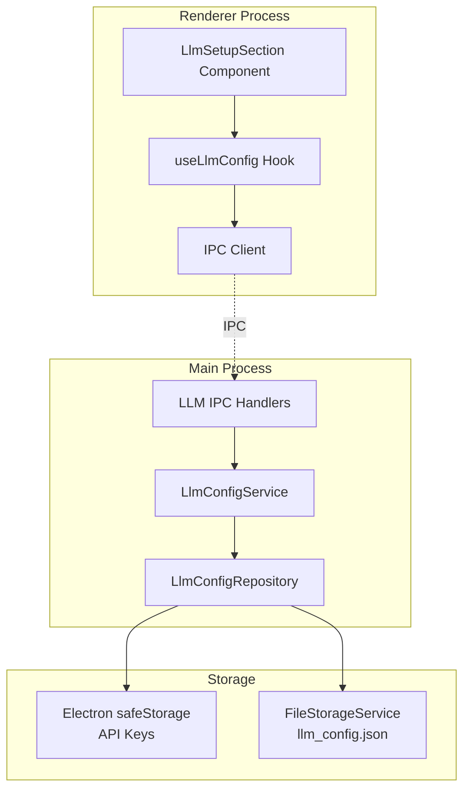

# LLM Configuration Persistence System

## Executive Summary

Implement a secure and robust persistence system for LLM provider configurations in the Fishbowl desktop application. The system will securely store API keys using Electron's safeStorage API while maintaining configuration metadata in a JSON file, following existing architectural patterns in the codebase.

## Detailed Functional Requirements

### 1. Secure API Key Storage

- Store all API keys in the system's secure storage using Electron's safeStorage API
- Each API key will be associated with a unique ID for reference
- Implement encryption/decryption through IPC handlers in the main process
- Support multiple API keys per provider (e.g., multiple OpenAI configurations)

### 2. Configuration Metadata Storage

- Store non-sensitive configuration data in `llm_config.json` file
- Metadata includes: custom names, base URLs, auth header preferences, provider types
- Link metadata to secure API keys via unique IDs
- Follow the existing `preferences.json` pattern for file storage

### 3. Data Operations

- **Create**: Add new LLM provider configurations with secure API key storage
- **Read**: Load configurations on app startup and provide to UI components
- **Update**: Modify existing configurations and update both secure and file storage
- **Delete**: Remove configurations and clean up both storage locations
- **List**: Retrieve all configured providers with their metadata

### 4. State Management

- Load configurations on application startup
- Cache configurations in memory for performance
- Update in-memory state when configurations change
- Propagate changes to all UI components that need them

## Technical Requirements and Constraints

### Technology Stack

- **Electron safeStorage API**: For secure API key encryption
- **IPC Communication**: For main/renderer process communication
- **FileStorageService**: Existing service for JSON file operations
- **Zod**: For configuration schema validation
- **TypeScript**: For type safety across the system

### Constraints

- Must follow existing architectural patterns (no over-engineering)
- Desktop-specific implementation (not shared with mobile)
- No keytar dependency (use Electron's built-in safeStorage)
- MVP phase - no performance optimization or integration testing
- Follow existing IPC handler patterns from settingsHandlers.ts

## Architecture Overview

The system follows a layered architecture with clear separation of concerns:

1. **Renderer Process (UI Layer)**
   - React components for LLM configuration UI
   - Hooks for accessing LLM configuration data
   - IPC client for communication with main process

2. **IPC Bridge Layer**
   - Channel definitions for LLM operations
   - Request/Response types for type safety
   - Error serialization for cross-process communication

3. **Main Process (Business Layer)**
   - IPC handlers for LLM operations
   - LLM configuration service for business logic
   - Integration with secure storage and file storage

4. **Storage Layer**
   - Secure storage service for API keys (Electron safeStorage)
   - File storage service for metadata (existing FileStorageService)
   - Repository pattern for data access abstraction

## Architecture Diagram



## User Stories

1. **As a user**, I want to configure multiple LLM providers so that I can use different AI models in my conversations
2. **As a user**, I want my API keys stored securely so that they are protected from unauthorized access
3. **As a user**, I want to edit existing configurations so that I can update API keys or settings
4. **As a user**, I want to delete configurations so that I can remove unused providers
5. **As a user**, I want my configurations to persist between app sessions so that I don't need to re-enter them

## Non-Functional Requirements

### Security

- API keys must be encrypted using Electron's safeStorage API
- API keys must never be stored in plain text
- API keys must not be included in logs or error messages
- Follow principle of least privilege for data access

### Performance

- Configuration loading should not block app startup
- In-memory caching to avoid repeated file/secure storage access
- Efficient update propagation to UI components

### Reliability

- Graceful handling of storage failures
- Validation of configuration data before storage
- Atomic operations where possible (all-or-nothing saves)

### Maintainability

- Follow existing code patterns and conventions
- Clear separation of concerns
- Comprehensive error handling and logging
- Type safety throughout the system

## Integration Requirements

### Existing Systems

- Integrate with existing FileStorageService for JSON operations
- Follow existing IPC handler patterns from settingsHandlers.ts
- Use existing logger service for debugging and error tracking
- Maintain compatibility with existing settings structure

### File Locations

- Configuration file: `{userData}/llm_config.json`
- Follow same path resolution as `preferences.json`
- Ensure proper file permissions (0600 for security)

## Deployment Strategy

### Implementation Phases

1. **Phase 1**: Implement storage layer (secure storage service, repository)
2. **Phase 2**: Implement IPC handlers and main process logic
3. **Phase 3**: Integrate with existing UI components
4. **Phase 4**: Add e2e tests for configuration workflows

### File Structure

```
apps/desktop/src/
├── electron/
│   ├── llmConfigHandlers.ts    # IPC handlers for LLM config
│   └── services/
│       └── LlmSecureStorage.ts # Secure storage implementation
├── repositories/
│   └── LlmConfigRepository.ts  # Repository for LLM configs
├── hooks/
│   └── useLlmConfig.ts         # React hook for UI access
└── types/
    └── llmConfig.ts            # TypeScript types

packages/shared/src/
└── types/
    └── llmConfig.ts            # Shared types and schemas
```

## Detailed Acceptance Criteria

### Configuration Storage

- ✓ API keys are encrypted using Electron's safeStorage API
- ✓ Metadata is stored in llm_config.json with proper structure
- ✓ Each configuration has a unique ID linking metadata to secure storage
- ✓ File follows same location pattern as preferences.json

### CRUD Operations

- ✓ Can create new LLM provider configuration with all fields
- ✓ Can read all configurations on app startup
- ✓ Can update existing configuration including API key
- ✓ Can delete configuration and clean up both storages
- ✓ Changes persist across app restarts

### Data Validation

- ✓ Configuration data is validated using Zod schemas
- ✓ Invalid data is rejected with clear error messages
- ✓ API key format is validated before storage
- ✓ Required fields are enforced (customName, provider, apiKey)

### Error Handling

- ✓ Storage failures are handled gracefully with user feedback
- ✓ Corrupted configuration file can be recovered or reset
- ✓ Missing secure storage entries are handled properly
- ✓ All errors are logged with appropriate detail levels

### Security Requirements

- ✓ API keys are never exposed in plain text in logs
- ✓ API keys are not visible in DevTools or memory dumps
- ✓ Configuration file has restricted permissions (0600)
- ✓ Secure storage is properly initialized before use

### UI Integration

- ✓ Existing UI components receive configuration data
- ✓ Changes in UI are persisted immediately
- ✓ Multiple UI components stay synchronized
- ✓ Loading states are shown during async operations

### Testing Coverage

- ✓ E2E tests cover full configuration workflow
- ✓ Tests verify secure storage encryption
- ✓ Tests verify file storage persistence
- ✓ Tests cover error scenarios and recovery

### Log
