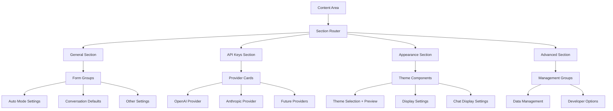

# Basic Settings Sections

## Purpose and Goals

Implement the four simpler settings sections (General, API Keys, Appearance, and Advanced) that don't require complex sub-navigation. These sections establish the form component patterns, styling standards, and layout structures that will be used throughout the settings modal.

## Settings Modal UI Specification

- `docs/specifications/settings-modal-ui-spec.md` - This document outlines the design and functional requirements for the settings modal, including dimensions, layout, navigation, content sections, and user experience considerations. Reference this document for detailed specifications on how the modal should look and behave.

## Major Components and Deliverables

### General Section

- Auto Mode Settings group with sliders and inputs (Response Delay, Maximum Messages, Maximum Wait Time)
- Conversation Defaults group with radio buttons and number inputs
- Other Settings group with toggle switches
- Proper form grouping with labels and helper text

### API Keys Section

- Provider subsections for OpenAI, Anthropic, and future providers
- Password input fields with show/hide toggle functionality
- Status indicators (visual-only) with appropriate icons and colors
- Test buttons (non-functional but properly styled)
- Expandable advanced settings for base URL configuration

### Appearance Section

- Theme selection with radio buttons and preview area
- Display settings for timestamps and conversation list options
- Chat display settings with font size slider and live preview
- Message spacing options with visual examples

### Advanced Section

- Data Management group with export/import/clear buttons
- Developer Options group with debug and experimental feature toggles
- Proper warning styling for destructive actions

## Architecture Diagram

## Detailed Acceptance Criteria

### General Section Implementation

- [ ] Section title: "General" with 24px font and 20px margin-bottom
- [ ] Section description with proper styling and spacing
- [ ] Auto Mode Settings group with clear group title and description
  - [ ] Response Delay slider (1-30 seconds) with current value display
  - [ ] Maximum Messages number input (0-500, 0=unlimited)
  - [ ] Maximum Wait Time number input (5-120 seconds)
- [ ] Conversation Defaults group with proper form structure
  - [ ] Default Mode radio buttons (Manual/Auto)
  - [ ] Maximum Agents number input (1-8)
- [ ] Other Settings group with toggle switch for update checking
- [ ] All helper text properly styled and positioned

### API Keys Section Implementation

- [ ] Provider subsections with clear visual separation
- [ ] OpenAI provider card with API key field, status, and base URL
- [ ] Anthropic provider card with same structure
- [ ] Password input fields with show/hide toggle button
- [ ] Status indicators: green checkmark for connected, red X for not connected
- [ ] Test buttons: 80px width, secondary styling, non-functional
- [ ] Base URL fields collapsed by default, expandable on click
- [ ] Proper form validation styling (red borders for errors)

### Appearance Section Implementation

- [ ] Theme selection with vertical radio button layout
- [ ] Theme preview area: 200x100px showing current theme colors
- [ ] System theme option properly labeled and positioned
- [ ] Message timestamps settings with radio button options (Always/On Hover/Never)
- [ ] Conversation list toggles for activity time and compact mode
- [ ] Font size slider (12px-18px) with live preview text below
- [ ] Message spacing radio buttons (Compact/Normal/Relaxed)

### Advanced Section Implementation

- [ ] Data Management group with export/import/clear buttons
- [ ] Export and Import buttons with proper helper text
- [ ] Clear All Conversations button with danger styling
- [ ] Warning text: "This cannot be undone" in appropriate color
- [ ] Developer Options group with debug mode toggle
- [ ] Experimental features toggle with amber warning text
- [ ] All buttons properly sized and spaced

### Form Component Standards

- [ ] Consistent form group structure across all sections
- [ ] Proper label and input associations for accessibility
- [ ] Helper text styling: 13px gray text with consistent spacing
- [ ] Input field styling matches shadcn/ui patterns
- [ ] Button styling consistent with existing project patterns
- [ ] Error states properly implemented (red borders, error text)

## Technical Considerations

- shadcn/ui components used with consistent customizations
- Form validation patterns established for future functional implementation
- All components follow TypeScript best practices with proper typing
- Component structure allows for easy addition of functionality later
- CSS-in-JS avoided in favor of Tailwind utility classes
- Responsive behavior included for all form elements

## Dependencies

- Epic: Modal Foundation & Infrastructure (E-modal-foundation-infrastructure)
- Epic: Navigation & Layout System (E-navigation-layout-system)
- Requires: Modal state management, navigation system, content area layout

## User Stories

- As a user, I want to see all general settings in a clear, organized layout so I can configure basic app behavior
- As a user, I want to manage my API keys with clear status indicators so I know which providers are configured
- As a user, I want to customize the app's appearance with immediate visual feedback so I can personalize my experience
- As a user, I want access to advanced options without cluttering the main interface so I can access power user features when needed

## Non-functional Requirements

### Visual Consistency

- All sections follow the same visual hierarchy and spacing patterns
- Form components have consistent styling and behavior
- Color usage aligns with existing claymorphism theme

### Accessibility

- All form elements properly labeled for screen readers
- Keyboard navigation works throughout all sections
- Color contrast meets WCAG 2.1 AA standards
- Focus indicators visible and consistent

### Performance

- Section rendering completes in under 100ms
- Form interactions feel immediate (< 50ms response)
- No unnecessary re-renders during navigation

## Estimated Scale

8-10 features covering all four basic sections with their form components and layouts

## Architecture Integration Points

- Uses foundation and navigation systems from previous epics
- Establishes form component patterns for complex sections epic
- Integrates with existing theme system through Tailwind classes
- Prepares state structure for future functional implementation

### Log
