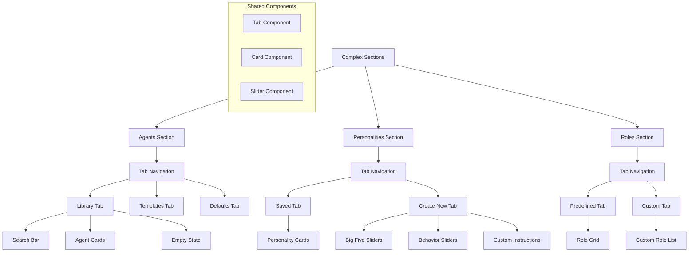

# Complex Settings Sections

## Purpose and Goals

Implement the three complex settings sections (Agents, Personalities, and Roles) that feature sub-navigation tabs and sophisticated layouts. These sections include card-based displays, form creation interfaces, and complex interactive elements that represent the most advanced UI patterns in the settings modal.

## Settings Modal UI Specification

- `docs/specifications/settings-modal-ui-spec.md` - This document outlines the design and functional requirements for the settings modal, including dimensions, layout, navigation, content sections, and user experience considerations. Reference this document for detailed specifications on how the modal should look and behave.
- `docs/specifications/agent-personality-spec.md` - The Agent Personality system defines how AI agents behave, communicate, and make decisions within the collaborative environment. This system uses a combination of established personality models and customizable behavior sliders to create diverse, purpose-specific agents.
- `docs/specifications/agent-role-spec.md` - Agent Roles define an agent's area of expertise, focus, and behavioral patterns within the collaborative environment. Roles work in conjunction with personality settings to create specialized agents that contribute unique perspectives and skills to conversations.

## Major Components and Deliverables

### Agents Section with Tabs

- Tab navigation: Library, Templates, Defaults
- Library tab: Search functionality, agent cards with edit/delete, empty states
- Templates tab: Pre-configured agent template cards with "Use Template" buttons
- Defaults tab: Sliders for temperature, max tokens, and top-p settings

### Personalities Section with Tabs

- Tab navigation: Saved, Create New
- Saved tab: Personality cards with Big Five trait preview and edit/clone buttons
- Create New tab: Complete personality creation form with Big Five sliders, collapsible behavior sliders, and custom instructions textarea

### Roles Section with Tabs

- Tab navigation: Predefined, Custom
- Predefined tab: 2-column grid layout of role cards with icons and descriptions
- Custom tab: List of custom roles with create functionality and edit/delete actions

### Advanced Tab System

- Reusable tab component for consistent navigation experience
- Tab content switching with smooth transitions
- Active tab highlighting and keyboard navigation
- Mobile-responsive tab behavior

## Architecture Diagram

## Detailed Acceptance Criteria

### Agents Section Implementation

- [ ] Tab navigation with [Library] [Templates] [Defaults] properly styled
- [ ] Library tab features:
  - [ ] Search bar: "Search agents..." placeholder with proper styling
  - [ ] Agent cards in scrollable list with agent icon, name, model, and role
  - [ ] Edit and delete buttons (non-functional) positioned right-aligned
  - [ ] Empty state: "No agents configured. Create your first agent!" with friendly styling
  - [ ] Add button: "+ Create New Agent" at bottom with primary styling
- [ ] Templates tab features:
  - [ ] Pre-configured template cards in responsive layout
  - [ ] Each card shows icon, name, description, and "Use Template" button
  - [ ] Cards have proper hover states and spacing
- [ ] Defaults tab features:
  - [ ] Temperature slider (0-2) with value display
  - [ ] Max Tokens number input with proper validation styling
  - [ ] Top P slider (0-1) with value display

### Personalities Section Implementation

- [ ] Tab navigation with [Saved] [Create New] properly styled
- [ ] Saved tab features:
  - [ ] Personality cards showing name and Big Five trait values (O:70 C:85 E:40 A:45 N:30)
  - [ ] Edit and Clone buttons positioned consistently
  - [ ] Cards have proper spacing and visual hierarchy
- [ ] Create New tab features:
  - [ ] Name input field: "Personality Name" with proper labeling
  - [ ] Big Five sliders (5 total) with labels: Openness, Conscientiousness, Extraversion, Agreeableness, Neuroticism
  - [ ] Each slider shows current value (0-100) and proper labeling
  - [ ] Behavior sliders section (collapsible) containing all 14 behavior sliders
  - [ ] Custom Instructions textarea (4 rows) with proper styling
  - [ ] Save button at bottom with proper spacing

### Roles Section Implementation

- [ ] Tab navigation with [Predefined] [Custom] properly styled
- [ ] Predefined tab features:
  - [ ] 2-column grid layout of role cards
  - [ ] Each card shows icon (📊, 💼, etc.), name, and brief description
  - [ ] "View Details" hover state (non-functional but styled)
  - [ ] Cards are non-editable with proper visual indicators
- [ ] Custom tab features:
  - [ ] List of custom roles with name and description preview
  - [ ] Edit and Delete buttons for each role
  - [ ] "+ Create Custom Role" button with proper styling
  - [ ] Empty state handling for no custom roles

### Tab System Standards

- [ ] shadcn/ui Tabs component used consistently across all sections
- [ ] Tab content switching with smooth 200ms transitions
- [ ] Active tab highlighting with accent color
- [ ] Keyboard navigation: arrow keys switch tabs, tab key moves focus
- [ ] Responsive tab behavior: stack on very narrow screens
- [ ] Proper ARIA labels for accessibility

### Card Component Standards

- [ ] Consistent card styling across agent, personality, and role cards
- [ ] Proper hover states with subtle elevation changes
- [ ] Button positioning follows consistent patterns (right-aligned for actions)
- [ ] Icon integration uses lucide-react consistently
- [ ] Cards responsive behavior on different screen sizes

## Technical Considerations

- Complex state management for tab switching and form data
- Reusable components for cards, tabs, and form elements
- Performance optimization for lists with many items (virtual scrolling consideration)
- Proper TypeScript interfaces for all data structures
- Component composition patterns for maximum reusability

## Dependencies

- Epic: Modal Foundation & Infrastructure (E-modal-foundation-infrastructure)
- Epic: Navigation & Layout System (E-navigation-layout-system)
- Can be developed in parallel with: Basic Settings Sections (E-basic-settings-sections)

## User Stories

- As a user, I want to browse my configured agents in an organized way so I can quickly find and manage them
- As a user, I want to use pre-made agent templates so I can quickly set up common agent types
- As a user, I want to create custom personalities with detailed trait controls so I can fine-tune agent behavior
- As a user, I want to see personality traits at a glance so I can quickly identify different personality profiles
- As a user, I want to choose from predefined roles so I can quickly assign appropriate contexts to agents
- As a user, I want to create custom roles so I can define specialized agent behaviors for my specific needs

## Non-functional Requirements

### Performance

- Tab switching completes in under 200ms
- Large lists (100+ items) render smoothly without blocking
- Form interactions feel immediate (< 50ms response time)

### Usability

- Tab navigation is immediately discoverable and intuitive
- Complex forms are broken into digestible sections
- Empty states guide users toward productive actions
- Card layouts scale appropriately across screen sizes

### Data Integrity

- Form validation prevents invalid states (even though non-functional)
- Visual feedback for all user interactions
- Consistent error handling patterns established

## Estimated Scale

12-15 features covering three complex sections with their sub-navigation, forms, and interactive elements

## Architecture Integration Points

- Extends navigation system with sub-navigation tab patterns
- Uses form component standards established in basic sections
- Integrates with state management for complex form and list states
- Provides patterns for future functional implementation phases

### Log
