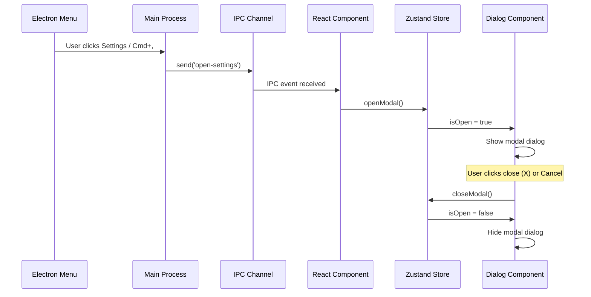

# Modal Foundation & Infrastructure

## Purpose and Goals

Establish the core infrastructure for the settings modal, including the dialog component, state management system, IPC integration for Electron menu commands, and the basic modal shell structure. This epic provides the foundation that all other settings sections will build upon.

## Settings Modal UI Specification

- `docs/specifications/settings-modal-ui-spec.md` - This document outlines the design and functional requirements for the settings modal, including dimensions, layout, navigation, content sections, and user experience considerations. Reference this document for detailed specifications on how the modal should look and behave.

## Major Components and Deliverables

### Core Modal Dialog

- shadcn/ui Dialog component integration and customization
- Modal container with proper dimensions, positioning, and styling
- Header section with title and close button
- Footer section with Cancel/Save buttons (non-functional)
- Semi-transparent overlay with proper z-index management
- Modal centering and responsive sizing logic

### State Management System

- Zustand store for settings modal state
- State structure for modal open/close, active section, and sub-tab navigation
- Actions for modal lifecycle management
- Integration with React components via custom hooks

### Electron Menu Integration

- IPC channel setup for settings modal commands
- Electron main process menu configuration
- Keyboard shortcut handling (Cmd/Ctrl+,)
- Message passing between main and renderer processes

### Basic Modal Shell

- Modal header with proper styling and close functionality
- Content area structure ready for section implementations
- Footer with button placeholders
- Basic error boundary for modal content

## Architecture Diagram

## Detailed Acceptance Criteria

### Modal Dialog Implementation

- [ ] shadcn/ui Dialog component properly customized for desktop app
- [ ] Modal dimensions: 80% viewport (max 1000px, min 800px width; max 700px, min 500px height)
- [ ] Centered positioning maintained on window resize
- [ ] Border radius of 8px with shadow: 0 10px 25px rgba(0, 0, 0, 0.3)
- [ ] Semi-transparent overlay prevents background interaction

### Header and Footer

- [ ] Header height of 50px with proper background styling
- [ ] Title "Settings" displayed with 18px font, left-aligned with 20px padding
- [ ] Close button (×) with 40x40px hover area, right-aligned
- [ ] Footer height of 60px with 1px solid border-top
- [ ] Cancel and Save buttons right-aligned with 20px padding and 10px spacing

### State Management

- [ ] Zustand store created with proper TypeScript typing
- [ ] Modal open/close state properly managed
- [ ] Active section state structure in place
- [ ] Custom hooks for easy component integration
- [ ] State persistence during modal session (resets on close)

### Electron Integration

- [ ] IPC channel 'open-settings' properly configured
- [ ] Electron menu includes Settings option in appropriate location
- [ ] Keyboard shortcut Cmd/Ctrl+, opens settings modal
- [ ] Main process to renderer communication working
- [ ] Error handling for IPC communication

### Accessibility & Interaction

- [ ] Focus trap within modal when open
- [ ] Escape key closes modal
- [ ] Proper ARIA labels for screen readers
- [ ] Focus management on modal open/close
- [ ] Keyboard navigation setup ready for content sections

## Technical Considerations

- Component structure follows existing project patterns in `apps/desktop/src/components/`
- TypeScript types defined for all state management interfaces
- Error boundaries to prevent modal crashes from affecting main app
- Proper cleanup of event listeners and IPC handlers
- Theme integration preparation for claymorphism styling

## Dependencies

- None (foundational epic)

## User Stories

- As a user, I want to open settings via Cmd+, keyboard shortcut so I can quickly access configuration options
- As a user, I want to open settings from the application menu so I have visual discoverability
- As a user, I want to close the settings modal via Escape key or close button so I can quickly exit
- As a user, I want the modal to stay centered when I resize the window so the interface remains usable

## Non-functional Requirements

### Performance

- Modal open/close animation under 200ms
- IPC communication latency under 50ms
- No memory leaks from event listeners

### Security

- No sensitive data exposure in IPC messages
- Proper event listener cleanup to prevent resource leaks

### Reliability

- Error boundaries prevent modal crashes
- Graceful degradation if IPC communication fails
- State consistency maintained across all scenarios

## Estimated Scale

4-6 features covering modal infrastructure, state management, and Electron integration

## Architecture Integration Points

- Integrates with existing Electron main process architecture
- Connects to existing React component patterns
- Prepares foundation for content section implementations in subsequent epics

### Log
