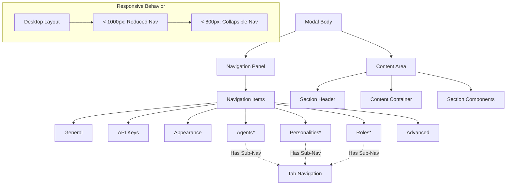

# Navigation & Layout System

## Purpose and Goals

Implement the two-panel layout system with left sidebar navigation and right content area. This epic creates the navigation framework that allows users to switch between different settings sections and provides the responsive layout structure for the entire modal.

## Settings Modal UI Specification

- `docs/specifications/settings-modal-ui-spec.md` - This document outlines the design and functional requirements for the settings modal, including dimensions, layout, navigation, content sections, and user experience considerations. Reference this document for detailed specifications on how the modal should look and behave.

## Major Components and Deliverables

### Left Sidebar Navigation

- Fixed 200px navigation panel with visual separation
- Navigation items for all 7 main sections (General, API Keys, Appearance, Agents, Personalities, Roles, Advanced)
- Active/hover state styling with accent color left border
- Smooth transitions between sections
- Visual indicators for sections with sub-navigation

### Content Area Layout

- Right panel content area with proper padding and constraints
- Scrollable content region with max-width centering
- Section header area for titles and descriptions
- Content switching logic based on active navigation

### Responsive Navigation System

- Narrow screen adaptations (< 1000px): reduced navigation panel width
- Very narrow screen handling (< 800px): collapsible hamburger navigation
- Responsive content area padding adjustments
- Mobile-friendly navigation patterns

### Navigation State Management

- Section switching logic integrated with Zustand store
- URL-independent navigation state (modal-only)
- Active section highlighting and transitions
- Sub-navigation state preparation for complex sections

## Architecture Diagram

## Detailed Acceptance Criteria

### Navigation Panel Layout

- [ ] Fixed 200px width navigation panel with proper background styling
- [ ] 1px solid border-right for visual separation from content area
- [ ] 10px padding around navigation items
- [ ] Navigation items with 40px height and proper vertical spacing

### Navigation Item Styling

- [ ] 12px horizontal padding, vertically centered content
- [ ] 4px border-radius for item hover areas
- [ ] Default state: no background, subtle text color
- [ ] Hover state: light background tint, smooth transition
- [ ] Active state: darker background + 3px left accent border
- [ ] Smooth transitions (200ms) between all states

### Content Area Structure

- [ ] Content area fills remaining width after navigation panel
- [ ] 30px padding around content with proper spacing
- [ ] Scrollable vertical content when height exceeds container
- [ ] Max content width of 600px, centered when panel is wider
- [ ] Proper section transition animations

### Section Navigation Logic

- [ ] All 7 main sections accessible via navigation items
- [ ] Active section properly highlighted in navigation
- [ ] Smooth content transitions when switching sections
- [ ] Navigation state persists during modal session
- [ ] Visual indicators for sections that have sub-navigation (Agents, Personalities, Roles)

### Responsive Behavior

- [ ] Screens < 1000px: Navigation panel reduces to 180px width
- [ ] Screens < 1000px: Content padding reduces to 20px
- [ ] Screens < 800px: Navigation becomes hamburger menu
- [ ] Screens < 800px: Full width content area when navigation hidden
- [ ] Smooth responsive transitions with proper breakpoints

### Keyboard Navigation

- [ ] Arrow keys navigate between navigation items
- [ ] Enter key activates focused navigation item
- [ ] Tab key moves focus through navigation items
- [ ] Focus visible indicators for all navigation elements
- [ ] Logical tab order throughout navigation system

## Technical Considerations

- Component architecture allows for easy section addition/removal
- Navigation state integrates cleanly with existing Zustand store
- Responsive CSS uses Tailwind breakpoints consistently
- Smooth animations use CSS transitions, not JavaScript
- Accessibility attributes properly implemented throughout

## Dependencies

- Epic: Modal Foundation & Infrastructure (E-modal-foundation-infrastructure)
- Requires: Core modal dialog, state management system, basic modal shell

## User Stories

- As a user, I want to see all available settings sections in the sidebar so I can understand what's configurable
- As a user, I want clear visual feedback on which section I'm currently viewing so I don't get lost
- As a user, I want smooth transitions between sections so the interface feels polished
- As a user, I want the navigation to work on smaller screens so I can access settings on any device
- As a user, I want keyboard navigation through sections so I can use the modal efficiently

## Non-functional Requirements

### Performance

- Section transitions complete in under 300ms
- Responsive layout changes happen instantly
- No layout shift during navigation state changes

### Usability

- Navigation affordances are immediately clear to users
- Visual hierarchy guides users through available options
- Responsive behavior doesn't hide functionality

### Maintainability

- New sections can be added with minimal code changes
- Navigation styling is consistent and reusable
- Responsive breakpoints are centrally managed

## Estimated Scale

3-4 features covering navigation layout, responsive behavior, and keyboard interaction

## Architecture Integration Points

- Extends Modal Foundation & Infrastructure with layout structure
- Prepares content area for section implementations in subsequent epics
- Integrates with Zustand store for navigation state management
- Provides foundation for complex sections with sub-navigation tabs

### Log
