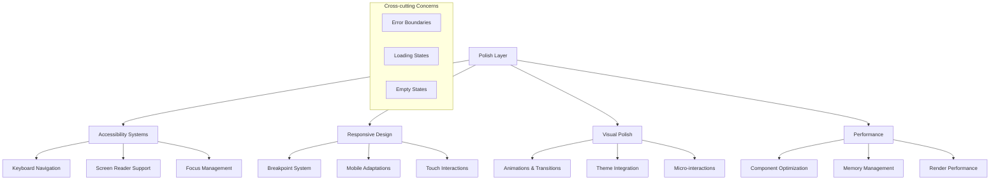

# User Experience & Polish

## Purpose and Goals

Add the final layer of polish, accessibility, and user experience enhancements to the settings modal. This epic ensures the interface feels native to desktop applications, provides excellent accessibility support, and includes all the micro-interactions and visual feedback that make the modal feel professional and responsive.

## Settings Modal UI Specification

- `docs/specifications/settings-modal-ui-spec.md` - This document outlines the design and functional requirements for the settings modal, including dimensions, layout, navigation, content sections, and user experience considerations. Reference this document for detailed specifications on how the modal should look and behave.

## Major Components and Deliverables

### Accessibility & Keyboard Navigation

- Complete keyboard navigation support throughout the modal
- Proper focus management and visual focus indicators
- ARIA labels and screen reader compatibility
- Color contrast compliance and accessible color choices
- Logical tab order and keyboard shortcuts

### Responsive Design & Mobile Support

- Responsive breakpoint implementations across all sections
- Mobile-friendly interaction patterns
- Touch-friendly target sizes for interactive elements
- Responsive typography and spacing adjustments

### Visual Polish & Animations

- Smooth transitions between modal states and sections
- Loading states and interactive feedback
- Hover effects and micro-interactions
- Visual consistency across all components
- Theme integration with claymorphism styling

### Performance Optimizations

- Component lazy loading where appropriate
- Efficient re-rendering patterns
- Memory management for modal lifecycle
- Smooth scrolling and interaction performance

## Architecture Diagram

## Detailed Acceptance Criteria

### Keyboard Navigation & Accessibility

- [ ] Complete keyboard navigation: Tab moves through all interactive elements
- [ ] Arrow key navigation works in sidebar and within tab groups
- [ ] Enter key activates focused buttons and navigation items
- [ ] Space bar toggles switches and checkboxes
- [ ] Escape key closes modal with proper focus return
- [ ] Cmd/Ctrl+S triggers save action (even though non-functional)
- [ ] Focus trap keeps keyboard focus within modal when open
- [ ] Focus indicators visible and consistent (2px accent color outline)
- [ ] Logical tab order follows visual layout
- [ ] ARIA labels provided for all interactive elements
- [ ] Screen reader compatibility tested and verified
- [ ] Color contrast ratios meet WCAG 2.1 AA standards (4.5:1 minimum)

### Responsive Design Implementation

- [ ] Desktop (≥1000px): Full layout with 200px sidebar
- [ ] Medium screens (999px-800px): 180px sidebar, reduced content padding
- [ ] Small screens (<800px): Collapsible hamburger navigation
- [ ] Mobile portrait: Stacked layout with full-width content
- [ ] Touch targets minimum 44x44px on mobile devices
- [ ] Responsive typography scales appropriately
- [ ] Modal dimensions adapt correctly on window resize
- [ ] Scrolling behavior optimized for touch devices

### Visual Polish & Theme Integration

- [ ] Smooth modal open/close animations (300ms ease-out)
- [ ] Section transition animations (200ms ease-in-out)
- [ ] Button hover effects with proper timing (150ms)
- [ ] Loading states for all async operations (even simulated)
- [ ] Empty states with friendly icons and helpful messaging
- [ ] Consistent spacing using design system values
- [ ] Claymorphism theme properly integrated across all components
- [ ] Shadow and elevation effects consistent with design system
- [ ] Color palette matches existing application theme

### Interactive Feedback & States

- [ ] All interactive elements provide immediate visual feedback
- [ ] Disabled states properly styled with reduced opacity and cursor changes
- [ ] Loading spinners for test buttons and save operations
- [ ] Form validation visual feedback (red borders, error messages)
- [ ] Success states for actions (green checkmarks, success messages)
- [ ] Hover states for all clickable elements
- [ ] Active states for pressed buttons and interactions

### Error Handling & Edge Cases

- [ ] Error boundaries prevent modal crashes from affecting main app
- [ ] Graceful degradation when features are unavailable
- [ ] Proper error messages for validation failures
- [ ] Network error handling for simulated async operations
- [ ] Memory cleanup on modal close
- [ ] Proper cleanup of event listeners and timers

### Performance Optimizations

- [ ] Modal renders in under 100ms on typical hardware
- [ ] Section switching completes in under 200ms
- [ ] Smooth 60fps animations on all transitions
- [ ] No memory leaks from uncleaned event listeners
- [ ] Component re-renders minimized through proper memoization
- [ ] Large lists use virtualization if needed (>100 items)

## Technical Considerations

- CSS-in-JS avoided in favor of Tailwind for better performance
- Animation libraries used sparingly (prefer CSS transitions)
- Accessibility testing tools integrated into development workflow
- Responsive design follows mobile-first principles
- Performance monitoring for modal lifecycle events

## Dependencies

- Epic: Modal Foundation & Infrastructure (E-modal-foundation-infrastructure)
- Epic: Navigation & Layout System (E-navigation-layout-system)
- Epic: Basic Settings Sections (E-basic-settings-sections)
- Epic: Complex Settings Sections (E-complex-settings-sections)
- Requires: All UI components and sections implemented

## User Stories

- As a user with motor disabilities, I want full keyboard navigation so I can use the settings without a mouse
- As a screen reader user, I want proper ARIA labels so I can understand and navigate the settings structure
- As a mobile user, I want touch-friendly interactions so I can configure settings on my tablet
- As a user, I want smooth animations and feedback so the interface feels polished and responsive
- As a power user, I want keyboard shortcuts so I can navigate efficiently
- As any user, I want the modal to feel like a native desktop application

## Non-functional Requirements

### Accessibility Standards

- WCAG 2.1 AA compliance for color contrast and keyboard navigation
- Screen reader compatibility (tested with common tools)
- Focus management follows desktop application patterns
- Keyboard shortcuts don't conflict with system shortcuts

### Performance Benchmarks

- Modal open time: <100ms (p95)
- Section switching: <200ms (p95)
- Animation frame rate: 60fps maintained
- Memory usage: <50MB additional during modal session
- No memory leaks over extended usage

### Visual Quality

- Animations feel natural and purposeful (not distracting)
- Visual hierarchy guides user attention appropriately
- Theme integration is seamless with existing application
- All interactive states provide clear feedback

## Estimated Scale

6-8 features covering accessibility, responsive design, animations, and performance optimizations

## Architecture Integration Points

- Applies polish layer to all components from previous epics
- Integrates with existing desktop application theme and patterns
- Ensures consistent behavior with other modal/dialog patterns in the app
- Prepares user experience foundation for future functional implementations

### Log
