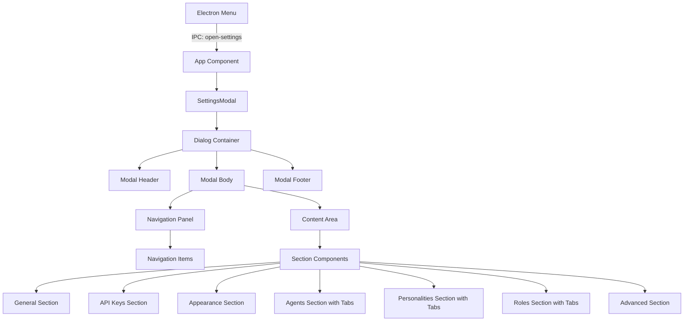

# Settings Modal UI Implementation

## Executive Summary

Implementation of a comprehensive settings modal for the Fishbowl AI desktop application, focusing exclusively on the user interface and navigation experience. This project establishes the visual design, layout, and interaction patterns for managing AI collaborator configurations, without implementing any data persistence or functional logic.

## Settings Modal UI Specification

- `docs/specifications/settings-modal-ui-spec.md` - This document outlines the design and functional requirements for the settings modal, including dimensions, layout, navigation, content sections, and user experience considerations. Reference this document for detailed specifications on how the modal should look and behave.

## Project Scope

### In Scope

- Complete UI implementation of the settings modal using shadcn/ui dialog component
- Navigation system with left sidebar and content area
- All visual sections as specified (General, API Keys, Appearance, Agents, Personalities, Roles, Advanced)
- Sub-navigation tabs for Agents, Personalities, and Roles sections
- Form component layouts using shadcn/ui components with custom styling
- Modal open/close functionality via Electron menu (Cmd+,) and close button
- Responsive behavior and keyboard navigation
- Theme integration with existing claymorphism theme

### Out of Scope

- Data persistence (JSON files, keytar, or any storage)
- Actual functionality of settings (no API key validation, theme switching, etc.)
- State persistence between modal sessions
- Integration with existing agent/personality/role systems
- Any backend logic or IPC beyond open/close commands

## Technical Architecture

### Technology Stack

- **Framework**: React 19.1 with TypeScript 5.8
- **UI Components**: shadcn/ui (dialog, tabs, form components)
- **Styling**: Tailwind CSS v4 with existing claymorphism theme
- **State Management**: Zustand for modal state and navigation
- **Desktop Integration**: Electron 37.2 with IPC for menu commands
- **Icons**: Lucide React

### Component Architecture



### State Management Structure

```typescript
interface SettingsModalState {
  // Modal state
  isOpen: boolean;
  activeSection: SettingsSection;
  activeSubTab?: string;

  // Navigation state
  hasUnsavedChanges: boolean; // Always false for now

  // Actions
  openModal: () => void;
  closeModal: () => void;
  navigateToSection: (section: SettingsSection) => void;
  setActiveSubTab: (tab: string) => void;
}
```

## Functional Requirements

### Modal Container

- Centered modal with dimensions: 80% viewport (max 1000px, min 800px width; max 700px, min 500px height)
- Semi-transparent overlay with proper z-index layering
- 8px border radius with shadow: 0 10px 25px rgba(0, 0, 0, 0.3)
- Header (50px) with title and close button
- Footer (60px) with Cancel and Save buttons (non-functional)
- Scrollable content area between header and footer

### Navigation System

- Fixed 200px left sidebar with visual separation
- Navigation items: 40px height, hover/active states
- Active state: accent color left border (3px)
- Smooth transitions between sections
- Visual indicator for sections with sub-navigation

### Content Sections

#### General Section

- Auto Mode Settings group (Response Delay slider, Maximum Messages input, Maximum Wait Time input)
- Conversation Defaults group (Default Mode radio, Maximum Agents input)
- Other Settings group (Check for Updates toggle)

#### API Keys Section

- Provider cards for OpenAI, Anthropic, and other providers
- Password input fields with show/hide toggle
- Status indicators (visual only)
- Test buttons (non-functional)
- Expandable advanced settings for base URLs

#### Appearance Section

- Theme selection with radio buttons (Light/Dark/System)
- Theme preview area (200x100px)
- Display settings (timestamps, conversation list options)
- Chat display settings (font size slider with preview, message spacing)

#### Agents Section

- Tab navigation: [Library] [Templates] [Defaults]
- Library tab: Search bar, agent list cards, empty state
- Templates tab: Pre-configured agent template cards
- Defaults tab: Temperature/Max Tokens/Top P sliders

#### Personalities Section

- Tab navigation: [Saved] [Create New]
- Saved tab: Personality cards with Big Five preview
- Create New tab: Big Five sliders, behavior sliders (collapsible), custom instructions

#### Roles Section

- Tab navigation: [Predefined] [Custom]
- Predefined tab: 2-column grid of role cards
- Custom tab: Custom role list with create button

#### Advanced Section

- Data Management group (Export/Import/Clear buttons)
- Developer Options group (Debug mode, Experimental features toggles)

## User Experience Requirements

### Interactions

- Keyboard shortcuts: Cmd/Ctrl+, to open, Esc to close
- Tab navigation through all interactive elements
- Arrow key navigation in sidebar
- Smooth section transitions
- Hover states on all interactive elements
- Focus visible indicators for accessibility

### Visual Feedback

- Loading states for async operations (even if simulated)
- Disabled states for Save button (always disabled in this phase)
- Empty states with friendly messages and icons
- Consistent spacing and alignment throughout

### Responsive Behavior

- Narrow screens (< 1000px): 95% width, reduced navigation panel
- Very narrow (< 800px): Collapsible hamburger navigation
- Content area maintains readability with max-width constraints

## Acceptance Criteria

### Modal Functionality

- [ ] Modal opens via Cmd+, keyboard shortcut
- [ ] Modal opens via application menu selection
- [ ] Modal closes via X button, Cancel button, or Esc key
- [ ] Modal maintains centered position on window resize
- [ ] Overlay prevents interaction with background content

### Navigation

- [ ] All seven main sections are navigable via sidebar
- [ ] Active section is visually highlighted
- [ ] Sub-navigation tabs work for Agents, Personalities, and Roles
- [ ] Navigation maintains state while modal is open
- [ ] Smooth transitions between sections

### Visual Implementation

- [ ] All sections match the specification layout
- [ ] Form components are properly styled and spaced
- [ ] Theme integration works with existing claymorphism styles
- [ ] Empty states display appropriately
- [ ] All specified dimensions and spacing are implemented

### Component Structure

- [ ] shadcn/ui dialog component is properly customized
- [ ] Form components use shadcn/ui with necessary overrides
- [ ] Custom components follow existing project patterns
- [ ] Code follows the monorepo architecture guidelines

### Accessibility

- [ ] All interactive elements are keyboard accessible
- [ ] ARIA labels are properly implemented
- [ ] Focus management works correctly
- [ ] Color contrast meets accessibility standards
- [ ] Screen reader compatibility is maintained

### Code Quality

- [ ] TypeScript types are properly defined
- [ ] Components follow single responsibility principle
- [ ] No console.log statements in production code
- [ ] Code passes linting and type checking
- [ ] File organization follows project conventions

## Success Metrics

- Clean, intuitive navigation between all settings sections
- Smooth visual transitions and interactions
- Modal feels native to the desktop application
- UI is ready for functionality implementation in future phases
- Code is maintainable and follows established patterns

## Future Considerations

This UI implementation serves as the foundation for future functionality phases:

- Phase 2: State persistence and data binding
- Phase 3: Functional implementation (API key validation, theme switching, etc.)
- Phase 4: Integration with agent/personality/role management systems

The modular architecture ensures easy extension without major refactoring.

### Log
