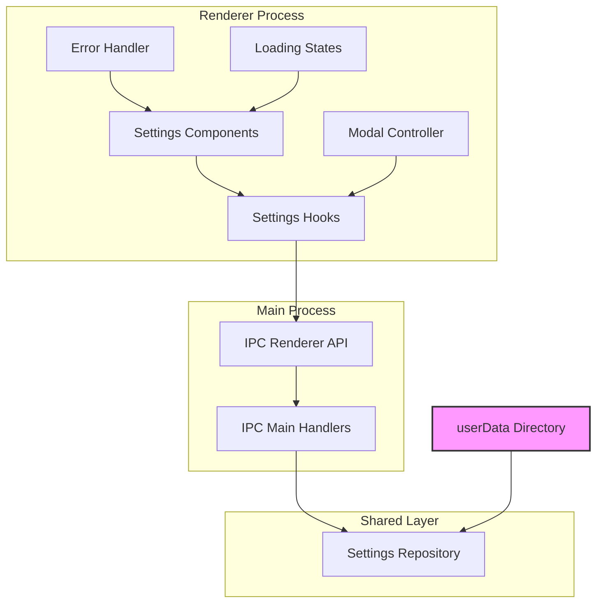

# Desktop Integration

## Purpose and Goals

Integrate the settings persistence system with the existing Electron desktop application, connecting the UI components to the persistence layer through the type mapping system. This epic focuses on implementing the save/load workflows, error handling, and ensuring a seamless user experience when managing application preferences.

## Major Components and Deliverables

### 1. Electron Main Process Integration

- Implement IPC handlers for settings operations
- Configure userData directory access
- Handle file system permissions
- Provide settings API to renderer process

### 2. Settings Component Enhancement

- Connect GeneralSettings component to persistence
- Connect AppearanceSettings component to persistence
- Connect AdvancedSettings component to persistence
- Implement loading states and error handling

### 3. Save/Load Orchestration

- Implement settings load on modal open
- Handle save operations on form submit
- Coordinate between multiple settings tabs
- Manage unsaved changes state

### 4. Error Handling UI

- Display file operation errors to users
- Handle validation errors gracefully
- Provide retry mechanisms
- Show success confirmations

### 5. Platform-Specific Bridge

- Implement Electron-specific file operations
- Create desktop storage bridge
- Handle platform security requirements
- Manage app lifecycle events

## Architecture

## Detailed Acceptance Criteria

### Functional Deliverables

- ✓ Settings load automatically when modal opens
- ✓ All three settings tabs persist correctly
- ✓ Save button triggers persistence operation
- ✓ Unsaved changes are tracked properly
- ✓ Success/error feedback shown to users
- ✓ Settings survive app restart

### Integration Requirements

- ✓ Uses type mappers from ui-shared package
- ✓ Calls repository from shared package
- ✓ Maintains existing component structure
- ✓ Preserves current UI/UX flow
- ✓ Works with existing form validation

### User Experience Standards

- ✓ Loading states during file operations
- ✓ Clear error messages for failures
- ✓ Instant feedback on save success
- ✓ No UI freezing during operations
- ✓ Graceful degradation on errors

### Security Requirements

- ✓ Proper IPC channel security
- ✓ No sensitive data in renderer
- ✓ File access limited to userData
- ✓ Validate data before persistence

### Performance Standards

- ✓ Modal opens in < 100ms with loaded data
- ✓ Save operations complete in < 200ms
- ✓ No blocking UI operations
- ✓ Efficient IPC communication

## Technical Considerations

### IPC Communication

- Define clear IPC channel names
- Use typed IPC handlers
- Implement request/response patterns
- Handle IPC errors gracefully

### State Management

- Coordinate with existing Zustand stores
- Manage loading and error states
- Track dirty/saved state per tab
- Handle concurrent operations

### Error Recovery

- Retry failed file operations
- Fallback to defaults on corruption
- Log errors for debugging
- Provide user recovery options

### Lifecycle Management

- Load settings on app start
- Save settings before quit (if dirty)
- Handle app updates gracefully
- Manage settings migration

## Dependencies

- **E-shared-layer-infrastructure**: Uses repository and file storage
- **E-ui-shared-type-mapping**: Uses type mappers and utilities

## Estimated Scale

Approximately 5-6 features:

1. IPC communication setup
2. General settings integration
3. Appearance settings integration
4. Advanced settings integration
5. Error handling and feedback
6. Platform bridge implementation

## User Stories

As a desktop user, I want to:

- Open settings and see my previously saved preferences
- Make changes and save them permanently
- See clear feedback when settings are saved
- Understand what went wrong if saving fails
- Trust that my settings won't be lost

As a developer, I want to:

- Easily connect new settings to persistence
- Debug file operation issues
- Handle errors without crashing
- Maintain clean separation of concerns
- Test the integration thoroughly

## Non-functional Requirements

### Reliability

- Settings always load if file exists
- Corrupted files don't crash app
- Failed saves don't lose all data
- Atomic operations prevent partial writes

### Maintainability

- Clear separation of IPC logic
- Well-documented integration points
- Consistent error handling patterns
- Easy to add new settings tabs

### Security

- Secure IPC communication
- Proper file permissions
- No arbitrary file access
- Input validation at boundaries

### User Experience

- Responsive UI during operations
- Clear visual feedback
- Intuitive error messages
- Consistent with app design language

### Log
