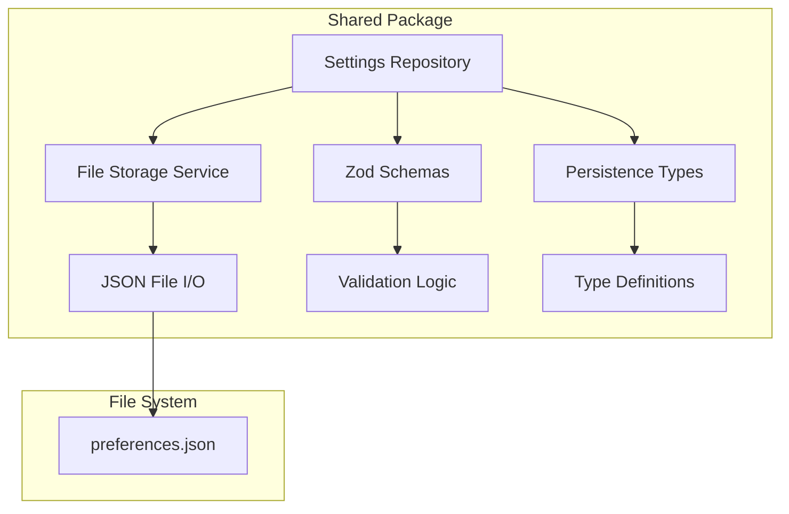

# Shared Layer Infrastructure

## Purpose and Goals

Establish the foundational persistence infrastructure in the shared package (`@fishbowl-ai/shared`) that provides generic file storage capabilities and settings-specific persistence logic. This layer must be completely isolated from UI concerns and provide a clean API for the UI layers to consume.

## Major Components and Deliverables

### 1. Persistence Type System

- Define TypeScript interfaces for persisted settings data
- Create types for General, Appearance, and Advanced settings
- Design types optimized for storage (flat structure, serializable)

### 2. Zod Schema Definitions

- Create validation schemas for all persistence types
- Define default values for each setting
- Ensure schema evolution support for future settings

### 3. Generic File Storage Service

- Implement async JSON read/write operations
- Handle file creation, updates, and error cases
- Support generic typing for future data types
- Provide atomic write operations to prevent data corruption

### 4. Settings Repository

- Implement repository pattern for settings persistence
- Provide high-level API for loading and saving preferences
- Handle schema validation and migration
- Coordinate between file storage and type system

## Architecture

## Detailed Acceptance Criteria

### Functional Deliverables

- ✓ Complete type definitions for all settings categories
- ✓ Zod schemas validate all persistence types
- ✓ File storage service reads and writes JSON files
- ✓ Repository provides load() and save() methods
- ✓ Default values provided for all settings
- ✓ File operations are fully async

### Integration Requirements

- ✓ Exports clean API surface for UI layers
- ✓ No dependencies on UI packages
- ✓ All public methods return Promises
- ✓ Errors are thrown (not caught) for UI handling

### Performance Standards

- ✓ No synchronous file system operations

### Security Requirements

- ✓ File permissions set appropriately (user-only access)
- ✓ No sensitive data logged or exposed
- ✓ Validates all data before persistence
- ✓ Handles malformed JSON gracefully

### Quality Standards

- ✓ 100% TypeScript type coverage
- ✓ All functions have JSDoc documentation
- ✓ Follows repository pattern best practices
- ✓ Uses consistent error types

## Technical Considerations

### Type Design

- Keep persistence types flat for easy serialization
- Avoid nested objects where possible
- Use primitive types and simple arrays
- Consider future extensibility

### Error Handling Strategy

- Define custom error types for different failures
- Include contextual information in errors
- Distinguish between recoverable and fatal errors
- Propagate all errors to calling layer

### File System Interactions

- Use Node.js fs/promises for async operations
- Handle cross-platform path differences
- Ensure atomic writes to prevent corruption
- Create directories if they don't exist

## Dependencies

This epic has no dependencies on other epics as it forms the foundation layer.

## Estimated Scale

Approximately 4-5 features:

1. Type definitions and interfaces
2. Zod schema implementation
3. Generic file storage service
4. Settings repository
5. Error handling and utilities

## User Stories

As a developer, I want to:

- Save settings to a JSON file without worrying about file I/O details
- Load settings with automatic validation and defaults
- Handle file errors gracefully in my UI code
- Extend the system with new settings types easily
- Trust that data won't be corrupted during saves

## Non-functional Requirements

### Maintainability

- Clean, well-documented code
- Single responsibility for each module
- Easy to add new settings types
- Clear separation of concerns

### Testability

- All components unit testable
- Mock-friendly interfaces
- Pure functions where possible
- Dependency injection for file system

### Extensibility

- Generic file storage for future use
- Pluggable validation strategies
- Support for settings migration
- Room for additional persistence backends

### Log
