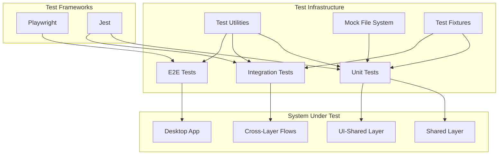

# Testing Infrastructure

## Purpose and Goals

Establish comprehensive testing coverage for the entire settings persistence system, ensuring reliability, correctness, and maintainability across all layers. This epic focuses on creating unit tests, integration tests, and end-to-end tests that validate the system works correctly from UI interaction through to file persistence.

## Major Components and Deliverables

### 1. Shared Layer Unit Tests

- Test persistence types and schemas
- Test file storage service operations
- Test repository pattern implementation
- Test error handling and edge cases
- Mock file system for isolated testing

### 2. Type Mapping Unit Tests

- Test all bidirectional mappers
- Test edge cases and null handling
- Test default value injection
- Test value transformations
- Ensure type safety validation

### 3. Integration Tests

- Test full save/load cycles
- Test cross-layer interactions
- Test error propagation
- Test data integrity
- Validate schema evolution

### 4. Desktop E2E Tests

- Test settings modal interactions
- Test persistence across app restarts
- Validate user workflows

### 5. Test Utilities and Fixtures

- Create test data builders
- Implement test helpers
- Design reusable mocks
- Build assertion utilities
- Document testing patterns

## Architecture

## Detailed Acceptance Criteria

### Test Coverage Requirements

- ✓ > 80% code coverage for shared layer
- ✓ > 80% code coverage for type mappers
- ✓ All happy paths tested
- ✓ All error paths tested
- ✓ Edge cases documented and tested

### Unit Test Standards

- ✓ Fast execution (< 5s total)
- ✓ Isolated from file system
- ✓ Deterministic results
- ✓ Clear test descriptions
- ✓ Arrange-Act-Assert pattern

### Integration Test Standards

- ✓ Test real file operations
- ✓ Validate data persistence
- ✓ Test error scenarios
- ✓ Clean up test files
- ✓ Run in CI pipeline

### E2E Test Standards

- ✓ Test actual user workflows
- ✓ Validate UI interactions
- ✓ Test across app lifecycle
- ✓ Screenshot on failure
- ✓ Stable and maintainable

### Quality Standards

- ✓ No flaky tests
- ✓ Clear failure messages
- ✓ Well-organized test suites
- ✓ Documented test strategies
- ✓ Maintainable test code

## Technical Considerations

### Testing Strategy

- Unit test pure functions extensively
- Integration test at service boundaries
- E2E test critical user paths
- Mock external dependencies
- Use real implementations where possible

### Mock Design

- File system mocks for unit tests
- IPC mocks for renderer tests
- Partial mocks for integration
- Avoid over-mocking
- Maintain mock fidelity

### Test Data Management

- Consistent test fixtures
- Builders for complex objects
- Realistic test scenarios
- Edge case data sets
- Invalid data examples

### CI/CD Integration

- Run tests on every commit
- Parallel test execution
- Test result reporting
- Coverage tracking

## Dependencies

- **E-shared-layer-infrastructure**: Tests the persistence implementation
- **E-ui-shared-type-mapping**: Tests the mapping logic
- **E-desktop-integration**: Tests the full integration

## Estimated Scale

Approximately 5-6 features:

1. Shared layer unit test suite
2. Type mapping unit test suite
3. Integration test suite
4. Desktop E2E test suite
5. Test utilities and helpers
6. CI/CD test configuration

## User Stories

As a developer, I want to:

- Run tests quickly during development
- Trust that tests catch real issues
- Understand why tests fail
- Add new tests easily
- Maintain tests with minimal effort

As a QA engineer, I want to:

- Verify all requirements are tested
- See clear test coverage reports
- Reproduce reported issues
- Validate fixes don't break existing functionality
- Trust the automated test suite

As a project maintainer, I want to:

- Ensure code quality over time
- Catch regressions early
- Document system behavior through tests
- Onboard new developers with test examples
- Maintain confidence in the codebase

## Non-functional Requirements

### Performance

- Parallel execution supported

### Maintainability

- Self-documenting test names
- Reusable test utilities
- Clear test organization
- Easy to update for new features
- Minimal test duplication

### Reliability

- No false positives
- No intermittent failures
- Consistent across environments
- Clear error reporting
- Reproducible results

### Developer Experience

- Easy to run locally
- Fast feedback cycle
- Helpful error messages
- Good IDE integration
- Simple debugging process

### Log
