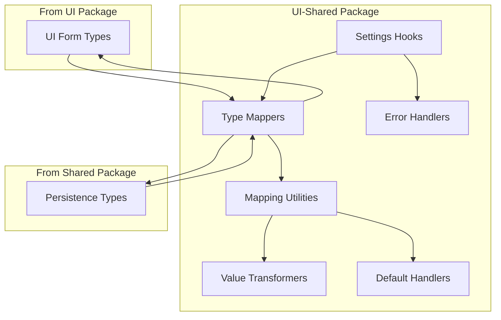

# UI-Shared Type Mapping

## Purpose and Goals

Create a comprehensive type mapping layer in the UI-Shared package that bridges the gap between UI form types and persistence types. This layer enables both desktop and future mobile applications to seamlessly convert between their UI representations and the storage format, maintaining clean separation of concerns while providing reusable mapping logic.

**Key Architecture Decision**: While individual mappers are implemented as modular utilities for maintainability, the system operates atomically - all settings are saved and loaded together as a single operation through unified hooks and interfaces.

## Major Components and Deliverables

### 1. Type Mapping Functions

- Create bidirectional mappers for General settings (UI ↔ Persistence)
- Create bidirectional mappers for Appearance settings (UI ↔ Persistence)
- Create bidirectional mappers for Advanced settings (UI ↔ Persistence)
- Implement type-safe conversion with proper error handling

### 2. Mapping Utilities

- Generic mapping helpers for common conversions
- Value transformation functions (e.g., milliseconds to seconds)
- Default value injection for missing fields
- Nested object flattening/unflattening utilities

### 3. Integration Interfaces

- Define contracts for atomic settings operations (all settings saved/loaded together)
- Create typed hooks for complete settings management (single save/load for all categories)
- Provide error transformation utilities
- Export clean API for platform consumption

### 4. Validation Bridge

- Coordinate between UI validation and persistence validation
- Transform validation errors to user-friendly messages
- Ensure data integrity during mapping
- Handle edge cases and partial data

## Architecture

## Detailed Acceptance Criteria

### Functional Deliverables

- ✓ Complete bidirectional mappers for all settings types
- ✓ Type-safe conversions with no runtime errors
- ✓ Graceful handling of missing or extra fields
- ✓ Proper default value injection
- ✓ Value transformations (time units, enums, etc.)
- ✓ Comprehensive error handling

### Integration Requirements

- ✓ Clean API for desktop app consumption
- ✓ Reusable by future mobile implementation
- ✓ Imports from shared package for persistence types
- ✓ Works with existing UI types and schemas
- ✓ No platform-specific code

### Performance Standards

- ✓ No unnecessary object cloning
- ✓ Efficient transformation algorithms
- ✓ Minimal memory allocation

### Type Safety Requirements

- ✓ Full TypeScript type coverage
- ✓ No use of 'any' types
- ✓ Compile-time type checking
- ✓ Runtime type guards where needed

### Quality Standards

- ✓ Pure functions for all mappers
- ✓ Comprehensive JSDoc documentation
- ✓ Clear naming conventions
- ✓ Follows functional programming principles

## Technical Considerations

### Mapping Strategies

- Use explicit field mapping (no auto-mapping)
- Handle type conversions safely
- Preserve data fidelity during round trips
- Mappers are modular utilities but used together atomically (all settings saved/loaded as one operation)
- Individual mappers enable maintainability while supporting single-operation usage pattern

### Error Handling

- Never throw errors in mappers
- Return Result types or use error callbacks
- Provide detailed error context
- Log mapping issues for debugging

### Platform Abstraction

- No Electron-specific code
- No React Native-specific code
- Pure JavaScript/TypeScript functions
- Platform-agnostic interfaces

## Dependencies

- **E-shared-layer-infrastructure**: Requires persistence types and interfaces from the shared layer

## Estimated Scale

Approximately 4-5 features:

1. General settings mapper implementation (modular utility)
2. Appearance settings mapper implementation (modular utility)
3. Advanced settings mapper implementation (modular utility)
4. Common mapping utilities
5. Integration hooks and interfaces (atomic operations using all mappers together)

## User Stories

As a platform developer, I want to:

- Convert all UI form data to persistence format in one atomic operation
- Transform all persisted data back to UI format for display
- Use modular mappers that work together seamlessly
- Handle missing fields with sensible defaults
- Get clear errors when mapping fails
- Reuse mapping logic between desktop and mobile

As an end user, I expect:

- My settings to save exactly as configured
- Settings to load with the same values I saved
- New settings to have reasonable defaults
- No data loss during updates

## Non-functional Requirements

### Maintainability

- Clear separation between UI and persistence concerns
- Easy to add new settings fields
- Self-documenting code structure
- Consistent patterns throughout

### Testability

- Pure functions enable easy unit testing
- No side effects in mappers
- Deterministic transformations
- Mock-friendly interfaces

### Reusability

- Desktop and mobile share same logic
- Generic utilities for common patterns
- Composable mapping functions
- Framework-agnostic implementation

### Developer Experience

- Intuitive API design
- TypeScript autocomplete support
- Clear error messages
- Minimal boilerplate code

### Log
